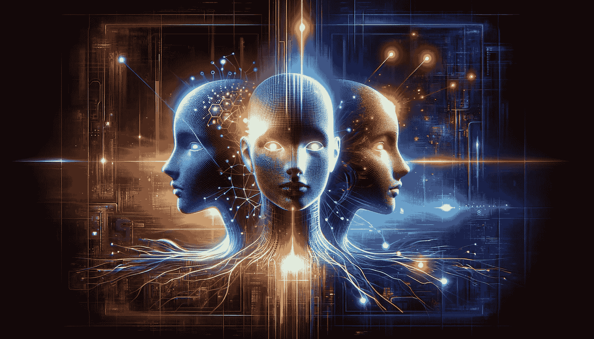
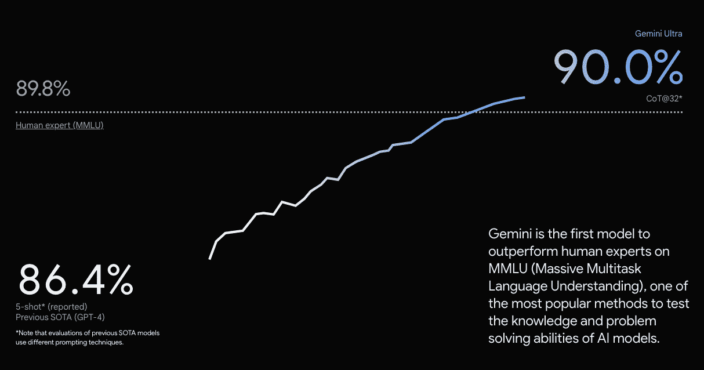

# ChatGPT 的新对手：谷歌的 Gemini

> 原文：[`www.kdnuggets.com/chatgpts-new-rival-googles-gemini`](https://www.kdnuggets.com/chatgpts-new-rival-googles-gemini)

作者提供的图像

一段时间以来，ChatGPT 一直是众人瞩目的焦点。每个人都在谈论它，很多人都在使用它，可能会出什么问题呢？

* * *

## 我们的前三个课程推荐

 1\. [谷歌网络安全证书](https://www.kdnuggets.com/google-cybersecurity) - 快速进入网络安全职业生涯。

 2\. [谷歌数据分析专业证书](https://www.kdnuggets.com/google-data-analytics) - 提升你的数据分析技能

 3\. [谷歌 IT 支持专业证书](https://www.kdnuggets.com/google-itsupport) - 支持你的组织 IT

* * *

谷歌一直致力于保持其作为人工智能优先公司的声誉，到目前为止他们做得不错。然而，过去一年很明显，OpenAI 的 ChatGPT 处于领先地位，谷歌重新争夺领先地位只是时间问题。

首席执行官 Sundar Pichai 表示：

> 我们之所以从一开始就对人工智能产生兴趣，是因为我们始终将我们的使命视为一种永恒的使命。

介绍来自谷歌的[Gemini](https://deepmind.google/technologies/gemini/#build-with-gemini)。

如果你还没有机会观看预告片，我建议你[在这里](https://www.youtube.com/watch?v=jV1vkHv4zq8)观看。

# Gemini 是什么？

Gemini 是谷歌最大的语言模型，首席执行官皮查伊（Pichai）最初在六月的一次会议上进行了首次测试，现在正式向[公众](https://blog.google/technology/ai/google-gemini-ai/#availability)发布。那么，Gemini 有什么了不起的地方，为什么它让 ChatGPT 感到畏惧？

Gemini 不仅仅是一个单一的 AI 模型。它有不同的变体以满足不同的需求。例如，你有一个名为 [Gemini Nano](https://store.google.com/intl/en/ideas/articles/pixel-feature-drop-december-2023/) 的轻量版，兼容在 Android 设备上运行。你还有 Gemini Pro，它使用 Barb 的骨干，将用于支持许多谷歌 AI 服务。

但事情并没有就此结束。你还有 Gemini Ultra，这是谷歌最强大的模型，也是目前最强大的大型语言模型。Gemini Ultra 似乎特别为数据中心和企业应用设计。

快速概览：

+   **Gemini Ultra** - 最大且最强大的模型，适用于高度复杂的任务。

+   **Gemini Pro** - 最适合在广泛任务中扩展的模型。

+   **Gemini Nano** - 最高效的设备端任务模型。

这款 3 种变体的大型语言模型家族旨在理解和操作不同类型的信息。LLM 可以处理不同类型的信息，如文本、代码、图像、音频和视频。多模态的最佳体现。

那么它有多好呢？

# Gemini 的表现

谷歌一直在努力测试 Gemini 模型，以确保它们符合要求，并在各种任务上进行了严格评估。据说，谷歌的 Gemini Ultra 在 LLM 研究中使用的 32 个广泛使用的学术基准中的 30 个上超过了当前的最先进成果，获得了高达 90.0% 的惊人分数。

图片来自[谷歌 Gemini](https://deepmind.google/technologies/gemini/#capabilities)

Gemini Ultra 已被证明是第一个在[MMLU](https://arxiv.org/abs/2009.03300)（大规模多任务语言理解）上超越人类专家的模型。MMLU 结合了 57 个学科，包括数学、历史、法律、医学、物理等，以测试世界知识和解决问题的能力。

从这些基准来看，我们可以看到 Gemini 最大的优势在于其理解和互动视频及音频的能力。

我们已经看到 OpenAI 通过创建 DALL-E 和 Whisper 来实现这一目标。然而，谷歌从一开始就采取了更进一步的多感官模型。谷歌还提到了编码的改进，因为它使用了一种新的代码生成系统，称为 AlphaCode 2，性能据说比其他编码竞赛参与者高出 85%。

话虽如此，基准测试只是基准测试。我们将能通过日常用户的互动来充分了解 Gemini 的全部能力。

如果你想了解更多关于 Gemini 的能力，可以观看这个视频：

# 如何访问 Gemini

对于 Pixel 8 Pro 用户，你们可能已经见到了一些新功能，比如 Recorder 应用中的自动总结功能，以及 Gboard 键盘中的智能回复功能，这些都是得益于 Gemini Nano。

如果你迫不及待想尝试 Gemini Pro，现在可以通过[Bard](https://bard.google.com/chat)进行尝试。开发者和企业客户也可以通过 Google Generative AI Studio 或 Google Cloud 的 Vertex AI 从 12 月 13 日开始访问 Gemini Pro。

如果你对 Gemini Nano 感兴趣，可能还需要再等一段时间，它将在明年发布。

值得注意的是，Gemini 目前仅支持英语。更多语言将会在首席执行官皮查伊表示公司计划将该模型整合到谷歌的搜索引擎、广告产品、Chrome 浏览器等中时推出。

# 总结一下

看起来这是谷歌重新夺回桂冠并向我们展示他们为何处于 AI 创新前沿的时刻。你认为接下来会出现什么？

****[尼莎·阿亚](https://www.linkedin.com/in/nisha-arya-ahmed/)**** 是一名数据科学家、自由技术写作人员，同时也是 KDnuggets 的编辑和社区经理。她特别关注提供数据科学职业建议或教程以及围绕数据科学的理论知识。尼莎涵盖了广泛的话题，希望探索人工智能如何有助于人类寿命的延续。作为一名热衷于学习的人员，尼莎致力于拓宽她的技术知识和写作技能，同时帮助指导他人。

### 相关话题

+   [免费的 Google Cloud Gemini 学习路径](https://www.kdnuggets.com/free-google-cloud-learning-path-for-gemini)

+   [如何免费访问和使用 Gemini API](https://www.kdnuggets.com/how-to-access-and-use-gemini-api-for-free)

+   [开始使用刚刚击败 GPT-4 和 Gemini 的 Claude 3 Opus](https://www.kdnuggets.com/getting-started-with-claude-3-opus-that-just-destroyed-gpt-4-and-gemini)

+   [ChatGPT 与 Google Bard：技术差异比较](https://www.kdnuggets.com/2023/03/chatgpt-google-bard-comparison-technical-differences.html)

+   [Google 通过将生成式 AI 添加到 Docs 和 Gmail 中来回应 ChatGPT](https://www.kdnuggets.com/2023/03/google-answer-chatgpt-adding-generative-ai-docs-gmail.html)

+   [Visual ChatGPT：微软结合 ChatGPT 和 VFMs](https://www.kdnuggets.com/2023/03/visual-chatgpt-microsoft-combine-chatgpt-vfms.html)
