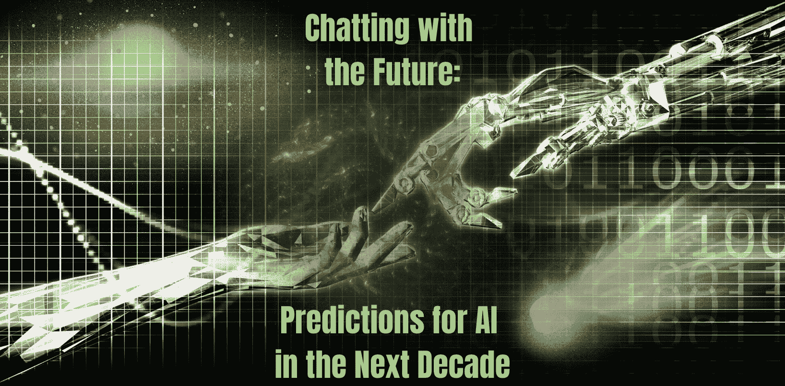

# 与未来对话：未来十年人工智能的预测

> 原文：[`www.kdnuggets.com/2023/04/chatting-future-predictions-ai-next-decade.html`](https://www.kdnuggets.com/2023/04/chatting-future-predictions-ai-next-decade.html)

作者提供的图片

# 自然语言处理

* * *

## 我们的三大课程推荐

 1\. [Google 网络安全证书](https://www.kdnuggets.com/google-cybersecurity) - 快速进入网络安全职业。

 2\. [Google 数据分析专业证书](https://www.kdnuggets.com/google-data-analytics) - 提升你的数据分析能力

 3\. [Google IT 支持专业证书](https://www.kdnuggets.com/google-itsupport) - 支持你的组织 IT 部门

* * *

这完全是显而易见的。我们在过去一个月中见证了 ChatGPT、Google Bard 和其他未知的新兴产品。那么，什么是自然语言处理（NLP），为什么我提到 ChatGPT 和 Google Bard 呢？

NLP 是帮助计算机理解文本数据的过程。学习一种语言对我们人类来说已经很困难了，你可以想象教计算机理解文本数据有多么困难。NLP 使用各种技术，如情感分析、命名实体识别、摘要、文本分类、词形还原/词干提取等。

ChatGPT 和 Google Bard 是大型语言模型（LLM），深度学习算法可以阅读、识别、总结、翻译、预测，并生成文本。凭借此功能，它们可以预测未来的词汇，并与用户进行对话，就像与人类交谈一样。了解更多关于 LLM 的信息，请点击这里：了解大型语言模型。

ChatGPT 和 Google Bard 似乎在竞争，看看谁会成为最佳的大型语言模型聊天机器人。这意味着 AI 系统将变得更擅长理解和生成自然语言，要求自然语言处理（NLP）在这场竞争中处于前沿。

# 多用途聊天机器人

随着聊天机器人的增加，例如 ChatGPT 和 Google Bard，我们知道它们将不再仅仅限于返回文本。OpenAI 宣布 ChatGPT-4 是一个多模态模型，将提供完全不同的可能性——例如，视频、图像等。

OpenAI 的 [DALL-E](https://openai.com/product/dall-e-2) 可以通过自然语言描述创建逼真的图像/艺术。我们早该预见到 OpenAI 计划使 ChatGPT-4 成为多模态模型。了解更多关于 ChatGPT-4 的信息，请点击这里：GPT-4：你需要知道的一切。

尽管如此，迟早人们会拥有一个能够回答问题、创建内容、生成图像等的单一模型或聊天机器人。

# 更加个性化

想象一下拥有一个可以完全按照你需求操作的聊天机器人。一个完全根据你说话方式、提问类型、兴趣等学习的 AI 系统。

我们在社交媒体渠道上也能看到这一点，例如 Instagram 和 TikTok——你的数据正在被记录以改善推荐系统。也就是说，如果你有一个能够理解你作为个体的工具，包括你的偏好、行为和需求——这是否会本质上消除对人际互动的需求？

# 不同领域中 AI 的使用增加

考虑到我上述的所有观点，若说这些 AI 系统和工具迟早会成为我们日常工作的一部分，那将有些荒谬。我不确定你如何看，但很多我的同事已经在使用如 Google Bard 的聊天机器人来帮助他们创建职位描述。不论是大型语言模型还是计算机视觉——AI 将开始成为工作环境和流程的核心部分。

曾经以及现在，人们对 AI 的使用感到紧张和焦虑。由于对其的炒作以及持续的投资和研究——越来越多的行业将采用 AI 来改善这些行业。

财务行业一直在利用 AI 来帮助检测欺诈、反洗钱流程和投资管理。他们可能会考虑使用聊天机器人来处理申请人的整个过程，从而降低成本和任务。

在医疗保健行业，机器学习算法已经被用来预测患者结果、帮助诊断疾病，并协助手术过程。我们再次探讨如何改进医疗保健行业。

这也包括 AI 在自主领域的持续增长。自动驾驶汽车、机器人和无人机将继续增长和改进，以至于我们可能会看到对人类需求的大幅下降。

面对现实，我们在大多数国家处理着大量的工作负荷，有些国家薪水不高。如果这些角色转交给 AI 系统、机器人等——这会有多糟糕？很难说，因为任何好事都必定有坏的一面，对吧？在评论中告诉我你的想法。

通过阅读了解更多： 工作的未来：AI 如何改变工作格局

# 法律、道德和伦理

到目前为止，AI 行业几乎没有任何管理、规则或约束。它基本上是一个狂野的西部。

然而，近年来我们已经看到了一些由于人工智能的兴起而产生的变化。例如，《欧洲人工智能法案》有可能被视为黄金标准。了解更多信息，请点击这里：欧洲人工智能法案：简化版解读。

在 2022 年，立法者和监管者努力确保人工智能领域在 2023 年会发生变化。立法者正在完成对之前提到的《欧洲人工智能法案》的修订，该法案在初稿中已经禁用了某些人工智能系统并规定了罚款。

人工智能将继续在全球范围内传播，因此政府、监管机构、立法者等将需要更加努力地确保人工智能系统符合伦理，不存在偏见，公平，并且保护客户隐私。

# 总结

我可以想象每个人对未来十年的预期都有自己的想法和看法。我个人关注这些问题，因为法律的实施也需要时间，人工智能系统才能真正成为我们日常个人生活和工作的一部分。

请在评论中告诉我你认为未来十年人工智能会发生什么。

**[尼莎·阿雅](https://www.linkedin.com/in/nisha-arya-ahmed/)** 是一名数据科学家、自由技术作家和 KDnuggets 的社区经理。她特别关注提供数据科学职业建议或教程以及基于理论的数据科学知识。她还希望探索人工智能如何能有益于人类寿命的延续。她是一个热衷于学习的求知者，致力于拓宽她的技术知识和写作技能，同时帮助指导他人。

### 更多相关主题

+   [人工智能的未来：探索下一代生成模型](https://www.kdnuggets.com/2023/05/future-ai-exploring-next-generation-generative-models.html)

+   [将你的数据科学职业提升到下一个水平](https://www.kdnuggets.com/2021/12/sas-advance-data-science-career-next-level.html)

+   [初级数据科学家：下一阶段](https://www.kdnuggets.com/2022/02/junior-data-scientist-next-level.html)

+   [你可能在下次面试中遇到的 24 个 SQL 问题](https://www.kdnuggets.com/2022/06/24-sql-questions-might-see-next-interview.html)

+   [数据分析师晋升所需技能](https://www.kdnuggets.com/2022/09/data-analyst-skills-need-next-promotion.html)

+   [RAPIDS cuDF 加速你的下一步数据科学工作流程](https://www.kdnuggets.com/2023/04/rapids-cudf-speed-next-data-science-workflow.html)
