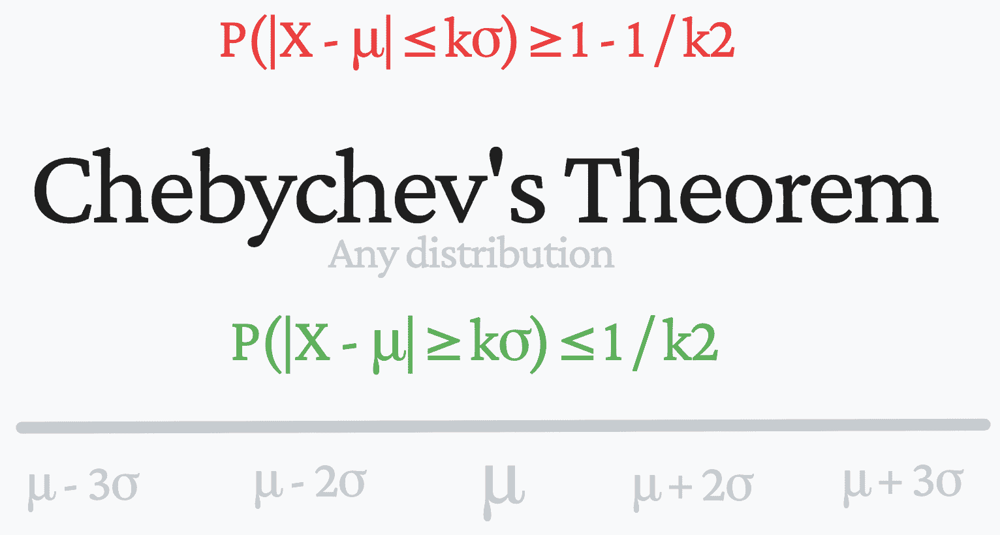
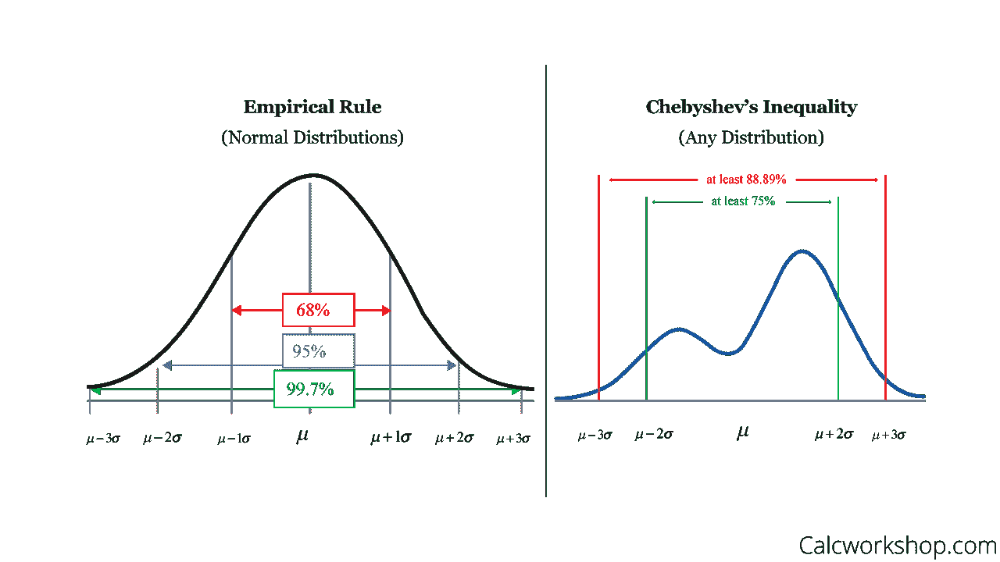
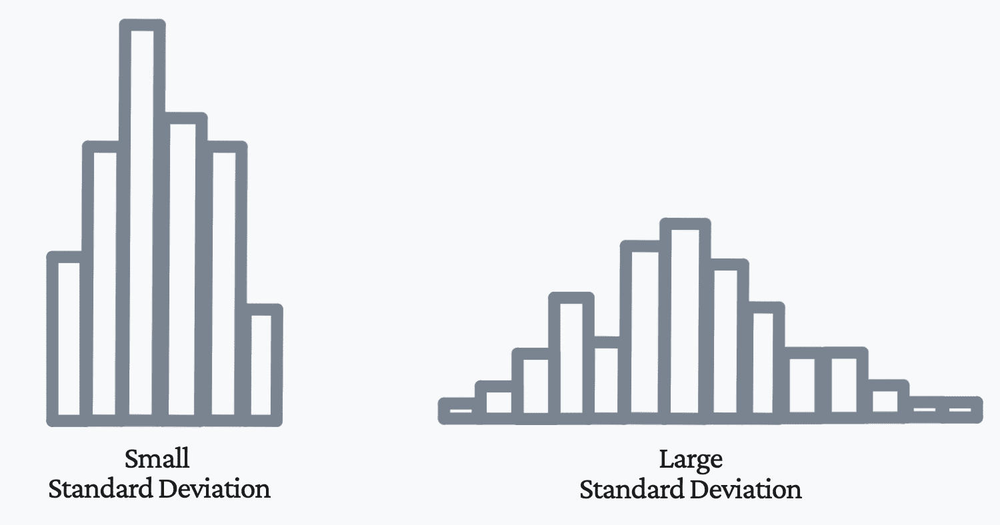

# 什么是切比雪夫定理，它如何应用于数据科学？

> 原文：[`www.kdnuggets.com/2022/11/chebychev-theorem-apply-data-science.html`](https://www.kdnuggets.com/2022/11/chebychev-theorem-apply-data-science.html)

作者提供的图片

# 什么是经验规则？

* * *

## 我们的前三个课程推荐

 1\. [谷歌网络安全证书](https://www.kdnuggets.com/google-cybersecurity) - 快速入门网络安全职业

 2\. [谷歌数据分析专业证书](https://www.kdnuggets.com/google-data-analytics) - 提升您的数据分析能力

 3\. [谷歌 IT 支持专业证书](https://www.kdnuggets.com/google-itsupport) - 支持您的组织 IT

* * *

在我们开始学习切比雪夫定理之前，了解经验规则会很有用。

经验规则告诉你大多数值在正态分布中的位置。它指出：

1.  约 68%的数据位于均值的 1 个标准差以内

1.  约 95%的数据位于均值的 2 个标准差以内

1.  约 99.7%的数据位于均值的 3 个标准差以内

然而，你无法 100%确定数据的分布会遵循正态钟形曲线。当你处理数据集时，应始终询问数据是否存在偏斜。这就是切比雪夫定理发挥作用的地方。

# 什么是切比雪夫定理？

切比雪夫定理由俄罗斯数学家帕夫努季·切比雪夫证明，通常称为切比雪夫不等式。它可以应用于任何数据集，特别是那些具有广泛概率分布而不遵循我们希望的正态分布的数据集。

用通俗的语言来说，它指出只有一定比例的观察值可以距离均值超过一定的距离。

对于切比雪夫定理，它指出，当使用任何数值数据集时：

1.  至少有 3/4 的数据位于均值的 2 个标准差以内

1.  至少有 8/9 的数据位于均值的 3 个标准差以内

1.  数据中有 1−1 ∕ k2 的部分位于均值的 k 个标准差以内

使用“至少”一词是因为定理给出了数据位于均值给定标准差数量内的最小比例。

下图直观地展示了经验规则和切比雪夫定理之间的差异：

来源: [calcworkshop](https://calcworkshop.com/joint-probability-distribution/chebyshev-inequality/)

## 切比雪夫定理的公式：

切比雪夫定理有两种呈现方式：

X 是一个随机变量

μ是均值

σ是标准差

k>0 是一个正数

1.  P(|X - μ| ≥ kσ) ≤ 1 / k²

这个方程表示，X 距离均值超过 k 个标准差的概率最多为 1/k²。这也可以写作：

1.  P(|X - μ| ≤ kσ) ≥ 1 - 1 / k²

切比雪夫定理意味着随机变量远离均值的可能性非常小。因此，我们使用的 k 值是我们为距离均值的标准差数量设置的限制。

当 k >1 时，可以使用切比雪夫定理

# 那么它如何应用于数据科学呢？

在数据科学中，你会使用许多统计度量来了解你正在处理的数据集。均值计算数据集的集中趋势，但这并不能告诉我们关于数据集的足够信息。

作为数据科学家，你会想了解更多关于数据的离散情况。为了弄清楚这一点，你需要测量标准差，它表示每个值与均值之间的差异。当你有了均值和标准差，你可以了解到很多关于数据集的信息。

我们的方差越大，数据点的分布越分散，离均值的距离越远；方差越小，数据点的分布越集中，离均值的距离也越近。

如果随机变量的方差低，那么观察值将集中在均值附近。如下面的图片所示，这会导致较小的标准差。然而，如果你的数据分布具有较大的方差，那么你的观察值将自然地更加分散，离均值更远。如下面的图片所示，这会导致较大的标准差。

作者提供的图片

数据科学家和其他技术专家会遇到方差较大的数据集。因此，他们通常使用的经验规则可能无法帮助他们，他们将不得不使用切比雪夫定理。

# 总结

如果你想了解更多关于数据点的离散情况，只要你计算了均值和标准差，并且数据不符合正态分布，切比雪夫定理就可以应用。它能够确定数据落在均值特定范围内的比例。

**[Nisha Arya](https://www.linkedin.com/in/nisha-arya-ahmed/)** 是一位数据科学家和自由职业技术作家。她特别感兴趣于提供数据科学职业建议或教程，以及数据科学相关的理论知识。她还希望探索人工智能如何/能够促进人类寿命的不同方式。作为一个热衷于学习的人，她寻求拓宽技术知识和写作技能，同时帮助指导他人。

### 更多相关话题

+   [KDnuggets 新闻，11 月 30 日：什么是切比雪夫定理以及如何…](https://www.kdnuggets.com/2022/n46.html)

+   [理解贝叶斯定理的 3 种方式将提升你的数据科学](https://www.kdnuggets.com/2022/06/3-ways-understanding-bayes-theorem-improve-data-science.html)

+   [MLOps: 最佳实践及其应用方法](https://www.kdnuggets.com/2022/04/mlops-best-practices-apply.html)

+   [将 AI 应用于小数据集的 5 种方式](https://www.kdnuggets.com/2022/02/5-ways-apply-ai-small-data-sets.html)

+   [使用 Pandas Dataframes 的 apply() 方法](https://www.kdnuggets.com/2022/07/apply-method-pandas-dataframes.html)

+   [如何使用 NumPy 对数组进行填充](https://www.kdnuggets.com/how-to-apply-padding-to-arrays-with-numpy)
