# 如何在 Python 中检查回归模型的质量？

> 原文：[`www.kdnuggets.com/2019/07/check-quality-regression-model-python.html`](https://www.kdnuggets.com/2019/07/check-quality-regression-model-python.html)

评论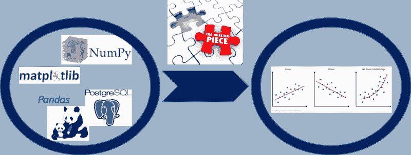

### 为什么这很重要（以及你可能忽视了什么）

尽管最新深度神经网络架构的复杂性以及[xgboost 在 Kaggle 比赛中的惊人表现](https://blog.kaggle.com/tag/xgboost/)常被讨论，且行业中对[data-driven analytics](https://www.oreilly.com/library/view/creating-a-data-driven/9781491916902/ch01.html)和机器学习（ML）技术的关注不断增加，但对大多数行业来说，[回归分析依然是首选](https://www.surveygizmo.com/resources/blog/regression-analysis/)用于日常工作。

* * *

## 我们的前三个课程推荐

 1\. [Google 网络安全证书](https://www.kdnuggets.com/google-cybersecurity) - 快速进入网络安全职业生涯。

 2\. [Google 数据分析专业证书](https://www.kdnuggets.com/google-data-analytics) - 提升你的数据分析能力

 3\. [Google IT 支持专业证书](https://www.kdnuggets.com/google-itsupport) - 支持你所在组织的 IT 工作

* * *

查看这个 KDnuggets 2018–19 年的调查结果（由[Matthew Mayo](https://medium.com/@mattmayo13)提供）。

**2018 年和 2019 年使用的顶级数据科学和机器学习方法**

*在最新的 KDnuggets 调查中，读者被问到：你使用了哪些数据科学/机器学习方法和算法…*www.kdnuggets.com

回归技术有多种形式——线性、非线性、泊松、树基——但核心思想在各类回归中几乎相同，并且可以应用于金融、医疗、服务业、制造业、农业等各种预测分析问题。

线性回归是基本技术，[它深深植根于经过时间考验的统计学习和推断理论](https://towardsdatascience.com/linear-regression-using-python-b136c91bf0a2)，并驱动了现代数据科学管道中所有基于回归的算法。

然而，**线性回归模型的成功还依赖于一些对数据本质的基本假设**。请参阅这篇文章以简单直观地理解这些假设，

[**回归模型假设**

*我们在使用线性回归来建模响应和预测变量之间的关系时做出了一些假设…*www.jmp.com](https://www.jmp.com/en_us/statistics-knowledge-portal/what-is-regression/simple-linear-regression-assumptions.html)

因此，检查你的线性回归模型的质量非常重要，通过验证这些假设是否“合理”地满足（通常使用可视化分析方法，这些方法有解释空间，来检查假设）。

> 问题在于，检查模型质量通常是数据科学任务流程中的一个优先级较低的方面，而其他优先事项（如预测、缩放、部署和模型调整）占据主导地位。

这个断言听起来是否太过**大胆**？有一个简单的测试。

在行业标准的基于 Python 的数据科学堆栈中，你有多少次使用过**Pandas、NumPy**、**Scikit-learn**，甚至**PostgreSQL**进行数据获取、整理、可视化，最终构建和调整你的机器学习模型？我想很多次吧？

现在，你有多少次使用过[**statsmodels**库](http://www.statsmodels.org/devel/index.html)来通过运行[优度检验](https://www.statisticshowto.datasciencecentral.com/goodness-of-fit-test/)来检查模型？

在**基于 Python 的数据科学学习路径**中，这种情况非常常见，

“是否缺少什么”这个问题的答案是肯定的！

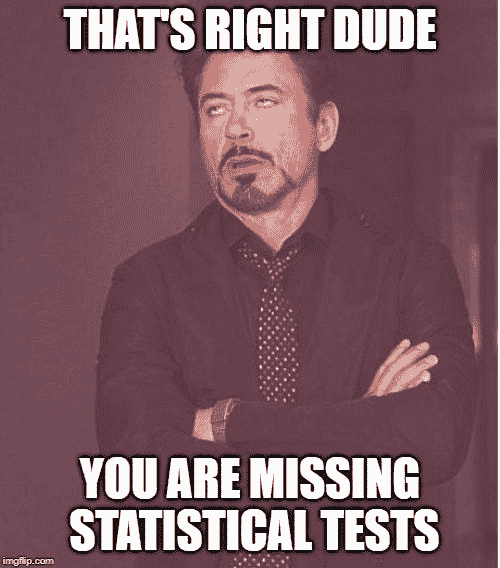

经常讨论的有[正则化](https://towardsdatascience.com/regularization-in-machine-learning-76441ddcf99a)、[偏差-方差权衡](http://scott.fortmann-roe.com/docs/BiasVariance.html)或可扩展性（学习和复杂度曲线）图。但是，对于以下图表和列表，讨论是否足够？

+   残差与预测变量的图

+   拟合值与残差图

+   归一化残差的直方图

+   归一化残差的 Q-Q 图

+   残差的 Shapiro-Wilk 正态性检验

+   残差的 Cook 距离图

+   预测特征的方差膨胀因子 (VIF)

很明显，你需要戴上[统计学家的帽子](https://towardsdatascience.com/statistics-for-people-in-a-hurry-a9613c0ed0b)，不仅仅是数据挖掘专业人士的帽子，以处理机器学习管道的这一部分。

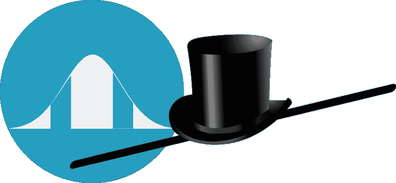

### Scikit-learn 的问题

可以安全地假设，大多数[转行成为数据科学家的统计学家](https://www.unece.org/info/media/news/statistics/2017/are-official-statisticians-becoming-data-scientists/doc.html)定期对其回归模型进行[优度检验](http://www.medicine.mcgill.ca/epidemiology/joseph/courses/EPIB-621/fit.pdf)。

但许多年轻的数据科学家和分析师在数据驱动建模中高度依赖于像 **Scikit-learn** 这样的机器学习库，尽管它是一个出色的库，并且几乎是 [机器学习和预测任务的灵丹妙药](https://medium.com/analytics-vidhya/scikit-learn-a-silver-bullet-for-basic-machine-learning-13c7d8b248ee)，但它不支持基于标准统计测试的快速和轻松的模型质量评估。

> 因此，除了使用像 Scikit-learn 这样的机器学习库外，良好的数据科学管道还必须包含一些标准化的代码集，以使用统计测试评估模型的质量。

在本文中，我们展示了针对多变量线性回归问题的这种标准评估集。我们将使用 statsmodels 库进行回归建模和统计测试。

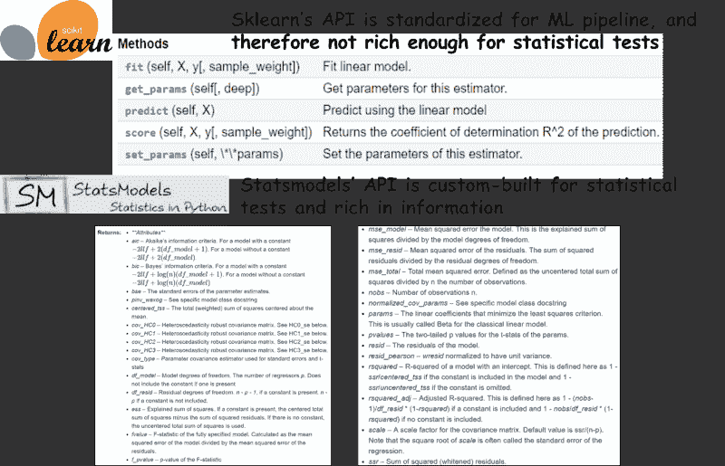

### 线性回归假设及关键视觉测试的简要概述

**假设**

线性回归模型需要测试的四个关键假设是，

+   **线性**：因变量的期望值是每个自变量的线性函数，其他自变量保持固定（注意，这并不限制你使用自变量的非线性变换，即你仍然可以使用 *f(x) = ax² + bx + c* 来建模，同时使用 *x²* 和 *x* 作为预测变量）。

+   **独立性**：误差（拟合模型的残差）彼此独立。

+   **同方差性** **（常量方差）**：误差的方差对于预测变量或响应变量是常量。

+   **正态性**：误差来自正态分布（其均值和方差未知，但可以从数据中估计）。注意，这不是执行线性回归的必要条件，不像上述三个假设。然而，如果不满足这个假设，你将无法轻松计算所谓的“置信区间”或“预测区间”，因为无法使用对应于高斯分布的已知分析表达式。

对于多元线性回归，从统计推断的角度来看，判断 **多重共线性** 也是至关重要的。这个假设认为预测变量之间没有或极少有线性依赖。

**异常值** 也可能影响模型质量，因为它们对估计的模型参数有不成比例的影响。

这里是一个视觉回顾，

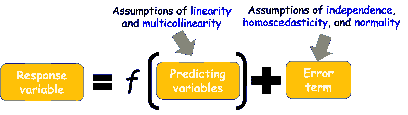

**可以检查哪些图？**

所以，误差项非常重要。

> 但有个坏消息。无论我们拥有多少数据，我们永远无法知道真实的误差。我们只能估计和推断数据生成的分布。

因此，**真实误差的代理是残差**，即观察值和拟合值之间的差异。

底线——我们需要绘制残差，检查它们的随机性质、方差和分布，以评估模型质量。**这是线性模型拟合优度估计所需的可视分析。**

除此之外，多重共线性可以通过相关矩阵和热图进行检查，而数据中的离群值（残差）可以通过所谓的**库克距离图**来检查。

### 回归模型质量评估示例

本示例的完整代码库[可以在作者的 Github 上找到](https://github.com/tirthajyoti/Machine-Learning-with-Python/blob/master/Regression/Regression_Diagnostics.ipynb)。

我们使用的是[混凝土抗压强度预测](https://archive.ics.uci.edu/ml/datasets/Concrete+Compressive+Strength)问题，来源于 UCI ML 门户。混凝土的抗压强度是年龄和成分的高度复杂函数。我们能否通过这些参数的测量值来预测强度？

**检查线性关系的变量散点图**

我们可以通过散点图简单地检查线性假设的视觉效果。

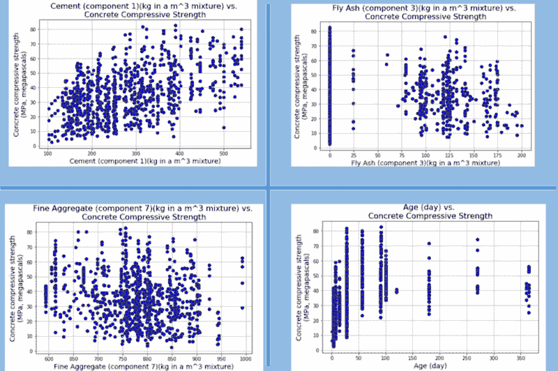

**检查多重共线性的配对散点图和相关性热图**

我们可以使用[**seaborn 库中的 pairplot**](https://seaborn.pydata.org/generated/seaborn.pairplot.html)函数来绘制所有组合的配对散点图。

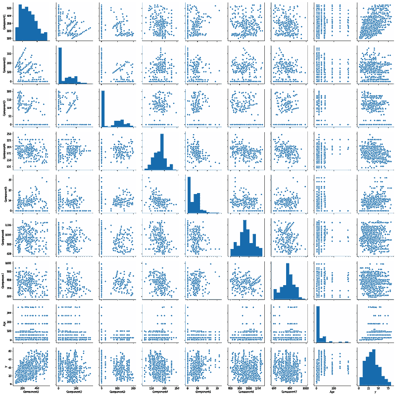

此外，如果数据加载到 Pandas 中，我们可以轻松计算相关矩阵，并将其传递给[**statsmodels 的特殊绘图函数**](https://www.statsmodels.org/stable/generated/statsmodels.graphics.correlation.plot_corr.html#statsmodels.graphics.correlation.plot_corr)以将相关性可视化为热图。

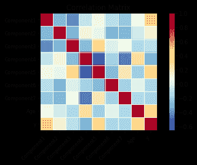

**使用 statsmodel.ols()函数进行模型拟合**

主要模型拟合是使用 statsmodels.OLS 方法完成的。这是一个惊人的线性模型拟合工具，感觉非常像 R 中的强大‘lm’函数。最棒的是，它接受 R 风格的公式来构建完整或部分模型（即涉及所有或一些预测变量）。

你可能会问，在大数据时代，为什么还要创建部分模型而不是将所有数据都放进去？这是因为数据中可能存在混淆或隐性偏差，而这些问题只有通过[**控制某些因素**](https://stats.stackexchange.com/questions/78816/how-do-you-control-for-a-factor-variable)才能解决。

无论如何，通过该模型拟合的模型摘要已经提供了关于模型的丰富统计信息，例如与所有预测变量相关的 t 统计量和 p 值、R 平方值、调整后的 R 平方值、AIC 和 BIC 等。

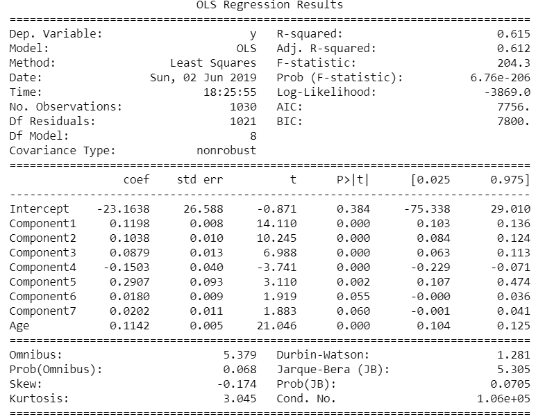

**残差与预测变量图**

接下来，我们可以绘制残差与每个预测变量的关系图，以检查独立性假设。**如果残差在零 x 轴周围均匀随机分布，并且不形成特定的聚类**，那么假设成立。在这个特定问题中，我们观察到一些聚类现象。

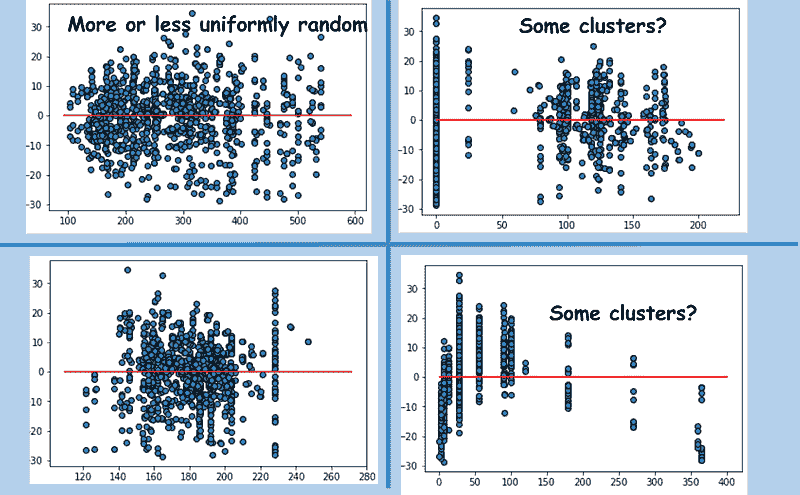

**拟合值与残差图以检查同方差性**

当我们绘制拟合响应值（按照模型）与残差的关系图时，我们清楚地观察到**残差的方差随着响应变量的大小而增加**。因此，该问题不符合同方差性，可能需要某种变量变换来提高模型质量。

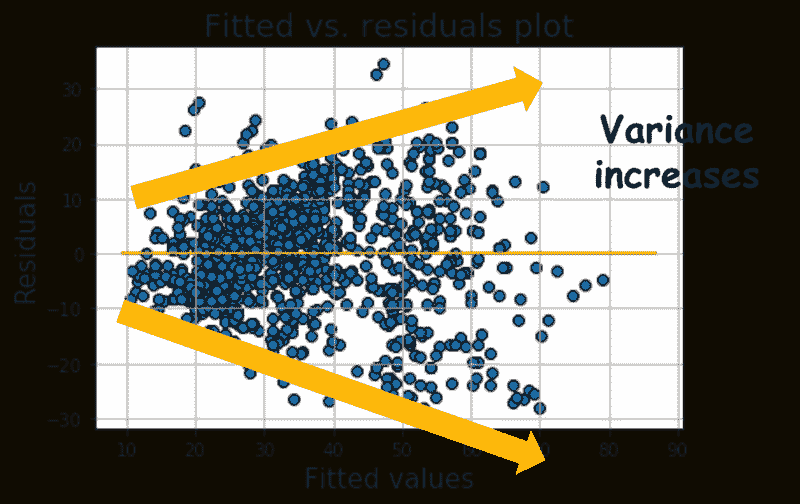

**标准化残差的直方图和 Q-Q 图**

为了检查数据生成过程的正态性假设，我们可以简单地绘制标准化残差的直方图和 Q-Q 图。

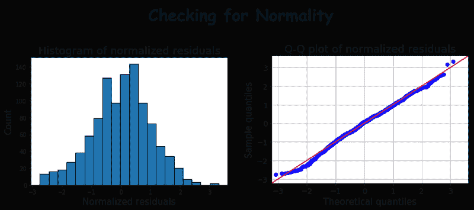

此外，我们可以对残差进行 Shapiro-Wilk 检验，以检查正态性。

**使用 Cook 距离图进行异常值检测**

Cook 的距离基本上衡量了删除某一观察值的效果。具有较大 Cook 距离的点需要仔细检查，以确定是否为潜在的异常值。我们可以使用来自 [statsmodels 的特殊异常值影响类](http://www.statsmodels.org/devel/generated/statsmodels.stats.outliers_influence.OLSInfluence.summary_frame.html) 绘制 Cook 距离。

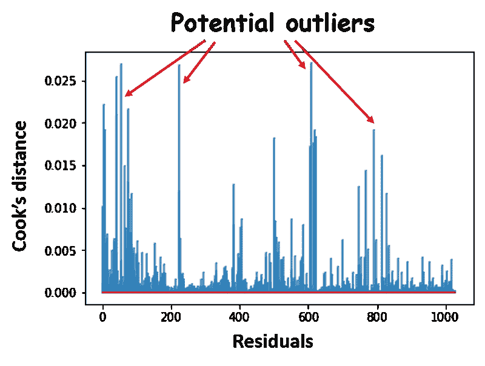

**方差膨胀因子**

对于这个数据集的 OLS 模型总结显示了多重共线性的警告。但是如何检查哪些因素导致了它？

我们可以计算每个预测变量的 [方差膨胀因子](https://en.wikipedia.org/wiki/Variance_inflation_factor)。这是一个多项式模型的方差与仅包含一个项的模型的方差之比。同样，我们利用 statsmodels 中的 [特殊异常值影响类](https://www.statsmodels.org/stable/generated/statsmodels.stats.outliers_influence.variance_inflation_factor.html)。

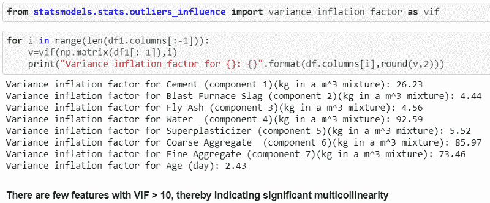

**其他残差诊断**

Statsmodels 提供了多种其他诊断测试用于检查模型质量。你可以查看这些页面。

+   [残差诊断测试](https://www.statsmodels.org/stable/stats.html#module-statsmodels.stats.stattools)

+   [拟合优度测试](https://www.statsmodels.org/stable/stats.html#goodness-of-fit-tests-and-measures)

### 总结和 **思考**

在这篇文章中，我们介绍了如何在线性回归中添加 **模型质量评估的必要视觉分析**——各种残差图、正态性测试和多重共线性检查。

甚至可以考虑创建一个简单的函数套件，能够接受 scikit-learn 类型的估算器，并生成这些图表，供数据科学家快速检查模型质量。

目前，虽然 scikit-learn 没有详细的统计测试或模型质量评估绘图功能，[Yellowbrick](https://www.scikit-yb.org/en/latest/) 是一个有前途的 Python 库，可以为 scikit-learn 对象添加直观的可视化功能。我们希望在不久的将来，统计测试可以直接添加到 scikit-learn ML 估算器中。

如果你有任何问题或想法，欢迎通过[**tirthajyoti[AT]gmail.com**](mailto:tirthajyoti@gmail.com)联系作者。此外，你可以查看作者的[**GitHub**](https://github.com/tirthajyoti?tab=repositories)**仓库**，获取其他有趣的 Python、R 或 MATLAB 代码片段和机器学习资源。如果你像我一样，对机器学习/数据科学充满热情，欢迎[在 LinkedIn 上添加我](https://www.linkedin.com/in/tirthajyoti-sarkar-2127aa7/) 或 [在 Twitter 上关注我](https://twitter.com/tirthajyotiS)。

[**Tirthajyoti Sarkar - 高级首席工程师 - 半导体、AI、机器学习 - ON…**]

*乔治亚理工学院理学硕士 - MS, 数据分析 该硕士项目提供理论和实践…*www.linkedin.com](https://www.linkedin.com/in/tirthajyoti-sarkar-2127aa7/)

**简介：[Tirthajyoti Sarkar](https://www.linkedin.com/in/tirthajyoti-sarkar-2127aa7/)** 是 ON Semiconductor 的高级首席工程师，专注于基于深度学习/机器学习的设计自动化项目。

[原文](https://towardsdatascience.com/how-do-you-check-the-quality-of-your-regression-model-in-python-fa61759ff685)。已获许可转载。

**相关：**

+   为你的回归问题选择最佳的机器学习算法

+   选择评估机器学习模型的正确度量标准——第一部分

+   从信号中分离噪声

### 更多相关话题

+   [数据质量维度：用 Great Expectations 确保数据质量](https://www.kdnuggets.com/2023/03/data-quality-dimensions-assuring-data-quality-great-expectations.html)

+   [使用 Eurybia 检测数据漂移以确保生产 ML 模型质量](https://www.kdnuggets.com/2022/07/detecting-data-drift-ensuring-production-ml-model-quality-eurybia.html)

+   [数据质量在成功机器学习模型中的重要性](https://www.kdnuggets.com/2022/03/significance-data-quality-making-successful-machine-learning-model.html)

+   [3 个新的提示工程资源，值得查看](https://www.kdnuggets.com/3-new-prompt-engineering-resources)

+   [用 Great Expectations 克服数据质量问题](https://www.kdnuggets.com/2023/01/overcome-data-quality-issues-great-expectations.html)

+   [线性回归模型选择：平衡简洁性与复杂性](https://www.kdnuggets.com/2023/02/linear-regression-model-selection-balancing-simplicity-complexity.html)
