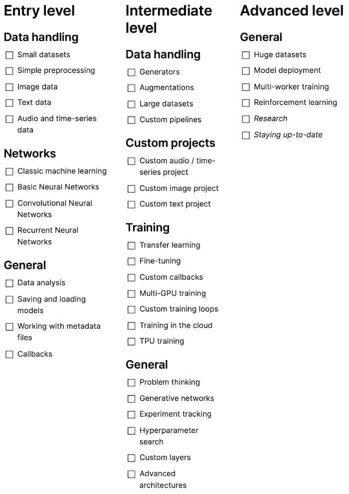

# 跟踪你数据科学进展的检查清单

> 原文：[`www.kdnuggets.com/2021/05/checklist-data-science-progress.html`](https://www.kdnuggets.com/2021/05/checklist-data-science-progress.html)

评论

**作者：[Pascal Janetzky](https://pascaljanetzky.medium.com/)，计算机科学学生，体育爱好者。**

有许多很棒的课程可以学习数据科学，还有很多证书可以证明你的成功。

* * *

## 我们的前三大课程推荐

 1\. [谷歌网络安全证书](https://www.kdnuggets.com/google-cybersecurity) - 快速进入网络安全职业生涯。

 2\. [谷歌数据分析专业证书](https://www.kdnuggets.com/google-data-analytics) - 提升你的数据分析水平

 3\. [谷歌 IT 支持专业证书](https://www.kdnuggets.com/google-itsupport) - 支持你的组织进行 IT 工作

* * *

那么，你如何跟踪你的进展呢？你如何知道自己已经取得了哪些成就，还有哪些尚待实现的目标？

以下检查清单可以帮助你概览自己的进度。它旨在为那些寻找自己在旅程中大致位置的用户提供一个总体概述。它并不强调特定的指南、课程和软件包，而是专注于一般概念：

*作者提供的图片。可在 Notion [这里](https://www.notion.so/A-checklist-to-track-your-Data-Science-progress-9de80b1b23c04634904168991247b651)查看，PDF 格式 [这里](https://drive.google.com/file/d/1CjuSlqhzjq1rUX5JYvJhx7YWIjxs5tdF/view?usp=sharing)，以及 GitHub [这里](https://github.com/phrasenmaeher/data-science-checklist)下载。*

让我们详细介绍这些级别，从入门级开始，继续到中级，最后到广泛的高级领域。

### 入门级

这是开始的地方。它涵盖了你进一步旅程的基础。

**数据处理**

此类别的意图是专注于能够处理最常见的数据类型：

+   图片

+   文字

+   音频/时间序列

一般来说，此阶段的数据集非常小，处理比内存大的数据集不会带来（心理）负担。好的例子包括经典的 MNIST 图像数据集（[PyTorch](https://pytorch.org/vision/stable/datasets.html#mnist)，[TensorFlow](https://www.tensorflow.org/api_docs/python/tf/keras/datasets/mnist)），IMDB 评论文本数据集（[PyTorch](https://pytorch.org/text/stable/datasets.html#imdb)，[TensorFlow](https://www.tensorflow.org/api_docs/python/tf/keras/datasets/imdb)），以及小型音频或时间序列数据集。它们最多只有几百 MB，非常适合放入 RAM 中。

这些数据集中的一些需要最少的预处理（缩放图像、缩短句子），通常不超过几行代码。由于示例数量要么非常少，要么仅为小尺寸，你可以在运行时轻松完成处理（与提前运行复杂的脚本相比）。

总之，这一类别强调处理小型音频/时间序列、图像和文本数据集，并应用简单的操作进行数据预处理。

**网络**

这一类别的意图是从经典的机器学习过渡到神经网络，并了解常见的构建块：

经典的机器学习技术包括支持向量机、线性回归和聚类算法。尽管更复杂的神经网络在最近的研究中似乎占据主导地位，但它们在处理小问题时也很有用——或者作为一个基准。在分析数据时，了解如何使用它们也是很有帮助的。

在深入学习的过程中，密集层是一个很好的起点。我猜它们几乎在每个（分类）模型中都会用到，至少用于构建输出层。

第二种常用的网络类型是卷积神经网络，它的核心使用卷积操作。很难想象有哪个成功的研究没有使用并受益于这一简单操作：你将一个卷积核滑动在输入上，然后计算卷积核与其覆盖的图像块之间的内积。卷积操作从输入数据的每一个可能位置中提取一小组特征。难怪它们在分类图像时非常成功，因为重要的特征分散在各处。

前两种网络类型主要用于静态输入，即我们提前知道数据的形状。当你拥有形状各异的数据时，例如句子，你可能会寻找更灵活的方法。这就是递归神经网络的用武之地：它们可以保留长时间的信息，这使得将“我在早上起床穿衣后和我的狗散步”中的“我”和“和我的狗散步”连接起来，以回答“谁和狗散步？”这个问题成为可能。

总之，这一类别专注于使用简单的密集层、卷积层和递归神经网络来分类图像、文本和时间序列数据。

**通用**

这一类别的意图是学习数据科学相关任务的一般处理方法。

一个重要的步骤是了解数据本身。这不仅限于图像数据或文本数据，还包括时间序列数据、音频数据以及其他任何数据类型。术语探索性数据分析（感谢[Andryas Waurzenczak](https://medium.com/@andryaas)指出这一点）最能描述这个步骤：使用技术来寻找模式、异常值（超出常见范围的数据点）、子结构、标签分布，以及对数据进行可视化。这可能涉及主成分分析（PCA）或降维技术。你在这一阶段处理的数据集通常已经被详细探索过（尝试搜索数据集的名称以找到有趣的特征），但现在学习这些知识会在你继续处理自定义数据集时带来回报。

你还将学习如何加载和保存上述模型，以便以后可以重用它们。常见的做法是将关于数据的数据，即*元数据*，存储在单独的文件中。以 CSV 文件为例：第一列存储数据样本的文件路径，第二列存储样本的类别。能够解析这些信息是必要的，但 thanks to 许多库，这是一项简单的任务。

当你开始在这些小型数据集上训练你的基础网络时，使用上述架构，你会逐渐发现回调的有用性。回调是训练过程中执行的代码，它实现了许多功能：定期保存模型以确保其安全，停止训练，或改变参数。最常见的回调已经内置于大多数库中，只需简短的函数调用即可使用它们！

总而言之，这个类别让你学会处理在小型数据集上运行神经网络的任务。

### 中级阶段

在我看来，这里是乐趣开始的地方，而且你会比你预期的更快到达这个阶段！我发现这个转变发生得非常自然：你寻找一种更高效的数据处理方式——而在你意识到之前，你已经为大型数据集编写了自定义管道。

**数据处理**

这一阶段的意图是能够处理更大或更复杂的数据集，这可能需要特殊处理，如增强和自定义预处理管道。

在这个阶段，数据集趋向于变得更大，可能不再适合放入你的内存中。高效的预处理变得更加重要，因为你不会让你的硬件闲置。此外，当你处理形状不等的样本、从数据库中提取样本或进行自定义预处理时，你可能需要编写自己的生成器。

或者你处理复杂且不平衡的数据集，其中大多数样本属于一个类别，而只有少数样本属于所需类别。你将学习一些有用的技术：增加数据以生成更多的少数类别样本，或减少主要类别的样本数量。

对于这两种数据集类型，自定义管道变得更加重要。例如，当你希望快速迭代设置时，比如将图像裁剪为 32x32 而不是 50x50 时，你很少会想要启动长期运行的脚本。将这种可能性纳入你的管道可以实现快速实验。

总结来说，数据集往往变得更加复杂（例如，不平衡）和更大（例如，达到 30—40 GB），并且需要更复杂的处理。

**自定义项目**

这是中级水平的核心。其背后的意图是处理自定义项目，从而学习和使用许多其他类别的内容。

第一级可能已经引导你通过在 MNIST 数据集上训练网络。在这个层级，你将自然地更加关注自己的数据以及如何解析它。我只列出了音频、图像和文本这三个主要领域，但还有许多其他领域。

通过自己进行项目，你可以将之前学到的知识与解决挑战联系起来。

**训练**

这一类别的意图是了解更多关于训练神经网络的知识。这个类别是中级水平中最大的类别，原因在于它集中于更高级的主题。

自定义训练的第一步是使用迁移学习和微调。之前，你通常会使用标准方法来训练和测试模型，但现在你可能需要更强大的方法。这时，重新利用其他从业者训练的模型就很有用。你加载他们的模型，并在自己的数据集上仔细训练它们。

如果你遗漏了一些功能，这时你需要编写自定义训练循环和自定义回调函数。想要每 20 个批次打印一些统计信息？编写一个自定义回调。想要在 20 个批次中累积梯度？编写一个自定义训练循环。

更复杂的循环可能需要更多的资源：多 GPU 训练即将到来！不过，这不仅仅是增加第二、第三个或更多的资源；你必须足够快地获取数据。请记住，多设备训练增加了复杂性。大部分后台工作已经由 PyTorch 和 TensorFlow 完成，它们只需少量代码更改就能处理这种情况，但前端部分仍由你负责。（不过不要担心，那里有许多指南可以帮助你完成这项工作！）

如果你像我一样没有多张 GPU，那么在云上训练可能是下一步的选择。所有主要的云服务提供了你所需的资源。刚开始时，从本地环境转到云计算会有一些（心理上的）开销。但经过几次尝试，这会变得容易得多。（当我开始在 Kubernetes 集群上运行脚本时，事情非常让人不知所措：什么是 Dockerfile？如何运行作业？如何使用本地资源？如何进出数据？经过一番实验，我逐渐习惯了，现在只需几个简单的命令就能运行我的脚本。）

当你已经在云端时，为什么不尝试 TPU 训练呢？TPU 是 Google 定制的芯片。而且它们很快：一年前，我与一个团队一起对一个大型文本语料库（大约 20,000 个文档，每个文档约 10 页文本）进行了分类。我们在 CPU 上进行的第一次实验中，一个 epoch 花费了 8 小时。在接下来的步骤中，我们改进了预处理、缓存，并使用了一个 GPU：时间缩短到 15 分钟，这是一个巨大的飞跃。在阅读 TensorFlow 文档并调整代码后，我成功实现了 TPU 训练，一个 epoch 缩短到 *15 秒*。因此，我鼓励你升级你的管道，并在 TPU 上运行训练。

总结来说，这一类别专注于将实际训练部分扩展到更复杂的训练循环和自定义回调。

**概述**

这一类别的意图是了解使用普通架构之外的更多可能性。

现在你正在处理自定义数据集，理解问题思维变得重要。让我这样解释：假设你正在处理一个音频数据集。你已经完成了初步数据分析，结果发现你的数据不仅不平衡，而且样本长度各异。有的仅三秒钟长，有的则长达 20 秒或更多。此外，你只想分类音频的片段，而不是整个剪辑。最后，这还是一个工业项目，因此有一些限制。将这一切整合在一起是你需要完成的任务。

幸运的是，你并不孤单。数据分析已经完成，自定义数据的预处理也已完成。这里主要关注的是工业部分。查看其他人所做的（并发布在 GitHub 上）、询问你的团队，并尝试不同的技术。

比如，你想要一个网络层来按照自定义方案规范化你的数据。查看你的库文档，你没有找到类似的实现。现在是时候自己实现这种功能了。如前所述，[TensorFlow](https://www.tensorflow.org/tutorials/customization/custom_layers)和 PyTorch（这使得方法更简单）提供了一些很好的资源来开始。

不久前，我想编写一个自定义嵌入层。找到没有实现后，我决定自己动手编写一个。这确实是一个挑战！经过多次试错，我最终制作出了一个有效的 TensorFlow 层。（具有讽刺意味的是，最终它并没有比现有的更好。）

另一个在深度学习中广泛领域是生成网络。在此之前，你主要是对现有数据进行分类，但现在你可以尝试生成数据。这正是生成网络的作用，它们最近的大部分成功来自于一篇论文：[生成对抗网络](https://papers.nips.cc/paper/2014/file/5ca3e9b122f61f8f06494c97b1afccf3-Paper.pdf)。研究人员确实提出了一个聪明的办法：不是训练一个网络，而是训练两个网络，并且两个网络都随着时间的推移变得更好。详细检查它们的工作超出了本讨论的范围，但 Joseph 和 Baptiste Rocca 对它们的解释非常出色，可以在 [这里](https://towardsdatascience.com/understanding-generative-adversarial-networks-gans-cd6e4651a29) 查看。

除了使用更多种类的模型外，你还需要跟踪你的实验。这对于理解模型的指标如何受到其参数影响非常有帮助。说到这一点，你可能还会开始进行参数搜索，旨在找到优化目标指标的最佳参数组合。

与上一部分一样，你将使用更先进的模型。除了这些生成网络，还有巨大的语言模型。你听说过 Transformer（不是电影）吗？我敢打赌你听说过，现在是时候将它们应用到自己的项目中了。或者尝试获得 GPT-3 的访问权限，并与之讨论 AI。

总结来说，这一类别超越了常规模型，探索了更多技术。

### 高级阶段

这是最后阶段，尽管与前一阶段的界限确实模糊。恭喜你来到这里！由于项目是建立在你之前的经验基础上的，因此你只需探索一个类别。

**概述**

即使你已经走到了这一步，仍然有更多的内容可以探索。

第一个项目是 *巨大的数据集*。虽然启动训练过程现在对你来说是一个常规任务，但这里的重点是尽管数据集庞大，仍要让训练变得迅速。所谓的 *巨大的* 意味着数据集达到几百 GB 甚至更多。考虑像 ImageNet 规模或 [The Pile](https://github.com/EleutherAI/the-pile) 规模的数据集。处理这些数据需要考虑你的存储选项、数据获取和预处理管道。不仅仅是数据的大小增加了，复杂性也随之上升：一个几百 GB 的多模型数据集，每张图片都附带文本和听觉描述？这确实需要仔细思考。

在处理如此庞大的数据集时，可能需要运行多工作节点的训练设置。GPU 不再安装在单一的机器上，而是分布在多个机器上，也就是工作节点。管理工作负载和数据的分布变得必要。值得庆幸的是，[PyTorch](https://pytorch.org/tutorials/intermediate/dist_tuto.html) 和 [TensorFlow](https://www.tensorflow.org/tutorials/distribute/multi_worker_with_keras?hl=en) 在这方面也提供了一些资源。

在你花费了几个小时设置模型之后，为什么不部署它们呢？使用一些让你轻松构建漂亮 GUI 的库（如[streamlit.io](http://streamlit.io/)），并部署你的模型，以便其他从业者可以实时查看你的工作。

当你完成了这些之后，进入强化学习。将其放在高级部分可能不完全正确（基础知识可以很早掌握），但它与迄今为止你所研究的领域大多不同。与往常一样，有一些[some](https://www.tensorflow.org/agents/overview)[resources](https://web.stanford.edu/class/psych209/Readings/SuttonBartoIPRLBook2ndEd.pdf)[available](https://pytorch.org/tutorials/intermediate/reinforcement_q_learning.html)帮助你入门。

现在你已经积累了一些丰富的经验和知识，是时候进行研究了。你在旅途中是否注意到有任何可以改进的地方？这可能是第一个要着手的事情。或者通过向其他研究项目的代码库提供代码来贡献。与其他爱好者合作，持续学习。

这可能是剩下的最后一件事：保持最新。数据科学是一个快速发展的领域，每天都有许多令人兴奋的新事物出现。跟踪重要信息很困难，所以选择一些新闻通讯（我阅读 Andrew Ng 和 deeplearning.ai 的[The Batch](https://www.deeplearning.ai/the-batch/)）以获取精华信息。为了缩小范围，你还可以使用 Andrew Karpathy 的 Arxiv [Sanity Preserver](http://www.arxiv-sanity.com/)，它帮助你筛选出符合你兴趣的论文。

总结来说，这个类别专注于将强化学习作为一个全新的领域进行探索，贡献于研究，并保持最新——最后两点从未真正完成。

### 接下来该去哪里？

你可以在 Notion 上找到清单[这里](https://www.notion.so/A-checklist-to-track-your-Data-Science-progress-9de80b1b23c04634904168991247b651)，PDF 版本[这里](https://drive.google.com/file/d/1CjuSlqhzjq1rUX5JYvJhx7YWIjxs5tdF/view?usp=sharing)。制作副本，自定义它，然后逐步勾选。

请在[GitHub](https://github.com/phrasenmaeher/data-science-checklist)上留下任何建议或备注。

如果你在寻找具体的资源：

+   大部分入门级内容由 deeplearning.ai 的[TensorFlow Developer Professional Certificate](https://www.coursera.org/professional-certificates/tensorflow-in-practice)涵盖（尝试在之后参加 TF 考试，看看你已经学到了什么！）

+   入门级和中级以及高级部分由伯克利的[Full Stack Deep Learning](https://fall2019.fullstackdeeplearning.com/#who-is-this-for)课程涵盖。

+   深度学习和强化学习的一些中级和高级部分由 DeepMind 的[Advanced Deep Learning & Reinforcement Learning](https://www.youtube.com/playlist?list=PLqYmG7hTraZDNJre23vqCGIVpfZ_K2RZs)讲座涵盖。

+   中级和高级水平的一部分由 deeplearning.ai 的[TensorFlow: 数据与部署专项课程](https://www.coursera.org/specializations/tensorflow-data-and-deployment)和[TensorFlow: 高级技术专项课程](https://www.coursera.org/specializations/tensorflow-advanced-techniques)涵盖。

如果你在寻找更具体的列表，可以查看 Daniel Bourke 的路线图[这里](https://whimsical.com/machine-learning-roadmap-2020-CA7f3ykvXpnJ9Az32vYXva)。

### 问题

> *… 缺失了。*

留下评论告诉我。请记住，这个检查清单旨在作为一般概述，并不包含*使用 NumPy/pandas/TensorFlow/…*或类似的具体项目。

> *不同类别之间是否存在重叠？*

是的，确实如此。不同类别之间有些项目没有明确的分界线。例如，当你处理图像时，你可能已经将它们存储在磁盘上，而 CSV 文件保存了所有的文件路径和标签。这样你可以一次完成两个项目。

同样，在同一类别内，有时也会存在两个项目之间的重叠。这发生在它们大部分时间是一起进行的，但仍然有所不同。

> *是否有顺序？*

我最初尝试在每个类别内保持顺序（例如，在*训练*类别中），将最简单的任务放在顶部，较难的任务放在底部。但有时两个项目之间没有明确的难度排名。以*迁移学习*和*微调*为例：两者紧密相关，没有明确的顺序。

> *TPU 有何特别之处，使其独立成一个类别？*

虽然幸运的是可以轻松地访问[Colab](https://colab.research.google.com/)并选择 TPU，但首先准备数据是至关重要的。我提出这个点的目的是为了让你的管道非常高效，以便数据能够及时到达 TPU。因此，重点更多是放在高效的预处理上，而不是加快计算速度。

实际上，在 TPU 上运行代码确实很酷。

> *列表很长。我该如何完成它？*

两个简短的答案：

— 你不必这样做；我自己距离这个点还很远。将其作为你下一个努力的简单指南。

— 你不必在进入下一个级别之前完成一个级别或类别。

更长的答案：

每周腾出一天，屏蔽其他所有事情。

在其他的日子里，你可以进行学习。可以在星期三、星期四和星期五上课。周末学习是额外的奖励。

然后，在星期一，你复习过去几天学到的内容，利用周末巩固知识。

在你封闭的星期二，你将新的知识应用到自己的项目中。

这些项目不一定要很大：

学到了关于高效数据处理的知识？为自己的数据建立一个管道（并勾选*自定义管道*）。

学会了如何分类图像？拍摄你房间里的一些物品的图像，并对它们进行分类（并勾选*自定义图像项目*）。

学习了特定的网络架构？使用你选择的库并简单地重新实现它（并勾选*高级架构*或*卷积神经网络*或两者）。

使用这些简短的独立项目来接触广泛的主题。你处理的小主题越多，越容易开始那些起初看起来令人畏惧的大项目——因为它们只是由你已经完成的许多小步骤组成。

[原始文档](https://towardsdatascience.com/a-checklist-to-track-your-data-science-progress-bf92e878edf2)。经许可转载。

**相关：**

+   [如何在 2021 年组织你的数据科学项目](https://www.kdnuggets.com/2021/04/how-organize-your-data-science-project-2021.html)

+   [如何用数据提出正确的问题](https://www.kdnuggets.com/2021/03/right-questions-answered-using-data.html)

+   [给有志数据科学家的建议——你最常见的问题解答](https://www.kdnuggets.com/2021/01/advice-aspiring-data-scientists.html)

### 更多相关内容

+   [停止学习数据科学，找到目的，并找到目的去…](https://www.kdnuggets.com/2021/12/stop-learning-data-science-find-purpose.html)

+   [数据科学统计学习的顶级资源](https://www.kdnuggets.com/2021/12/springboard-top-resources-learn-data-science-statistics.html)

+   [成功数据科学家的 5 个特征](https://www.kdnuggets.com/2021/12/5-characteristics-successful-data-scientist.html)

+   [每个数据科学家都应了解的三种 R 语言库（即使你使用 Python）](https://www.kdnuggets.com/2021/12/three-r-libraries-every-data-scientist-know-even-python.html)

+   [一个 90 亿美元的人工智能失败，分析](https://www.kdnuggets.com/2021/12/9b-ai-failure-examined.html)

+   [是什么使 Python 成为初创公司的理想编程语言](https://www.kdnuggets.com/2021/12/makes-python-ideal-programming-language-startups.html)
