# 在模型候选之间进行选择

> 原文：[`www.kdnuggets.com/2019/05/choosing-between-model-candidates.html`](https://www.kdnuggets.com/2019/05/choosing-between-model-candidates.html)

 评论

有关所有内容，包括视频和代码，[请访问模型选择课程页面](https://end-to-end-machine-learning.teachable.com/p/building-blocks-choosing-a-model)。

### 在模型之间进行选择

* * *

## 我们的前三个课程推荐

 1\. [谷歌网络安全证书](https://www.kdnuggets.com/google-cybersecurity) - 快速进入网络安全职业的快车道。

 2\. [谷歌数据分析专业证书](https://www.kdnuggets.com/google-data-analytics) - 提升你的数据分析技能

 3\. [谷歌 IT 支持专业证书](https://www.kdnuggets.com/google-itsupport) - 支持你的组织的 IT 工作

* * *

让我们为一些数据拟合一个模型。这些是虚构的中西部小镇过去 120 年的年温度。每年一个点，代表每日最高温度的年中位数。当我们查看这些数据时，我们的眼睛非常擅长提取模式。右侧有明显的上升趋势。我们希望在模型中捕捉到这一点。

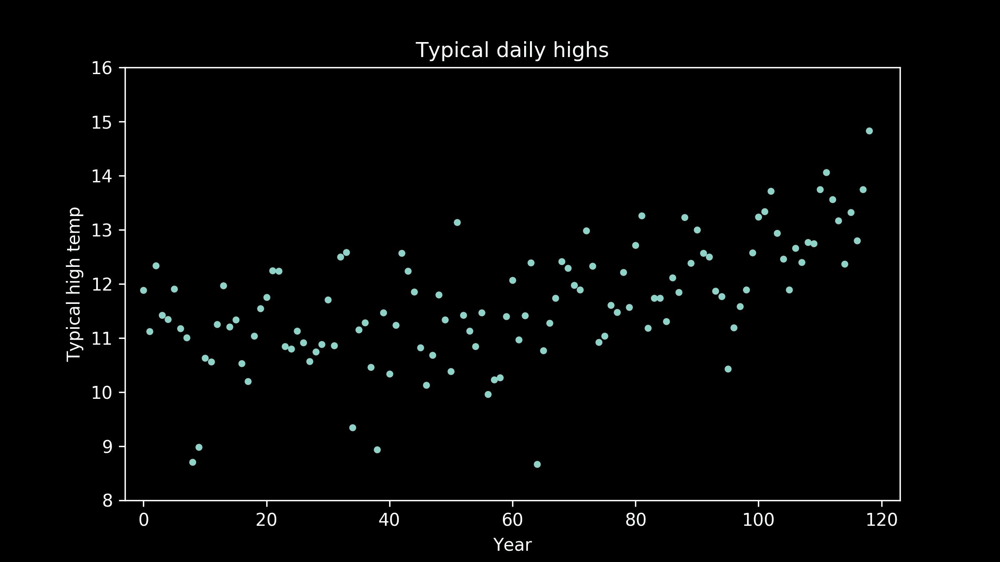

有很多模型可以表示这一点。一个很好的起点，因为它非常简单，就是一条直线。下面是最佳拟合直线的样子。它做得相当不错。我们可以看到它确实捕捉了数据的上升趋势，但它没有捕捉到数据的弯曲。我们检查后可以清楚地看到，直线并没有像我们希望的那样好。

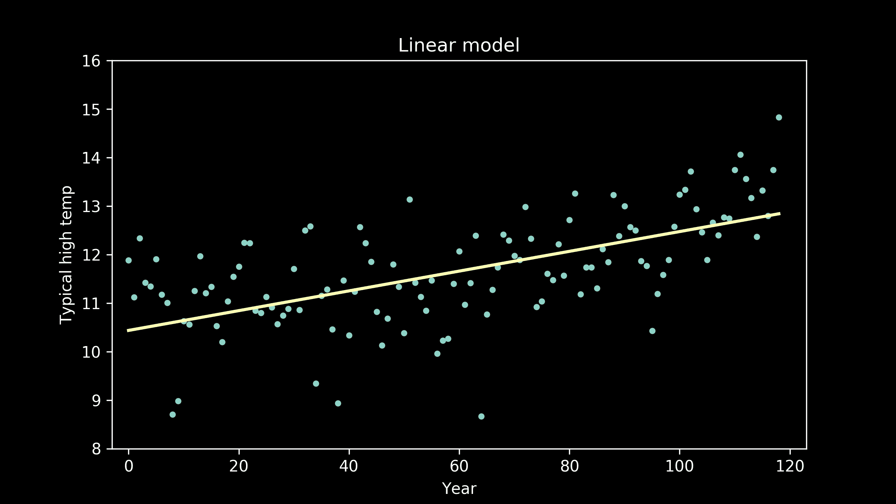

幸运的是，我们还有很多其他选项。一个合理的下一个候选是二次多项式，即带有平方项的多项式，而不仅仅是线性项。这些多项式有曲率。我们可以看到最佳拟合的二次多项式清晰地捕捉了图右侧的上升趋势和中间的弯曲，但它也在图的左侧施加了一些上升趋势，这在数据中并没有明显反映出来。

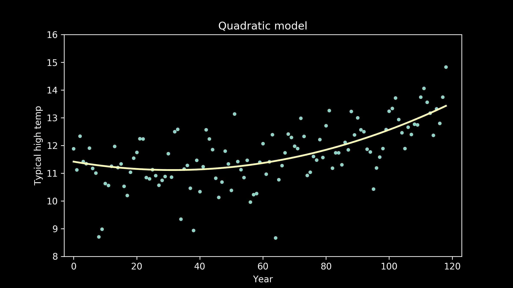

所以，我们可以尝试其他选项。我们可以尝试具有三次项的多项式，即三次方的多项式。

或者我们可以查看具有四次项的多项式，即四次方的多项式。

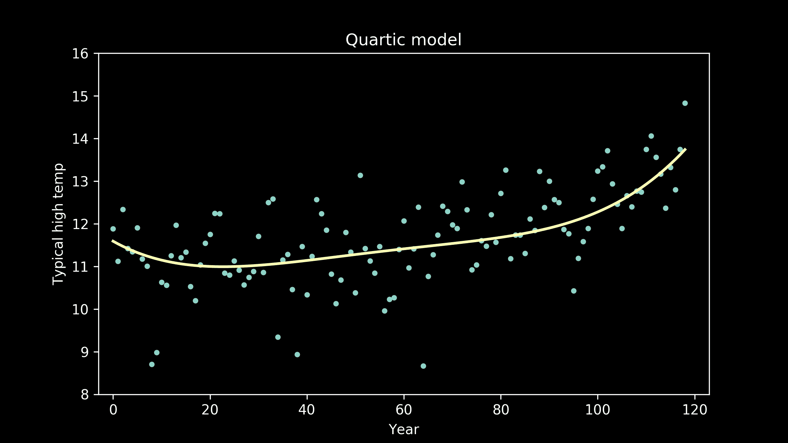

我们还可以拟合五阶多项式模型，

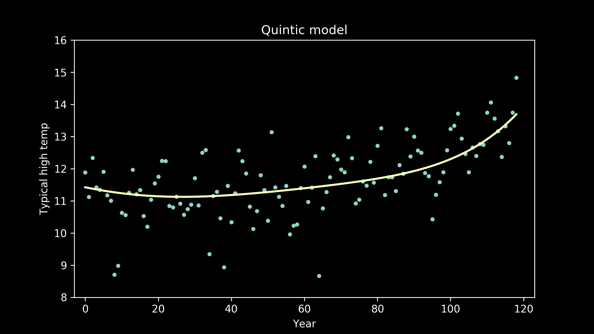

六阶多项式，

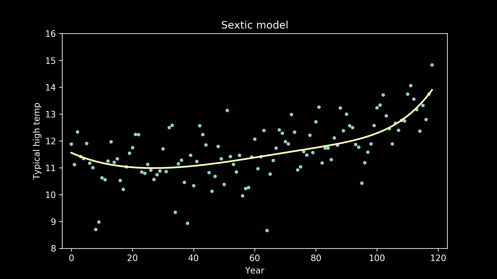

七阶多项式，

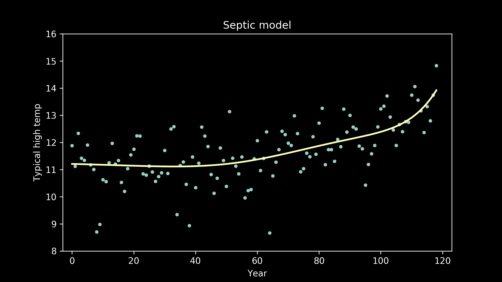

八阶多项式，也称为*八次多项式*（这是一个在聚会上填补空白的有用小知识）。

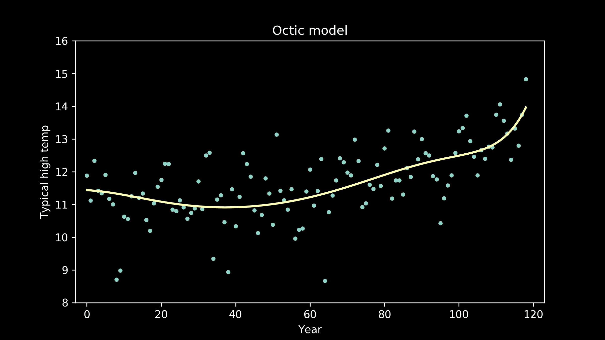

现在拟合情况似乎在改善，但线条开始变得有些“个性化”。它出现了波动。如果我们将这种情况推到极端，我们可以想象一个模型完美地通过每一个数据点。这个模型将具有零误差，零偏差。那么这是否意味着它是最佳拟合模型？

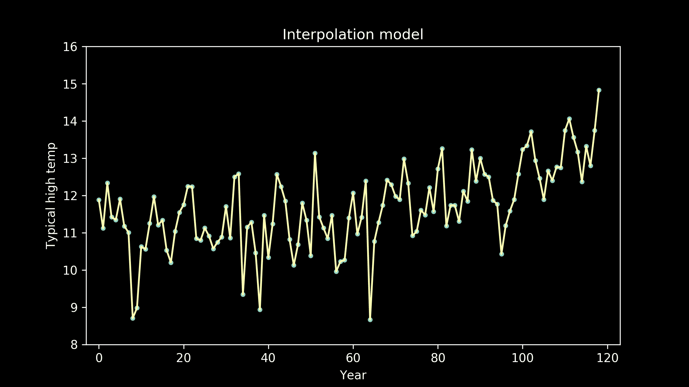

模型之所以有用，是因为它们使我们能够将一种情况推广到另一种情况。当我们使用模型时，我们在假设存在某种我们想要测量的潜在模式，但它上面有一些误差。一个好的模型的目标是透过误差找到这个模式。

最常见的方法是将我们的数据分成两组。我们可以使用一组来训练我们的模型，然后测试模型，看看它在第二组数据上的拟合程度。第一组是训练数据集，第二组是测试数据集。实现这一目标的方法有很多，我们稍后会重新讨论，但现在，我们将随机将年份分成两个箱子。我们将 70%的数据放入训练数据集，30%的数据放入测试数据集。

然后，我们可以回到我们的模型候选集合，逐一测试它们。这里是一些模型，这些模型在训练数据上训练，并与测试数据一起绘制。

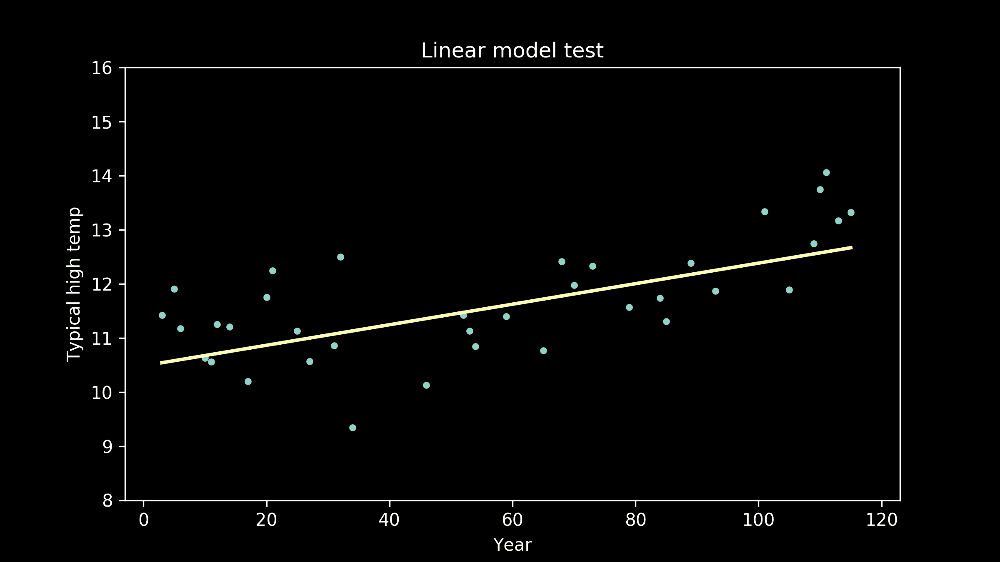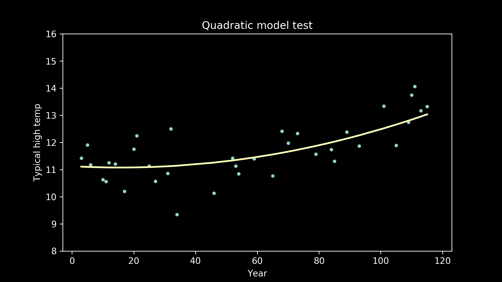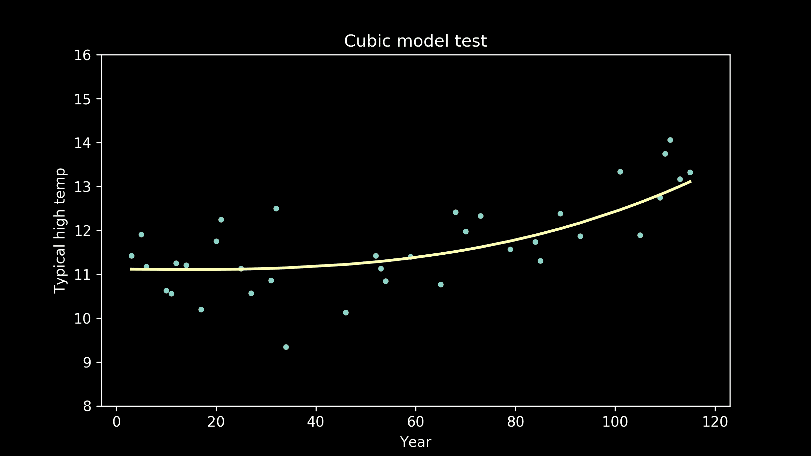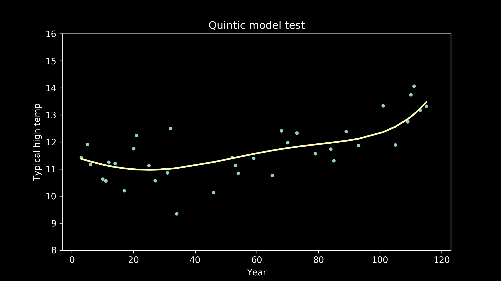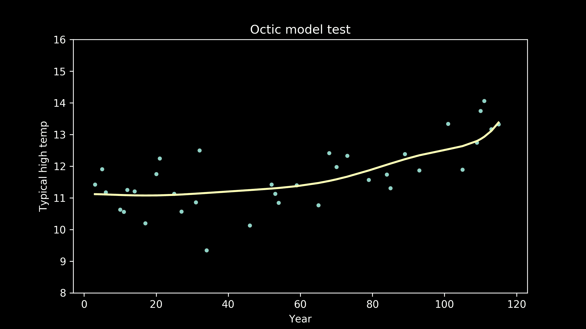

随着模型阶数的增加，我们可以看到它们所产生的波动可能对拟合训练数据有帮助，但不一定有助于更好地拟合测试数据。我们可以在完全插值模型中看到一个极端的例子，在这个模型中，我们只是用直线连接所有训练数据点。这种模型确实很难与测试数据点匹配。

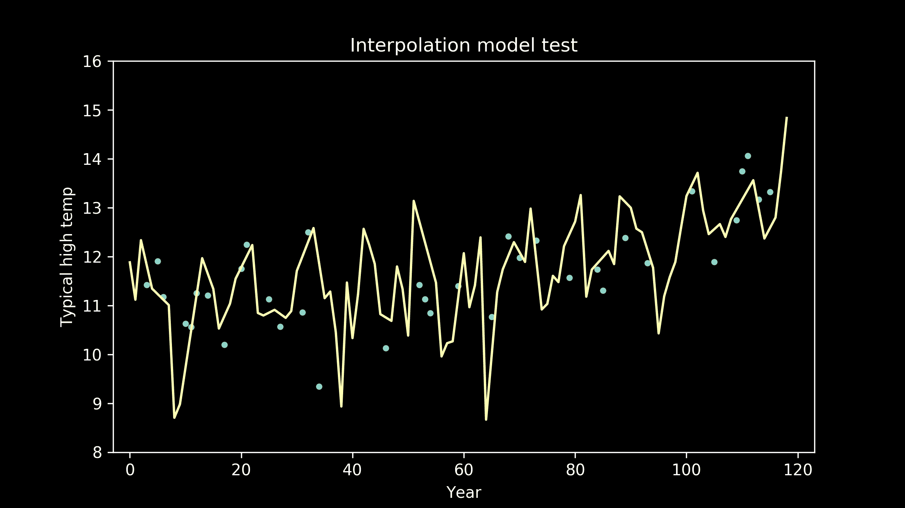

对于每个模型，将训练数据集和测试数据集上的误差并排查看是很有帮助的。

查看训练数据集上的误差，可以看到几个问题。首先是训练误差（空心圆圈）和测试误差（实心圆圈）之间的巨大差距。我们可以立即看到这两个数据集之间存在显著差异。

其次，从线性模型到二次模型（1 阶到 2 阶多项式）误差急剧下降。这是有道理的。当我们目测时，可以看到线性拟合未能捕捉数据的曲率，这是其最显著的特征之一。

那么哪个模型最适合？当我们仔细观察训练数据上的误差时，似乎五阶多项式模型的误差最低。差异很微妙，所以你可能需要仔细观察。所有高阶模型的误差也很低，但仅比 5 阶多项式略高。但正如我们提到的，这并不是最终测试。我们真正关心的是测试数据上的误差。

对测试误差（实心圆点）的仔细检查显示，四阶模型表现最佳。在高阶多项式中，测试数据集上的误差会上升。第五阶及更高阶多项式模型中的曲线越弯曲，它们就越多地捕捉了训练数据的怪异，而不是我们感兴趣的测试数据的基本模式。

基于这种训练和测试方法，我们有一个明显的赢家：在我们尝试的所有模型中，四阶多项式效果最佳。

恭喜我们！我们为数据选择了一个相当不错的模型。但不要急着离开！还有一些重要的想法需要讨论。[加入我，观看第二部分](https://brohrer.github.io/how_modeling_works_2.html)，我们将更深入地讨论我们对模型的期望。

[原文](https://brohrer.github.io/how_modeling_works_1.html)。经许可转载。

**相关内容：**

+   [如何（不）使用机器学习进行时间序列预测：避免陷阱](https://www.kdnuggets.com/2019/05/machine-learning-time-series-forecasting.html)

+   [如何微调你的机器学习模型以提高预测准确性](https://www.kdnuggets.com/2019/01/fine-tune-machine-learning-models-forecasting.html)

+   [傻瓜时间序列 – 3 步法](https://www.kdnuggets.com/2018/03/time-series-dummies-3-step-process.html)

### 更多相关话题

+   [揭开选择完美机器学习算法的秘密！](https://www.kdnuggets.com/2023/07/ml-algorithm-choose.html)

+   [为你的数据集选择合适的聚类算法](https://www.kdnuggets.com/2019/10/right-clustering-algorithm.html)

+   [数据分析师和数据科学家之间的区别是什么？](https://www.kdnuggets.com/2022/03/difference-data-analysts-data-scientists.html)

+   [全栈一切？数据科学、开发技术之间的组织交叉点](https://www.kdnuggets.com/2022/08/full-stack-everything-organizational-intersections-data-science-dev-tech.html)

+   [机器学习中的训练数据和测试数据的区别](https://www.kdnuggets.com/2022/08/difference-training-testing-data-machine-learning.html)

+   [深度学习与人类认知能力之间的差距](https://www.kdnuggets.com/2022/10/gap-deep-learning-human-cognitive-abilities.html)
