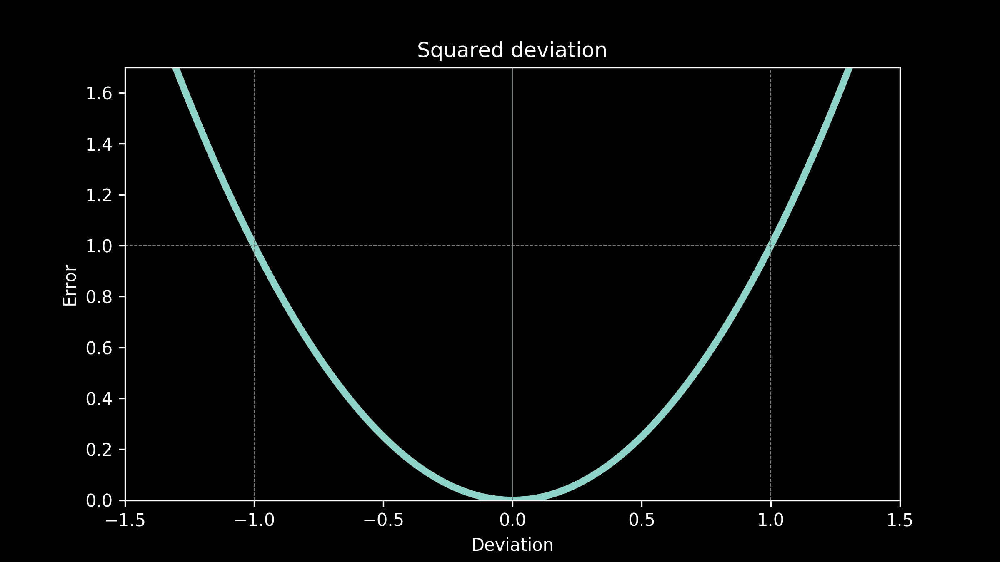
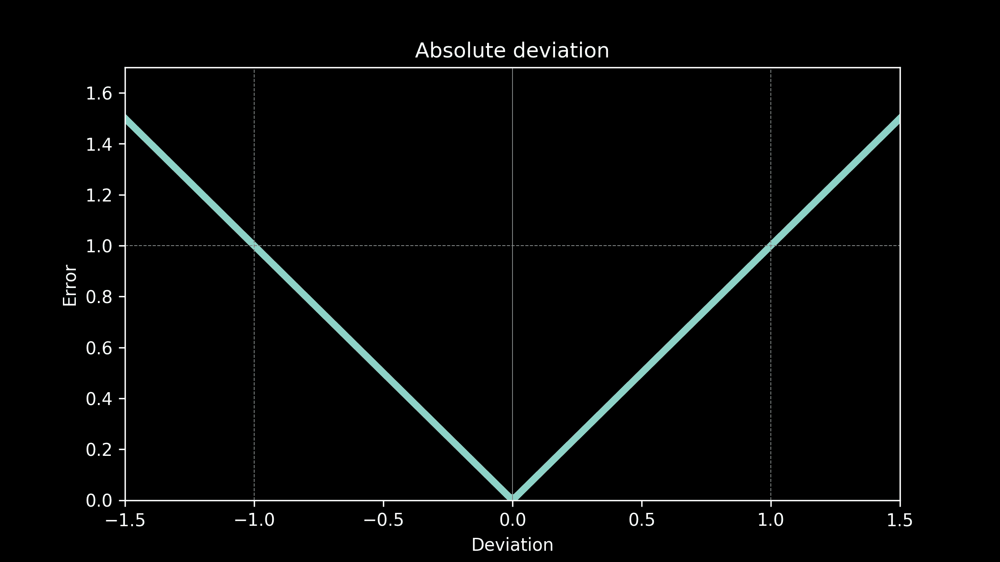
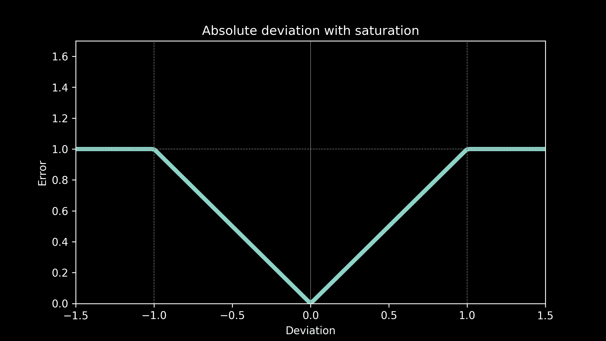
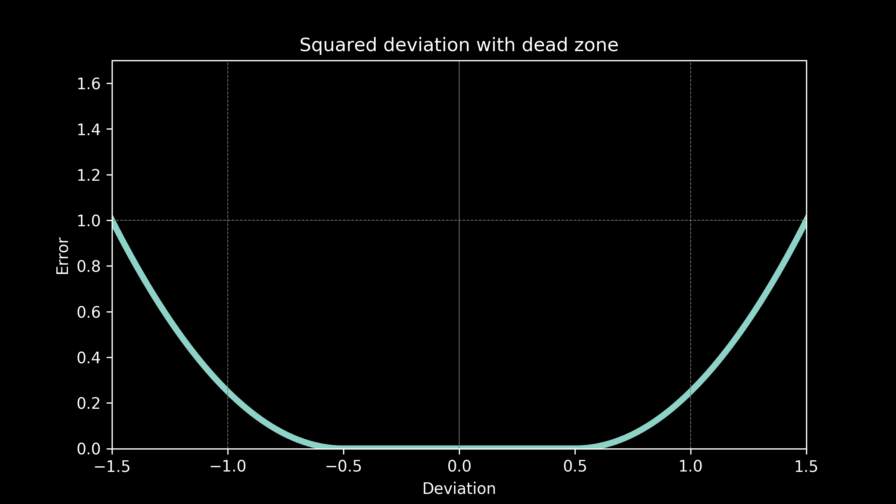

# 选择误差函数

> 原文：[`www.kdnuggets.com/2019/06/choosing-error-function.html`](https://www.kdnuggets.com/2019/06/choosing-error-function.html)

 评论

关于所有内容，包括视频和代码，[访问建模工作原理课程页面](https://end-to-end-machine-learning.teachable.com/p/building-blocks-choosing-a-model)。

### 选择误差函数

当我们为一些数据拟合模型时，很容易忽略误差函数的选择。拟合模型是一项优化练习。它是在寻找一组参数值，以最小化损失函数。（如果你需要复习一下，可以查看一下[优化工作原理](https://brohrer.github.io/how_optimization_works_1.html)系列。）

模型与测量数据点之间的差异称为偏差。误差函数表示我们对一定大小的偏差有多在意。小的错误可以接受，但大的错误非常糟糕？还是说偏差一点和偏差很多一样糟糕？用商业术语来说，我们可以将误差函数看作是错误一定数量时的美元成本。实际上，误差函数也称为成本函数。

误差函数的选择完全取决于我们的模型将如何使用。

**用例：平方偏差**

想象我们的温度预测被用来设计一个温室。玻璃的厚度和基础的绝缘量被仔细选择，以创造一个理想的生长环境。温室里不会有任何加热器或空调来调节温度，只有由温室设计决定的被动热流。植物比较耐寒，可以容忍温度偏差几个度，但不会有灾难性的影响。然而，温度离理想值越远，对植物的影响就越严重，效果也会很快变得更加明显。这表明成本函数可能类似于偏差的平方。

**用例：绝对偏差**

现在，我们再次设计一个温室，但这次包括加热器和冷却器。这意味着我们可以调节温度，使其适合植物，但我们需要进行更多的加热和冷却，就需要购买更多的能源，花费更多的钱。预测偏差的成本与纠正它的成本有关，即将温度恢复到适当范围的能源成本。这表明误差函数中的成本与偏差的绝对值成正比。

在第一部分中拟合我们温度数据的所有模型都使用了绝对偏差误差函数。

**用例：饱和度绝对偏差**

我们的温度预测现在被用来决定何时对办公室建筑进行预热或预冷。夜间预热和预冷可以降低能源价格，为公司节省资金。任何偏差的成本就是白天高峰能源的额外成本。这与设备在白天运行的时间成正比，而设备运行时间又与预测误差直接成正比。然而，超过某个预测阈值后，任何时间的加热或冷却都无法完全弥补差距，因此成本有上限。设备全天运行。这表明一个具有饱和度的绝对偏差误差函数。

**用例：带“无所谓”区域的平方偏差**

现在我们的温度预测被用于电视天气预报。我们的观众并不期望预测完全准确，因此如果误差稍微大一点也没有惩罚。这给了我们一个“无所谓”的区域。错误小不会有成本。然而，如果温度偏差过大，那么观众会非常不满，可能会切换到其他电视台获取天气报告。一个二次曲线给我们提供了与此相关的急剧增加的成本。

**用例：自定义误差函数**

我们甚至可以处理更复杂的情况。假设我们一流的商业分析团队确定我们的能源成本与预测误差之间有复杂的关系，例如，像这样。

这不是问题。我们可以像使用其他候选函数一样轻松地使用它。对我们误差函数的唯一真正限制是它不会随着距离零点的增加而减少。只要它始终增加或保持平坦，它可以遵循我们想要的任何模式。

误差函数的选择会影响哪个模型最适合以及该模型的参数值是什么。这些误差函数中的每一个都会在我们的温度模型中产生一组不同的最佳拟合参数。最佳拟合曲线每次都会不同。选择正确的误差函数可以大大影响我们的模型有多有用。错误的误差函数可能会给我们一个比无用还糟糕的模型。

留意平方偏差作为误差函数。这是一个非常常见的选择。事实上，它如此常见，以至于经验不足的建模者可能会认为它是唯一的选择。它具有一些非常好的数学分析性质，因此在理论和学术工作中受到青睐。但除此之外，它并没有什么特别之处。它很可能不适合你的应用。如果你花时间仔细选择你的误差函数，你会很高兴这么做了。

现在我们已经打下了坚实的基础，[第四部分](https://brohrer.github.io/how_modeling_works_4.html)将详细介绍如何将数据分成训练集和测试集。这比看起来更复杂。

[原始](https://brohrer.github.io/how_modeling_works_3.html)。经许可转载。

**相关：**

+   机器学习速成课程：第一部分

+   理解神经网络中的目标函数

+   标准模型拟合方法简要概述

* * *

## 我们的前三个课程推荐

 1\. [谷歌网络安全证书](https://www.kdnuggets.com/google-cybersecurity) - 快速进入网络安全职业生涯

 2\. [谷歌数据分析专业证书](https://www.kdnuggets.com/google-data-analytics) - 提升你的数据分析技能

 3\. [谷歌 IT 支持专业证书](https://www.kdnuggets.com/google-itsupport) - 支持你的组织进行 IT 管理

* * *

### 更多相关话题

+   [解锁选择完美机器学习算法的秘密！](https://www.kdnuggets.com/2023/07/ml-algorithm-choose.html)

+   [为你的数据集选择正确的聚类算法](https://www.kdnuggets.com/2019/10/right-clustering-algorithm.html)

+   [你应该了解的 5 个梯度下降和成本函数的概念](https://www.kdnuggets.com/2020/05/5-concepts-gradient-descent-cost-function.html)

+   [什么是函数？](https://www.kdnuggets.com/2022/11/function.html)

+   [3 个数据科学面试中 SQL 聚合函数的问题](https://www.kdnuggets.com/2023/01/3-sql-aggregate-function-interview-questions-data-science.html)

+   [Python 函数参数：权威指南](https://www.kdnuggets.com/2023/02/python-function-arguments-definitive-guide.html)
