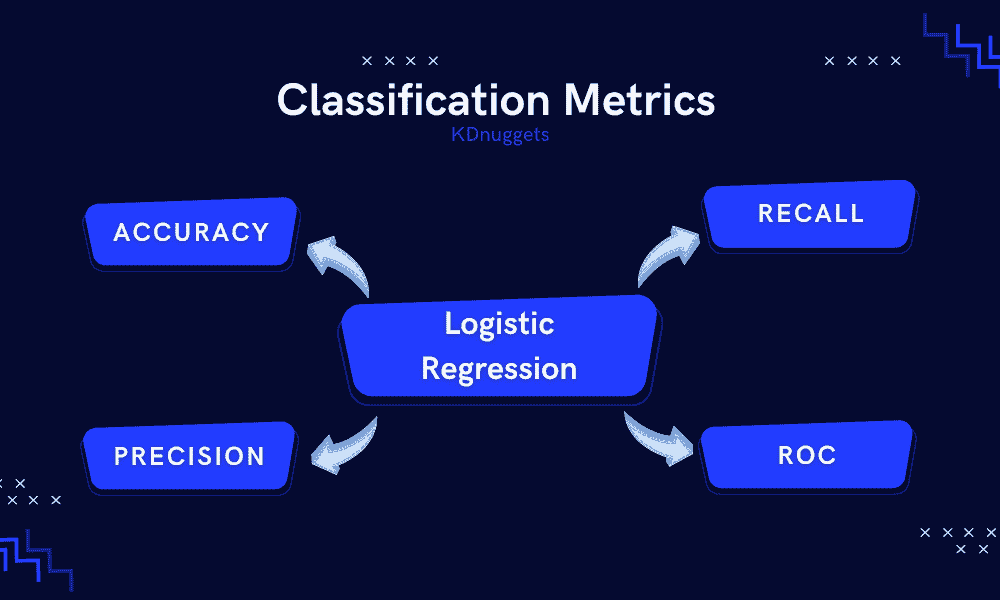
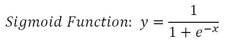
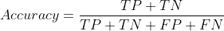
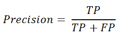
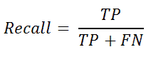
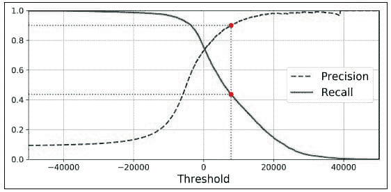
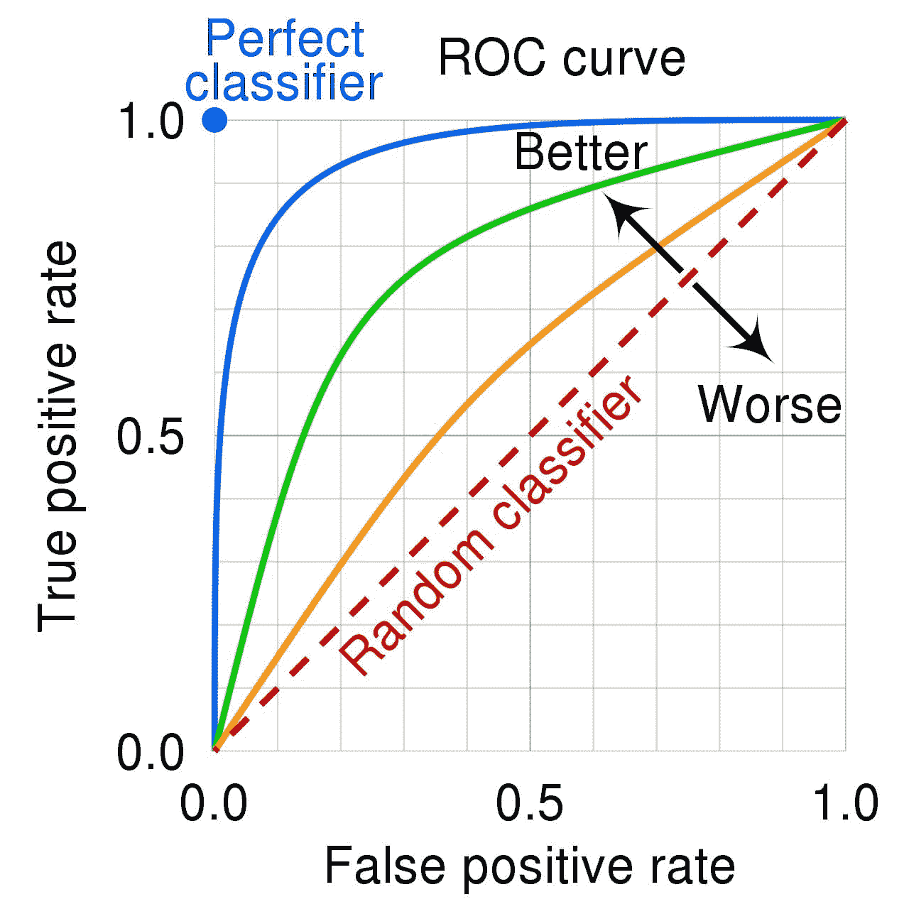
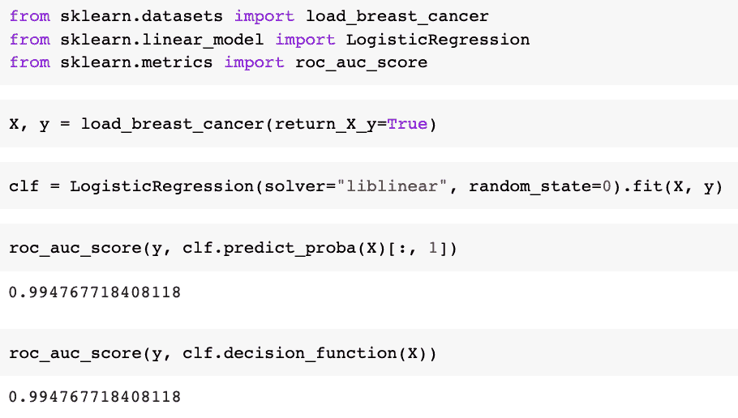

# 分类指标演练：使用准确率、精确率、召回率和 ROC 的逻辑回归

> 原文：[`www.kdnuggets.com/2022/10/classification-metrics-walkthrough-logistic-regression-accuracy-precision-recall-roc.html`](https://www.kdnuggets.com/2022/10/classification-metrics-walkthrough-logistic-regression-accuracy-precision-recall-roc.html)



编辑提供的图像

指标是机器学习的重要元素。关于分类任务，有不同类型的指标可以用来评估机器学习模型的性能。然而，选择适合你任务的正确指标可能会很困难。

* * *

## 我们的前 3 个课程推荐

 1\. [谷歌网络安全证书](https://www.kdnuggets.com/google-cybersecurity) - 快速进入网络安全职业道路。

 2\. [谷歌数据分析专业证书](https://www.kdnuggets.com/google-data-analytics) - 提升你的数据分析能力

 3\. [谷歌 IT 支持专业证书](https://www.kdnuggets.com/google-itsupport) - 支持你所在组织的 IT

* * *

在这篇文章中，我将介绍 4 种常见的分类指标：准确率、精确率、召回率和 ROC，并与逻辑回归相关联。

让我们开始吧……

# 什么是逻辑回归？

逻辑回归是一种监督学习形式——当算法在标记数据集上学习并分析训练数据时。逻辑回归通常用于基于其“逻辑函数”的二分类问题。

二分类可以将其类别表示为：正/负，1/0，或真/假。

逻辑函数也称为 Sigmoid 函数，它将任何实值数映射到 0 和 1 之间的值。它可以用数学方式表示为：



```py
def sigmoid(z):
 return 1.0 / (1 + np.exp(-z))
```


来源：[维基百科](https://en.wikipedia.org/wiki/Sigmoid_function)

# 什么是分类指标？

分类是指预测一个标签，然后根据不同的参数识别一个对象属于哪个类别。

为了衡量我们的分类模型在做出这些预测时的表现，我们使用分类指标。它衡量了我们机器学习模型的性能，给我们信心，使这些输出可以进一步用于决策过程。

性能通常在 0 到 1 的范围内表示，其中 1 代表完美。

# 阈值问题

如果我们使用 0 到 1 的范围来表示模型的性能，当值为 0.5 时会发生什么？正如我们从早期的数学课程中知道的那样，如果概率大于 0.5，我们将其四舍五入为 1（正的）- 如果不是，它就是 0（负的）。

这听起来还不错，但现在当你使用分类模型来帮助确定现实生活中的输出时。我们需要 100%确保输出已经被正确分类。

例如，逻辑回归用于检测垃圾邮件。如果电子邮件是垃圾邮件的概率基于其超过 0.5，这可能存在风险，因为我们可能会将重要邮件误判为垃圾邮件。对模型性能的高度准确性需求在健康相关和财务任务中变得更加敏感。

因此，使用阈值概念，其中阈值以上的值趋向于 1，而阈值以下的值趋向于 0，可能会带来挑战。

尽管可以调整阈值，但这仍然会增加分类错误的风险。例如，较低的阈值会正确分类大多数正类，但正类中可能会包含负类 - 反之，如果我们使用较高的阈值。

所以让我们深入探讨这些分类指标如何帮助我们衡量逻辑回归模型的表现

## 准确性

我们将从准确性开始，因为它是通常使用得最多的，尤其是对于初学者。

准确性定义为正确预测的数量除以总预测数量：

*accuracy = correct_predictions / total_predictions*

然而，我们可以通过以下方式进一步扩展：

+   真阳性（TP）- 你预测为正，实际上也是正的

+   真阴性（TN）- 你预测为负，实际上也是负的

+   假阳性（FP）- 你预测为正，但实际上是负的

+   假阴性（FN）- 你预测为负，但实际上是正的

所以我们可以说真正的预测是 TN+TP，而错误的预测是 FP+FN。这个方程现在可以重新定义为：



为了找出模型的准确性，你可以这样做：

```py
score = LogisticRegression.score(X_test, y_test)
print('Test Accuracy Score', score)
```

或者你也可以使用[sklearn 库](https://scikit-learn.org/stable/modules/generated/sklearn.metrics.accuracy_score.html)：

```py
from sklearn.metrics import accuracy_score
accuracy_score(y_train, y_pred)
```

然而，仅使用准确性指标来衡量模型的性能通常是不够的。这就是我们需要其他指标的地方。

## 精确率和召回率

如果我们想进一步测试不同类别中的“准确性”，以确保当模型预测为正时，确实是真阳性，我们使用精确率。我们也可以称之为正预测值，其定义为：



```py
from sklearn.metrics import precision_score
```

如果我们想进一步测试不同类别中的“准确性”，确保当模型预测为负时，实际也为负——我们使用召回率。召回率与敏感性相同，可以定义为：



```py
from sklearn.metrics import recall_score
```

使用精度和召回率是有用的度量，尤其是在两个类别之间的观察不平衡时。例如，数据集中一个类别（1）的数量多，而另一个类别（0）的数量少。

为了提高模型的精确度，你需要减少 FP，并不必担心 FN。相反，如果你想提高召回率，你需要减少 FN，而不必担心 FP。

提高分类阈值会减少假阳性——从而提高精度。提高分类阈值会减少真阳性或保持不变，同时增加假阴性或保持不变——从而降低或保持召回率不变。

不幸的是，不可能同时获得高精度和高召回率。如果你提高精度，召回率将会降低，反之亦然。这被称为精度/召回率权衡。



来源：[Medium](https://medium.com/@syuumak/precision-recall-tradeoff-1f5b10cc729d)

## ROC 曲线

在精度方面，我们关心减少 FP；在召回率方面，我们关心减少 FN。然而，有一种度量可以同时降低 FP 和 FN——它被称为接收者操作特征曲线，或 ROC 曲线。

它将假阳性率（x 轴）与真阳性率（y 轴）绘制在一起。

+   真阳性率 = TP / (TP + FN)

+   假阳性率 = FP / (FP + TN)

真阳性率也称为敏感性，而假阳性率也称为反特异性率。

+   特异性 = TN / (TN + FP)

如果 x 轴上的值较小，则表示 FP 较少且 TN 较高。如果 y 轴上的值较大，则表示 TP 较高且 FN 较少。

ROC 展示了在所有分类阈值下分类模型的表现，如下所示：



来源：[Wikipedia](https://en.wikipedia.org/wiki/Receiver_operating_characteristic#/media/File:Roc_curve.svg)

例子：



### AUC

当谈到 ROC 曲线时，你可能还听说过曲线下面积（AUC）。它正如其名——曲线下面积。如果你想知道你的曲线有多好，你可以计算 ROC AUC 得分。AUC 衡量了所有可能分类阈值下的性能。

曲线下面积越大，效果越好——ROC AUC 得分越高。这是在 FN 和 FP 都为零时的情况——或者如果我们参考上面的图表，那就是当真正例率为 1 而假正例率为 0 时。

```py
from sklearn.metrics import roc_auc_score
```

下图展示了逻辑回归预测的升序排列。如果 AUC 值为 0.0，我们可以说预测完全错误。如果 AUC 值为 1.0，我们可以说预测完全正确。


# 总结一下

总结一下，我们已经讲解了什么是逻辑回归、分类指标是什么，以及阈值问题及其解决方案，如准确率、精确率、召回率和 ROC 曲线。

还有许多其他分类指标，如混淆矩阵、F1 分数、F2 分数等。这些指标都可以帮助你更好地了解模型的性能。

**[Nisha Arya](https://www.linkedin.com/in/nisha-arya-ahmed/)** 是一名数据科学家和自由职业技术作家。她特别感兴趣于提供数据科学职业建议或教程，以及围绕数据科学的理论知识。她还希望探索人工智能如何及可能如何促进人类寿命的延续。作为一个渴望学习的人，她希望拓宽技术知识和写作技能，同时帮助指导他人。

### 相关话题

+   [愚蠢的精确率、召回率和混淆矩阵指南](https://www.kdnuggets.com/2020/01/guide-precision-recall-confusion-matrix.html)

+   [混淆矩阵、精确率和召回率解释](https://www.kdnuggets.com/2022/11/confusion-matrix-precision-recall-explained.html)

+   [KDnuggets 新闻，11 月 16 日：LinkedIn 如何使用机器学习 •…](https://www.kdnuggets.com/2022/n45.html)

+   [理解分类指标：评估模型准确性的指南](https://www.kdnuggets.com/understanding-classification-metrics-your-guide-to-assessing-model-accuracy)

+   [用于分类的逻辑回归](https://www.kdnuggets.com/2022/04/logistic-regression-classification.html)

+   [与分类准确性相关的关键问题](https://www.kdnuggets.com/2023/03/key-issues-associated-classification-accuracy.html)
