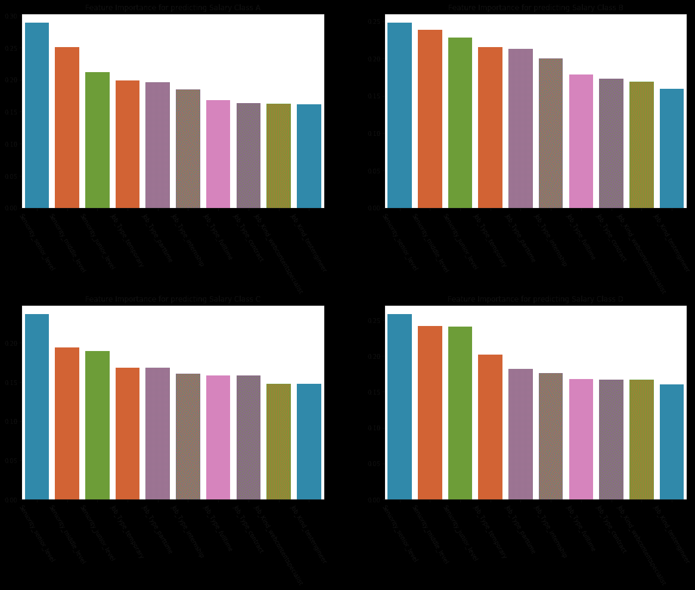
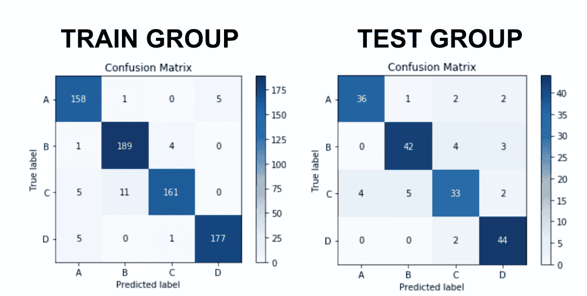

# 机器学习中的分类项目：一个温和的逐步指南

> 原文：[`www.kdnuggets.com/2020/06/classification-project-machine-learning-guide.html`](https://www.kdnuggets.com/2020/06/classification-project-machine-learning-guide.html)

评论


分类是数据科学和机器学习领域中你可能遇到的主要项目之一。以下是维基百科的定义：

> *分类是识别新观察数据属于一组类别（子群体）中的哪个类别的问题，基于包含已知类别成员的数据训练集。举例来说，就是将给定的电子邮件分配到“垃圾邮件”或“非垃圾邮件”中。*

在这篇文章中，我将讲解一个来自[General Assembly 的数据科学沉浸课程](https://generalassemb.ly/education/data-science-immersive/)的项目。在这个项目中，我探索了不同的机器学习分类模型，以预测来自 Indeed.co.uk 的 Data Science 职位的四个薪资类别：

+   第 25 百分位以下的薪资

+   第 25 至 50 百分位之间的薪资

+   第 50 至 75 百分位之间的薪资

+   第 75 百分位以上的薪资

我们无法逐一讨论项目的每一个方面，但请注意，整个代码库可以在我的[GitHub 个人资料](https://github.com/gonzaferreiro)上找到。

### 第一阶段：数据抓取和清洗

首先，没有数据，任何项目都无从谈起。因此，我首先通过抓取[Indeed.co.uk](https://www.indeed.co.uk/jobs?q=data+scientist)以获取在英国多个城市寻找“数据科学家”的职位列表。我不会在这里详细讲解如何进行抓取，但我使用了我另一篇文章中提到的相同技术和工具：[五分钟网络抓取](https://towardsdatascience.com/web-scraping-in-5-minutes-1caceca13b6c?source=friends_link&sk=3d2c281449fc6584e4efb272245f8865)。

值得一提的是，尽管网络抓取对数据科学工作者非常有用，但完成抓取后一定要检查数据的完整性。例如，在这个案例中，职位薪资当然是关键。然而，并不是所有的职位信息都包含薪资，因此需要抓取成千上万的页面和职位信息，以确保至少有 1000 个职位包含薪资信息。

处理抓取的数据通常还涉及大量的特征工程，以从我们已有的数据中添加一些价值。例如，对于这个项目，我开发了一个“资历”特征，该特征由每篇出版物的标题和摘要生成，使用了两个不同的单词列表，分别属于高级或初级职位。如果职位标题或摘要中出现了任何一个层级的单词，则分配相应的资历层级。如果这些特征中没有任何单词，则该职位被分配为中级层级。

### 第二阶段：建模

我开始这个阶段时探索了三种不同的模型：

+   **一个带有装袋的 KNN 模型**：KNN 代表 K-Nearest Neighbours 模型。这通过检查最接近被预测点的点的类别来工作，以对其进行分类。将其与装袋结合，我们可以提高稳定性和准确性，同时减少方差并帮助避免过拟合。*怎么做？* 装袋是一种集成方法——一种结合多个机器学习算法的预测以比任何单一模型更准确地预测的技术。尽管通常应用于决策树方法，但它可以与任何类型的方法一起使用。

+   **一个带有提升的决策树模型**：在这种情况下，决策树像一个流程图结构，其中每个内部节点代表对属性的“测试”（例如，硬币翻转是正面还是反面），每个分支代表测试的结果，每个叶子节点代表一个类标签和一个做出的决策。从根到叶的路径代表分类规则。在这个模型中，尽管提升是一种与装袋截然不同的方法，但它也是一种集成方法——它通过从训练数据中建立一个模型，然后创建第二个模型以试图纠正第一个模型的错误来工作。模型会不断增加，直到训练集被完美预测，或添加到最大模型数。

由于这两个模型高度依赖给定的超参数，你可能会希望使用*GridSearch*来尽可能地优化它们。*[GridSearch](https://scikit-learn.org/stable/modules/generated/sklearn.model_selection.GridSearchCV.html)*只是一个工具，它通过训练多个模型来寻找从给定参数和数值列表中得到的最佳参数。

所以，例如，创建一个带有提升和*GridSearch*的决策树模型，你需要执行以下步骤。

**1\. 实例化模型**

```py
from sklearn.tree import DecisionTreeRegressor

tree_to_boost = DecisionTreeRegressor(random_state=123)

```

**2\. 实例化集成方法算法**

```py
from sklearn.ensemble import AdaBoostClassifier

boosting_trees_model = AdaBoostClassifier(base_estimator = tree_to_boost, random_state=123)

```

**3\. 实例化 GridSearch 并指定要测试的参数**

使用*GridSearch*时，你可以通过调用*get_params()*来获取可以调整的可用参数：

```py
tree_to_boost.get_params()

```

请记住：你总是可以在 Sklearn 的文档中获取有关如何优化任何超参数的更多细节。例如，以下是[决策树文档](https://scikit-learn.org/stable/modules/generated/sklearn.tree.DecisionTreeClassifier.html)。

最后，让我们导入*GridSearch*，指定所需的参数并实例化对象。请注意，sklearn 的*GridSearchCV*在算法中包含了交叉验证，因此你还需要指定要进行的 CV 数量，

```py
from sklearn.model_selection import GridSearchCV

trees_params = {‘base_estimator__max_depth’: [80,100,120,150],
‘base_estimator__max_features’: [0.93,0.95,0.97], 
‘n_estimators’: [1200]}

boosting_tree_grid = GridSearchCV(estimator=boosting_trees_modeel, param_grid=tree_params, cv=5)

```

**4\. 拟合你的组合 GridSearch 并检查结果**

拟合*GridSearch*就像拟合任何模型一样：

```py
boosting_tree_grid.fit(X_train, y_train)

```

完成后，你可以检查最佳参数，看看是否还有机会优化它们。只需运行以下代码：

```py
boosting_tree_grid.best_params_

```

和任何模式一样，你可以使用 *.score()* 和 *.predict()* 使用 *GridSearchCV* 对象。

### 第三阶段：特征重要性

在建模之后，下一个阶段总是分析我们的模型表现如何以及为什么会这样。

然而，如果你有机会使用过集成方法，你可能已经知道这些算法通常被称为“黑箱模型”。这些模型缺乏解释性和可解释性，因为它们通常的工作方式涉及一个或多个层的机器在没有人工监督的情况下做出决策，除了设置的一组规则或参数。往往，甚至领域中最专业的人员也无法理解通过训练神经网络实际创建的函数。

从这个意义上说，一些最经典的机器学习模型实际上更好。这就是为什么在本文中，我们将使用经典的逻辑回归分析我们项目的特征重要性。然而，如果你有兴趣了解如何分析黑箱模型的特征重要性，在[我另外一篇文章](https://towardsdatascience.com/unboxing-machine-learning-feature-importance-for-black-box-models-ea12268ddb23?source=friends_link&sk=52d12526d6c199d78d680ad05118449d)中，我探讨了一个工具来实现这一点。

从逻辑回归模型开始，获取特征重要性就像调用以下内容一样简单：

```py
logistic_regression_model.coef_[class_number]

```

查看整体特征重要性的一个简洁方法是创建一个 *DataFrame*，包含每个类别的特征重要性。我喜欢使用每个特征的绝对值，以便查看每个特征对模型的绝对影响。然而，请注意，如果你想具体分析每个特征如何帮助增加或减少属于每个类别的可能性，你应该使用原始值，无论是负值还是正值。

记住我们在尝试预测四个类别，因此我们应该这样创建 Pandas *DataFrame*：

```py
feature_importance_df = pd.DataFrame({‘feature’: logistic_regression_model.columns,

‘coefA’: np.abs(logistic_regression_model.coef_[0]),

‘coefB’: np.abs(logistic_regression_model.coef_[1]),

‘coefC’: np.abs(logistic_regression_model.coef_[2]),

‘coefD’: np.abs(logistic_regression_model.coef_[3]),})

```

我们可以最终将所有内容放入图表中，查看每个类别的表现：



尽管标签的大小可能没有帮助，但我们可以从这些图表中得出结论，我们数据集中的以下特征在预测薪资类别时是相关的：

+   高级别：正如我们所见，树的层级对所有类别都有很强的影响，是绝对大小方面的第一个系数。

+   其次是直接从 Indeed 抓取的 *Job_Type*

+   最后，对于所有薪资类别，有两个职位从 indeed 上抓取并清洗过来：网页内容专家和测试工程师。

这个数据集包含数百个特征，但很高兴看到在各类别中有明显的趋势！

### 第四阶段：结论和可信度

最终，剩下的唯一任务就是评估我们模型的表现。为此，我们可以使用多个指标。不幸的是，全面讲解分类问题中的所有可能指标对于这篇文章来说太长了。然而，我可以在这里推荐一个非常好的 Medium 文章，它详细介绍了所有关键指标。请在[这里](https://medium.com/thalus-ai/performance-metrics-for-classification-problems-in-machine-learning-part-i-b085d432082b)享受它。

正如上面链接的 Mohammed 故事中所述，混淆矩阵是包含所有其他指标的核心概念。简而言之，它在一个轴上显示真实标签或类别，在另一个轴上显示预测标签。最终，我们希望预测和真实标签之间有对角线匹配，理想情况下，匹配的情况为零或极少。Sklearn 的指标库提供了一个美观且简单的表示方式，我们只需将真实标签和我们的预测输入算法即可绘制：

```py
from sklearn import metrics

skplt.metrics.plot_confusion_matrix(y_test, y_predictions)

plt.show()

```

使用这个库，我们可以在以下图中看到，对于这个项目，训练组和测试组在四个薪水类别中都预测得相当准确：



一个重要的最终澄清是，尽管我们的最终模型似乎很准确，但它在预测类别时效果良好，当类别的重要性相等时，我们不需要对任何类别进行加权。

例如，如果我们为一家公司创建这个模型，在这种情况下，错误地告知某人他们将获得*低*薪水工作比错误地告诉客户他们将获得*高*薪水工作更为严重，我们的模型可能会遇到困难，因为它无法准确预测所有正类值为正类，同时也无法避免错误地预测大量负类值。在这种情况下，我们应该另辟蹊径，例如，创建一个具有加权类别的模型。

[原文](https://medium.com/better-programming/facing-a-classification-project-in-machine-learning-462b319873de)。经许可转载。

**简介：** 在多个行业拥有 5 年以上的电子商务和营销经验之后，[Gonzalo Ferreiro Volpi](https://www.linkedin.com/in/gferreirovolpi/) 转向了数据科学和机器学习领域，目前在 Ravelin Technology 工作，利用机器学习和人类洞察来解决电子商务中的欺诈问题。

**相关：**

+   [机器学习中的模型评估指标](https://www.kdnuggets.com/2020/05/model-evaluation-metrics-machine-learning.html)

+   [线性回归到逻辑回归，逐步解析](https://www.kdnuggets.com/2020/03/linear-logistic-regression-explained.html)

+   [傻瓜指南：精准率、召回率与混淆矩阵](https://www.kdnuggets.com/2020/01/guide-precision-recall-confusion-matrix.html)

* * *

## 我们的三大课程推荐

 1\. [谷歌网络安全证书](https://www.kdnuggets.com/google-cybersecurity) - 快速进入网络安全职业轨道

 2\. [谷歌数据分析专业证书](https://www.kdnuggets.com/google-data-analytics) - 提升你的数据分析技能

 3\. [谷歌 IT 支持专业证书](https://www.kdnuggets.com/google-itsupport) - 支持你的组织在 IT 领域

* * *

### 更多相关内容

+   [如何结构化数据科学项目：逐步指南](https://www.kdnuggets.com/2022/05/structure-data-science-project-stepbystep-guide.html)

+   [自然语言处理的温和介绍](https://www.kdnuggets.com/2022/06/gentle-introduction-natural-language-processing.html)

+   [支持向量机的温和介绍](https://www.kdnuggets.com/2023/07/gentle-introduction-support-vector-machines.html)

+   [如何成为数据科学家的指南（逐步方法）](https://www.kdnuggets.com/2021/05/guide-become-data-scientist.html)

+   [使用 Python 和 Beautiful Soup 进行网页抓取的逐步指南](https://www.kdnuggets.com/2023/04/stepbystep-guide-web-scraping-python-beautiful-soup.html)

+   [文本到视频生成：逐步指南](https://www.kdnuggets.com/2023/08/text2video-generation-stepbystep-guide.html)
