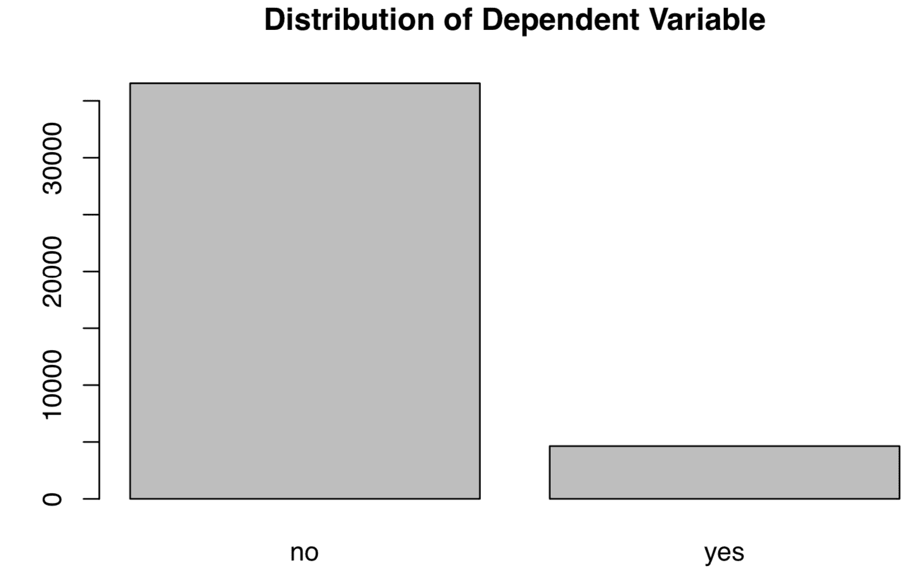
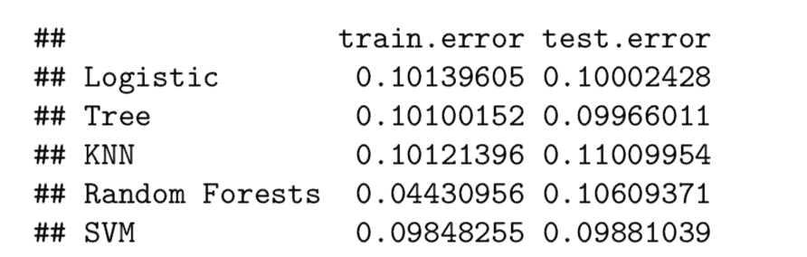
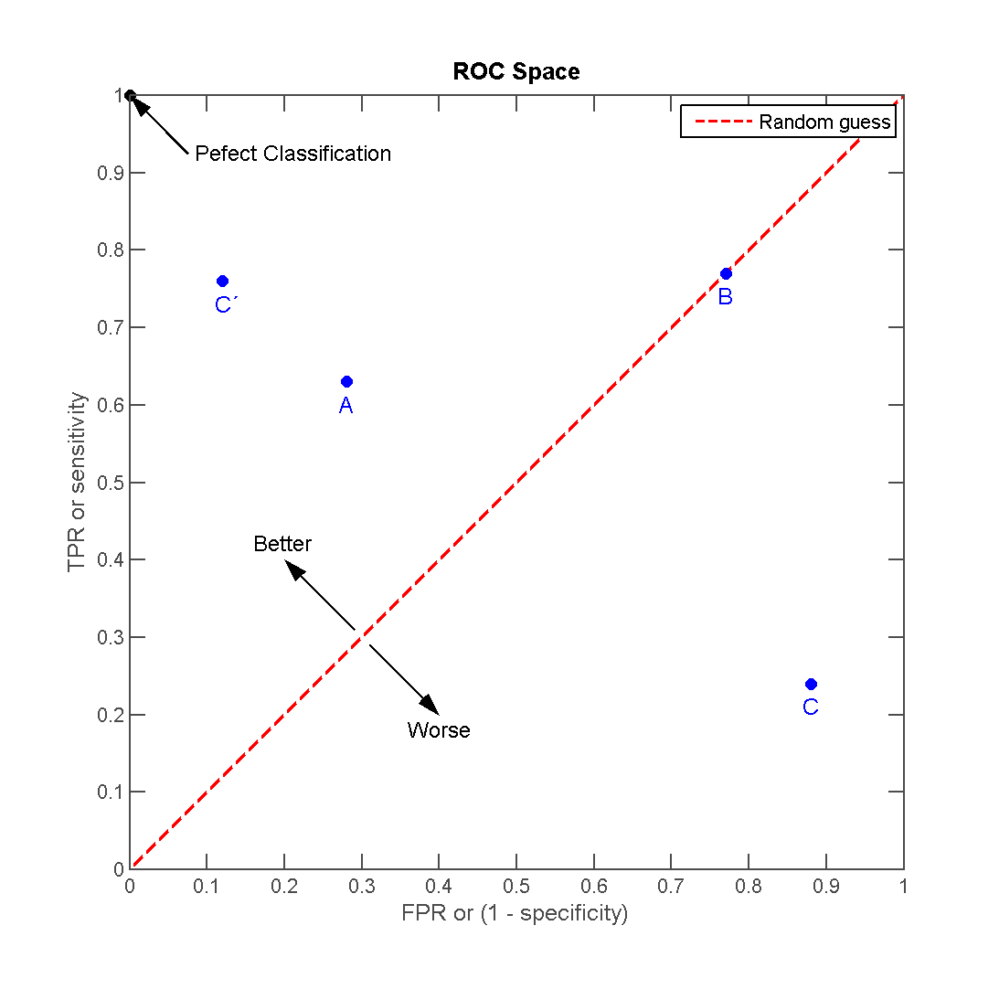
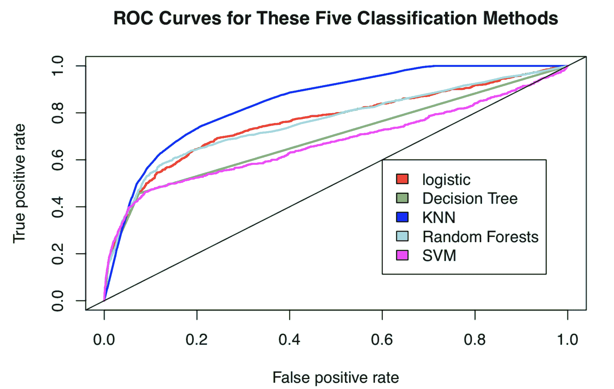
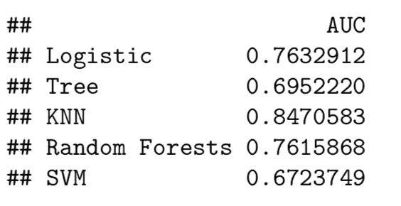

# 使用 5 种机器学习算法分类稀有事件

> 原文：[`www.kdnuggets.com/2020/01/classify-rare-event-machine-learning-algorithms.html`](https://www.kdnuggets.com/2020/01/classify-rare-event-machine-learning-algorithms.html)

评论

**由 [Leihua Ye](http://www.linkedin.com/in/leihuaye)，UC Santa Barbara**

> 机器学习是数据科学的皇冠；
> 
> * * *
> 
> ## 我们的前三大课程推荐
> ## 
>  1\. [Google 网络安全证书](https://www.kdnuggets.com/google-cybersecurity) - 快速进入网络安全职业生涯。
> 
>  2\. [Google 数据分析专业证书](https://www.kdnuggets.com/google-data-analytics) - 提升你的数据分析能力
> 
>  3\. [Google IT 支持专业证书](https://www.kdnuggets.com/google-itsupport) - 支持你所在组织的 IT 事务
> 
> * * *
> 
> 监督学习是机器学习的皇冠上的明珠。

### 背景

几年前，《哈佛商业评论》发布了一篇题为 “[数据科学家：21 世纪最性感的职业](https://hbr.org/2012/10/data-scientist-the-sexiest-job-of-the-21st-century)” 的文章。自发布以来，数据科学或统计学系成为了大学生广泛追捧的专业，数据科学家（书呆子）第一次被称为性感。

对于某些行业，数据科学家重新塑造了企业结构，并将大量决策权重新分配给了“前线”员工。从数据中生成有用的商业洞察力从未如此简单。

根据 Andrew Ng 的说法（[机器学习的渴望](https://www.deeplearning.ai/machine-learning-yearning/)，第 9 页），

> 监督学习算法为行业贡献了大部分价值。

毋庸置疑，为什么监督学习产生了如此巨大的商业价值。银行用它来检测信用卡欺诈，交易员根据模型的建议做出购买决策，工厂通过生产线筛选有缺陷的单元（这是 AI 和 ML 可以帮助传统公司的一个领域，根据 Andrew Ng）。

这些商业场景具有两个共同特点：

1.  **二元结果**：欺诈与非欺诈，购买与不购买，和有缺陷与无缺陷。

1.  **数据不平衡分布**：一个主要组与一个次要组。

正如 Andrew Ng 最近指出的， [小数据](https://info.deeplearning.ai/the-batch-self-driving-cars-that-cant-see-pedestrians-evolutionary-algorithms-fish-recognition-fighting-fraud-?utm_campaign=The%20Batch&utm_source=hs_email&utm_medium=email&utm_content=79686634&_hsenc=p2ANqtz-8JYm57kQehRZzewKP7GRcg1KzCEiTzMaPaYmA1fKuzs_IU9AoooG7ABIqqRLuOubgAU8r8pBVED-l1D6mOoCjVrF6lYw&_hsmi=79686634), [鲁棒性](https://info.deeplearning.ai/the-batch-deepmind-masters-starcraft-2-ai-attacks-on-amazon-a-career-in-robot-management-banks-embrace-bots-1?utm_campaign=The%20Batch&utm_source=hs_email&utm_medium=email&utm_content=79686634&_hsenc=p2ANqtz-8JYm57kQehRZzewKP7GRcg1KzCEiTzMaPaYmA1fKuzs_IU9AoooG7ABIqqRLuOubgAU8r8pBVED-l1D6mOoCjVrF6lYw&_hsmi=79686634), 和 [人为因素](https://blog.deeplearning.ai/blog/the-batch-google-achieves-quantum-supremacy-amazon-aims-to-sway-lawmakers-ai-predicts-basketball-plays-face-detector-preserves-privacy-problems-beyond-bounding-box?utm_campaign=The%20Batch&utm_source=hs_email&utm_medium=email&utm_content=80323254&_hsenc=p2ANqtz-_88W5PvaNASb06SH_AW1uzL2ETjfCivTbmXc7m87jMcF4rrMG42U9qp7EATDPRM-rxHm0biLE3yMyHebUyR-pMaLZm2A&_hsmi=80323254) 是成功 AI 项目的三个障碍。在某种程度上，我们的稀有事件问题与一个少数群体也是一个小数据问题：**ML 算法从多数群体中学习更多，可能容易误分类小数据群体。**

这里是百万美元的问题：

> 对于这些稀有事件，哪个机器学习方法表现更好？
> 
> 什么指标？
> 
> 权衡？

在这篇文章中，我们尝试通过将 5 种机器学习方法应用于一个真实数据集来回答这些问题，并提供全面的 R 实现。

*有关完整描述和原始数据集，请查看原始 *[*数据集*](https://archive.ics.uci.edu/ml/datasets/bank+marketing)*；有关完整的 R 代码，请查看我的 *[*Github*](https://github.com/LeihuaYe/Machine-Learning-Classification-for-Imbalanced-Data)*。*

### 商业问题

一家葡萄牙的银行实施了一项新的银行服务（定期存款）的营销策略，并想知道哪些类型的客户订阅了该服务。这样，银行可以调整其营销策略，并在未来针对特定的客户群体。数据科学家与销售和营销团队合作，提出统计解决方案以识别未来的订阅者。

### R 实现

下面是模型选择和 R 实现的流程。

### **1\. 导入、数据清理和探索性数据分析**

让我们加载并清理原始数据集。

```py
####load the dataset
banking=read.csv(“bank-additional-full.csv”,sep =”;”,header=T)##check for missing data and make sure no missing data
banking[!complete.cases(banking),]#re-code qualitative (factor) variables into numeric
banking$job= recode(banking$job, “‘admin.’=1;’blue-collar’=2;’entrepreneur’=3;’housemaid’=4;’management’=5;’retired’=6;’self-employed’=7;’services’=8;’student’=9;’technician’=10;’unemployed’=11;’unknown’=12”)#recode variable again
banking$marital = recode(banking$marital, “‘divorced’=1;’married’=2;’single’=3;’unknown’=4”)banking$education = recode(banking$education, “‘basic.4y’=1;’basic.6y’=2;’basic.9y’=3;’high.school’=4;’illiterate’=5;’professional.course’=6;’university.degree’=7;’unknown’=8”)banking$default = recode(banking$default, “‘no’=1;’yes’=2;’unknown’=3”)banking$housing = recode(banking$housing, “‘no’=1;’yes’=2;’unknown’=3”)banking$loan = recode(banking$loan, “‘no’=1;’yes’=2;’unknown’=3”)
banking$contact = recode(banking$loan, “‘cellular’=1;’telephone’=2;”)banking$month = recode(banking$month, “‘mar’=1;’apr’=2;’may’=3;’jun’=4;’jul’=5;’aug’=6;’sep’=7;’oct’=8;’nov’=9;’dec’=10”)banking$day_of_week = recode(banking$day_of_week, “‘mon’=1;’tue’=2;’wed’=3;’thu’=4;’fri’=5;”)banking$poutcome = recode(banking$poutcome, “‘failure’=1;’nonexistent’=2;’success’=3;”)#remove variable “pdays”, b/c it has no variation
banking$pdays=NULL #remove variable “pdays”, b/c itis collinear with the DV
banking$duration=NULL
```

清理原始数据似乎很乏味，因为我们必须重新编码缺失的变量并将定性变量转换为定量变量。在现实世界中，清理数据的时间更长。**有一种说法是“数据科学家花 80%的时间清理数据，20%的时间构建模型。”**

接下来，让我们探讨一下结果变量的分布。

```py
#EDA of the DV
plot(banking$y,main="Plot 1: Distribution of Dependent Variable")
```



如图所示，因变量（服务订阅）分布不均，"No"的数量多于"Yes"。**这种不平衡的分布应引起一些警示，因为数据分布会影响最终的统计模型**。使用基于多数情况开发的模型容易错误分类少数情况。

### **2\. 数据划分**

接下来，让我们将数据集分为两部分：训练集和测试集。按照经验法则，我们遵循 80-20 的划分：80%作为训练集，20%作为测试集。对于时间序列数据，我们基于 90%的数据训练模型，其余 10%作为测试数据集。

```py
#split the dataset into training and test sets randomly 
set.seed(1)#set seed so as to generate the same value each time we run the code#create an index to split the data: 80% training and 20% test
index = round(nrow(banking)*0.2,digits=0)#sample randomly throughout the dataset and keep the total number equal to the value of index
test.indices = sample(1:nrow(banking), index)#80% training set
banking.train=banking[-test.indices,] #20% test set
banking.test=banking[test.indices,] #Select the training set except the DV
YTrain = banking.train$y
XTrain = banking.train %>% select(-y)# Select the test set except the DV
YTest = banking.test$y
XTest = banking.test %>% select(-y)
```

在这里，让我们创建一个空的跟踪记录。

```py
records = matrix(NA, nrow=5, ncol=2) 
colnames(records) <- c(“train.error”,”test.error”)
rownames(records) <- c(“Logistic”,”Tree”,”KNN”,”Random Forests”,”SVM”)
```

### **3\. 训练模型**

在这一部分，我们定义了一个新的函数（**calc_error_rate**），并将其应用于计算每个机器学习模型的训练和测试误差。

```py
calc_error_rate <- function(predicted.value, true.value)
                    {return(mean(true.value!=predicted.value))}
```

该函数计算当预测标签不等于真实值时的误差率。

### **#1 逻辑回归模型**

有关逻辑模型的简要介绍，请查看我的其他帖子：[**机器学习 101**](https://towardsdatascience.com/machine-learning-101-predicting-drug-use-using-logistic-regression-in-r-769be90eb03d)和[**机器学习 102**](https://towardsdatascience.com/machine-learning-102-logistic-regression-with-polynomial-features-98a208688c17)。

让我们拟合一个包括除结果变量以外所有其他变量的逻辑模型。由于结果是二元的，我们将模型设置为二项分布（“family=binomial”）。

```py
glm.fit = glm(y ~ age+factor(job)+factor(marital)+factor(education)+factor(default)+factor(housing)+factor(loan)+factor(contact)+factor(month)+factor(day_of_week)+campaign+previous+factor(poutcome)+emp.var.rate+cons.price.idx+cons.conf.idx+euribor3m+nr.employed, data=banking.train, family=binomial)
```

下一步是获取训练误差。我们将类型设置为响应，因为我们预测的是结果的类型，并采用多数规则：如果先验概率大于或等于 0.5，我们预测结果为“是”；否则，为“否”。

```py
prob.training = predict(glm.fit,type=”response”)banking.train_glm = banking.train %>% #select all rows of the train
 mutate(predicted.value=as.factor(ifelse(prob.training<=0.5, “no”, “yes”))) #create a new variable using mutate and set a majority rule using ifelse# get the training error
logit_traing_error <-  calc_error_rate(predicted.value=banking.train_glm$predicted.value,  true.value=YTrain)# get the test error of the logistic model
prob.test = predict(glm.fit,banking.test,type=”response”)banking.test_glm = banking.test %>% # select rows
 mutate(predicted.value2=as.factor(ifelse(prob.test<=0.5, “no”, “yes”))) # set ruleslogit_test_error <- calc_error_rate(predicted.value=banking.test_glm$predicted.value2, true.value=YTest)# write down the training and test errors of the logistic model 
records[1,] <- c(logit_traing_error,logit_test_error)#write into the first row
```

### **#2 决策树**

对于决策树（DT），我们遵循交叉验证并确定最佳的分裂节点。有关决策树的简要介绍，请参考[Prashant Gupta](https://medium.com/u/a84d0e60277a?source=post_page-----fab464573233----------------------)的帖子([link](https://towardsdatascience.com/decision-trees-in-machine-learning-641b9c4e8052))。

```py
# finding the best nodes
# the total number of rows
nobs = nrow(banking.train)#build a DT model; 
#please refer to this document (here) for constructing a DT model
bank_tree = tree(y~., data= banking.train,na.action = na.pass,
 control = tree.control(nobs , mincut =2, minsize = 10, mindev = 1e-3))#cross validation to prune the tree
set.seed(3)
cv = cv.tree(bank_tree,FUN=prune.misclass, K=10)
cv#identify the best cv
best.size.cv = cv$size[which.min(cv$dev)]
best.size.cv#best = 3bank_tree.pruned<-prune.misclass(bank_tree, best=3)
summary(bank_tree.pruned)
```

交叉验证的最佳大小是 3。

```py
# Training and test errors of bank_tree.pruned
pred_train = predict(bank_tree.pruned, banking.train, type=”class”)
pred_test = predict(bank_tree.pruned, banking.test, type=”class”)# training error
DT_training_error <- calc_error_rate(predicted.value=pred_train, true.value=YTrain)# test error
DT_test_error <- calc_error_rate(predicted.value=pred_test, true.value=YTest)# write down the errors
records[2,] <- c(DT_training_error,DT_test_error)
```

### **#3 K-最近邻**

作为一种非参数方法，KNN 不需要任何关于分布的先验知识。简单来说，KNN 将 k 个最近邻分配给感兴趣的单位。

要快速入门，请查看我关于 KNN 的文章：[**初学者的 K-最近邻指南：从零到英雄。**](https://towardsdatascience.com/beginners-guide-to-k-nearest-neighbors-in-r-from-zero-to-hero-d92cd4074bdb)有关交叉验证和 do.chunk 函数的详细解释，请转到我的[文章](https://towardsdatascience.com/beginners-guide-to-k-nearest-neighbors-in-r-from-zero-to-hero-d92cd4074bdb)。

使用交叉验证，我们发现当 k=20 时，交叉验证误差最小。

```py
nfold = 10
set.seed(1)# cut() divides the range into several intervals
folds = seq.int(nrow(banking.train)) %>%
     cut(breaks = nfold, labels=FALSE) %>%  
     sampledo.chunk <- function(chunkid, folddef, Xdat, Ydat, k){ 
     train = (folddef!=chunkid)# training indexXtr = Xdat[train,] # training set by the indexYtr = Ydat[train] # true label in training setXvl = Xdat[!train,] # test setYvl = Ydat[!train] # true label in test setpredYtr = knn(train = Xtr, test = Xtr, cl = Ytr, k = k) # predict training labelspredYvl = knn(train = Xtr, test = Xvl, cl = Ytr, k = k) # predict test labelsdata.frame(fold =chunkid, # k folds 
train.error = calc_error_rate(predYtr, Ytr),#training error per fold 
 val.error = calc_error_rate(predYvl, Yvl)) # test error per fold
 }# set error.folds to save validation errors
error.folds=NULL# create a sequence of data with an interval of 10
kvec = c(1, seq(10, 50, length.out=5))set.seed(1)for (j in kvec){
 tmp = ldply(1:nfold, do.chunk, # apply do.function to each fold
 folddef=folds, Xdat=XTrain, Ydat=YTrain, k=j) # required arguments
 tmp$neighbors = j # track each value of neighbors
 error.folds = rbind(error.folds, tmp) # combine the results 
 }#melt() in the package reshape2 melts wide-format data into long-format data errors = melt(error.folds, id.vars=c(“fold”,”neighbors”), value.name= “error”)
```

然后，让我们找到最小化验证误差的最佳 k 值。

```py
val.error.means = errors %>%
 filter(variable== “val.error” ) %>%
 group_by(neighbors, variable) %>%
 summarise_each(funs(mean), error) %>%
 ungroup() %>%
 filter(error==min(error))#the best number of neighbors =20
numneighbor = max(val.error.means$neighbors)
numneighbor## [20]
```

按照相同的步骤，我们找到训练和测试误差。

```py
#training error
set.seed(20)
pred.YTtrain = knn(train=XTrain, test=XTrain, cl=YTrain, k=20)
knn_traing_error <- calc_error_rate(predicted.value=pred.YTtrain, true.value=YTrain)#test error =0.095set.seed(20)
pred.YTest = knn(train=XTrain, test=XTest, cl=YTrain, k=20)
knn_test_error <- calc_error_rate(predicted.value=pred.YTest, true.value=YTest)records[3,] <- c(knn_traing_error,knn_test_error)
```

### **#4 随机森林**

我们按照构建随机森林模型的标准步骤进行。有关 RF 的简要介绍，请参见由 [Tony Yiu](https://medium.com/u/840a3210fbe7?source=post_page-----fab464573233----------------------) 撰写的帖子 ([link](https://towardsdatascience.com/understanding-random-forest-58381e0602d2))。

```py
# build a RF model with default settings 
set.seed(1)
RF_banking_train = randomForest(y ~ ., data=banking.train, importance=TRUE)# predicting outcome classes using training and test sets

pred_train_RF = predict(RF_banking_train, banking.train, type=”class”)pred_test_RF = predict(RF_banking_train, banking.test, type=”class”)# training error
RF_training_error <- calc_error_rate(predicted.value=pred_train_RF, true.value=YTrain)# test error
RF_test_error <- calc_error_rate(predicted.value=pred_test_RF, true.value=YTest)records[4,] <- c(RF_training_error,RF_test_error)
```

### **#5 支持向量机**

同样，我们按照构建 SVM 的标准步骤进行。有关此方法的良好介绍，请参见由 [Rohith Gandhi](https://medium.com/u/8f4e7f7a57e3?source=post_page-----fab464573233----------------------) 撰写的帖子 ([Link](https://towardsdatascience.com/support-vector-machine-introduction-to-machine-learning-algorithms-934a444fca47))。

```py
set.seed(1)
tune.out=tune(svm, y ~., data=banking.train,
kernel=”radial”,ranges=list(cost=c(0.1,1,10)))# find the best parameters
summary(tune.out)$best.parameters# the best model
best_model = tune.out$best.modelsvm_fit=svm(y~., data=banking.train,kernel=”radial”,gamma=0.05555556,cost=1,probability=TRUE)# using training/test sets to predict outcome classes
svm_best_train = predict(svm_fit,banking.train,type=”class”)
svm_best_test = predict(svm_fit,banking.test,type=”class”)# training error
svm_training_error <- calc_error_rate(predicted.value=svm_best_train, true.value=YTrain)# test error
svm_test_error <- calc_error_rate(predicted.value=svm_best_test, true.value=YTest)records[5,] <- c(svm_training_error,svm_test_error)
```

### 4\. 模型指标

我们按照模型选择程序构建了所有机器学习模型，并获得了它们的训练和测试误差。在本节中，我们将使用一些模型指标来选择最佳模型。

### **4.1 训练/测试误差**

是否可以通过训练/测试误差找到最佳模型？

现在，让我们检查结果。

```py
records
```



在这里，随机森林具有最小的训练误差，尽管与其他方法的测试误差相似。如你所见，训练误差和测试误差非常接近，很难判断哪个模型明显更好。

此外，分类准确率，无论是训练误差还是测试误差，都不应作为高度不平衡数据集的指标。这是因为数据集被多数情况主导，即使是随机猜测也能给你 50-50 的正确概率（50%的准确率）。更糟的是，一个高准确率的模型可能会严重惩罚少数情况。因此，让我们检查另一个指标 ROC 曲线。

### **4.2** 接收者操作特征（ROC）曲线

ROC 是一个图形化表示，显示分类模型在所有分类阈值下的表现。我们更倾向于选择一个比其他模型更快接近 1 的分类器。

ROC 曲线在同一图表中绘制了两个参数——真正率和假正率——在不同阈值下的情况：

> TPR（召回率）= TP/(TP+FN)
> 
> FPR = FP/(TN+FP)



[Indon](https://commons.wikimedia.org/wiki/File:ROC_space-2.png)

在很大程度上，ROC 曲线不仅衡量分类准确率的水平，还在 TPR 和 FPR 之间达到很好的平衡。这对于稀有事件是非常可取的，因为我们还希望在多数和少数情况之间达到平衡。

```py
# load the library
library(ROCR)#creating a tracking record
Area_Under_the_Curve = matrix(NA, nrow=5, ncol=1)
colnames(Area_Under_the_Curve) <- c(“AUC”) 
rownames(Area_Under_the_Curve) <- c(“Logistic”,”Tree”,”KNN”,”Random Forests”,”SVM”)########### logistic regression ###########
# ROC
prob_test <- predict(glm.fit,banking.test,type=”response”)
pred_logit<- prediction(prob_test,banking.test$y)
performance_logit <- performance(pred_logit,measure = “tpr”, x.measure=”fpr”)########### Decision Tree ###########
# ROC
pred_DT<-predict(bank_tree.pruned, banking.test,type=”vector”)
pred_DT <- prediction(pred_DT[,2],banking.test$y)
performance_DT <- performance(pred_DT,measure = “tpr”,x.measure= “fpr”)########### KNN ########### 
# ROC
knn_model = knn(train=XTrain, test=XTrain, cl=YTrain, k=20,prob=TRUE)prob <- attr(knn_model, “prob”)
prob <- 2*ifelse(knn_model == “-1”, prob,1-prob) — 1
pred_knn <- prediction(prob, YTrain)
performance_knn <- performance(pred_knn, “tpr”, “fpr”)########### Random Forests ###########
# ROC
pred_RF<-predict(RF_banking_train, banking.test,type=”prob”)
pred_class_RF <- prediction(pred_RF[,2],banking.test$y)
performance_RF <- performance(pred_class_RF,measure = “tpr”,x.measure= “fpr”)########### SVM ########### 
# ROC
svm_fit_prob = predict(svm_fit,type=”prob”,newdata=banking.test,probability=TRUE)
svm_fit_prob_ROCR = prediction(attr(svm_fit_prob,”probabilities”)[,2],banking.test$y==”yes”)
performance_svm <- performance(svm_fit_prob_ROCR, “tpr”,”fpr”)
```

让我们绘制 ROC 曲线。

我们添加了一条 abline 以显示随机分配的机会。我们的分类器应该比随机猜测表现更好，对吧？

```py
#logit
plot(performance_logit,col=2,lwd=2,main=”ROC Curves for These Five Classification Methods”)legend(0.6, 0.6, c(‘logistic’, ‘Decision Tree’, ‘KNN’,’Random Forests’,’SVM’), 2:6)#decision tree
plot(performance_DT,col=3,lwd=2,add=TRUE)#knn
plot(performance_knn,col=4,lwd=2,add=TRUE)#RF
plot(performance_RF,col=5,lwd=2,add=TRUE)# SVM
plot(performance_svm,col=6,lwd=2,add=TRUE)abline(0,1)
```



ROC

我们在这里找到了一个赢家。

根据 ROC 曲线，KNN（蓝色的）高于所有其他方法。

### 4.3 曲线下面积（AUC）

正如名称所示，AUC 是 ROC 曲线下的面积。它是可视化 AUC 曲线的算术表示。AUC 提供了分类器在可能的分类阈值下表现的聚合结果。

```py
########### Logit ########### 
auc_logit = performance(pred_logit, “auc”)@y.values
Area_Under_the_Curve[1,] <-c(as.numeric(auc_logit))########### Decision Tree ###########
auc_dt = performance(pred_DT,”auc”)@y.values
Area_Under_the_Curve[2,] <- c(as.numeric(auc_dt))########### KNN ###########
auc_knn <- performance(pred_knn,”auc”)@y.values
Area_Under_the_Curve[3,] <- c(as.numeric(auc_knn))########### Random Forests ###########
auc_RF = performance(pred_class_RF,”auc”)@y.values
Area_Under_the_Curve[4,] <- c(as.numeric(auc_RF))########### SVM ########### 
auc_svm<-performance(svm_fit_prob_ROCR,”auc”)@y.values[[1]]
Area_Under_the_Curve[5,] <- c(as.numeric(auc_svm))
```

让我们检查 AUC 值。

```py
Area_Under_the_Curve
```



此外，KNN 具有最大的 AUC 值（0.847）。

### 结论

在这篇文章中，我们发现 KNN，一个非参数分类器，比其参数化的同行表现更好。在指标方面，对于稀有事件，选择 ROC 曲线比分类准确率更合理。

### 享受阅读这篇文章吗？

请在[LinkedIn](https://www.linkedin.com/in/leihuaye/)和[Twitter](https://twitter.com/leihua_ye)找到我。

查看我在人工智能和机器学习方面的其他文章。

[**R 语言中的 K-最近邻初学者指南：从零到英雄**](https://towardsdatascience.com/beginners-guide-to-k-nearest-neighbors-in-r-from-zero-to-hero-d92cd4074bdb)

使用各种测量指标在 R 中构建 KNN 模型的流程

[**机器学习 101：使用逻辑回归预测药物使用**](https://towardsdatascience.com/machine-learning-101-predicting-drug-use-using-logistic-regression-in-r-769be90eb03d)

基础知识、链接函数和图表

[**机器学习 102：带有多项式特征的逻辑回归**](https://towardsdatascience.com/machine-learning-102-logistic-regression-with-polynomial-features-98a208688c17)

当存在非线性组件时如何分类

**简介：[叶磊华](http://www.linkedin.com/in/leihuaye)**（[@leihua_ye](https://twitter.com/leihua_ye)）是加州大学圣塔芭芭拉分校的博士候选人。他在定量用户体验研究、实验与因果推断、机器学习和数据科学方面有 5 年以上的研究和专业经验。

[原文](https://towardsdatascience.com/classifying-rare-events-using-five-machine-learning-techniques-fab464573233)。转载已获许可。

**相关：**

+   R 语言中的 K-最近邻初学者指南：从零到英雄

+   使用 K-最近邻分类心脏病

+   如何在 Python（和 R）中可视化数据

### 更多相关主题

+   [5 种稀有的数据科学技能可以帮助你获得工作](https://www.kdnuggets.com/5-rare-data-science-skills-that-can-help-you-get-employed)

+   [使用基本和现代算法解决计算机科学问题](https://www.kdnuggets.com/2023/11/packt-tackle-computer-science-problems-fundamental-modern-algorithms-machine-learning)

+   [机器学习中使用的主要监督学习算法](https://www.kdnuggets.com/2022/06/primary-supervised-learning-algorithms-used-machine-learning.html)

+   [KDnuggets 新闻，6 月 22 日：主要的监督学习算法](https://www.kdnuggets.com/2022/n25.html)

+   [分类的机器学习算法](https://www.kdnuggets.com/2022/03/machine-learning-algorithms-classification.html)

+   [流行的机器学习算法](https://www.kdnuggets.com/2022/05/popular-machine-learning-algorithms.html)
