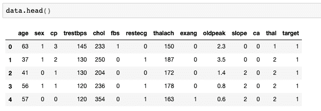
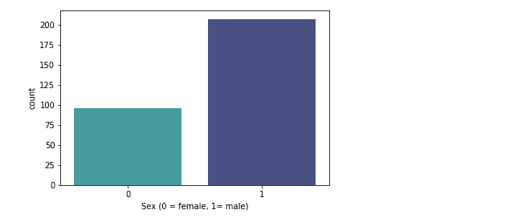
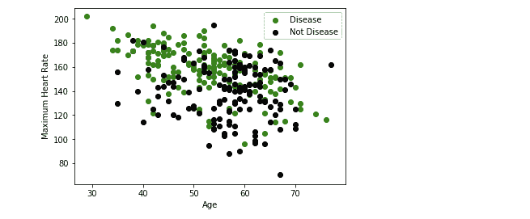

# 使用 K-最近邻算法对心脏病进行分类

> 原文：[`www.kdnuggets.com/2019/07/classifying-heart-disease-using-k-nearest-neighbors.html/2`](https://www.kdnuggets.com/2019/07/classifying-heart-disease-using-k-nearest-neighbors.html/2)

 评论

### 使用 K-NN 算法构建心脏病分类器


[来源](https://brainfeedmagazine.com/now-machine-learning-can-predict-death-with-over-90-accuracy/)

在医疗领域，最关键的任务是疾病诊断。如果能早期诊断疾病，可以挽救许多生命。机器学习分类技术通过提供准确和快速的疾病诊断，可以显著改善医疗领域，从而为医生和患者节省时间。由于心脏病是当今世界上首要的杀手，它成为最难诊断的疾病之一。

在本节中，我们将建立一个 K-NN 分类器，以预测患者是否患有心脏病。

你可以从 [UCI 机器学习库](https://archive.ics.uci.edu/ml/datasets/Heart+Disease) 下载数据集。

这个数据库包含 76 个属性，但所有已发布的实验都使用了其中的 14 个属性的子集。特别是，克利夫兰数据库是迄今为止 ML 研究人员唯一使用的数据库。“目标”字段指的是患者是否患有心脏病。其值为 0（未患病）到 4。

数据集包含以下特征：

`age — 年龄 sex — (1 = 男性; 0 = 女性) cp — 胸痛类型 trestbps — 静息血压（入院时的 mm Hg） chol — 血清胆固醇（mg/dl） fbs — （空腹血糖 > 120 mg/dl）（1 = 是; 0 = 否） restecg — 静息心电图结果 thalach — 达到的最高心率 exang — 运动诱发心绞痛（1 = 是; 0 = 否） oldpeak — 运动引起的 ST 段压低相对于静息状态 slope — 峰值运动 ST 段的坡度 ca — 通过荧光透视检查的主要血管数量（0–3） thal — 3 = 正常; 6 = 固定缺陷; 7 = 可逆缺陷 target — 是否患病（1 = 是, 0 = 否）`

让我们加载所有必需的库。

```py
import numpy as np
import matplotlib.pyplot as plt 
import pandas as pd
import seaborn as sns
from sklearn.model_selection import train_test_split
from sklearn.preprocessing import StandardScaler
from sklearn.neighbors import KNeighborsClassifier
from sklearn.metrics import confusion_matrix
from sklearn import metrics
```

让我们加载数据集：

```py
data = pd.read_csv('/Users/nageshsinghchauhan/Downloads/ML/KNN_art/heart.csv')
```



我们的原始数据集看起来是这样的

让我们探索数据集并统计患有心脏病的患者数量：

```py
data.target.value_counts()

1    165
0    138
Name: target, dtype: int64
```

所有患者中有 165 名患者实际上患有心脏病。现在也来可视化一下。

```py
sns.countplot(x="target", data=data, palette="bwr")
plt.show()
```


患有心脏病的患者数量（target = 1）

现在让我们将目标变量分类为男性和女性，并可视化结果。

```py
sns.countplot(x='sex', data=data, palette="mako_r")
plt.xlabel("Sex (0 = female, 1= male)")
plt.show()
```



患有心脏病的男性和女性数量

从上述图中可以看出，我们的数据集中有 207 名男性和 96 名女性。

我们还可以查看“最大心率”和“年龄”之间的关系。

```py
plt.scatter(x=data.age[data.target==1], y=data.thalach[(data.target==1)], c="green")
plt.scatter(x=data.age[data.target==0], y=data.thalach[(data.target==0)], c = 'black')
plt.legend(["Disease", "Not Disease"])
plt.xlabel("Age")
plt.ylabel("Maximum Heart Rate")
plt.show()
```



年龄与最大心率之间的散点图

从上述结果来看，最大心率出现在 50 至 60 岁之间。

好的，现在让我们用**X**（自变量矩阵）和**y**（因变量向量）标记我们的数据集。

```py
X = data.iloc[:,:-1].values
y = data.iloc[:,13].values
```

接下来，我们将 75%的数据分配到训练集，25%的数据分配到测试集，使用下面的代码。

```py
X_train, X_test, y_train, y_test =  train_test_split(X,y,test_size = 0.25, random_state= 0)
```

现在，我们的数据集包含特征，这些特征在量级、单位和范围上高度变化。但由于大多数机器学习算法在计算中使用两点之间的欧几里得距离，这就成了一个问题。为了抑制这种影响，我们需要将所有特征调整到相同的量级。这可以通过一种叫做特征缩放的方法来实现。

所以我们的下一步是对数据进行标准化，这可以使用 scikit-learn 中的 StandardScaler()来完成。

```py
sc_X = StandardScaler()
X_train = sc_X.fit_transform(X_train)
X_test = sc_X.transform(X_test)
```

我们的下一步是建立 K-NN 模型，并用训练数据进行训练。这里的 n_neighbors 是 K 的值。

```py
classifier = KNeighborsClassifier(n_neighbors = 5, metric = 'minkowski', p = 2)
classifier = classifier.fit(X_train,y_train)
```

所以这里最重要的一点是选择 K 的最佳值，为此，我们将从 K=5 开始。

现在，由于你的 K-NN 模型已经准备好 K=5，让我们训练测试数据并检查其准确率。

```py
y_pred = classifier.predict(X_test)
#check accuracy
accuracy = metrics.accuracy_score(y_test, y_pred)
print('Accuracy: {:.2f}'.format(accuracy))
```

**准确率：0.82**

对于 K=6

```py
classifier = KNeighborsClassifier(n_neighbors = 6, metric = 'minkowski', p = 2)
classifier = classifier.fit(X_train,y_train)
#prediction
y_pred = classifier.predict(X_test)
#check accuracy
accuracy = metrics.accuracy_score(y_test, y_pred)
print('Accuracy: {:.2f}'.format(accuracy))
```

**准确率：0.86**

对于 K=7

```py
classifier = KNeighborsClassifier(n_neighbors = 7, metric = 'minkowski', p = 2)
classifier = classifier.fit(X_train,y_train)
#prediction
y_pred = classifier.predict(X_test)
#check accuracy
accuracy = metrics.accuracy_score(y_test, y_pred)
print('Accuracy: {:.2f}'.format(accuracy))
```

**准确率：0.87**

对于 K=8

```py
classifier = KNeighborsClassifier(n_neighbors = 8, metric = 'minkowski', p = 2)
classifier = classifier.fit(X_train,y_train)
#prediction
y_pred = classifier.predict(X_test)
#check accuracy
accuracy = metrics.accuracy_score(y_test, y_pred)
print('Accuracy: {:.2f}'.format(accuracy))
```

**准确率：0.87**

对于 K=9

```py
classifier = KNeighborsClassifier(n_neighbors = 9, metric = 'minkowski', p = 2)
classifier = classifier.fit(X_train,y_train)
#prediction
y_pred = classifier.predict(X_test)
#check accuracy
accuracy = metrics.accuracy_score(y_test, y_pred)
print('Accuracy: {:.2f}'.format(accuracy))
```

**准确率：0.86**

从中可以看出，***当 K=7 时，准确率最大，为 87%***。

我们还可以检查混淆矩阵，查看多少记录被正确预测。

```py
#confusion matrix
from sklearn.metrics import confusion_matrix
cm = confusion_matrix(y_test, y_pred)
```

**```py
array([[26, 7],
       [ 3, 40]])
```**

在输出中，26 和 40 是正确预测，而 7 和 3 是错误预测。

### 如何提高分类器的性能？

嗯，有许多方法可以改进 KNN 算法。

+   **改变距离度量**对于不同的应用可能有助于提高算法的准确度。（即用于文本分类的汉明距离）。

+   **降维**技术，如 PCA，应在应用 K-NN 之前执行。

+   **重新缩放数据**使距离度量更具意义。例如，给定两个特征身高和体重，观察值如 z=[220,60]将明显偏向身高。修正方法之一是逐列减去均值并除以标准差。

+   **近似最近邻**技术，如使用*k-d 树*来存储训练数据，可以减少测试时间。

### **结论**

恭喜你，成功构建了一个使用 K-NN 的心脏病分类器，能够以最佳准确度对心脏病患者进行分类。

在这篇文章中，我们学习了 K-NN，它的工作原理，维度灾难，模型构建以及使用 Python Scikit-learn 包在心脏病数据集上的评估。

好吧，希望你们喜欢阅读这篇文章。请在评论区告诉我你的想法/建议/问题。

你可以通过 [LinkedIn](https://www.linkedin.com/in/nagesh-singh-chauhan-6936bb13b/) 联系我，提出任何问题。

感谢阅读 !!!

**简介： [Nagesh Singh Chauhan](https://www.linkedin.com/in/nagesh-singh-chauhan-6936bb13b/)** 是 CirrusLabs 的大数据开发人员。他在电信、分析、销售、数据科学等多个领域拥有超过 4 年的工作经验，专注于各种大数据组件。

[原文](https://towardsdatascience.com/implement-k-nearest-neighbors-classification-algorithm-c99be8f14052)。经许可转载。

**相关：**

+   使用 Scikit-Learn 的 Python 线性回归初学者指南

+   使用 Python 和 NLTK 构建你的第一个聊天机器人

+   使用卷积神经网络和 OpenCV 预测年龄和性别

* * *

## 我们的前三大课程推荐

 1\. [谷歌网络安全证书](https://www.kdnuggets.com/google-cybersecurity) - 快速进入网络安全职业生涯。

 2\. [谷歌数据分析专业证书](https://www.kdnuggets.com/google-data-analytics) - 提升你的数据分析技能

 3\. [谷歌 IT 支持专业证书](https://www.kdnuggets.com/google-itsupport) - 支持你所在组织的 IT

* * *

### 更多相关话题

+   [从理论到实践：构建 k 最近邻分类器](https://www.kdnuggets.com/2023/06/theory-practice-building-knearest-neighbors-classifier.html)

+   [分类的最近邻算法](https://www.kdnuggets.com/2022/04/nearest-neighbors-classification.html)

+   [Scikit-learn 中的 K 最近邻](https://www.kdnuggets.com/2022/07/knearest-neighbors-scikitlearn.html)

+   [使用 BERT 分类长文本文档](https://www.kdnuggets.com/2022/02/classifying-long-text-documents-bert.html)

+   [使用 Python 自动化 Microsoft Excel 和 Word](https://www.kdnuggets.com/2021/08/automate-microsoft-excel-word-python.html)

+   [如何使用 Python 确定最佳拟合的数据分布](https://www.kdnuggets.com/2021/09/determine-best-fitting-data-distribution-python.html)**
