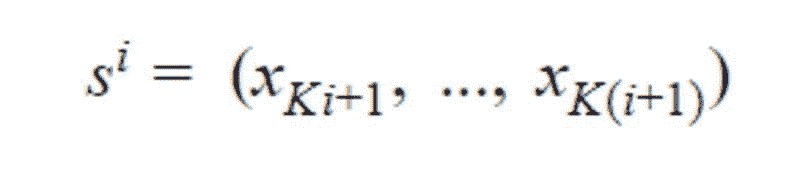
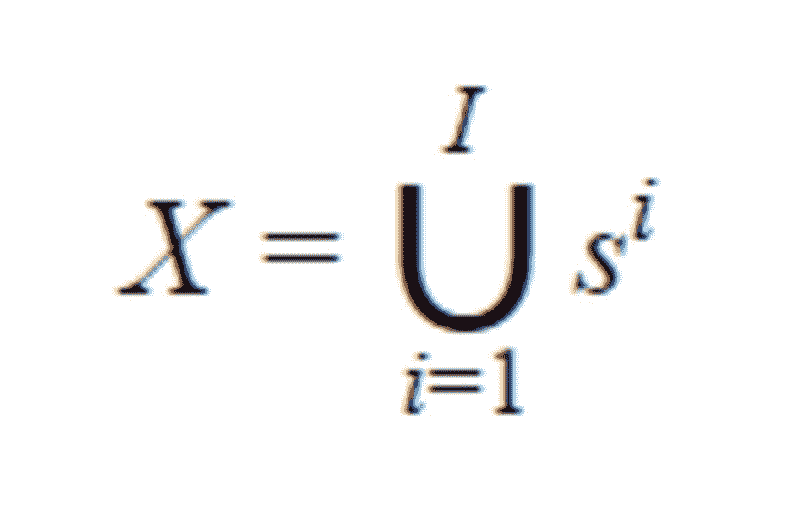
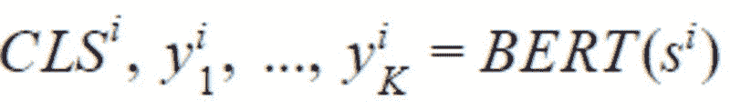
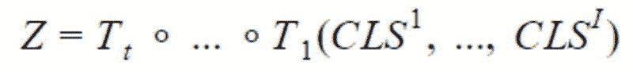
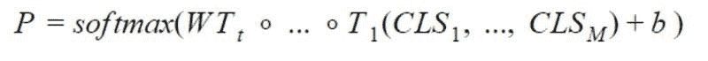
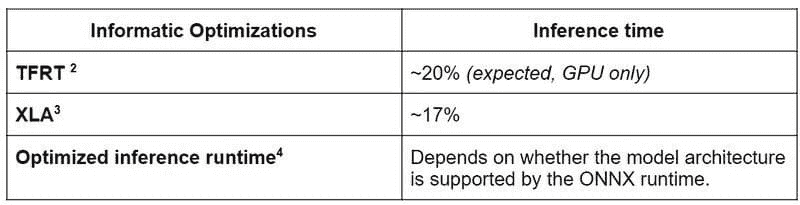

# 使用 BERT 进行长文本文档分类

> 原文：[`www.kdnuggets.com/2022/02/classifying-long-text-documents-bert.html`](https://www.kdnuggets.com/2022/02/classifying-long-text-documents-bert.html)

**由 Sinequa 提供**

### 我们想要实现什么目标？

我们想将文本分类到预定义的类别中，这是 NLP 中非常常见的任务。多年来，简单文档的经典方法是使用[TF-IDF](https://en.wikipedia.org/wiki/Tf%E2%80%93idf)生成特征，并将其与[逻辑回归](https://en.wikipedia.org/wiki/Logistic_regression)结合。以前我们在 Sinequa 用来进行文本分类时依赖于这一套方案，剧透一下，使用这里介绍的模型，我们将非常嘈杂和长文档数据集的基线从 5%提高到了 30%。这种旧方法有两个主要问题：特征稀疏性，我们通过压缩技术解决了这一问题，以及词匹配问题，我们通过利用 Sinequa 强大的语言学能力（主要通过我们自家开发的分词器）来克服。

后来，语言模型的潘多拉盒子被打开了（这些模型在海量语料库上进行无监督预训练，并在下游监督任务中进行微调），TF-IDF 基础的技术不再是最先进的。这些语言模型可能是[word2vec](https://arxiv.org/pdf/1301.3781.pdf)与 LSTM 或 CNN、ELMo，以及最重要的 Transformer（2017 年：[`arxiv.org/pdf/1706.03762.pdf`](https://arxiv.org/pdf/1706.03762.pdf)）。

[BERT](https://arxiv.org/pdf/1810.04805.pdf)是一个基于 Transformer 的语言模型，近年来获得了大量关注，因为它远远超越了所有 NLP 基线，并成为构建我们文本分类的自然选择。

### 那么挑战是什么呢？

基于 Transformer 的语言模型如 BERT 在理解语义上下文方面表现出色（这是词袋方法所无法做到的），因为它们专门为此目的而设计。如引言中所述，BERT 在所有 NLP 基线测试中表现优异，但正如我们在科学界所说的，“没有免费的午餐”。像 BERT 这样的模型提供的广泛语义理解带来了一个大问题：它无法处理非常长的文本序列。基本上，这个限制是 512 个标记（标记是文本中的一个词或子词），这大致相当于两到三段维基百科内容，而我们显然不希望仅仅考虑如此小的文本子部分进行分类。

为了说明这一点，考虑将全面的产品评论分类为正面或负面评论的任务。前几句话或段落可能只包含产品的描述，可能需要进一步阅读评论才能理解评论者是否真正喜欢这个产品。如果我们的模型不能涵盖全部内容，可能无法做出正确的预测。因此，我们的模型的一个要求是捕捉文档的上下文，同时正确管理文档开头和结尾之间的长期依赖关系。

从技术上讲，核心限制是内存占用，它随着标记数量的增加而按平方增长，同时使用的预训练模型具有由 Google 等公司确定的固定大小。这是预期中的情况，因为每个标记都“注意” [https://arxiv.org/pdf/1706.03762.pdf] 到每个其他标记，因此需要一个 [N x N] 的注意力矩阵，其中 [N] 是标记的数量。例如，BERT 接受最多 512 个标记，这很难称为长文本。超过 512 个标记很快就会达到甚至现代 GPU 的极限。

在生产环境中使用 Transformers 另一个出现的问题是由于模型的大小（BERT base 具有 110M 参数）以及平方成本导致推理非常缓慢。因此，我们的目标不仅是找到一个在训练过程中适合内存的架构，还要找到一个在推理过程中也能合理快速响应的架构。

我们在这里面临的最后一个挑战是基于各种特征类型构建一个模型：当然包括长文本，还包括附加的文本元数据（如标题、摘要等）和类别（如位置、作者等）。

### 那么，如何处理非常长的文档呢？

主要的想法是将文档拆分成更短的序列，并将这些序列输入到 BERT 模型中。我们为每个序列获得 CLS 嵌入并合并这些嵌入。合并有几种可能性，我们尝试了：

+   卷积神经网络（CNN）

+   长短期记忆网络（LSTM）

+   Transformers（用来聚合 Transformers，没错 :)）

我们在不同标准文本分类语料库上的实验表明，使用额外的 Transformer 层来合并生成的嵌入效果最佳，而不会引入大量计算成本。

### 想要正式描述，对吧？

我们考虑一个具有 *L* 标签的文本分类任务。对于一个文档 *D*，其由 [WordPiece 分词](https://medium.com/@makcedward/how-subword-helps-on-your-nlp-model-83dd1b836f46) 提供的标记可以表示为 *X =( x₁, …, xₙ)*，其中 *N* 为 *D* 中标记的总数。设 K 为最大序列长度（对于 BERT 为 512）。设 *I* 为 *D* 中 *K* 个标记或更少的序列数，它由 I=⌊ N/K ⌋ 给出。

请注意，如果文档中的最后一个序列的大小小于 *K*，它将用 0 填充，直到 *Kᵗʰ* 索引。如果 *s*ⁱ 其中 *i* ∈ {1, .., I} 是 *D* 中第 *i* 个具有 *K* 元素的序列，我们有：

我们可以注意到

BERT 返回 CLS 嵌入以及每个 token 的嵌入。

让我们定义 BERT 为文档的第 *i* 个序列返回的每个 token 的嵌入，如下所示：

其中 *CLS* 是插入到每个输入 BERT 的文本序列前的特殊 token 的嵌入，通常被认为是总结整个序列的嵌入。

为了结合这些序列，我们只使用 *CLSᵢ*，不使用 *y*。我们使用 *t* 个变换器 *T₁, …,Tₜ* 来获得最终向量，以便输入到网络的最后一个全连接层：

其中 **∘** 是函数复合操作。

给定最后一个全连接层的权重 *W ∈ ℝᴸˣᴴ*，其中 *H* 是变换器的隐藏大小，偏置 *b* ∈ ℝᴸ

概率 ***P*** *∈ ℝᴸ* 由以下公式给出：

最后，对向量 *P* 应用 *argmax* 返回预测的标签。有关上述架构的总结，您可以查看图 1。

上述架构使我们能够利用 BERT 进行文本分类任务，绕过变换器的最大序列长度限制，同时保持对多个序列的上下文。让我们看看如何将其与其他类型的特征结合。

### 如何处理元数据？

文档通常不仅仅包含其内容，还可能有我们分为两个组的元数据：文本元数据和分类元数据。

### 文本元数据

文本元数据是指短文本，它（在分词后）具有相对较少的 token 数量。这是为了能够完全适配到我们的语言模型中。此类元数据的典型示例包括标题或摘要。

给定一个具有 *M* 个元数据注释的文档。让

是 BERT 为每个元数据生成的 CLS 嵌入。使用与上述相同的技术来获取概率向量，如下所示：

### 分类元数据

分类元数据可以是表示类别的数值或文本值。数值可以是页数，而文本值可以是出版商名称或地理位置。

处理此类特征的一种常见方法是实现 [宽和深架构](https://export.arxiv.org/pdf/1606.07792)。我们的实验表明，这个网络的深度部分产生的结果已经足够好，而宽度部分是不必要的。

我们使用 one-hot 编码将分类元数据编码为一个单一的跨类别向量。然后，将该编码传递到嵌入层，该层学习每个不同类别的向量表示。最后一步是对结果嵌入矩阵应用池化层。

我们考虑了最大池化、平均池化和最小池化，并发现使用平均池化对我们的测试语料库效果最好。

### 完整的架构是怎样的？

希望你坚持到现在，下面的图示将有助于进一步澄清问题。

图 1

有三个子模型，一个用于文本，另一个用于文本元数据，最后一个用于分类元数据。三个子模型的输出仅仅是串联成一个单一的向量，然后通过一个 dropout 层，最后进入一个具有 softmax 激活的最后密集层进行分类。

你可能已经注意到，在架构中描绘了多个 BERT 实例，这不仅用于文本输入，还用于文本元数据。由于 BERT 需要训练许多参数，我们决定不为每个子模型包含一个单独的 BERT 模型，而是共享一个模型的权重。共享权重确实减少了模型使用的 RAM（使得可以使用更大的批量大小进行训练，从而在某种程度上加速训练），但它并不会改变推理时间，因为无论权重是否共享，BERT 执行的次数依然是一样的。

### 推理时间怎么样？

到现在，你一定已经猜到包含如此多的 BERT 模型调用并不是免费的。确实，运行这样的模型推理计算代价昂贵。然而，有几个技巧可以提高推理时间。以下内容我们将重点讨论 CPU 推理，因为这在生产环境中非常重要。

对于进行的实验，有几点说明：

+   我们考虑了一个仅包含文本特征的简化模型。

+   我们将每个文档使用的 tokens 限制为 25,600 个，这大致相当于 130,000 个字符（如果文档包含英文文本）。

+   我们用具有上述最大长度的文档进行实验。实际上，文档的大小各不相同，由于我们在模型中使用了动态大小的张量，因此短文档的推理时间显著更快。作为一个经验法则，使用一个长度是原文档一半的文档，推理时间会减少 50%。

**参考文献**

1.  [`arxiv.org/abs/2006.04152`](https://arxiv.org/abs/2006.04152)， [`arxiv.org/pdf/2001.08950.pdf`](https://arxiv.org/pdf/2001.08950.pdf)

1.  [`blog.tensorflow.org/2020/04/tfrt-new-tensorflow-runtime.html`](https://blog.tensorflow.org/2020/04/tfrt-new-tensorflow-runtime.html)

1.  [`www.tensorflow.org/xla?hl=fr`](https://www.tensorflow.org/xla?hl=fr)

1.  [`medium.com/microsoftazure/accelerate-your-nlp-pipelines-using-hugging-face-transformers-and-onnx-runtime-2443578f4333`](https://medium.com/microsoftazure/accelerate-your-nlp-pipelines-using-hugging-face-transformers-and-onnx-runtime-2443578f4333)

### 还有什么可以做的？

### 线性 Transformer

构建一种类似于 Transformer 的架构，但没有时间和内存的二次复杂度，目前是一个非常活跃的研究领域。一旦预训练模型发布，有几个候选者绝对值得尝试：

+   Linformer [[`arxiv.org/pdf/2006.04768.pdf`](https://arxiv.org/pdf/2006.04768.pdf)]

+   BigBird [[`arxiv.org/pdf/2007.14062.pdf`](https://arxiv.org/pdf/2007.14062.pdf)]

+   改革者 [[`arxiv.org/pdf/2001.04451.pdf`](https://arxiv.org/pdf/2001.04451.pdf)]（仅 O(N log(N)) 复杂度）

+   Performers [[`arxiv.org/pdf/2009.14794.pdf`](https://arxiv.org/pdf/2009.14794.pdf)]

+   等等…

对非常有前景的 [Longformer](https://arxiv.org/pdf/2004.05150.pdf) 模型进行的初步测试未能成功执行。我们尝试使用 [Hugging Face](https://huggingface.co/transformers/model_doc/longformer.html) 的 TensorFlow 实现来训练 LongFormer 模型。然而，似乎该实现尚未进行内存优化，因为即使在具有 48 GB 内存的大型 GPU 上也无法训练。

推理时间是任何需要在生产中运行的 ML 项目的基石，因此我们计划在未来使用这种“线性 Transformer”，除此之外还会进行剪枝和量化。

### 我们完成了吗？

是的，感谢你坚持到最后。如果你对我们的模型有任何问题或评论，请随时留言。我们非常乐意听取你的意见。

[原文](https://sinequa.medium.com/classifying-long-textual-documents-up-to-25-000-tokens-using-bert-9d2dd55ca060)。经许可转载。

* * *

## 我们的前三个课程推荐

 1. [谷歌网络安全证书](https://www.kdnuggets.com/google-cybersecurity) - 快速开启网络安全职业生涯。

 2. [谷歌数据分析专业证书](https://www.kdnuggets.com/google-data-analytics) - 提升你的数据分析能力

 3. [谷歌 IT 支持专业证书](https://www.kdnuggets.com/google-itsupport) - 支持你在 IT 领域的组织

* * *

### 更多相关主题

+   [使用 tfidfvectorizer 将文本文档转换为 TF-IDF 矩阵](https://www.kdnuggets.com/2022/09/convert-text-documents-tfidf-matrix-tfidfvectorizer.html)

+   [使用 CountVectorizer 将文本文档转换为词频计数](https://www.kdnuggets.com/2022/10/converting-text-documents-token-counts-countvectorizer.html)

+   [GPT4All 是您文档的本地 ChatGPT，且完全免费！](https://www.kdnuggets.com/2023/06/gpt4all-local-chatgpt-documents-free.html)

+   [使用 BERT 进行提取式摘要](https://www.kdnuggets.com/extractive-summarization-with-llm-using-bert)

+   [学习数据科学基础知识需要多长时间？](https://www.kdnuggets.com/2022/03/long-take-learn-data-science-fundamentals.html)

+   [使用 HuggingFace 微调 BERT 进行推文分类](https://www.kdnuggets.com/2022/01/finetuning-bert-tweets-classification-ft-hugging-face.html)
