# 云计算、数据科学和 ML 趋势 2020–2022：巨头之战

> 原文：[`www.kdnuggets.com/2021/01/cloud-computing-data-science-ml-trends-2020-2022-battle-giants.html`](https://www.kdnuggets.com/2021/01/cloud-computing-data-science-ml-trends-2020-2022-battle-giants.html)

评论

**由 [George Vyshnya](https://www.linkedin.com/in/gvyshnya/)，SBC 联合创始人/CTO**

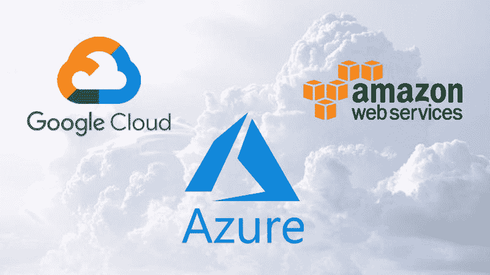

每次你看到一个巨头时，你必须知道那个巨头可能在其他地方只是个侏儒！ ― Mehmet Murat ildan

* * *

## 我们的前三名课程推荐

 1\. [谷歌网络安全证书](https://www.kdnuggets.com/google-cybersecurity) - 快速进入网络安全职业生涯。

 2\. [谷歌数据分析专业证书](https://www.kdnuggets.com/google-data-analytics) - 提升你的数据分析能力

 3\. [谷歌 IT 支持专业证书](https://www.kdnuggets.com/google-itsupport) - 支持你的组织的 IT

* * *

### 介绍

我将致力于一系列文章，分享 Kaggle “2020 年数据科学和机器学习现状”调查中收集的数据见解 ([`www.kaggle.com/c/kaggle-survey-2020`](https://www.kaggle.com/c/kaggle-survey-2020))。

调查涵盖了很多不同的话题，每一个话题都值得单独讨论各自的趋势。

*备注*：

+   Kaggle ([www.kaggle.com](https://www.kaggle.com/)) 是一个由全球各地的数据科学家和机器学习者组成的社区，成员技能和背景各异。社区拥有约 300 万活跃成员。虽然从社会学角度来看，它并不完全代表全球数据科学和 ML 专业人士的总体情况，但它仍然构成了该领域从业者和专业人士的重要部分。因此，调查结果确实可以对数据科学和 AI/ML 行业在未来几年可能的发展方向进行有价值的预测。

+   你可以查看仓库 [`github.com/gvyshnya/state-of-data-science-and-ml-2020`](https://github.com/gvyshnya/state-of-data-science-and-ml-2020) 以了解本文讨论的每个见解是如何发现的。

### 巨头之战

在这篇文章中，我们将探讨参与调查的数据科学和 ML 专业人士对云计算平台和产品的受欢迎程度。特别是，它将涵盖

+   云平台使用情况

+   云计算产品使用情况

+   云 ML 产品使用情况

+   大数据平台

+   BI 工具（主要是基于云的工具）

本章的叙述线将经常附带关于市场上前三大云服务提供商的好消息和机会

+   亚马逊 Web 服务 (AWS)

+   Google Cloud Platform (GCP)

+   Microsoft Azure Cloud (MS Azure)

*注意：*

+   调查组织者将非专业人士定义为学生、失业者以及从未在云中花费过任何钱的回应者。其他所有人被视为专业人士

### 云服务提供商的使用

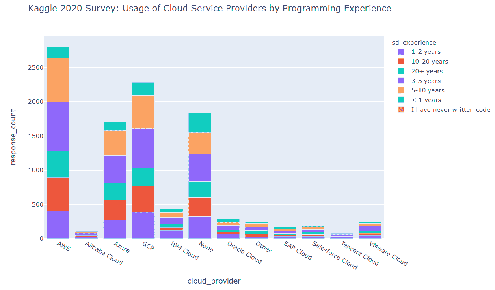

我们发现 Kaggle 调查的回应者中前三名的云服务提供商是

+   AWS

+   GCP

+   MS Azure

其余的云服务提供商目前似乎在与上述前三名提供商的竞争中失去了竞争优势。

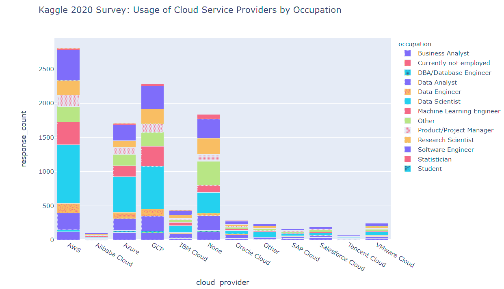

同时，值得注意的是，“无”类别略微超过了 MS Azure 条形图的大小，这意味着市场可能尚未被云服务提供商的产品饱和。

我们还看到具有 3–5 年和 5–10 年编程经验的专业人士是前三大云服务提供商中最大的用户群体。具有 10 年以上经验的高级专业人士在前三大平台的云服务用户中占比相对较少（根据市场营销优先级，特别的行动来教育这些高级专业人士可能有助于更好地推广云服务）。

正如我们所看到的，前三大云服务提供商的用户大多数符合以下角色

+   数据科学家

+   软件工程师

第三名职位由以下人员担任

+   机器学习工程师（AWS，GCP）

+   数据分析师（MS Azure）

正如之前所述，“其他”职业组本身范围过大，未来的调查中可能值得将其拆分为更细化的类别。我们看到，“其他”组在每个云服务平台用户中占据了相当大的比例（尽管在任何平台的前三名列表中都未出现）。

就用户职业和编程经验而言，前三大云服务提供商共享以下相同的趋势

+   数据科学家中具有 3–5 年和 5–10 年编程经验的用户是调查回应者中 AWS 的主要用户群体

+   在软件工程师、机器学习工程师和数据分析师组中，具有 3–5 年和 5–10 年经验的专业人士占主导地位

+   在研究科学家、数据工程师、DBA、统计学家和其他组中，具有 10 年以上经验的专业人士占据了最大的用户比例

+   在产品/项目管理组中，具有 5 年以上经验的专业人士占据了最大的用户比例

+   在商业分析师组中，我们看到具有 1–2 年经验的用户占据主导地位

就组织环境而言，最能使用云服务的数据科学和机器学习专业人士可以在以下领域找到

+   员工人数为 0–49 的组织中，拥有 1–2 名专门从事数据科学工作的员工

+   员工人数超过 10000 的组织中，拥有 20 名以上专门从事数据科学工作的员工

因此我们可以得出结论，AWS、GCP 和 MS Azure 在相同类型的组织/用户中进行激烈竞争。

### 云计算产品的使用

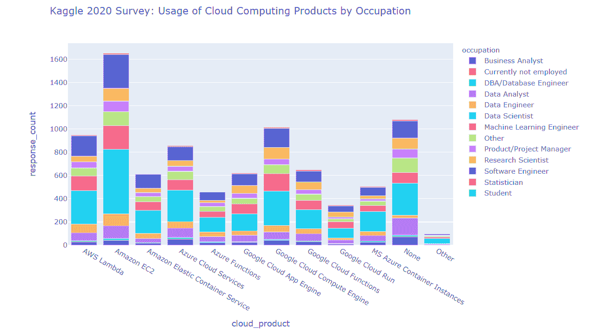

我们发现

+   在云计算引擎领域，Amazon EC2 比 Google（Google Cloud Computing Engine）和 MS Azure（Azure Cloud Services）的竞争对手更受欢迎

+   在云函数领域，AWS Lambda 比 Google（Google Cloud Functions）和 MS Azure（Azure Functions）的竞争对手更受欢迎

+   在云容器运行器领域，Amazon Elastic Container Service 比 Google（Google Cloud Run）和 MS Azure（MS Azure Container Instances）的竞争对手更受欢迎

+   Google 在云计算引擎和云函数领域位居第二，在云容器运行器领域位居第三

+   有大量回应为“无”，这很可能表明整个云计算应用市场尚未饱和

在用户角色方面，所有上述云计算产品的用户都担任以下角色（从上到下）

+   数据科学家

+   软件工程师

+   机器学习工程师

+   数据分析师

### 编程经验对云计算产品使用的影响

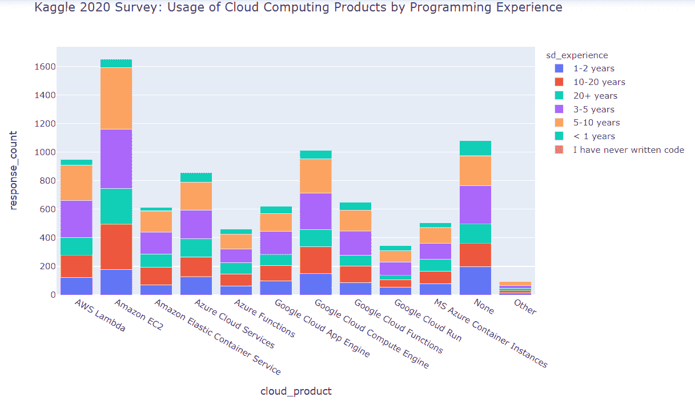

除了上述见解外，我们还看到，云计算产品用户的顶尖数量按编程经验划分为以下几个群体

+   5–10 年的经验

+   3–5 年的经验

+   10–20 年的经验

初级和超级资深（20 年以上编程经验）的覆盖程度似乎较低。

### 云机器学习产品使用情况

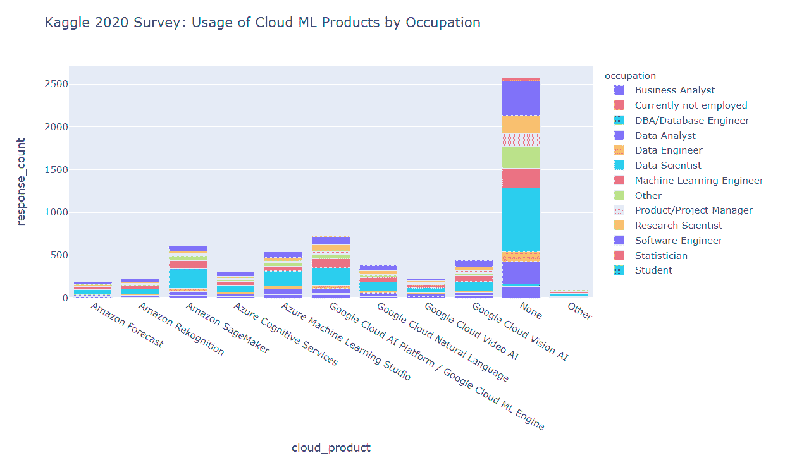

我们发现

+   Google Cloud AI Platform / Google Cloud ML Engine 在机器学习云产品使用方面的“提名”领先

+   第二和第三名分别是 Amazon SageMaker 和 Azure Machine Learning Studio

+   数据科学家是云机器学习产品的主要用户（针对每个调查的产品）

+   有一大部分回应者表示他们根本不使用云机器学习产品——这表明市场尚未饱和，还有很好的增长潜力，但需要解决市场推广和最终用户障碍

### 编程经验对云机器学习产品使用的影响

除了上述见解外，我们还可以看到云机器学习产品主要被具有以下编程经验的回应者使用

+   3–5 年

+   5–10 年

### 按组织规模和数据科学能力分类的云机器学习产品使用情况

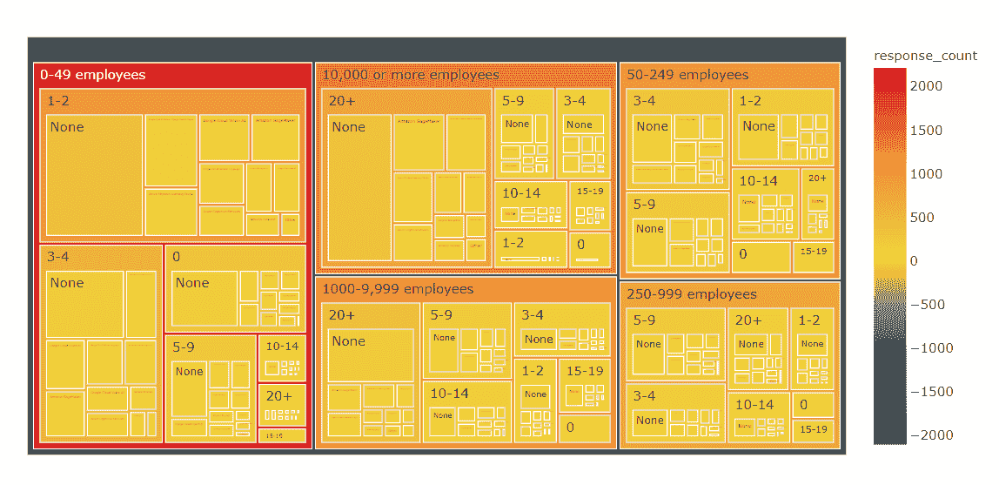

我们发现，在每个规模类别的大多数组织目前都不使用任何云机器学习产品。

对于那些使用它们的少数人来说，有以下有趣的见解

+   在小型组织（0–49 名员工）中，Google Cloud AI Platform / Google Cloud ML Engine 占据主导地位

+   在中型组织（50–249 名员工）中，Google Cloud AI Platform / Google Cloud ML Engine 和 Amazon SageMaker 不分上下

+   对于较大规模的公司（250+名员工），数据科学团队的规模通常与首选的云 ML 产品相关（较小的团队更倾向于使用 Google Cloud AI Platform / Google Cloud ML Engine，而拥有 20+人的数据科学团队则更倾向于使用 Amazon SageMaker）。

### 按职业分类的大数据产品使用情况

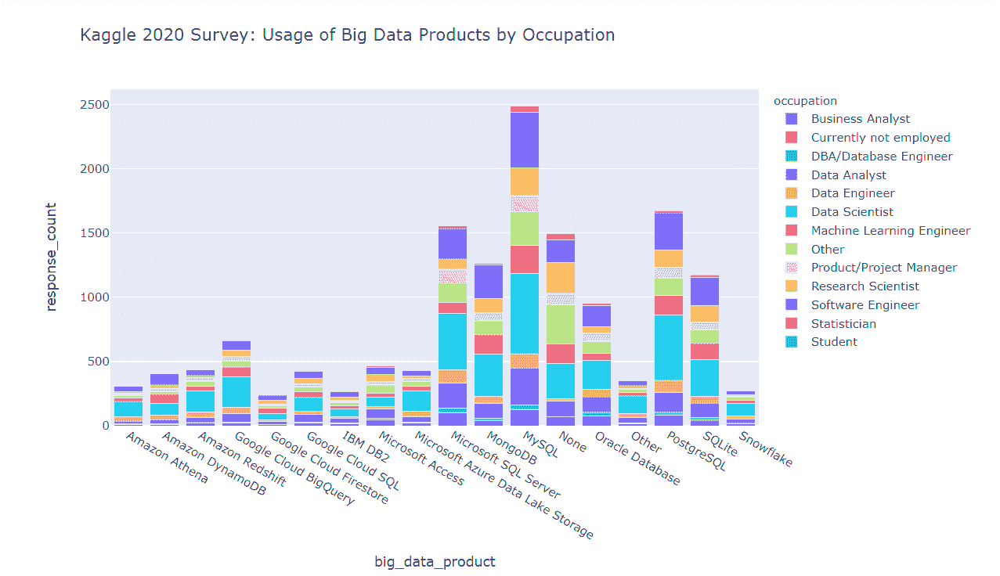

我们发现

+   总体前 3 名列表由三个关系型 DBMS 平台（MySQL、PostgreSQL、MS SQL Server）组成。

+   MongoDB 作为一种非关系型数据库平台，在列表中排名第 4。

+   列表中的其他关系型 DBMS 平台（Oracle、IBM DB2、SQLite）在 MongoDB 之后。

+   在真正基于云的大数据产品领域，Google BigQuery 超越了其 Amazon 和 MS Azure 竞争对手（Amazon Redshift、Amazon Athena、Amazon DynamoDB 和 Microsoft Azure Data Lake Storage）。

+   Google Cloud SQL 实例的受欢迎程度仍低于 MySQL 和 PostgreSQL 的“原生”关系型数据库实例。

+   MS Access 在业内仍在使用。

+   数据科学家是本列表中每种产品的主要用户。

### 按用户职业和编程经验分类的大数据产品使用模式

我们发现

+   MySQL 和 PostgreSQL 是各职业中最受欢迎的数据库管理平台。

+   MongoDB 在软件工程师中非常受欢迎（尽管不如 MySQL 和 PostgreSQL 受欢迎）。

### 按组织规模和数据科学能力分类的大数据产品使用模式

我们发现

+   除了超大型组织外，几乎所有组织都主要使用 MySQL、PostgreSQL 和 MongoDB 来满足其数据管理需求。

+   超大型组织（10000+名员工）更倾向于使用 MySQL、MS SQL Server、Oracle 和 PostgreSQL。

### BI 工具的使用情况

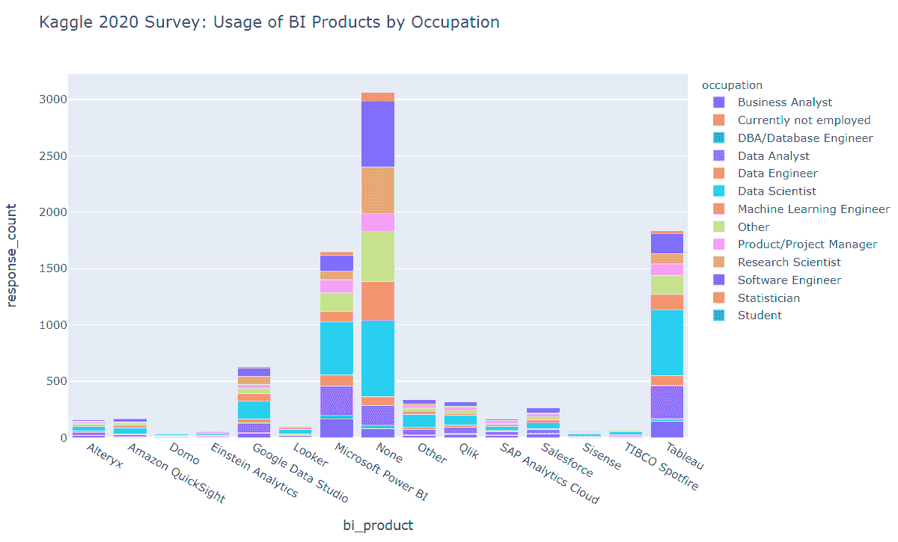

我们发现

+   Tableau 和 MS Power BI 显著超越其他竞争对手。

+   Google Data Studio 成为上述领先 BI 产品的挑战者，排名第三。

+   数据科学家、数据分析师、研究科学家和机器学习工程师是 BI 工具的最频繁用户。

+   大量调查回应者表示他们根本不使用 BI 工具。

### 全球范围内的 AWS 专业用户

我们发现

+   AWS 在印度和美国的调查回应者中最受欢迎。

+   巴西、日本和英国在使用 AWS 的这些国家中排名第 2 层级。

### 全球范围内的 GCP 专业用户

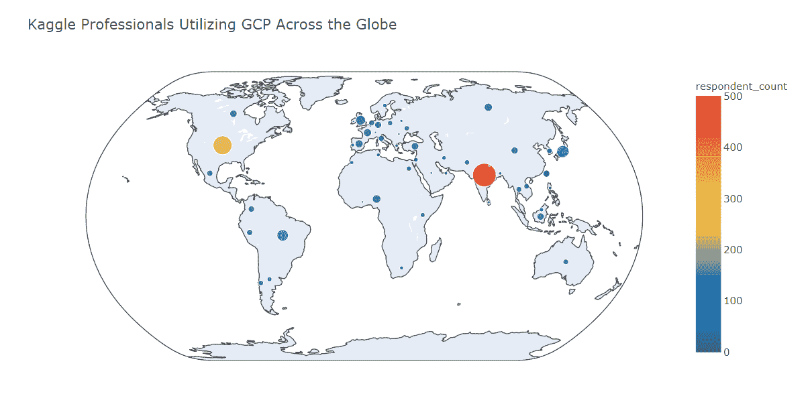

我们发现

+   印度是 GCP 使用最广泛的国家。

+   美国排名第二，但远低于印度（与 AWS 不同，印度和美国的排名相对接近）。

+   日本和巴西在使用 AWS 的这些国家中排名第 2 层级。

+   在英国、加拿大和澳大利亚，GCP 的受欢迎程度低于 AWS。

+   GCP 在土耳其、印度尼西亚和俄罗斯的表现优于 AWS

### 全球 MS Azure 专业用户

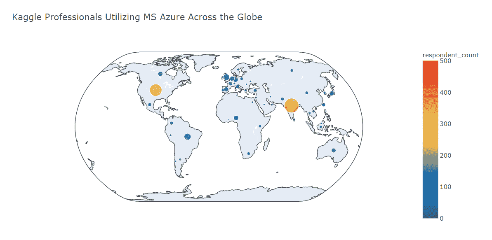

我们发现

+   MS Azure 用户数量最多的国家是印度（尽管在这里 MS Azure 远远落后于 AWS 和 GCP）

+   美国在排名中位居第二，MS Azure 用户数量与美国的 GCP 用户数量相当

+   在 MS Azure 用户数量方面，巴西属于第二梯队

+   在大多数国家（美国除外），MS Azure 用户数量少于 GCP 和 AWS 用户数量

### 摘要

在这篇文章中，我们回顾了数据科学和机器学习行业专业人士使用云计算平台、产品和工具的现状。这些不仅仅是他们在 2020 年底的偏好。这些都是最有可能决定 2021–2022 年趋势的基石。

未来几年在数据科学和机器学习行业，云计算巨头们在争夺头脑、资源和预算的战斗中将至关重要。尽管 AWS 的位置仍然看起来比其他顶级竞争对手更强，但 GCP 带来的挑战可能成为未来市场重塑的复杂部分。同时，MS Azure 似乎在北美保持着强势地位（虽然在其他大陆的渗透机会相对较少，尤其是与 AWS 和 GCP 相比）。

然而，我们进入了全球动荡的时代。2021 年，星辰之年的年份，可能会在我们生活的各个方面给我们带来意想不到的惊喜。

*备注*: 你可以查看这个库 [`github.com/gvyshnya/state-of-data-science-and-ml-2020`](https://github.com/gvyshnya/state-of-data-science-and-ml-2020) 来查看上述每一项洞见是如何被发现的。

**简介: [乔治·维什尼亚](https://www.linkedin.com/in/gvyshnya/)** 是 SBC 的联合创始人兼首席技术官，帮助首席执行官和首席技术官通过实施智能 AI、BI 和 Web 解决方案来增加收入。

[原文](https://medium.com/sbc-group-blog/cloud-computing-and-data-science-and-ml-trends-in-2020-2022-the-battle-of-giants-c2a174d3cd2b)。已获转载许可。

**相关:**

+   2021 年人工智能（AI）趋势前五名

+   2020 年数据科学和机器学习现状：3 项关键发现

+   2020 年必须掌握的 5 项数据科学技能

### 更多相关内容

+   [成为优秀数据科学家所需的 5 项关键技能](https://www.kdnuggets.com/2021/12/5-key-skills-needed-become-great-data-scientist.html)

+   [每个初学数据科学家都应该掌握的 6 种预测模型](https://www.kdnuggets.com/2021/12/6-predictive-models-every-beginner-data-scientist-master.html)

+   [2021 年最佳 ETL 工具](https://www.kdnuggets.com/2021/12/mozart-best-etl-tools-2021.html)

+   [停止学习数据科学来寻找目标，寻找目标来……](https://www.kdnuggets.com/2021/12/stop-learning-data-science-find-purpose.html)

+   [学习数据科学统计的顶级资源](https://www.kdnuggets.com/2021/12/springboard-top-resources-learn-data-science-statistics.html)

+   [建立一个强大的数据团队](https://www.kdnuggets.com/2021/12/build-solid-data-team.html)
