# 云机器学习透视：2021 年的惊喜，2022 年的预测

> 原文：[`www.kdnuggets.com/2021/12/cloud-ml-perspective-surprises-2021-projections-2022.html`](https://www.kdnuggets.com/2021/12/cloud-ml-perspective-surprises-2021-projections-2022.html)

**由[George Vyshnya](https://www.linkedin.com/in/gvyshnya/)，SBC 的联合创始人/首席技术官**

> ~ 生活就是一系列的适应性测试。— 威廉·约瑟夫·多诺万

## 引言

在我 2021 年 1 月发表在 KDnuggets 上的文章中，我对 2021 年的云计算和云机器学习行业做出了以下预测

+   未来几年对于云计算巨头在数据科学和机器学习行业争夺思想、资源和预算将至关重要。虽然 AWS 的位置依然比其他主要竞争对手更强，但来自 GCP 的挑战可能是未来市场重塑的复杂部分。同时，MS Azure 似乎在北美保持着强势地位（而在与 AWS 和 GCP 相比中，进入其他大陆的机会较小）。

+   然而，我们进入了全球动荡的时代。2021 年，星辰之年，可能会在我们生活的各个方面带来意想不到的惊喜

我必须承认这两个预测都得到了实现。

巨头之战中，AWS、GCP 和 MS Azure 在争夺市场份额和收入的竞争中持续进行，各大巨头在全球范围内定位其产品时都有其强项和弱点。

> 至于惊喜，它确实发生了。在云机器学习行业中，我们观察到了 2021 年几个难以预测的现象
> 
> ***- Google ***在最近将其单独的云机器学习产品整合到统一产品平台（Google Cloud Vertex AI）后，市场份额下降了
> 
> ***- Databricks ***跃升为云机器学习市场的前三大产品，取代了 Google 的竞争产品

让我们回顾 2021 年的云机器学习市场（偶尔也回顾 2020 年的实际情况）。本文接下来的部分将揭示行业洞察。

**注意**：在挖掘洞察时，使用了 Kaggle 对‘2020 年数据科学和机器学习现状’的调查数据（[`www.kaggle.com/c/kaggle-survey-2020`](https://www.kaggle.com/c/kaggle-survey-2020)）以及对‘2021 年数据科学和机器学习现状’的调查数据（[`www.kaggle.com/c/kaggle-survey-2021`](https://www.kaggle.com/c/kaggle-survey-2021)）。

## Databricks 突破壁垒及 2021 年其他云机器学习趋势

我们可以发现许多关于 2021 年云机器学习行业的吸引人事实和趋势。它们如下

+   Google 在 2021 年将其所有云机器学习产品整合到新的统一平台（即 Google Cloud Vertex AI）中的举措，并未带来 Google 在企业（商业）云机器学习市场的市场份额增长。

+   此外，Big Three Cloud Giants 中的主要 Cloud ML 竞争者——Amazon SageMaker 和 Azure ML Studio——在其市场地位上有所提升，并且到 2021 年成为了市场的最终领导者（Amazon SageMaker 排名第一，略微领先于 Azure ML Studio）。

+   我们可以看到 Databricks 在 2021 年的 Cloud ML 产品排名中位居第三（高于 Google Cloud Vertex AI，略低于 Amazon SageMaker 和 Azure ML Studio）。

+   其他 Cloud ML 竞争产品（DataRobot、Dataiku、Alteryx、Rapidminer）远远落后于 Databricks 和 Google Cloud Vertex AI。

+   Amazon SageMaker 在 Cloud ML 市场中连续两年（2020–2021）保持领先地位。

+   尽管如此，大量受访者表示他们在日常活动中根本不使用 Cloud ML（需要注意的是，‘None’在 2020 年和 2021 年可能有不同的含义，因为 2020 年和 2021 年调查中提供的 Cloud ML 产品列表差异很大）。

+   Databricks 在 2021 年对 Google 的统一 AI 平台发起了强有力的进攻（因此，Google 最近决定投资 Databricks 可能是 Databricks 市场份额在 2021 年显著增长的触发因素）。

+   Cloud ML 行业领头羊——Amazon SageMaker 和 Azure ML Studio——在 2021 年底保持了相对强势的地位，相比于 Databricks 和 Google Cloud Vertex AI。

+   印度和美国是 Kaggle 2021 调查问卷中 Cloud ML 产品用户最多的前两大国家。

+   Amazon SageMaker 在印度和美国都占据了领先地位。

+   Azure Machine Learning Studio 在印度排名第二。

+   Databricks 在美国排名第二，并且在 2022 年在英国和欧盟国家也有良好的增长潜力。

+   ML 支出最多的公司更倾向于使用 Amazon SageMaker 和 Databricks，而 Azure ML Studio 在这种排名中位列第三（Google Cloud Vertex AI 则远远落后）。

+   Google Cloud Vertex AI 在中等和小规模 ML 支出公司的地位更好（这可能是一个未来将这些公司转化为高支付客户的机会）；它有可能在 2022 年在北美和欧盟以外的多个地点探索增长机会。

现在我们来详细了解一下上述洞察背后的数据驱动故事。

**注意**：如果你对详细复现我的发现感兴趣，欢迎查看 Github 仓库中的相关 Jupyter 笔记本（[`github.com/gvyshnya/kaggle-2021-survey`](https://github.com/gvyshnya/kaggle-2021-survey)）。

## 按职业和编程经验划分的 Cloud ML 产品使用情况（2020–2021）

让我们回顾一下 2021 年调查中提到的 Cloud ML 产品是如何被调查参与者使用的（根据他们的职业和编程经验进行分类）。

2021 年按职业分类的情况如下：

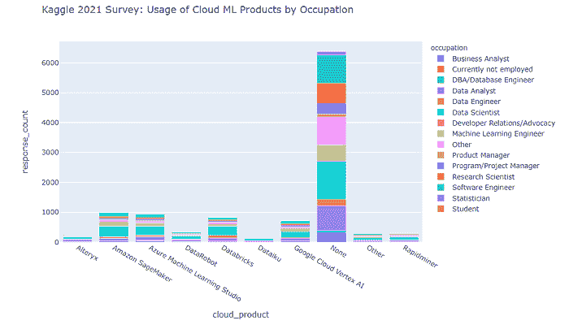

关于主要 Cloud ML 产品用户的编程经验，情况如下所示。

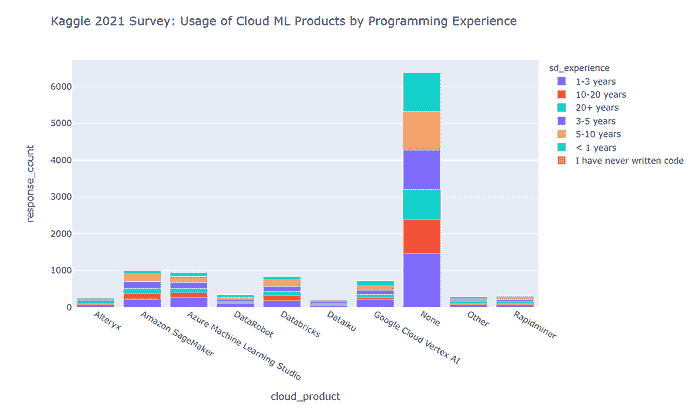

从上面的图表中可以明显看出，

+   大部分受访者在日常活动中不使用任何 Cloud ML 产品。

+   在少数使用这些工具的受访者中，数据科学家占主导地位。

+   Amazon SageMaker 和 Azure ML Studio 在使用人数方面领先。

+   来自 Google 的竞争产品（即 Google Cloud Vertex AI）落后于领导者，同时也落后于今年调查中出现的挑战者产品（即 Databricks）。

+   其他挑战者产品（DataRobot、Dataiku、Alteryx、Rapidminer）远远落后于领导者。

+   此外，Cloud ML 产品的使用最多的是具有 1–3 年和 10–20 年编程经验的专业人士。

现在，让我们回顾一下 2020 年调查中提到的 Cloud ML 产品如何被参与者使用（按职业和编程经验分类）。

截至 2020 年的按职业分类如下所示。

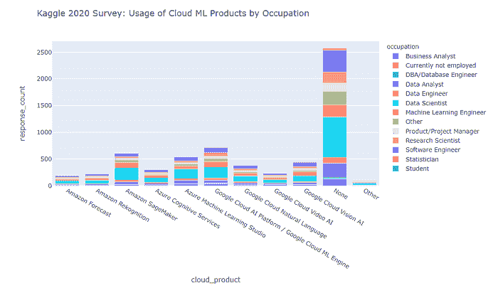

2020 年按编程经验分布的 Cloud ML 产品用户如下所示。

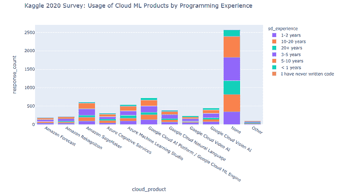

我们可以看到，

+   Google Cloud AI Platform / Google Cloud ML Engine 在 2020 年领先了机器学习云产品的使用“提名”。

+   第二和第三名分别是 Amazon SageMaker 和 Azure Machine Learning Studio。

+   数据科学家是云机器学习产品的主要用户（针对每个调查的产品）。

+   有一大部分受访者表示他们完全不使用云机器学习产品——这表明市场尚未饱和，仍有良好的增长潜力，但需要解决市场营销和终端用户的障碍。

+   此外，截至 2020 年，我们看到具有 3–5 年和 5–10 年编程经验的专业人士使用云机器学习产品最多。

如果我们分别汇总 2020 年和 2021 年的观察结果，我们会看到，

+   Google 在 2021 年将所有 Cloud ML 产品整合到新的统一平台（即 Google Cloud Vertex AI）上的举措，并未导致 Google 在企业（商业）Cloud ML 市场中的市场份额增长。

+   此外，三大云巨头中的主要 Cloud ML 竞争者——Amazon SageMaker 和 Azure ML Studio——改善了他们的市场位置，并成为截至 2021 年的*最终*市场领导者（其中 Amazon SageMaker 排名第一，略微领先于 Azure ML Studio）。

+   Azure Cognitive Services 在 2021 年被排除在调查之外，因此很难估算其在 Kagglers 中的市场位置相较于 2020 年的变化。

+   很难估算挑战者云机器学习产品（DataRobot、Databricks、Dataiku、Alteryx、Rapidminer）在 2021 年与 2020 年的市场地位变化，因为这些产品在 2020 年的调查中未被列出。

+   然而，我们可以看到，到 2021 年，Databricks 在云机器学习产品排名中位居第三（高于 Google Cloud Vertex AI，略低于 Amazon SageMaker 和 Azure ML Studio）。

+   其他云机器学习挑战者产品（DataRobot、Dataiku、Alteryx、Rapidminer）远低于 Databricks 和 Google Cloud Vertex AI。

+   尽管如此，大多数受访者表示他们在日常活动中根本不使用云机器学习（Cloud ML）（需要注意的是，2020 年和 2021 年的“无”可能有很大不同，因为 2020 年和 2021 年调查选项中云机器学习产品列表有着显著差异）。

如果我们尝试结合上述观察与 Databricks 在 2021 年 2 月至 8 月间取得的主要业务发展、融资和宣传进展（详见附录），我们可以说

+   Databricks 在 2021 年对 Google 的统一 AI 平台进行了强力进攻（因此 Google 最近决定投资 Databricks 可能是 Databricks 市场份额在 2021 年良好增长的触发因素）。

+   云机器学习行业领头羊——Amazon SageMaker 和 Azure ML Studio——在 2021 年底保持了相对于 Databricks 和 Google Cloud Vertex AI 的强势地位。

## 按组织规模和行业划分的云机器学习工具使用情况（2021 年）

关于各种规模组织中云机器学习的使用情况（截至 2021 年），我们观察到以下情况

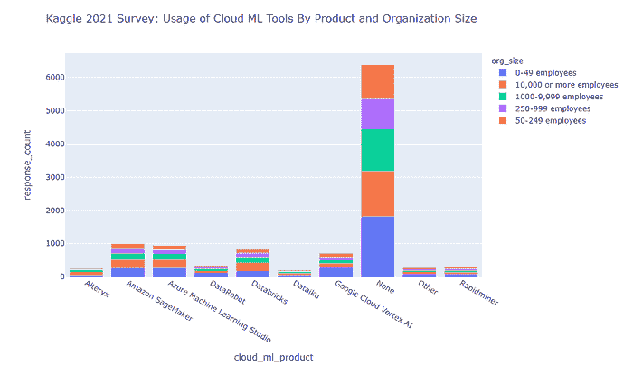

很明显

+   到 2021 年，各行业中许多组织不使用云机器学习产品。

+   计算机/技术行业的公司最常使用云机器学习，学术/教育行业排在第二位，会计/金融行业排在第三位。

+   对于每种正在审查的云机器学习产品，大多数用户都来自计算机/技术行业。

+   对于 Azure Machine Learning Studio 和 Google Cloud Vertex AI，第二受欢迎的行业是学术/教育。

+   对于 Amazon SageMaker 和 Databricks，第二受欢迎的行业是会计/金融。

关于 2021 年按行业划分的云机器学习用户，其情况如下

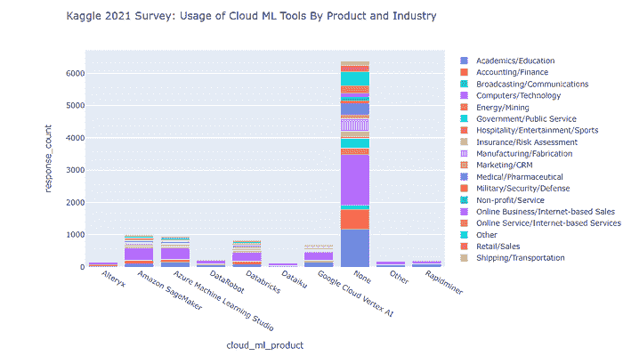

我们发现

+   到 2021 年，各行业中许多组织不使用云机器学习产品。

+   Google Cloud Vertex AI 和 DataRobot 在最小规模（0–49 名员工）的组织中最受欢迎。

+   Azure Machine Learning Studio 和 Amazon SageMaker 在最小（0–49 名员工）和最大（10k+名员工）规模的组织中同样受欢迎。

+   Databricks 在大型组织（分别为 10k+和 1000–9999 名员工）中更受欢迎。

## 云机器学习和组织内机器学习支出

2021 年的情况如下图所示

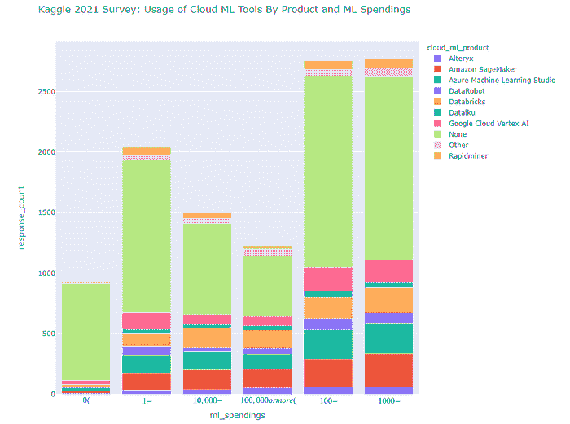

正如我们所见，2021 年的行业趋势如下

+   机器学习支出最多的公司更倾向于使用 Amazon SageMaker 和 Databricks

+   Azure ML Studio 在这种排名中位列第三

+   Google Cloud Vertex AI 在机器学习支出较多的组织中远远落后于上述三位领导者

+   Google Cloud Vertex AI 在中小型机器学习支出的公司中的表现更佳（这可能是将这些公司转化为 2022 年付费客户的机会）

+   其他云机器学习产品远远落后

如果我们回顾 2020 年，可以看到下面的图景

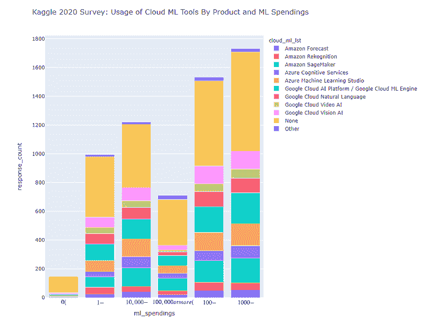

显然

+   截至 2020 年，Amazon SageMaker 在每一个机器学习支出类别中显然都处于领先地位（2021 年也是如此）。

+   截至 2020 年，Azure ML Studio 和当时的一个 Google Cloud ML 产品（Google Cloud AI Platform/Google Cloud ML Engine）几乎平分秋色，位居第二，仅次于 Amazon SageMaker。

## 云机器学习地理分布（2021）

让我们看看参与 Kaggle 2021 调查的领先云机器学习产品用户的地理分布。

首先，需要指出的是印度和美国是拥有最多机器学习工程师的国家。

话虽如此，让我们看看每个领先的云机器学习产品的地理洞察。

## Amazon SageMaker

正如我们所见，Amazon SageMaker 用户的地理分布表明

+   印度排名第一（看起来 Azure SageMaker 在这个国家也是最受欢迎的云机器学习产品）

+   美国排名第二

+   其他国家远远落后于印度和美国

+   日本在 Amazon SageMaker 用户基础中排名第三（在 Kaggle 2021 调查的受访者中）

+   我们可以看到该产品在巴西、英国、欧盟国家和尼日利亚的适度受欢迎程度

## Azure Machine Learning Studio

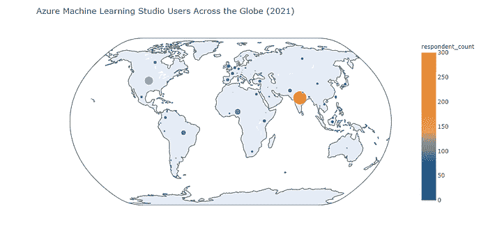

正如我们所见，Azure Machine Learning Studio 用户的地理分布表明

+   印度是产品用户的主要地区（其在印度的受欢迎程度仅略低于 Amazon SageMaker 的受欢迎程度）

+   美国排名第二（不过，Azure Machine Learning Studio 在受欢迎程度上远低于 Amazon SageMaker）

+   其他国家远远落后于印度和美国

+   尼日利亚在 Amazon SageMaker 用户基础中排名第三（在 Kaggle 2021 调查的受访者中）

+   我们可以看到该产品在巴西、英国、欧盟国家、巴基斯坦和肯尼亚的适度受欢迎程度

## Google Cloud Vertex AI

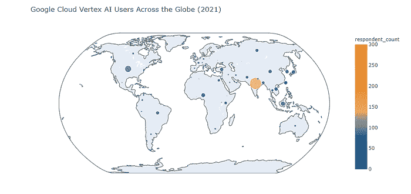

正如我们所见，Google Cloud Vertex AI 用户的地理分布表明

+   印度是产品用户的主要地区（尽管其在印度的受欢迎程度远低于 Amazon SageMaker 和 Azure Machine Learning Studio 的受欢迎程度）

+   美国排名第二（不过，与印度一样，它在美国的受欢迎程度远低于 Amazon SageMaker 和 Azure Machine Learning Studio 的受欢迎程度）。

+   其他国家远远落后于印度和美国。

+   令人惊讶的是，印度尼西亚在 Google Cloud Vertex AI 的热门地点排名中位列第三。

+   全球有一系列国家在产品使用调查受访者数量上接近印度尼西亚（尼日利亚、台湾、中国、日本、韩国、土耳其）——这些地区可能是 Google Cloud Vertex AI 销售和收入增长的潜在机会。

+   加拿大、英国和欧盟国家对 Google Cloud Vertex AI 的兴趣非常低（这可以通过某些国家和行业政策来解释，这些政策在欧盟和英国偏向 MS Azure 和 Amazon AWS）。

## Databricks

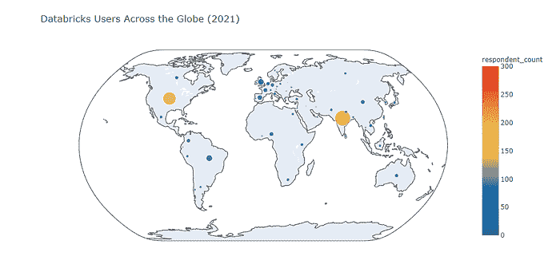

正如我们所见，Databricks 用户的地理分布表明

+   印度是 2021 年调查受访者中 Databricks 用户最多的国家（Databricks 在印度的表现优于 Google Cloud Vertex AI，而在 Amazon SageMaker 和 Azure Machine Learning AI 方面则逊色）。

+   美国在全球产品用户数量方面排名第二（Databricks 实际上在美国排名第二，仅次于 Amazon SageMaker，超越了 Azure Machine Learning 和 Google Cloud Vertex AI）。

+   其他国家远远落后于印度和美国。

+   巴西在全球“Databricks 排名”中位列第三（不过，英国和欧盟国家与其差距不大）。

## 2022 年的前景是什么？

上述趋势将无疑塑造 2022 年行业的未来。从我在数据驱动的钻研中收集的洞察来看，我可以预测

+   作为 2020-2021 年的行业领导者，Amazon SageMaker 将在 2022 年继续保持全球领先地位。

+   Databricks 作为云 ML 产品在 2022 年的进一步扩展可能会受到持续讨论的影响，即在 Spark 上进行 ML 是否是一个好主意（虽然 Spark ML 库在 BigData 规模数据集上非常强大，但 Spark 和 Databricks 的某些 API 缺陷仍然存在一些批评空间）。

+   尽管有提到的 Spark ML 争论，Databricks 很可能进一步提升其在美国和中国的领先地位，并在 2022 年在英国和欧盟国家也有良好的增长潜力。

+   Azure ML Studio 的产品在“Databricks 攻势”下相当受保护，因为 Azure Cloud 平台曾经将 Databricks 视为仅仅是 BigData 工程工具（Azure Databricks 服务已经在这一角色运行了几年）。

+   Google Cloud Vertex AI 可能会探索在 2022 年北美和欧盟以外的多个地点增长的机会，瞄准那里的中型和快速增长的公司。

+   在 2022 年，Google Cloud ML 生态系统的变革者可能是 BigQuery ML 的广泛推广；由于它可以成为 Databricks 的大数据规模机器学习解决方案的真正替代品，它可能会在即将到来的一年中改变云计算机器学习工具的格局。

## 方法论与参考文献

本文基于 Kaggle 的《2020 年数据科学与机器学习现状》（[`www.kaggle.com/c/kaggle-survey-2020`](https://www.kaggle.com/c/kaggle-survey-2020)）和《2021 年数据科学与机器学习现状》（[`www.kaggle.com/c/kaggle-survey-2021`](https://www.kaggle.com/c/kaggle-survey-2021)）调查数据中的见解。

Kaggle ([www.kaggle.com](https://www.kaggle.com/)) 是一个全球性的社区，由来自世界各地、具有不同技能和背景的数据科学家和机器学习者组成。这个社区拥有超过 300 万的活跃成员。尽管从社会学的角度来看，它并不能严格代表全球数据科学和机器学习专业人士的整体人口，但它仍然占据了该领域的一个重要比例。因此，这项调查的结果可以真正预测数据科学和 AI/ML 行业在未来几年可能的发展方向。

我的 Kaggle 2020 调查和 Kaggle 2021 调查的全面 EDA 风格笔记本如下所示：

+   [`www.kaggle.com/gvyshnya/kaggle-2020-survey-associated-insights`](https://www.kaggle.com/gvyshnya/kaggle-2020-survey-associated-insights)

+   [`www.kaggle.com/gvyshnya/kaggle-2021-ml-and-ds-survey-comprehensive-eda`](https://www.kaggle.com/gvyshnya/kaggle-2021-ml-and-ds-survey-comprehensive-eda)

收集本文描述的见解的数据驱动工具的源代码可以在 GitHub 的[`github.com/gvyshnya/kaggle-2021-survey`](https://github.com/gvyshnya/kaggle-2021-survey)仓库中找到。

我的文章《云计算、数据科学与机器学习趋势 2020–2022：巨头之战》已于 2021 年 1 月由 KDNuggets 发布，详见 /2021/01/cloud-computing-data-science-ml-trends-2020-2022-battle-giants.html。

你还可以在《2021 年 AI 现状报告》中找到许多有趣的见解（[`www.stateof.ai/`](https://www.stateof.ai/)）。

## 附录：Databricks 的历史

自 2015 年推出基于 Apache Spark 的数据平台以来，Databricks 已发展成为一个一站式的数据（非）结构化存储、自动化 ETL、协作数据科学笔记本、使用 SQL 的商业智能和基于开源 MLflow 的全栈机器学习的平台。有趣的是，所有三大主要云供应商——亚马逊、谷歌和微软——都在 2021 年 2 月投资了 Databricks。

Databricks 的总部位于旧金山。它在加拿大、英国、荷兰、新加坡、澳大利亚、德国、法国、日本、中国和印度也有业务。

由于该公司截至 2021 年 2 月已获得三大云计算巨头（亚马逊、微软和谷歌）的投资，并且截至 2021 年 8 月的估值超过竞争对手，成为行业中的强劲竞争者。从这个角度来看，Databricks 的产品/服务具有潜在的

- 部分蚕食其他大数据、云机器学习和 AutoML 产品，来自三大云计算提供商（AWS、微软 Azure、谷歌云平台）

- 在云机器学习和企业 AutoML 领域（如 H20.ai、DataRobot 等）与竞争产品形成强劲竞争

下图展示了公司的企业历史关键点

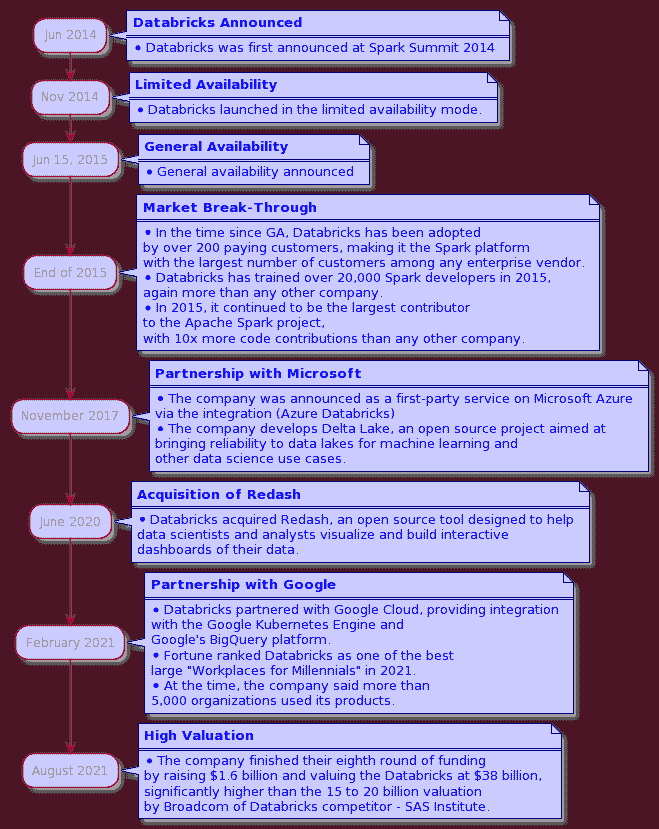

**个人简介：[George Vyshnya](https://www.linkedin.com/in/gvyshnya/)** 是 SBC 的联合创始人/首席技术官，帮助首席执行官和首席技术官通过实施智能 AI、BI 和 Web 解决方案来增长收入。

[原文](https://medium.com/sbc-group-blog/cloud-ml-in-perspective-surprises-of-2021-projections-for-2022-d0b3b821fa77)。经许可转载。

**相关内容：**

+   2020-2022 年云计算、数据科学和机器学习趋势：巨头之战

+   人工智能、分析、机器学习、数据科学、深度学习研究在 2021 年的主要发展及 2022 年的关键趋势

+   2021 年主要发展及 2022 年人工智能、数据科学、机器学习技术的关键趋势

* * *

## 我们的前三名课程推荐

 1\. [Google 网络安全证书](https://www.kdnuggets.com/google-cybersecurity) - 快速进入网络安全职业生涯。

 2\. [Google 数据分析专业证书](https://www.kdnuggets.com/google-data-analytics) - 提升你的数据分析技能

 3\. [Google IT 支持专业证书](https://www.kdnuggets.com/google-itsupport) - 支持你组织的 IT 需求

* * *

### 更多相关信息

+   [人工智能、分析、机器学习、数据科学、深度学习…](https://www.kdnuggets.com/2021/12/developments-predictions-ai-machine-learning-data-science-research.html)

+   [数据科学与分析行业在 2021 年的主要发展及关键…](https://www.kdnuggets.com/2021/12/developments-predictions-data-science-analytics-industry.html)

+   [2021 年主要发展及 2022 年人工智能、数据科学…](https://www.kdnuggets.com/2021/12/trends-ai-data-science-ml-technology.html)

+   [R 与 Python（再谈）：人因因素视角](https://www.kdnuggets.com/2022/01/r-python-human-factor-perspective.html)

+   [2022 年 5 大免费云笔记本](https://www.kdnuggets.com/2022/04/top-5-free-cloud-notebooks-2022.html)

+   [云和数据迁移到 AWS 云的 11 个最佳实践](https://www.kdnuggets.com/2023/04/11-best-practices-cloud-data-migration-aws-cloud.html)
