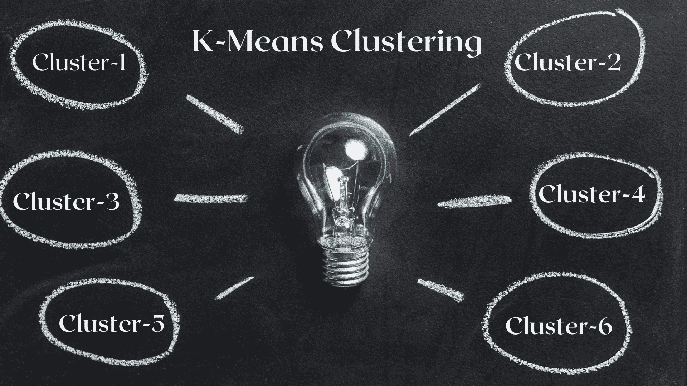
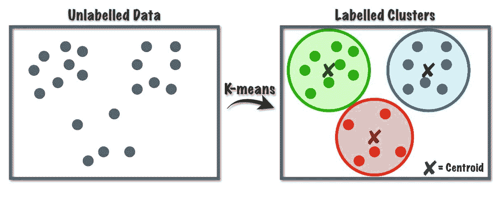
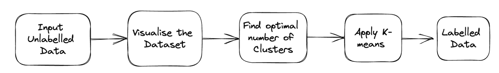
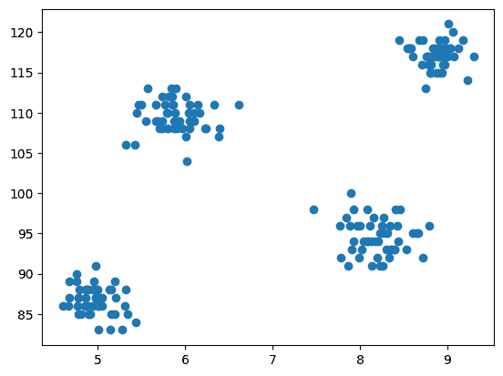
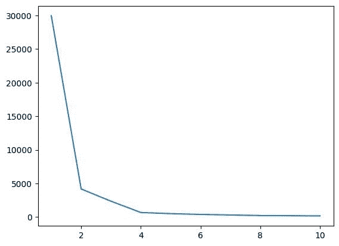
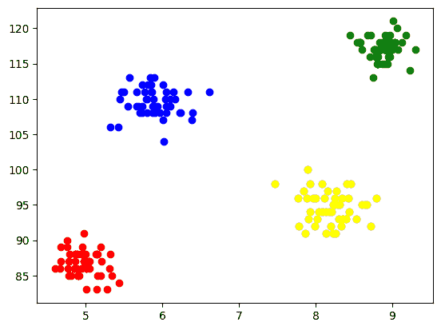
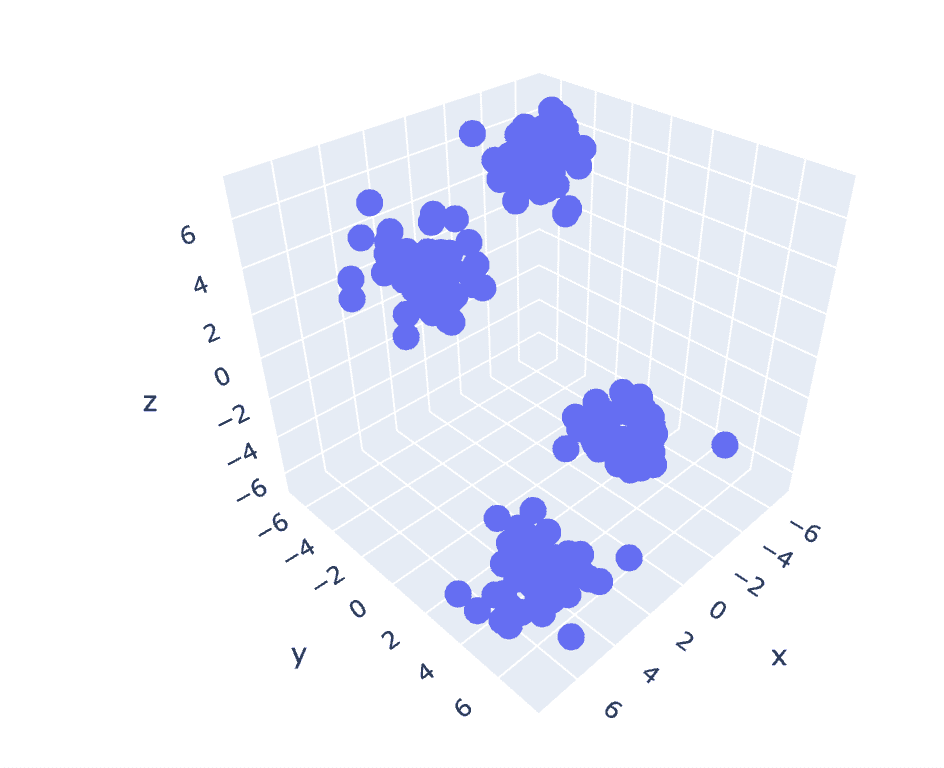
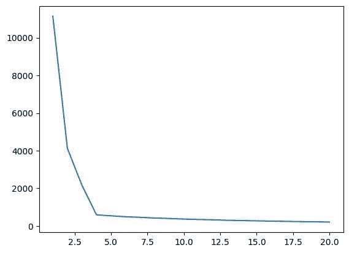
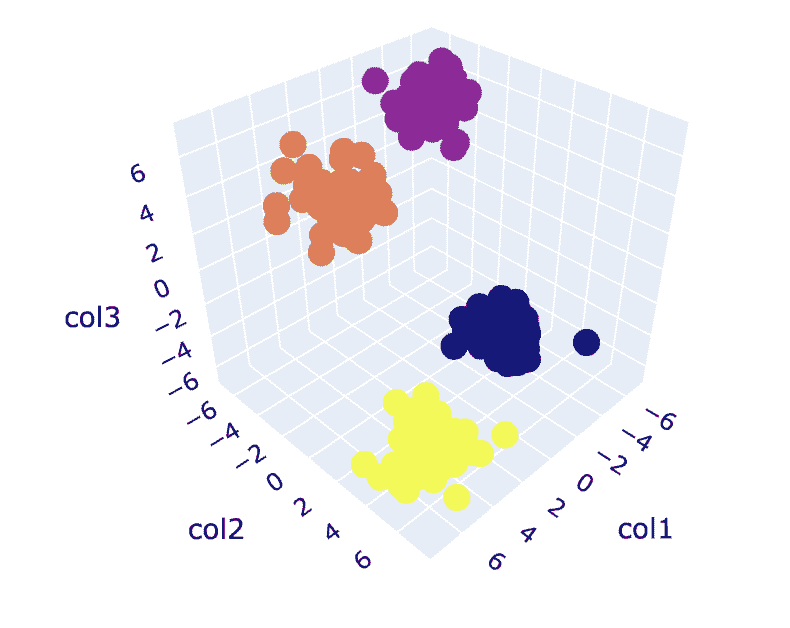

# 聚类释放：理解 K-Means 聚类

> 原文：[`www.kdnuggets.com/2023/07/clustering-unleashed-understanding-kmeans-clustering.html`](https://www.kdnuggets.com/2023/07/clustering-unleashed-understanding-kmeans-clustering.html)



图片来源：作者

在分析数据时，我们的目标是发现隐藏的模式并提取有意义的洞察。让我们进入基于 ML 的新类别，即无监督学习，其中一个强大的算法用于解决聚类任务的是 K-Means 聚类算法，它彻底改变了数据理解的方式。

* * *

## 我们的前三大课程推荐

 1\. [谷歌网络安全证书](https://www.kdnuggets.com/google-cybersecurity) - 快速进入网络安全职业生涯。

 2\. [谷歌数据分析专业证书](https://www.kdnuggets.com/google-data-analytics) - 提升你的数据分析技能

 3\. [谷歌 IT 支持专业证书](https://www.kdnuggets.com/google-itsupport) - 支持你的组织 IT 工作

* * *

K-Means 已成为机器学习和数据挖掘应用中的一种有用算法。在这篇文章中，我们将深入探讨 K-Means 的工作原理、使用 Python 实现，以及探索其原则、应用等。所以，让我们开始这段旅程，揭示隐藏的模式并利用 K-Means 聚类算法的潜力。

# 什么是 K-Means 算法？

K-Means 算法用于解决属于无监督学习类别的聚类问题。借助这个算法，我们可以将观察数据分组到 K 个簇中。



图 1 K-Means 算法工作原理 | 图片来自 [Towards Data Science](https://towardsdatascience.com/k-means-a-complete-introduction-1702af9cd8c)

这个算法内部使用向量量化，通过这种方式，我们可以将数据集中的每个观察值分配到距离最小的簇中，这是聚类算法的原型。这个聚类算法在数据挖掘和机器学习中常用于根据相似性度量将数据分区成 K 个簇。因此，在这个算法中，我们需要最小化观察值与其对应质心之间的平方和距离，这最终会产生明显且同质的簇。

## K-Means 聚类的应用

以下是这个算法的一些标准应用。K-Means 算法在工业应用中常用于解决与聚类相关的问题。

1.  **客户细分：** K-means 聚类可以根据客户的兴趣对不同客户进行细分。它可以应用于银行、电信、电子商务、体育、广告、销售等。

1.  **文档聚类：** 在这种技术中，我们将把一组文档中相似的文档归为一类，从而在相同的簇中得到相似的文档。

1.  **推荐引擎：** 有时，K-means 聚类可用于创建推荐系统。例如，你想向朋友推荐歌曲。你可以查看那个人喜欢的歌曲，然后使用聚类来找到类似的歌曲，并推荐最相似的那些。

还有许多更多应用，我相信你已经想到了一些，可能会在本文下方的评论区分享。

# 使用 Python 实现 K-Means 聚类

在本节中，我们将开始在一个数据集上使用 Python 实现 K-Means 算法，这在数据科学项目中主要使用。

## 1. 导入必要的库和依赖项

首先，让我们导入实现 K-means 算法所需的 Python 库，包括 NumPy、Pandas、Seaborn、Marplotlib 等。

```py
import numpy as np
import pandas as pd
import matplotlib.pyplot as plt
import seaborn as sb
```

## 2. 加载和分析数据集

在此步骤中，我们将通过将数据存储在 Pandas 数据框中来加载学生数据集。要下载数据集，请参考[这里](https://drive.google.com/file/d/1n8kPXP0IR_C3XB6UAw7qUU_F1rzW7DVu/view?usp=sharing)的链接。

问题的完整管道如下所示：



图 2 项目管道 | 图片来源：作者

```py
df = pd.read_csv('student_clustering.csv')
print("The shape of data is",df.shape)
df.head()
```

## 3. 数据集的散点图

现在进入建模步骤，我们需要可视化数据，因此我们使用 matplotlib 绘制散点图，以检查聚类算法如何工作并创建不同的簇。

```py
# Scatter plot of the dataset
import matplotlib.pyplot as plt
plt.scatter(df['cgpa'],df['iq'])
```

**输出：**



图 3 散点图 | 图片来源：作者

## 4. 从 Scikit-learn 的 Cluster 类中导入 K-Means

现在，由于我们需要实现 K-Means 聚类，我们首先导入 cluster 类，然后我们将 KMeans 作为该类的模块。

```py
from sklearn.cluster import KMeans
```

## 5. 使用肘部法找到 K 的最优值

在此步骤中，我们将找到 K 的最优值，这是实现算法时的一个超参数。K 值表示我们必须为数据集创建多少个簇。直观地找到这个值是不可能的，因此，为了找到最优值，我们将创建 WCSS（簇内平方和）和不同 K 值之间的图，并选择给我们最小 WCSS 值的 K。

```py
# create an empty list for store residuals
wcss = [] 

for i in range(1,11): 
    # create an object of K-Means class
    km = KMeans(n_clusters=i) 
    # pass the dataframe to fit the algorithm 
    km.fit_predict(df) 
    # append inertia value to wcss list
    wcss.append(km.inertia_) 
```

现在，让我们绘制肘部图以找到 K 的最优值。

```py
# Plot of WCSS vs. K to check the optimal value of K
plt.plot(range(1,11),wcss)
```

**输出：**



图 4 肘部图 | 图片来源：作者

从上述肘部图中，我们可以看到在 K=4 时，WCSS 的值有一个下降，这意味着如果我们将最佳值设置为 4，那么聚类将提供良好的性能。

## 6\. 使用最佳 K 值拟合 K-Means 算法

我们已经完成了 K 的最佳值的寻找。现在，让我们进行建模，我们将创建一个 X 数组，存储所有特征的完整数据集。在这里无需分离目标和特征向量，因为这是一个无监督问题。之后，我们将创建一个 KMeans 类的对象，并用选定的 K 值对数据集进行拟合。最后，我们打印 y_means，它表示不同聚类的均值。

```py
X = df.iloc[:,:].values # complete data is used for model building
km = KMeans(n_clusters=4)
y_means = km.fit_predict(X)
y_means
```

## 7\. 检查每个类别的聚类分配

让我们检查数据集中哪些点属于哪个聚类。

```py
X[y_means == 3,1]
```

到目前为止，我们为中心初始化使用了 K-Means++ 策略，现在，让我们改为使用随机中心初始化，而不是 K-Means++，并通过相同的过程比较结果。

```py
km_new = KMeans(n_clusters=4, init='random')
y_means_new = km_new.fit_predict(X)
y_means_new
```

检查有多少值匹配。

```py
sum(y_means == y_means_new)
```

## 8\. 聚类的可视化

为了可视化每个聚类，我们在坐标轴上绘制它们，并通过不同的颜色来区分，这样我们可以很容易地看到形成的 4 个聚类。

```py
plt.scatter(X[y_means == 0,0],X[y_means == 0,1],color='blue')
plt.scatter(X[y_means == 1,0],X[y_means == 1,1],color='red')  
plt.scatter(X[y_means == 2,0],X[y_means == 2,1],color='green') 
plt.scatter(X[y_means == 3,0],X[y_means == 3,1],color='yellow')
```

**输出：**



图 5 聚类形成的可视化 | 作者提供的图像

## 9\. K-Means 在三维数据上的应用

由于之前的数据集有 2 列，我们面临的是二维问题。现在，我们将使用相同的一组步骤处理三维问题，并尝试分析代码在 n 维数据上的可重复性。

```py
# Create a synthetic dataset from sklearn
from sklearn.datasets import make_blobs # make synthetic dataset
centroids = [(-5,-5,5),(5,5,-5),(3.5,-2.5,4),(-2.5,2.5,-4)]
cluster_std = [1,1,1,1]
X,y = make_blobs(n_samples=200,cluster_std=cluster_std,centers=centroids,n_features=3,random_state=1)
```

```py
# Scatter plot of the dataset
import plotly.express as px
fig = px.scatter_3d(x=X[:,0], y=X[:,1], z=X[:,2])
fig.show()
```

**输出：**



图 6 三维数据集的散点图 | 作者提供的图像

```py
wcss = []
for i in range(1,21):
    km = KMeans(n_clusters=i)
    km.fit_predict(X)
    wcss.append(km.inertia_)

plt.plot(range(1,21),wcss)
```

**输出：**



图 7 肘部图 | 作者提供的图像

```py
# Fit the K-Means algorithm with the optimal value of K
km = KMeans(n_clusters=4)
y_pred = km.fit_predict(X)
```

```py
# Analyse the different clusters formed
df = pd.DataFrame()
df['col1'] = X[:,0]
df['col2'] = X[:,1]
df['col3'] = X[:,2]
df['label'] = y_pred

fig = px.scatter_3d(df,x='col1', y='col2', z='col3',color='label')
fig.show()
```

**输出：**



图 8\. 聚类可视化 | 作者提供的图像

您可以在这里找到完整的代码 -  [Colab Notebook](https://colab.research.google.com/drive/1PyICZm_WyBGkbloEEyHBRCrfz-fG2e_5?usp=sharing)

# 总结

这完成了我们的讨论。我们讨论了 K-Means 的工作原理、实现和应用。总之，实施聚类任务是一种广泛使用的无监督学习算法，提供了一种简单而直观的方法来对数据集的观察值进行分组。该算法的主要优点在于，利用所选的相似性度量将观察值分成多个集合，同时借助实施该算法的用户。

然而，根据第一步质心的选择，我们的算法表现不同，可能收敛到局部或全局最优解。因此，选择要实施的聚类数、数据预处理、处理异常值等，对于获得良好的结果至关重要。但是，如果我们深入了解这个算法的局限性之外，K-Means 是一种有助于探索性数据分析和各种领域模式识别的有用技术。

**[Aryan Garg](https://www.linkedin.com/in/aryan-garg-1bbb791a3/)** 是一名电气工程学士学位学生，目前在本科最后一年。他对网页开发和机器学习领域感兴趣，并且追求了这一兴趣，渴望在这些方向上进一步工作。

### 更多关于这个话题

+   [K-means 聚类的质心初始化方法](https://www.kdnuggets.com/2020/06/centroid-initialization-k-means-clustering.html)

+   [什么是 K-Means 聚类及其算法如何工作？](https://www.kdnuggets.com/2023/05/kmeans-clustering-algorithm-work.html)

+   [动手实践无监督学习：K-Means 聚类](https://www.kdnuggets.com/handson-with-unsupervised-learning-kmeans-clustering)

+   [使用 PyCaret 在 Python 中进行聚类介绍](https://www.kdnuggets.com/2021/12/introduction-clustering-python-pycaret.html)

+   [选择适合你数据集的聚类算法](https://www.kdnuggets.com/2019/10/right-clustering-algorithm.html)

+   [机器学习中的 DBSCAN 聚类算法](https://www.kdnuggets.com/2020/04/dbscan-clustering-algorithm-machine-learning.html)
