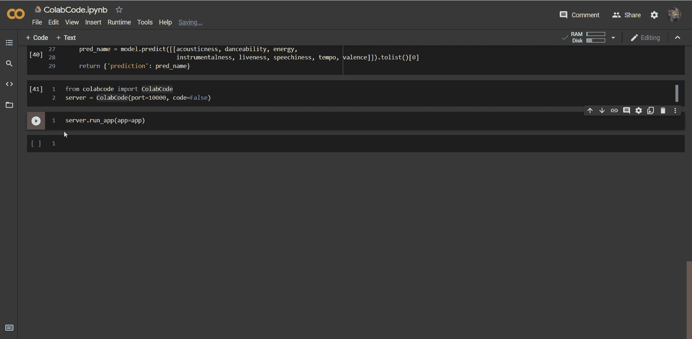
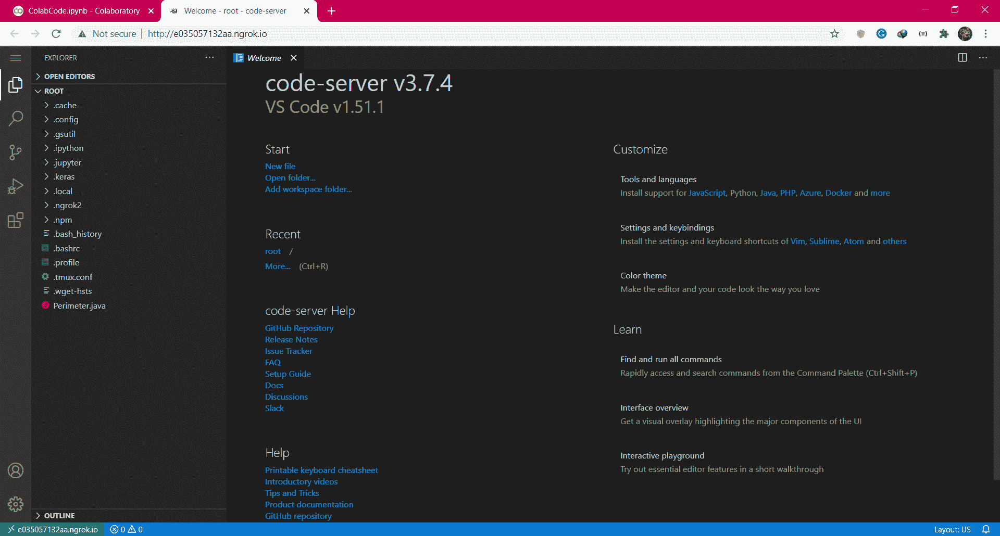
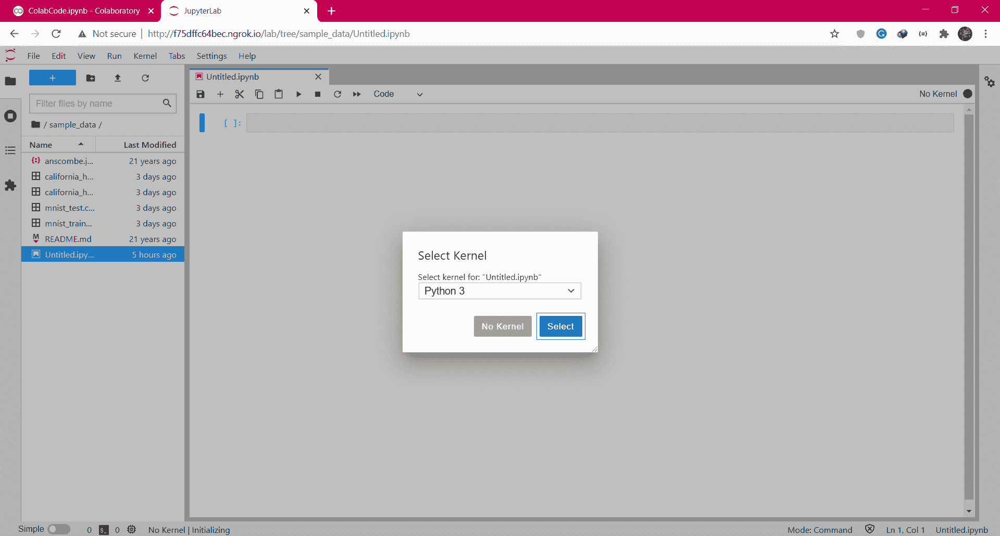

# ColabCode：从 Google Colab 部署机器学习模型

> 原文：[`www.kdnuggets.com/2021/07/colabcode-deploying-machine-learning-models-google-colab.html`](https://www.kdnuggets.com/2021/07/colabcode-deploying-machine-learning-models-google-colab.html)

评论

**作者 [Kaustubh Gupta](https://www.linkedin.com/in/kaustubh-gupta/)，Python 开发者**


照片由 [Niclas Illg](https://unsplash.com/@nicklbaert?utm_source=medium&utm_medium=referral) 提供，来源于 [Unsplash](https://unsplash.com/?utm_source=medium&utm_medium=referral)

* * *

## 我们的前三个课程推荐

 1\. [Google 网络安全证书](https://www.kdnuggets.com/google-cybersecurity) - 快速进入网络安全职业生涯。

 2\. [Google 数据分析专业证书](https://www.kdnuggets.com/google-data-analytics) - 提升你的数据分析能力

 3\. [Google IT 支持专业证书](https://www.kdnuggets.com/google-itsupport) - 支持你的组织的 IT

* * *

Google colab 是最方便的在线 Python 和数据科学爱好者的 IDE。它于 2017 年对公众发布，最初是 Google 研究团队用来协作进行不同 AI 项目的内部项目。自那时起，它因其易于使用的界面、类似 Jupyter notebooks 的特性以及对 GPU 的支持而获得了极大的关注。

大多数流行的机器学习库，如 numpy、pandas、seaborn、matplotlib、sklearn、TensorFlow，都在这个云环境中预装，因此你不需要任何显式的先决条件。你也可以安装任何你选择的 Python 包来运行你的代码。在这篇文章中，我将向你解释如何使用 FastAPI 和 ngrok 将你的机器学习模型作为 API 部署。

### 什么是 FastAPI？

这是一个高性能的 Python Web 框架，用于构建 API。传统上，大多数开发者选择 flask 作为构建 API 的首选，但由于一些限制，如数据验证、认证、异步等，FastAPI 获得了很高的普及度。FastAPI 提供了自动文档生成、认证、通过 pydantic 模型进行数据验证等功能。要详细了解这两个框架之间的重大差异，可以查看我在 Analytics Vidya 上的文章：

[**FastAPI：Flask 的合适替代品？**](https://www.analyticsvidhya.com/blog/2020/11/fastapi-the-right-replacement-for-flask/)

本文作为数据科学博客马拉松的一部分发表。介绍 在完成模型构建后……

FastAPI 帮助设置生产就绪的服务器，但如果你想在将其部署到实际的云平台（如 Heroku）之前与团队分享，这时 ngrok 就会派上用场，通过隧道化你的本地主机并将其公开到互联网。现在，任何人都可以通过提供的链接访问你的 API 端点，但如果所有这些都可以在 Google Colab 上完成呢？解决方案就是 ColabCode！

### 什么是 ColabCode？

它是一个 Python 包，可以让你直接从 Colab 笔记本启动代码服务器，而无需在系统上进行任何本地设置。它可以用来启动 VS Code 环境、Jupyter Lab 服务器，或将 FastAPI 服务器隧道到网络中，所有这些都在 Colab 笔记本中完成。这对那些在云中训练模型并希望以 API 形式与世界分享发现的热衷编码者来说是一个极大的优势。我们将讨论 ColabCode 的所有功能，直到本文的最后。

### 为 ColabCode 准备 FastAPI 代码

我将用于本文的任务声明是一个决策树分类器，用于对两种音乐类型进行分类：Hip-Hop 或 Rock。我已经完成了数据集的清理，它可以在我的 [GitHub 仓库](https://github.com/kaustubhgupta/Technocolab-Final-Project) 中找到。现在，我已经将数据集导入到笔记本中，并训练了一个决策树模型，没有进行任何预处理或 EDA，因为本文更多的是关于部署。因此，这个模型可能会返回一些错误的结果！

模型创建代码

1\. 现在，如果你熟悉 FastAPI 架构，我们将需要一个数据类来处理输入。这个数据类允许 FastAPI 验证发送到模型的输入，如果输入错误，它会简单地抛出错误而不将其传递给模型。

2\. 创建数据类非常简单，只需要接受参数和数据类型。为了进一步自定义，你还可以添加一个自定义示例以快速测试结果。这个类的代码是：

数据类代码

3\. 现在，我们需要创建一个端点，所有请求都将在此端点提供服务。FastAPI 中的端点创建与 Flask 非常相似，只需端点函数接收数据类进行验证。

FastAPI 代码

如果你希望探索一些有趣的项目，可以查看我的 GitHub 个人资料：

[**kaustubhgupta - 概述**](https://github.com/kaustubhgupta)

???? 我目前正在探索 Python 及其所有功能。 ???? 我目前正在学习如何工作…

### ColabCode

我们的 FastAPI 已经准备好，现在唯一需要做的就是通过 Colab 环境运行它。首先，导入这个包并初始化服务器：

```py
from colabcode import ColabCodeserver = ColabCode(port=10000, code=False)
```

端口号可以自选，代码参数应设置为 false。现在，服务器已准备好接收 FastAPI 对象，通过 ngrok 的帮助，本地主机被隧道化并通过唯一的 URL 公开到公众。

```py
server.run_app(app=app)
```

就这样！你将获得一个 ngrok URL，可以与社区、团队或任何人分享。该链接将在你终止单元格进程后立即过期，如果你不终止，Google Colab 会在一段时间后终止它。下面展示了这个过程的示例 GIF：



作者提供的 GIF

在这里，点击链接后，我导航到了 FastAPI 自动生成的 /docs 端点，在这里我们可以测试结果。如果你想运行并尝试这个东西，整个笔记本代码都在这里。只需打开这个笔记本并运行所有单元格。

作者提供的代码

### 其他功能

ColabCode 不仅限于在 Colab 上运行 FastAPI 代码，它还可以提供 VS Code 服务器和 Jupyter Lab 服务器！它可以帮助用户在基于云的服务中获得熟悉的环境。即使资源非常有限的用户也能从这些服务中受益。这与新推出的 GitHub Codespaces 非常相似，后者在网页上提供 VS Code 环境。要通过 ColabCodes 运行 VS Code 服务器，请执行以下操作：

```py
from colabcode import ColabCode
ColabCode()
```

你将看到一个 ngrok URL 提示，加载完成后，你将会看到类似于以下的 VS Code 运行在你的网页浏览器中：



作者提供的图片

同样，如果你想打开 Jupyter Lab 服务器，将 lab 参数设置为 true，将 code 参数设置为 false。

```py
from colabcode import ColabCode
ColabCode(code=False, lab=True)
```

你将获得一个 URL 和一个用于服务器身份验证的令牌。输入令牌并点击登录，将会看到类似于以下的屏幕：



作者提供的图片

### 结论

在这篇文章中，我解释了 ColabCode 的功能，并简要介绍了 FastAPI。目前，Abhishek Thakur（该包的创建者）发布了 v0.2.0。如果你希望贡献，可以查看这个包的[GitHub 仓库](https://github.com/abhishekkrthakur/colabcode)。

说到这里，这篇文章就结束了，希望你能有所收获，我会通过其他文章再次出现在你的信息流中！

**[我的 LinkedIn](https://www.linkedin.com/in/kaustubh-gupta/)**

**我其他受欢迎的文章：**

[**在不到 10 行代码中构建仪表板！**](https://towardsdatascience.com/build-dashboards-in-less-than-10-lines-of-code-835e9abeae4b)

探索 ExplainerDashBoard，开发互动仪表板的最简单方法

[**重建我的 7 个 Python 项目**](https://towardsdatascience.com/rebuilding-my-7-python-projects-8c629079c8e6)

这是我如何重建我的 Python 项目：数据科学、网络开发与 Android 应用

[**在网站上运行 Python 代码：探索 Brython**](https://towardsdatascience.com/run-python-code-on-websites-exploring-brython-83c43fb7ac5f)

JavaScript 等效的 Python 脚本

[**自动生成投资组合的 GitHub Action**](https://towardsdatascience.com/github-action-that-automates-portfolio-generation-bc15835862dc)

使用 Python 和基础前端的 Docker 化 GitHub Action。

**简介： [Kaustubh Gupta](https://www.linkedin.com/in/kaustubh-gupta/)** 是一位对数据科学和机器学习感兴趣的 Python 开发人员，曾参与多个数据相关项目，关注机器学习的实际应用。

[原始](https://towardsdatascience.com/colabcode-deploying-machine-learning-models-from-google-colab-54e0d37a7b09)。经许可转载。

**相关：**

+   如何通过 API 创建和部署简单的情感分析应用

+   多语言 CLIP 与 Huggingface + PyTorch Lightning

+   何时重新训练机器学习模型？运行这 5 个检查以决定时间表

### 更多相关话题

+   [部署机器学习模型：逐步教程](https://www.kdnuggets.com/deploying-machine-learning-models-a-step-by-step-tutorial)

+   [从 Google Colab 到 Ploomber 管道：使用 GPU 的大规模机器学习](https://www.kdnuggets.com/2022/03/google-colab-ploomber-pipeline-ml-scale-gpus.html)

+   [在 Google Colab 上免费用 QLora 微调 LLAMAv2](https://www.kdnuggets.com/fine-tuning-llamav2-with-qlora-on-google-colab-for-free)

+   [在 Google Colab 上免费运行 Mixtral 8x7b](https://www.kdnuggets.com/running-mixtral-8x7b-on-google-colab-for-free)

+   [在 Google Colab 上运行 Redis](https://www.kdnuggets.com/2022/01/running-redis-google-colab.html)

+   [RAPIDS cuDF：在 Google Colab 上加速数据科学](https://www.kdnuggets.com/2023/01/rapids-cudf-accelerated-data-science-google-colab.html)
