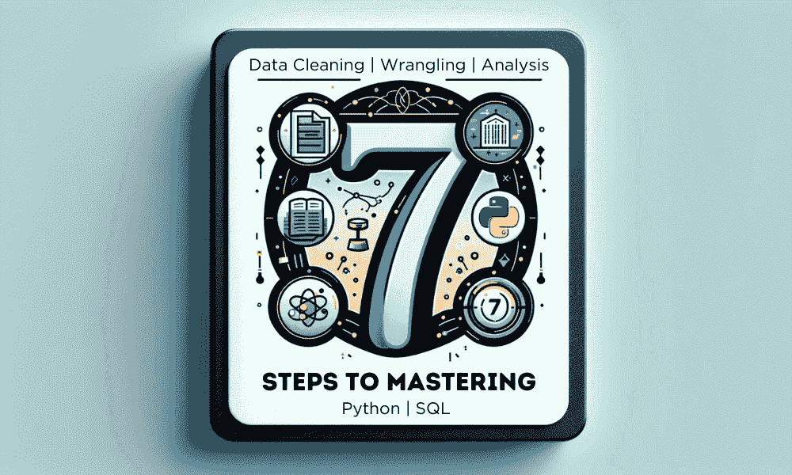
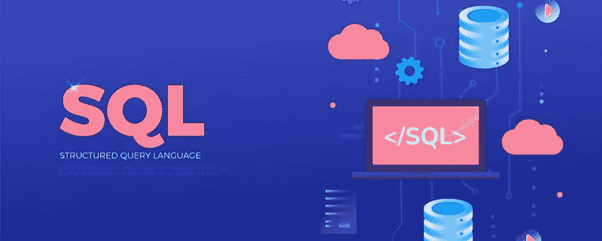
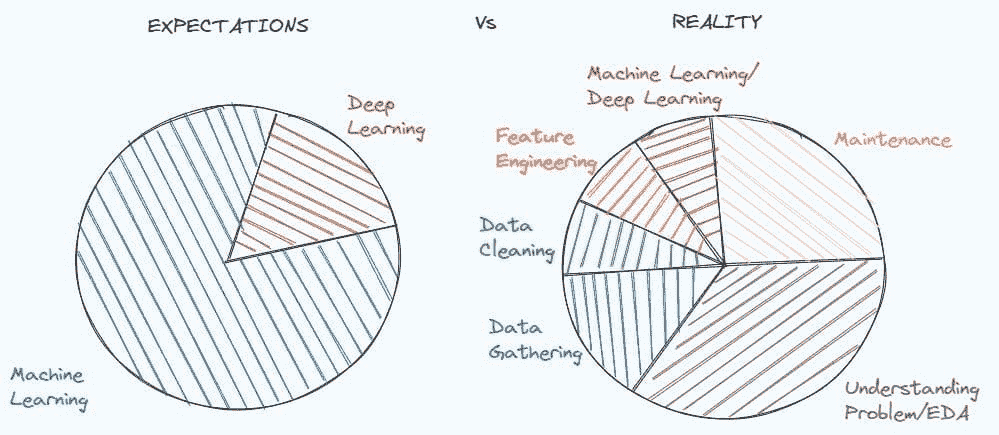
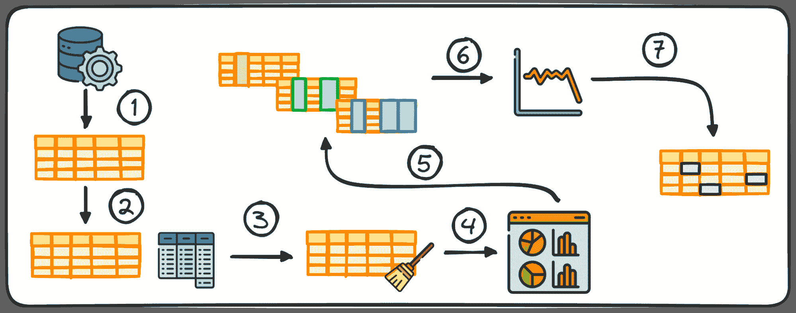

# 掌握 SQL、Python、数据清理、数据处理和探索性数据分析的指南合集

> 原文：[`www.kdnuggets.com/collection-of-guides-on-mastering-sql-python-data-cleaning-data-wrangling-and-exploratory-data-analysis`](https://www.kdnuggets.com/collection-of-guides-on-mastering-sql-python-data-cleaning-data-wrangling-and-exploratory-data-analysis)

作者提供的图片

数据在推动信息决策和实现人工智能应用中起着至关重要的作用。因此，各行各业对技能娴熟的数据专业人士的需求不断增长。如果你是数据科学的新手，这个全面的指南合集旨在帮助你发展从大量数据中提取见解所需的基本技能。

* * *

## 我们的三大课程推荐

 1\. [谷歌网络安全证书](https://www.kdnuggets.com/google-cybersecurity) - 快速进入网络安全职业生涯。

 2\. [谷歌数据分析专业证书](https://www.kdnuggets.com/google-data-analytics) - 提升你的数据分析技能

 3\. [谷歌 IT 支持专业证书](https://www.kdnuggets.com/google-itsupport) - 支持你的组织的 IT

* * *

# 掌握 SQL 的 7 个步骤以支持数据科学

**链接：** 掌握 SQL 的 7 个步骤以支持数据科学

这是一个逐步掌握 SQL 的方法，涵盖了 SQL 命令的基础知识、聚合、分组、排序、连接、子查询和窗口函数。

该指南还强调了使用 SQL 解决现实世界商业问题的意义，通过将需求转化为技术分析。为了进行实践和准备数据科学面试，建议通过像 HackerRank 和 PGExercises 这样的在线平台练习 SQL。

# 掌握 Python 的 7 个步骤以支持数据科学

**链接：** 掌握 Python 的 7 个步骤以支持数据科学

本指南提供了一个逐步的路线图，用于学习 Python 编程和发展从事数据科学和分析所需的技能。它从通过在线课程和编码挑战学习 Python 基础开始，然后涵盖了数据分析、机器学习和网页抓取的 Python 库。

职业指南强调通过项目实践编程的重要性，并建立在线作品集以展示你的技能。它还提供了每个步骤的免费和付费资源推荐。

# 掌握数据清洗和预处理技术的 7 个步骤

**链接：** 掌握数据清洗和预处理技术的 7 个步骤

这是一个逐步指南，帮助掌握数据清洗和预处理技术，这是任何数据科学项目的重要部分。指南涵盖了各种主题，包括探索性数据分析、处理缺失值、处理重复项和异常值、编码分类特征、将数据分为训练集和测试集、特征缩放以及解决分类问题中的不平衡数据。

你将学习理解问题陈述和数据的重要性，并通过使用 Pandas 和 scikit-learn 等 Python 库的示例代码进行各种预处理任务。

# 掌握 Pandas 和 Python 数据处理的 7 个步骤

**链接：** 掌握 Pandas 和 Python 数据清洗的 7 个步骤

这是一个全面的学习路径，用于掌握 Pandas 数据处理。指南涵盖了学习 Python 基础、SQL 和网络抓取等先决条件，然后是从各种来源加载数据、选择和过滤数据框、探索和清理数据集、执行转换和聚合、连接数据框和创建数据透视表的步骤。最后，它建议使用 Streamlit 构建一个互动数据仪表板，以展示数据分析技能并创建项目作品集，这对寻求工作机会的未来数据分析师至关重要。

# 掌握探索性数据分析的 7 个步骤

**链接：** 掌握探索性数据分析的 7 个步骤

该指南概述了使用 Python 进行有效探索性数据分析（EDA）的 7 个关键步骤。这些步骤包括数据收集、生成统计摘要、通过清理和转换准备数据、可视化数据以识别模式和异常值、对变量进行单变量、双变量和多变量分析、分析时间序列数据以及处理缺失值和异常值。EDA 是数据分析中的一个关键阶段，使专业人士能够了解数据质量、结构和关系，确保在随后的阶段中进行准确且有洞察力的分析。

# 结论

要开始你的数据科学之旅，建议从掌握 SQL 开始。这将使你能够高效地处理数据库。一旦你熟悉了 SQL，就可以深入学习 Python 编程，Python 拥有强大的数据分析库。学习诸如数据清洗等基本技术非常重要，因为它将帮助你维护高质量的数据集。

然后，通过使用 pandas 来掌握数据处理的技能，以重塑和准备你的数据。最重要的是，掌握探索性数据分析，以全面了解数据集并揭示洞察。

在遵循这些指导方针之后，下一步是进行项目实践并积累经验。你可以从一个简单的项目开始，然后逐步过渡到更复杂的项目。在 Medium 上撰写相关内容，并学习最新的技术来提升你的技能。

****[Abid Ali Awan](https://www.polywork.com/kingabzpro)**** ([@1abidaliawan](https://www.linkedin.com/in/1abidaliawan)) 是一位认证的数据科学专业人士，他喜欢构建机器学习模型。目前，他专注于内容创作和撰写关于机器学习和数据科学技术的技术博客。Abid 拥有技术管理硕士学位和电信工程学士学位。他的愿景是利用图神经网络开发一款 AI 产品，帮助那些遭受心理健康困扰的学生。

### 更多相关主题

+   [掌握 pandas 和 Python 的数据处理的 7 个步骤](https://www.kdnuggets.com/7-steps-to-mastering-data-wrangling-with-pandas-and-python)

+   [掌握探索性数据分析的 7 个步骤](https://www.kdnuggets.com/7-steps-to-mastering-exploratory-data-analysis)

+   [非结构化数据的探索性数据分析技术](https://www.kdnuggets.com/2023/05/exploratory-data-analysis-techniques-unstructured-data.html)

+   [数据科学家探索性数据分析的必备指南](https://www.kdnuggets.com/2023/06/data-scientist-essential-guide-exploratory-data-analysis.html)

+   [掌握数据科学的 50 个免费课程终极合集](https://www.kdnuggets.com/ultimate-collection-of-50-free-courses-for-mastering-data-science)

+   [掌握 Python 和 Pandas 的数据清洗的 7 个步骤](https://www.kdnuggets.com/7-steps-to-mastering-data-cleaning-with-python-and-pandas)
