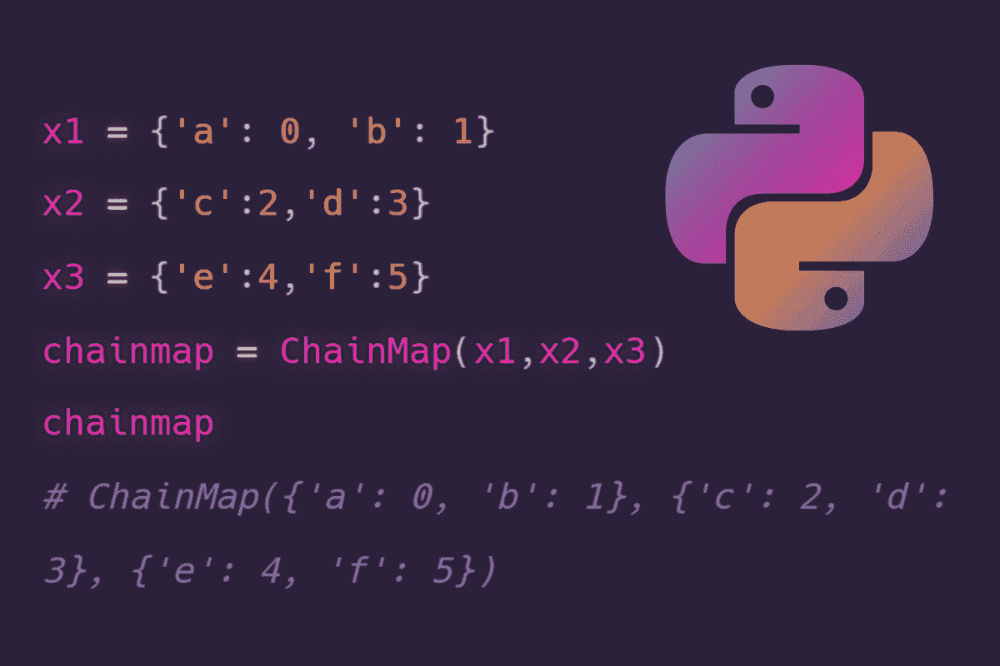

# 关于 Python 中的集合

> 原文：[`www.kdnuggets.com/2022/09/collections-python.html`](https://www.kdnuggets.com/2022/09/collections-python.html)



图片由编辑提供

Python 拥有一个名为 **collections** 的模块，其中包含不同类型的容器。容器是一个 Python 对象，它包含不同的对象，并实现了一种检索这些对象和对它们进行迭代的方法。

在本教程中，我们将深入探讨由 **collections** 模块实现的不同类型的容器。

+   Counters

+   OrderedDict

+   DefaultDict

+   ChainMap

+   NamedTuple

+   DeQue

# Counters

Counter 是 dict 的子类，用于在无序字典中保持可迭代对象中元素的计数，其中键表示元素，值表示该元素在可迭代对象中的计数

为了初始化一个计数器对象，我们使用 counter() 函数，它可以以以下方式调用

```py
from collections import Counter

```

**1) 使用项的序列**

```py
counter = Counter(['D','C','C','E','E','E','A','A','X'])
print(counter)
```

**输出：**

```py
Counter({'D': 1, 'C': 2, 'E': 3, 'A': 2, 'X': 1})
```

**2) 使用字典**

```py
counter = Counter({'X':3,'Y':2,'Z':1})
print(counter)
```

**输出：**

```py
Counter({'X': 3, 'Y': 2, 'Z': 1})
```

**3) 使用关键字参数**

```py
counter = Counter(X=3,Y=2,Z=1)
print(counter)
```

**输出：**

```py
Counter({'X': 3, 'Y': 2, 'Z': 1})
```

# OrderedDict

OrderedDict 是 dict 的子类，但不同于普通字典，它们记住键插入的顺序

```py
from collections import OrderedDict

orderdict = OrderedDict()
orderdict["x"] = 2
orderdict["y"] = 3
orderdict["z"] = 4

print(orderdict)
```

**输出：**

```py
OrderedDict([('x', 2), ('y', 3), ('z', 4)])
```

**1) 当在现有有序字典中插入新项目时，新项目会附加在字典的末尾，从而保持字典的顺序**

```py
orderdict["v"] = 5
print(orderdict)
```

**输出：**

```py
OrderedDict([('x', 2), ('y', 3), ('z', 4), ('v', 5)])
```

**2) 当从现有有序字典中删除一个项目并重新插入相同的项目时，该特定项目会被插入到字典的末尾**

```py
del orderdict["x"]

print(orderdict)
```

**输出：**

```py
OrderedDict([('y', 3), ('z', 4), ('v', 5)])
```

```py
orderdict["x"] = 2
print(orderdict)
```

**输出：**

```py
OrderedDict([('y', 3), ('z', 4), ('v', 5), ('x', 2)])
```

**3) 当重新分配或更新 OrderedDict 对象中现有键值对的值时，键的位置保持不变，但键的值会更新**

```py
orderdict.update(z = "four")
print(orderdict)
```

**输出：**

```py
OrderedDict([('y', 3), ('z', 'four'), ('v', 5), ('x', 2)]
```

# DefaultDict

DefaultDict 是 dict 的子类，为从未存在的键提供默认值，从而避免抛出 keyError

```py
from collections import defaultdict
```

**1) 使用 list 作为 defaultdict**

```py
dftdict = defaultdict(list)

for i in range(3):
dftdict[i].append(i)

print(dftdict)
```

**输出：**

```py
defaultdict(list, {0: [0], 1: [1], 2: [2]})

```

**2) 使用 int 作为 defaultdict**

```py
intdict = defaultdict(int)

X = [1,2,3,4,5,1,1,3,4,5]

for i in X:

#The default value is 0 so there is no need to enter the key first

intdict[i] += 1

print(intdict)
```

**输出：**

```py
defaultdict(int, {1: 3, 2: 1, 3: 2, 4: 2, 5: 2})
```

# ChainMap

ChainMap 用于将多个字典合并成一个单元，因此返回字典列表

```py
from collections import ChainMap

x1 = {'a': 0, 'b': 1}
x2 = {'c':2,'d':3}
x3 = {'e':4,'f':5}

chainmap = ChainMap(x1,x2,x3)

print(chainmap)
```

**输出：**

```py
ChainMap({'a': 0, 'b': 1}, {'c': 2, 'd': 3}, {'e': 4, 'f': 5})
```

**1) 使用键名访问值**

```py
print(chainmap['a'])
```

**输出：**

```py
0
```

**2) 访问值**

```py
print(chainmap.values())
```

**输出：**

```py
ValuesView(ChainMap({'a': 0, 'b': 1}, {'c': 2, 'd': 3}, {'e': 4, 'f': 5}))
```

**3) 访问键**

```py
print(chainmap.keys())
```

**输出：**

```py
KeysView(ChainMap({'a': 0, 'b': 1}, {'c': 2, 'd': 3}, {'e': 4, 'f': 5}))
```

**4) 插入新字典**

通过使用 new_child() 方法，新字典被插入到 ChainMap 的开头

```py
chainmap1 = chainmap.new_child({'g':6,'h':7})
print(chainmap1)
```

**输出：**

```py
ChainMap({'g': 6, 'h': 7}, {'a': 0, 'b': 1}, {'c': 2, 'd': 3}, {'e': 4, 'f': 5})
```

# NamedTuple

NamedTuple 是一个具有每个位置名称的元组对象

```py
from collections import namedtuple
```

**1) 声明 namedtuple**

```py
band = namedtuple('Country',['name','capital','famousband'])
```

**2) 向 namedtuple 中插入值**

```py
val = band("south korea","Seoul","BTS")
print(val)
```

**输出：**

```py
Country(name='south korea', capital='Seoul', famousband='BTS')
```

**3) 使用索引访问值**

```py
print(val[0])
```

**输出：**

```py
'south korea'
```

**4) 使用名称访问值**

```py
print(val.name)
```

**输出：**

```py
'south korea'
```

# Deque

deque 是一个列表，用于在容器的两侧实现 append 和 pop 操作

```py
from collections import deque
```

**1) 声明 deque**

```py
queue = deque([4,5,6])
print(queue)
```

**输出：**

```py
deque([4, 5, 6])
```

**2) 使用 append 在 deque 的右侧插入元素，即 deque 的末尾**

```py
queue.append(7)
print(queue)
```

**输出：**

```py
deque([4, 5, 6, 7])
```

**3) 使用 append 在 deque 的左侧插入元素，即 deque 的开始位置**

```py
queue.appendleft(3)

print(queue)
```

**输出：**

```py
deque([3, 4, 5, 6, 7])
```

**4) 使用 pop 从 deque 的右侧删除元素，即 deque 的末尾**

```py
queue.pop()
print(queue)
```

**输出：**

```py
deque([3, 4, 5, 6])
```

**5) 使用 popleft 从 deque 的左侧删除元素，即 deque 的开头**

```py
queue.popleft()
print(queue)
```

**输出：**

```py
deque([4, 5, 6])
```

**[Priya Sengar](https://www.linkedin.com/in/priya-sengar/)** (**Medium**, **Github**) 是一名来自旧金山大学的数据科学家。Priya 热衷于解决数据问题并将其转化为解决方案。

* * *

## 我们的前 3 个课程推荐

 1\. [谷歌网络安全证书](https://www.kdnuggets.com/google-cybersecurity) - 快速进入网络安全职业领域。

 2\. [谷歌数据分析专业证书](https://www.kdnuggets.com/google-data-analytics) - 提升你的数据分析能力

 3\. [谷歌 IT 支持专业证书](https://www.kdnuggets.com/google-itsupport) - 支持你的组织进行 IT 工作

* * *

### 更多相关内容

+   [科技行业的裁员潮是怎么回事？](https://www.kdnuggets.com/2023/02/layoffs-tech.html)

+   [超级 Bard：能够做一切并做得更好的 AI](https://www.kdnuggets.com/2023/05/super-bard-ai-better.html)

+   [如果你想掌握生成式 AI，请忽略所有工具（但保留两个）](https://www.kdnuggets.com/if-you-want-to-master-generative-ai-ignore-all-but-two-tools)

+   [科技行业各领域的热门谷歌认证](https://www.kdnuggets.com/popular-google-certification-for-all-areas-in-the-tech-industry)

+   [教科书就是你所需的一切：一种革命性的 AI 培训方法](https://www.kdnuggets.com/2023/07/textbooks-all-you-need-revolutionary-approach-ai-training.html)

+   [今天所有市场营销分析和数据科学专业人士需要的 5 种技能](https://www.kdnuggets.com/2023/08/mads-5-skills-marketing-analytics-data-science-pros-need-today.html)
