# 结合不同方法创建高级时间序列预测

> 原文：[`www.kdnuggets.com/2016/11/combining-different-methods-create-advanced-time-series-prediction.html`](https://www.kdnuggets.com/2016/11/combining-different-methods-create-advanced-time-series-prediction.html)

 评论

**Taras Firman, 数据科学家于 [ELEKS](http://eleks.com/)**

现在，企业需要能够预测需求和趋势，以便应对突发的市场变化和经济波动。这正是由数据科学驱动的预测工具发挥作用的地方，使组织能够成功处理战略和产能规划。智能预测技术可以用来降低潜在风险，并协助做出明智的决策。我们的一个客户，一家来自中东的企业，需要预测接下来十二周的市场需求。他们需要一个市场预测，以帮助他们设定短期目标，例如生产策略，并协助进行产能规划和价格控制。因此，我们想出了一个创建定制时间序列模型的想法，能够应对这一挑战。在本文中，我们将探讨建模过程以及我们在过程中必须克服的陷阱。

### 有许多构建时间序列预测的方法……没有一种适合我们

* * *

## 我们的前三个课程推荐

 1\. [Google 网络安全证书](https://www.kdnuggets.com/google-cybersecurity) - 快速进入网络安全职业的快车道。

 2\. [Google 数据分析专业证书](https://www.kdnuggets.com/google-data-analytics) - 提升你的数据分析技能

 3\. [Google IT 支持专业证书](https://www.kdnuggets.com/google-itsupport) - 支持你组织的 IT 工作

* * *

随着基于机器学习的强大预测方法的出现，未来预测变得更加准确。一般来说，预测技术可以分为两类：定性预测和定量预测。定性预测在没有数据可用时应用，仅基于专家判断。定量预测则基于时间序列建模。这种模型使用历史数据，尤其在预测发生在一段时间内的某些事件时特别有效，例如价格、销售数字、生产量等。

现有的时间序列预测模型包括主要用于建模时间序列数据但不直接处理季节性的[ARIMA 模型](https://onlinecourses.science.psu.edu/stat510/node/49)；[VAR 模型](https://onlinecourses.science.psu.edu/stat510/node/79)，[Holt-Winters](https://www.otexts.org/fpp/7/5)季节性方法，[TAR 模型](https://onlinecourses.science.psu.edu/stat510/node/82)及其他。不幸的是，这些算法可能无法提供所需的预测准确度，因为它们可能涉及不完整、不一致或含有错误的原始数据。由于质量决策仅基于高质量的数据，因此进行预处理以准备进一步处理的输入信息是至关重要的。

### 为什么结合模型是一个解决方案

显然，单一的预测技术无法在所有情况下都有效。每种方法都有其特定的应用场景，可以根据许多因素（历史数据的可用周期、需要观察的时间段、预算规模、期望的准确度水平）和所需的输出进行应用。因此，我们面临着一个问题：使用哪种方法/方法组合来获得期望的结果？由于不同的方法各有独特的优缺点，我们决定将多种方法结合起来，使它们协同工作。这样，我们就能够建立一个能够提供可靠预测的时间序列模型，以确保数据可靠性和节省时间/成本。这就是我们如何做到的。

### 建模过程；让我们深入了解细节

需求数据依赖于各种因素，这些因素可能会影响预测结果，例如价格和商品类型、地理位置、国家经济状况、制造技术等。为了使我们的时间序列模型能为客户提供高准确度的预测，我们使用了[插值](https://ece.uwaterloo.ca/~dwharder/NumericalAnalysis/05Interpolation/)方法来处理缺失值，以确保输入数据的可靠性。

在使用 Python 2.7 进行时间序列分析时，我们分析了从 2010 年到 2015 年的过去数据，以准确计算需求并预测未来的行为。

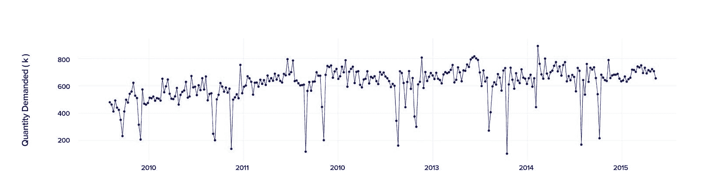

*图 1\. 2010-2015 时间段的需求数据*

初看起来，似乎没有恒定的需求值，因为方差上下波动，使得预测几乎不可能。然而，有一种方法可以帮助解决这个问题。

我们使用了分解方法来分别提取趋势（时间段内的系列增长或减少）、季节性（系列在每周、每月等周期内的波动）和残差（落在预期数据范围之外的数据点）。通过这三个组成部分，我们建立了加性模型：

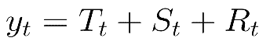

其中 yt 是数据，Tt 是趋势周期分量，St 是季节分量，Rt 是残差分量，所有这些都在时间段 t 上定义。

描述系列各种组件的一个重要的第一步是平滑，尽管它并没有真正提供一个现成的模型。一开始，我们估计了趋势（行为）组件。像移动平均、指数平滑、Chow 的自适应控制、Winter 的线性和季节性指数平滑方法都没有提供我们期望的趋势估计准确性。最可靠的结果是使用[霍德里克-普雷斯科特滤波器](https://cran.r-project.org/web/packages/mFilter/mFilter.pdf)技术获得的。

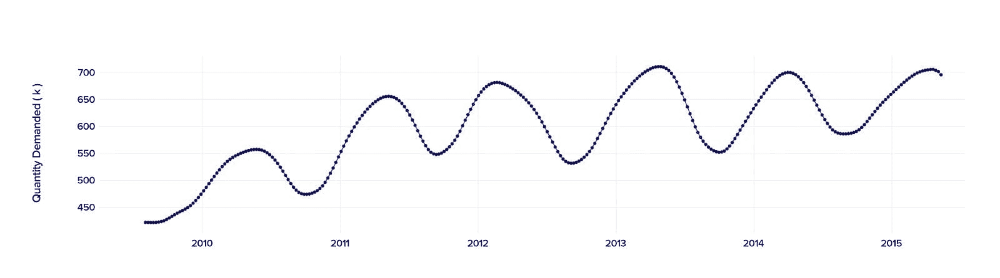

*图 2\. 估计的趋势*

然后，我们从现有数据中定义了季节性。这个组件可能随时间变化，因此我们应用了一种强大的时间序列分解工具——[Loess 方法](https://www.otexts.org/fpp/6/5)。[这种](https://www.otexts.org/fpp/6/5)方法可以处理任何类型的季节性，变化率可以由用户控制。

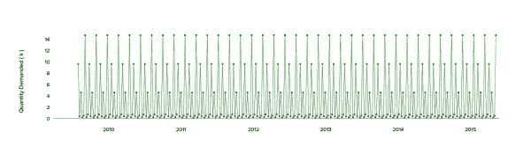

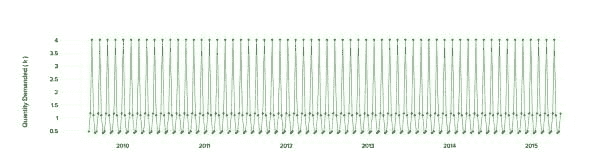

*图 3\. 多季节性*

我们获得了一个多季节性组件，其高低方差造成了大幅波动。

在应用了[弹性网回归](http://scikit-learn.org/stable/modules/generated/sklearn.linear_model.ElasticNet.html)和[傅里叶变换](http://www.le.ac.uk/users/dsgp1/COURSES/LEIMETZ/FOURIER.pdf)之后，我们基于获得的结果建立了趋势预测。趋势的近似可以从以下公式中找到，

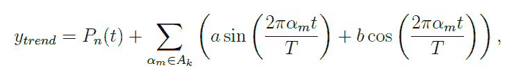

其中 Pn(t) 是一个多项式，Ak 是一组索引，包括前 k 个幅度最大的索引。

然后，我们使用离散傅里叶变换（DFT）计算了傅里叶系数。

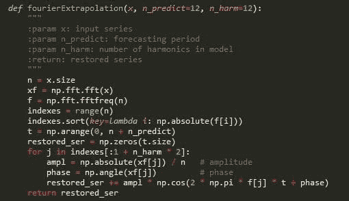

*图 4\. DFT 在 Python 中的代码示例*

模型中用作外部回归量的傅里叶项的效果如下所示。

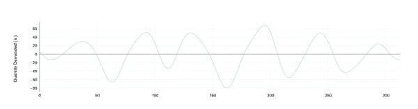

*图 5\. 傅里叶项的可视化效果*

我们使用加法模型建立了趋势预测。

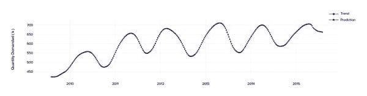

*图 6\. 趋势预测*

当模型中去除趋势和季节分量后，我们可以从剩余部分获得残差（观察值与基于其他观察值的预测值之间的差异），以验证和拟合我们的数学模型。

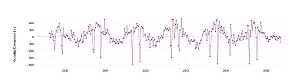

*图 7\. 获得的残差*

你可能会注意到存在一些负值，这表明在那段时间里发生了异常情况。我们旨在找出导致这种行为的情况，因此我们提出了一个主意，利用一个简单的日历来汇总异常值，并发现负值与如斋月、开斋节等公共假期紧密相关。在收集和总结所有数据后，我们应用了基于先前数据点的输入特征的机器学习方法和时间序列预测的机器学习策略。

经过几次使用机器学习模型进行的训练，我们建立了一个关于残差的预测，如下所示。

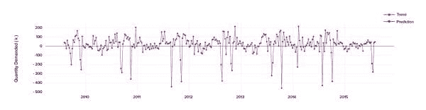

*图 8\. 残差预测*

结果，我们得到了一个最终的预测模型，使得一个特定城市的平均绝对百分比误差（MAPE）降低到 6%，整个国家的一般误差为 10%。

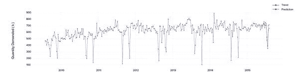

*图 9\. 原始比例下的预测*

### 24 倍更快的预测？是的，这完全可能。

在构建我们的模型时，我们不仅尝试使用可用的信息，还试图发现可能影响结果的因素。这种方法帮助我们开发了一个比现有模型生成更准确预测结果的模型。例如，训练开发出的模型以对 300 个不同城市进行预测，我们只需约 15 分钟，而其他方法则需要约 6 小时。

此外，实际需求与预测需求之间的偏差仅为 6%，这使得解决供需不匹配的可能性增加。现在，客户可以更快、更轻松地规划产能，最小化未来风险，并优化库存。

### 接下来是什么？

好吧，结果相当有希望。而且我们可以在这个模型的改进上走得更远，以便它也能提供准确的长期预测。目前，长期预测的误差程度仍然较高。这听起来像是个挑战？那就敬请期待吧！一些新的实验正在进行中！

**简介: [Taras Firman](https://www.facebook.com/profile.php?id=100009049483326)** 是 ELEKS 的数据科学家，从事统计分析、优化、预测等严肃工作。Taras 受过数学教育并以此为职业，通过研究生课程不断发展自己的专业技能，同时教授运筹学和数据分析。此外，他从不忽视任何有趣的数据科学或机器学习新闻，并且有很多要贡献的内容，也决定开始写博客。当他完成数学和数据科学工作后，Taras 还喜欢足球和音乐。

**相关：**

+   从时间序列数据中获得更好的洞察力：周期图

+   周期性大数据流中的简单异常检测方法

+   伟大的算法教程汇总

### 更多相关内容

+   [使用 BQML 进行多变量时间序列预测](https://www.kdnuggets.com/2023/07/multivariate-timeseries-prediction-bqml.html)

+   [创建时间序列比率分析仪表板](https://www.kdnuggets.com/2023/06/wolfer-create-time-series-ratio-analysis-dashboard.html)

+   [简化结合 Pandas 数据框](https://www.kdnuggets.com/2022/09/combining-pandas-dataframes-made-simple.html)

+   [将数据管理与数据讲述相结合以生成价值](https://www.kdnuggets.com/combining-data-management-and-data-storytelling-to-generate-value)

+   [Python 中加载数据的 5 种不同方法](https://www.kdnuggets.com/2020/08/5-different-ways-load-data-python.html)

+   [终极指南：NLP 中不同的词嵌入技术](https://www.kdnuggets.com/2021/11/guide-word-embedding-techniques-nlp.html)
