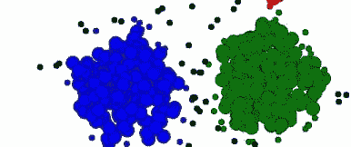
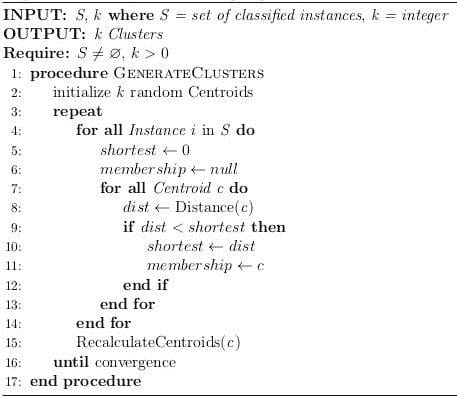
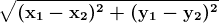
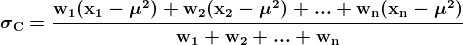

# 比较聚类技术：简明技术概述

> 原文：[`www.kdnuggets.com/2016/09/comparing-clustering-techniques-concise-technical-overview.html`](https://www.kdnuggets.com/2016/09/comparing-clustering-techniques-concise-technical-overview.html)

聚类用于分析未标记类别的数据。数据实例被分组在一起，使用最大化类内相似度和最小化不同类别之间相似度的概念。这意味着聚类算法识别并分组非常相似的实例，而不是那些彼此相似度较低的未分组实例。由于聚类不需要预先标记类别，它是一种无监督学习。

* * *

## 我们的前三大课程推荐

 1\. [Google 网络安全证书](https://www.kdnuggets.com/google-cybersecurity) - 快速进入网络安全职业生涯。

 2\. [Google 数据分析专业证书](https://www.kdnuggets.com/google-data-analytics) - 提升你的数据分析技能

 3\. [Google IT 支持专业证书](https://www.kdnuggets.com/google-itsupport) - 支持你的组织的 IT

* * *

* k *-均值聚类可能是最著名的聚类算法示例。然而，它并不是唯一的。完全不同的方案存在，如层次聚类、模糊聚类和密度聚类，还有不同的质心风格聚类方法，例如使用中位数（而不是均值），或确保质心是簇成员（请继续阅读以了解更多背景）。

以下是* k *-均值聚类算法的简要技术概述，以及基于高斯分布的期望最大化（EM）聚类方法。这两种方法都试图最大化类内相似度和最小化类间相似度，但采用了不同的方法来实现。

***k*-均值聚类**

* k *-均值是一种简单但通常有效的聚类方法。* k *个点被随机选择作为簇中心或质心，所有训练实例被绘制并添加到最近的簇中。在所有实例被添加到簇中后，代表每个簇实例均值的质心会重新计算，这些重新计算的质心将成为各自簇的新中心。

此时，所有的簇成员资格被重置，所有训练集中的实例被重新绘制并-添加到其最近的、可能重新中心化的簇中。这个迭代过程会持续进行，直到质心或其成员资格没有变化，簇被认为是稳定的。

**图 1: *k*-均值聚类算法。**

收敛是在重新计算的中心点与上一次迭代的中心点匹配，或在某个预设的范围内时实现的。在*k*-均值算法中，距离度量通常是欧几里得的，对于形式为*(x, y)*的 2 个点，可以表示为：

技术上特别要注意的是，特别是在并行计算时代，*k*-均值中的迭代聚类本质上是串行的；然而，迭代中的距离计算不必是串行的。因此，对于大规模数据集，距离计算是*k*-均值聚类算法中值得并行化的目标。

**期望最大化**

概率聚类旨在在给定数据集的情况下确定最可能的聚类集。EM 是一种概率聚类算法，因此涉及确定实例属于特定聚类的概率。EM “接近统计模型中参数的最大似然或最大后验估计”（[Han, Kamber & Pei](http://hanj.cs.illinois.edu/bk3/)）。EM 过程以一组参数开始，迭代直到在 k 个聚类的情况下最大化聚类。

正如其名称所示，EM 包括两个不同的步骤：期望和最大化。期望步骤（E 步骤）根据参数将特定对象分配到聚类中。这也可以称为聚类概率计算步骤，聚类概率是“期望的”类别值。最大化步骤（M 步骤）计算分布参数，最大化期望的似然。

参数估计方程表达了每个聚类的概率是已知的，而不是聚类本身。聚类的均值计算为

聚类的标准差由以下公式确定

其中 *w[i]* 是实例 *i* 属于聚类 *C* 的概率，而 *x[i]* 是数据集中的所有实例。

当给定一个新的实例进行聚类时，其聚类成员概率被计算并与每个聚类进行比较。该实例成为具有最高成员概率的聚类的成员。这些步骤会重复进行，直到聚类间的变化低于预定的阈值。实际上，迭代应继续进行，直到对数似然增加微不足道，并且对数似然在前几次迭代期间通常会急剧增加，并迅速收敛到这个微不足道的点。

需要注意的是，EM 也可以用于模糊聚类，而不是概率聚类。

虽然* k *均值和期望最大化采用了不同的方法，但它们都是聚类技术。这种差异应该是对广泛存在的各种聚类技术之间差异的良好提示，这些技术在今天仍在使用。

**相关**：

+   MDL 聚类：无监督属性排序、离散化和聚类

+   期望最大化（EM）算法教程

+   支持向量机：简明技术概述

### 更多相关内容

+   [解锁聚类：理解 K 均值聚类](https://www.kdnuggets.com/2023/07/clustering-unleashed-understanding-kmeans-clustering.html)

+   [比较自然语言处理技术：RNN、Transformers、BERT](https://www.kdnuggets.com/comparing-natural-language-processing-techniques-rnns-transformers-bert)

+   [如何撰写吸引人的技术博客](https://www.kdnuggets.com/2022/04/write-engaging-technical-blogs.html)

+   [在数据隐私中学习实施技术隐私解决方案…](https://www.kdnuggets.com/2022/04/manning-data-privacy-learn-implement-technical-privacy-solutions-tools-scale.html)

+   [每位 AI 从业者应了解的隐性技术债务](https://www.kdnuggets.com/2022/07/hidden-technical-debts-every-ai-practitioner-aware.html)

+   [ChatGPT 与 Google Bard：技术差异比较](https://www.kdnuggets.com/2023/03/chatgpt-google-bard-comparison-technical-differences.html)
