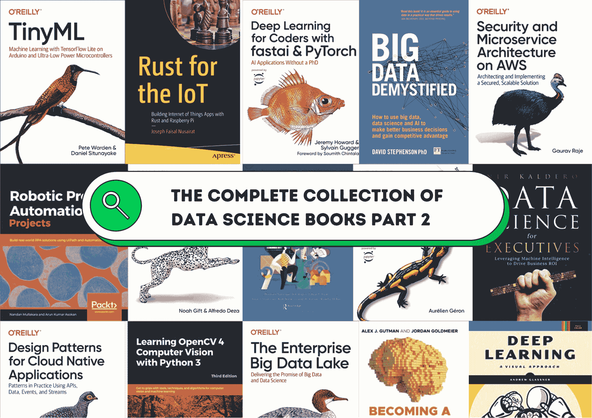
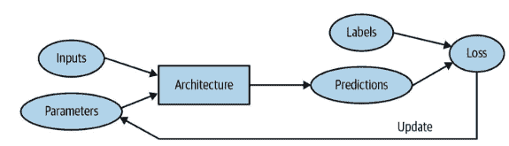
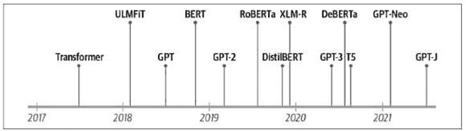
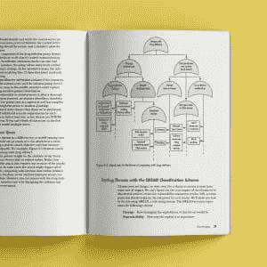

# 数据科学书籍完整合集 – 第二部分

> 原文：[`www.kdnuggets.com/2022/05/complete-collection-data-science-books-part-2.html`](https://www.kdnuggets.com/2022/05/complete-collection-data-science-books-part-2.html)

图片来源于作者

> **编辑注**：关于这一两部分系列中的数据科学书籍的完整范围，请参见[**数据科学书籍完整合集 – 第一部分**](https://www.kdnuggets.com/2022/05/complete-collection-data-science-books-part-1.html)。

* * *

## 我们的前三大课程推荐

 1\. [Google 网络安全证书](https://www.kdnuggets.com/google-cybersecurity) - 快速进入网络安全职业轨道。

 2\. [Google 数据分析专业证书](https://www.kdnuggets.com/google-data-analytics) - 提升你的数据分析技能

 3\. [Google IT 支持专业证书](https://www.kdnuggets.com/google-itsupport) - 支持你的组织在 IT 方面

* * *

数据科学书籍在我的数据科学之旅中发挥了重要作用。[Deep Learning for Coders with Fastai and PyTorch](https://www.amazon.com/dp/1492045527/ref=emc_bcc_2_i) 让我从新的角度思考深度神经网络及我们如何处理几乎所有的机器学习问题。我爱上了 NLP 书籍及其附带的 GitHub 代码库、Jupyter 笔记本练习和易于探索的选项。[Data Science at the Command Line](https://datascienceatthecommandline.com/2e/) 是一本现在可以在线访问（文档风格）的书籍，支持术语搜索、导航，并可以直接复制代码进行测试。它提供了免费的互动阅读体验。

在这两部分系列中，我将分享数据科学各子领域的最佳书籍。你可以购买纸质书籍，或仅仅获取在线版本，或下载 PDF/EPub/Kindle 版本。有些书籍基于网站，可以免费访问。

**在第二部分中，我们将回顾以下书籍：**

1.  机器学习

1.  深度学习

1.  计算机视觉

1.  自然语言处理

1.  MLOps

1.  机器人技术

1.  物联网

1.  AI 产品管理

1.  数据科学高管版

1.  数据科学超级书籍

# 机器学习

这是数据科学领域中最受欢迎的术语。大多数数据专业人士都需要执行某种机器学习任务，即使是开发一个简单的线性回归模型。这些书籍将教你最流行框架中的基础和高级概念，并附有代码示例。

+   [百页机器学习书：安德烈·布尔科夫](https://www.amazon.com/Hundred-Page-Machine-Learning-Book/dp/199957950X/ref=as_li_ss_tl?dchild=1&keywords=Hundred-Page-Machine-Learning-Book&qid=1625829832&sr=8-1&linkCode=sl1&tag=artmapincdbah-20&linkId=ff843bb60360267d998bbc5f7fdad452&language=en_US)

+   [动手实践机器学习：使用 Scikit-Learn、Keras 和 TensorFlow](https://www.amazon.com/Hands-Machine-Learning-Scikit-Learn-TensorFlow/dp/1492032646/ref=sr_1_1?crid=1BV2LGMBULS9O&keywords=Machine+Learning&qid=1651511886&s=books&sprefix=machine+learning%2Cstripbooks-intl-ship%2C511&sr=1-1)

+   [使用 Python 的机器学习入门：数据科学家的指南](https://www.amazon.com/Introduction-Machine-Learning-Python-Scientists/dp/1449369413/ref=as_li_ss_tl?dchild=1&keywords=Introduction+to+Machine+Learning+with+Python&qid=1626151672&sr=8-1&linkCode=sl1&tag=artmapincdbah-20&linkId=42fcf723c62f07a8d96b825ef0925233&language=en_US)

+   [AI 和机器学习实践：程序员的人工智能指南](https://www.amazon.com/Machine-Learning-Coders-Programmers-Intelligence/dp/1492078190/ref=sr_1_6?crid=3BYQMO4V0EK1J&keywords=Machine+Learning&qid=1651507494&s=books&sprefix=machine+learning%2Cstripbooks-intl-ship%2C277&sr=1-6)

# 深度学习

在简单的机器学习之后，我们将深入了解深度神经网络。这是机器学习的一个子领域，并且正在迅速改变世界。从计算机视觉到智能聊天机器人，你每天都在与它们互动。这些书籍将教你如何创建你的第一个深度学习模型，并介绍深度学习技术的子领域。

+   [深度学习实践：使用 Fastai 和 PyTorch：无需博士学位的 AI 应用](https://www.amazon.com/dp/1492045527/ref=emc_bcc_2_i)

+   [使用 Python 的深度学习（第二版）](https://www.amazon.com/Learning-Python-Second-Fran%C3%A7ois-Chollet/dp/1617296864/ref=sr_1_2?crid=22V1IEL8WUZQ4&keywords=Deep+Learning&qid=1651511776&s=books&sprefix=deep+learning%2Cstripbooks-intl-ship%2C691&sr=1-2)

+   [深度学习：视觉化方法](https://www.amazon.com/Deep-Learning-Approach-Andrew-Glassner/dp/1718500726/ref=sr_1_3?crid=22V1IEL8WUZQ4&keywords=Deep+Learning&qid=1651511776&s=books&sprefix=deep+learning%2Cstripbooks-intl-ship%2C691&sr=1-3)

+   [从头开始的深度学习：从第一原则用 Python 构建](https://www.amazon.com/Deep-Learning-Scratch-Building-Principles/dp/1492041416/ref=sr_1_17?crid=22V1IEL8WUZQ4&keywords=Deep+Learning&qid=1651511806&s=books&sprefix=deep+learning%2Cstripbooks-intl-ship%2C691&sr=1-17)

详细训练循环 | [深度学习实践：使用 Fastai 和 PyTorch](https://www.amazon.com/dp/1492045527/ref=emc_bcc_2_i)

# 计算机视觉

计算机视觉需求量很大，借助深度学习，这个领域正在主导全球。你可以在仓库管理、机器人、自驾车、面部识别、生成艺术，甚至现代武器中找到它。

+   [深度学习与视觉系统](https://www.amazon.com/Learning-Vision-Systems-Mohamed-Elgendy/dp/1617296198/ref=pd_bxgy_img_sccl_1/137-5550312-9155521?pd_rd_w=lXr1B&pf_rd_p=6b3eefea-7b16-43e9-bc45-2e332cbf99da&pf_rd_r=QYXJM6DWPS4H0NP5VF0H&pd_rd_r=09b79b65-c0c5-4477-9013-09069567c73e&pd_rd_wg=xQdBB&pd_rd_i=1617296198&psc=1)

+   [计算机视觉中的实用机器学习: 图像的端到端机器学习](https://www.amazon.com/_/dp/1098102363)

+   [使用 Python 3 学习 OpenCV 4 计算机视觉: 掌握计算机视觉和机器学习的工具、技术和算法，第 3 版](https://www.amazon.com/Learning-OpenCV-Computer-Vision-Python/dp/1789531616/ref=sr_1_3?keywords=image+recognition+python&pd_rd_r=33205a60-7a2c-4bec-bd8e-55010613bafb&pd_rd_w=yb81U&pd_rd_wg=Ta0Fi&pf_rd_p=2c083df3-a26e-4ea9-a512-e0aeb6fffdc2&pf_rd_r=YMF9RFPXDW1EW3RM5YGJ&qid=1651507719&sr=8-3)

+   [使用 PyTorch 的现代计算机视觉: 探索深度学习概念并实现超过 50 个现实世界的图像应用](https://www.amazon.com/Modern-Computer-Vision-PyTorch-applications/dp/1839213477/ref=sr_1_2?crid=85MGEBAKYL18&keywords=computer+vision&qid=1651507804&s=books&sprefix=computer+visio%2Cstripbooks-intl-ship%2C283&sr=1-2)

# 自然语言处理

学习如何创建机器翻译、自动语音识别、摘要生成器、文本和音频分类，以及对话机器人。自然语言处理是数据科学中的全新领域。你正在与音频、视觉和文本数据互动，以理解上下文和词汇。随着变换器的引入，这个领域在研究和开发上得到了真正的提升。我们现在正在训练具有 1760 亿个参数的模型 - [bigscience](https://huggingface.co/bigscience/tr11-176B-ml-logs)。

+   [使用变换器的自然语言处理: 使用 Hugging Face 构建语言应用程序](https://www.amazon.com/_/dp/1098103246?tag=oreilly20-20)

+   [实用自然语言处理: 构建实际 NLP 系统的全面指南](https://www.amazon.com/_/dp/1492054054?tag=oreilly20-20)

+   [真实世界的自然语言处理: 使用深度学习的实际应用](https://www.amazon.com/Real-World-Natural-Language-Processing-applications/dp/1617296422)

+   [企业中的应用自然语言处理: 教机器阅读、写作和理解](https://www.amazon.com/_/dp/149206257X)

变换器时间线 | [使用变换器的自然语言处理](https://www.amazon.com/_/dp/1098103246?tag=oreilly20-20)

# MLOps

你将学习创建机器学习流水线，将应用部署到云端，维护多个数据库，并学习自动化所有流程。机器学习运维由开发运维驱动，工程师自动化流程、监控指标和管理多个系统。如果你想变得面向未来，投资时间和金钱学习 MLOps 是值得的。

+   [引入 MLOps：如何在企业中扩展机器学习](https://www.amazon.com/Introducing-MLOps-Machine-Learning-Enterprise/dp/1492083291/ref=sr_1_4?crid=3Q6DCVF8BTBN0&keywords=MLOps&qid=1651509567&s=books&sprefix=mlops%2Cstripbooks-intl-ship%2C495&sr=1-4)

+   [实用 MLOps：机器学习模型的运维](https://www.amazon.com/Practical-MLOps-Operationalizing-Machine-Learning/dp/1098103017/ref=pd_rhf_dp_s_pd_crcd_sccl_1_27/137-5550312-9155521?pd_rd_w=oRrqt&pf_rd_p=cee83ff1-8fc1-4533-a3f5-bf3d998f4558&pf_rd_r=60NT8XECA1PM1MSE8TJF&pd_rd_r=9079b64d-efc0-4b47-b3ad-f5d31fa40f02&pd_rd_wg=9v2AE&pd_rd_i=1098103017&psc=1)

+   [大规模 MLOps 工程](https://www.amazon.com/Cloud-Native-Machine-Learning-Osipov/dp/1617297763/ref=sr_1_1?crid=3Q6DCVF8BTBN0&keywords=MLOps&qid=1651509567&s=books&sprefix=mlops%2Cstripbooks-intl-ship%2C495&sr=1-1)

+   [机器学习设计模式：数据准备、模型构建和 MLOps 中的常见挑战解决方案](https://www.amazon.com/Machine-Learning-Design-Patterns-Preparation/dp/1098115783/ref=sr_1_5?crid=3Q6DCVF8BTBN0&keywords=MLOps&qid=1651509567&s=books&sprefix=mlops%2Cstripbooks-intl-ship%2C495&sr=1-5)

# 机器人技术

虽然它不是数据科学的核心部分，但它已经是人工智能的一部分很长时间了。你可以学习如何在 Raspberry Pi 上使用 Python 训练和开发你的机器学习模型，或创建边缘应用。机器人技术是未来，如果你想保持相关性，我强烈建议你至少学习基础知识。

+   [学习机器人编程：使用 Raspberry Pi 和 Python 构建和控制 AI 驱动的自主机器人，第 2 版](https://www.amazon.com/Learn-Robotics-Programming-AI-enabled-autonomous/dp/1839218800)

+   [机器人流程自动化项目：使用 UiPath 和 Automation Anywhere 构建真实世界的 RPA 解决方案](https://www.amazon.com/Robotic-Process-Automation-Projects-real-world/dp/1839217359)

+   [机器人流程自动化手册：实施 RPA 系统指南](https://www.amazon.com/Robotic-Process-Automation-Handbook-Implementing/dp/1484257286)

+   [人工智能与机器人：使用 AI 技术构建执行人类任务的智能机器人](https://www.amazon.com/Artificial-Intelligence-Robotics-intelligent-techniques/dp/1788835441)

# 物联网

物联网无处不在。这些包括智能手机、智能手表、墙上的传感器，甚至是你的数字冰箱。我们被这些传感器包围，它们每小时都会收集和生成大量的数据。你将学习如何使用 Rust 构建服务器端应用，并将其与 Raspberry Pi 和云系统集成。你还将了解智能城市、物联网安全以及微控制器上的 TensorFlow Lite。

+   [万物互联网与大数据：智能城市中的主要挑战（万物互联网（IoE））](https://www.amazon.com/dp/0367458888?tag=uuid10-20)

+   [实用物联网黑客：攻克物联网的终极指南](https://www.amazon.com/Practical-IoT-Hacking-Fotios-Chantzis/dp/1718500904/ref=sr_1_1?crid=3UZ7AWANV6BRS&keywords=iot&qid=1651509429&s=books&sprefix=iot%2Cstripbooks-intl-ship%2C297&sr=1-1)

+   [Rust 与物联网：使用 Rust 和 Raspberry Pi 构建物联网应用](https://www.amazon.com/Rust-IoT-Building-Internet-Raspberry/dp/1484258592/ref=sr_1_1?crid=1TSKO33YTNM2Z&keywords=Rust+for+the+IoT%3A+Building+Internet+of+Things+Apps+with+Rust+and+Raspberry+Pi&qid=1651509587&s=books&sprefix=rust+for+the+iot+building+internet+of+things+apps+with+rust+and+raspberry+pi%2Cstripbooks-intl-ship%2C506&sr=1-1)

+   [TinyML：在 Arduino 和超低功耗微控制器上使用 TensorFlow Lite 进行机器学习](https://www.amazon.com/TinyML-Learning-TensorFlow-Ultra-Low-Power-Microcontrollers/dp/1492052043/ref=pd_sbs_sccl_2_2/137-5550312-9155521?pd_rd_w=BoYOX&pf_rd_p=3676f086-9496-4fd7-8490-77cf7f43f846&pf_rd_r=YB5TQHH1DZ2B0BJRZKD8&pd_rd_r=eea75200-4f2f-4a14-8387-602548df47ef&pd_rd_wg=KZ1Tp&pd_rd_i=1492052043&psc=1)

图片来源于 [实用物联网黑客](https://www.amazon.com/Practical-IoT-Hacking-Fotios-Chantzis/dp/1718500904/ref=sr_1_1?crid=3UZ7AWANV6BRS&keywords=iot&qid=1651509429&s=books&sprefix=iot%2Cstripbooks-intl-ship%2C297&sr=1-1)

# AI 产品管理

你不能让任何一个 MBA 毕业生来管理数据团队。这个业务人员需要了解这些系统是如何工作的以及如何管理数据。AI 产品经理涉及数据的采购和处理，制定数据标注策略，理解业务问题和解决方案。要成为一个成功的 AI 经理，你需要同时具备商业理解和技术专长。

+   [将人工智能应用于项目管理](https://www.amazon.com/Applying-Artificial-Intelligence-Project-Management/dp/1687550948/ref=sr_1_2?crid=13NQ1WNLWO7O3&keywords=AI+Management&qid=1651510149&s=books&sprefix=ai+management%2Cstripbooks-intl-ship%2C271&sr=1-2)

+   [揭秘企业中的人工智能](https://www.amazon.com/Demystifying-AI-Enterprise-Playbook-Transformation/dp/103214520X/ref=sr_1_1?crid=3MYZUTZXBPOQL&keywords=Demystifying+AI+for+the+Enterprise&qid=1651510236&s=books&sprefix=demystifying+ai+for+the+enterprise%2Cstripbooks-intl-ship%2C509&sr=1-1)

+   [风险智能：人工智能如何变革风险管理（ERM 未来系列第 2 本）电子书](https://www.amazon.com/Risk-Intelligence-Artificial-transform-Management-ebook/dp/B09GLC3617)

+   [在企业中管理人工智能：成功实现人工智能项目和 MLOps 以构建可持续人工智能组织](https://www.amazon.com/Managing-Enterprise-Succeeding-Sustainable-Organizations/dp/1484278232)

# 《高管数据科学》

针对那些负责根据投资回报率和增长潜力做决策的高级管理人员的非技术书籍。你将了解其他公司如何在管理数据项目方面取得进展，以及如何利用机器学习推动业务发展。

+   [高管数据科学：利用机器智能推动业务投资回报](https://www.amazon.com/Data-Science-Executives-Leveraging-Intelligence/dp/B07PZZL3Z8/ref=sr_1_1?crid=1PBPFX9YHHDLM&keywords=Data+Science+for+Executives&qid=1651510462&s=books&sprefix=data+science+for+executives%2Cstripbooks-intl-ship%2C620&sr=1-1)

+   [决策者的数据科学手册：非技术高管、经理和创始人的指南](https://www.amazon.com/Decision-Makers-Handbook-Data-Science/dp/1484254937/ref=sr_1_3?crid=1PBPFX9YHHDLM&keywords=Data+Science+for+Executives&qid=1651510462&s=books&sprefix=data+science+for+executives%2Cstripbooks-intl-ship%2C620&sr=1-3)

+   [如何在数据科学中领导](https://www.amazon.com/Lead-Data-Science-Jike-Chong/dp/1617298891/ref=sr_1_6?crid=1PBPFX9YHHDLM&keywords=Data+Science+for+Executives&qid=1651510462&s=books&sprefix=data+science+for+executives%2Cstripbooks-intl-ship%2C620&sr=1-6)[在人工智能时代的竞争：算法和网络主宰世界时的战略和领导力](https://www.amazon.com/dp/B082T2PYHB?plink=2UNUIRlOxqGRlGOi&ref_=adblp13npsbx_1_0_im)

+   [如何在数据科学中领导](https://www.amazon.com/Lead-Data-Science-Jike-Chong/dp/1617298891/ref=sr_1_6?crid=1PBPFX9YHHDLM&keywords=Data+Science+for+Executives&qid=1651510462&s=books&sprefix=data+science+for+executives%2Cstripbooks-intl-ship%2C620&sr=1-6)

# 数据科学超级书籍

这些书籍涵盖了数据科学的各个方面，从统计学到高级机器学习算法。你将复习数据科学面试，了解如何管理数据，并学习所有入门基础知识。

**一本书统治所有。**

+   [掌握数据科学面试：201 个 FAANG、科技初创公司和华尔街的真实面试问题](https://www.amazon.com/Ace-Data-Science-Interview-Questions/dp/0578973839/ref=sr_1_1?crid=1S49HX359FLAK&keywords=Data+Science+Super+Books&qid=1651510696&s=books&sprefix=data+science+super+books%2Cstripbooks-intl-ship%2C511&sr=1-1)

+   [成为数据专家：如何思考、表达和理解数据科学、统计学和机器学习](https://www.amazon.com/Becoming-Data-Head-Understand-Statistics/dp/1119741742/ref=sr_1_1?crid=1FW9SKQALVO2Q&keywords=Data+Science&qid=1651510862&s=books&sprefix=data+science%2Cstripbooks-intl-ship%2C283&sr=1-1)

+   [从头开始的数据科学：使用 Python 的基本原理](https://www.amazon.com/Data-Science-Scratch-Principles-Python/dp/1492041130/ref=sr_1_3?crid=1FW9SKQALVO2Q&keywords=Data+Science&qid=1651510862&s=books&sprefix=data+science%2Cstripbooks-intl-ship%2C283&sr=1-3)

+   [Python 数据科学手册：处理数据的基本工具](https://www.amazon.com/Python-Data-Science-Handbook-Essential/dp/1491912057/ref=sr_1_6?crid=1FW9SKQALVO2Q&keywords=Data+Science&qid=1651510862&s=books&sprefix=data+science%2Cstripbooks-intl-ship%2C283&sr=1-6)

# 结束语

数据科学不仅仅是统计和编码。我们需要理解业务问题并提出最佳解决方案。并非所有问题都可以通过机器学习解决。我们还需要理解 MLOps 和其他集成系统如何对数据应用的成功至关重要。

在上一部分中，我们回顾了有关编程语言、统计学、数据工程、网页抓取、数据分析、商业智能、数据应用、数据管理、大数据和云架构的书籍。

> “我强烈建议你将这两个页面添加到书签，这样你就不需要在网上搜索书籍，而是可以直接访问数据科学特定领域的最佳书籍。”

**[Abid Ali Awan](https://www.polywork.com/kingabzpro)** ([@1abidaliawan](https://twitter.com/1abidaliawan)) 是一名认证的数据科学专业人士，热衷于构建机器学习模型。目前，他专注于内容创作，并撰写关于机器学习和数据科学技术的技术博客。Abid 拥有技术管理硕士学位和电信工程学士学位。他的愿景是利用图神经网络为面临心理健康问题的学生开发 AI 产品。

### 更多相关话题

+   [数据科学书籍完整合集 - 第一部分](https://www.kdnuggets.com/2022/05/complete-collection-data-science-books-part-1.html)

+   [KDnuggets 新闻，5 月 25 日：每个人都需要的 6 种 Python 机器学习工具…](https://www.kdnuggets.com/2022/n21.html)

+   [KDnuggets 新闻，6 月 1 日：完整的数据科学书籍合集…](https://www.kdnuggets.com/2022/n22.html)

+   [KDnuggets 新闻，4 月 6 日：8 门免费 MIT 数据科学课程…](https://www.kdnuggets.com/2022/n14.html)

+   [数据科学免费课程完整合集 - 第一部分](https://www.kdnuggets.com/2023/03/complete-collection-data-science-free-courses-part-1.html)

+   [数据科学免费课程完整合集 - 第二部分](https://www.kdnuggets.com/2023/03/complete-collection-data-science-free-courses-part-2.html)
