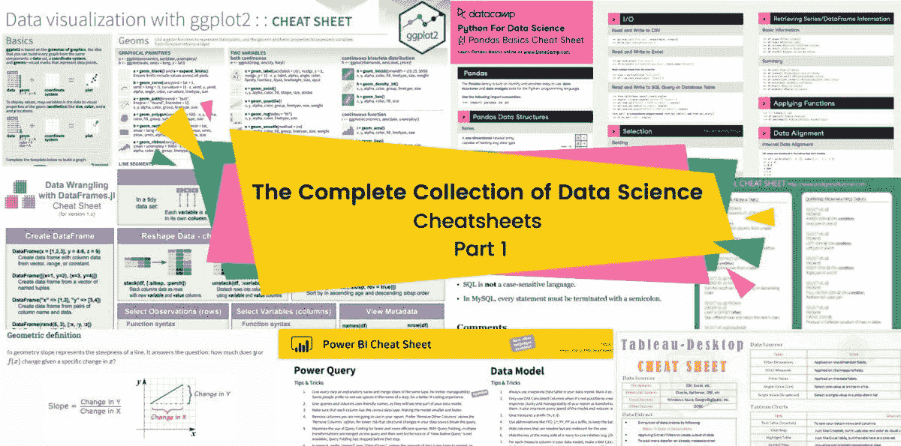
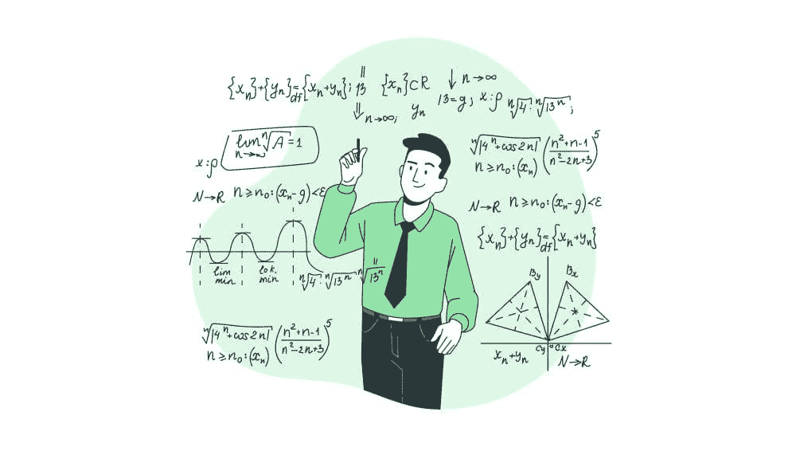

# 数据科学备忘单的完整集合 - 第一部分

> 原文：[`www.kdnuggets.com/2022/02/complete-collection-data-science-cheat-sheets-part-1.html`](https://www.kdnuggets.com/2022/02/complete-collection-data-science-cheat-sheets-part-1.html)

图片来源：作者

> **编辑注释**：有关此两部分系列中包含的备忘单的完整范围，请参阅[**数据科学备忘单的完整集合 - 第二部分**](https://www.kdnuggets.com/2022/02/complete-collection-data-science-cheat-sheets-part-2.html)。

* * *

## 我们的三大课程推荐

 1\. [谷歌网络安全证书](https://www.kdnuggets.com/google-cybersecurity) - 快速进入网络安全职业道路。

 2\. [谷歌数据分析专业证书](https://www.kdnuggets.com/google-data-analytics) - 提升你的数据分析水平

 3\. [谷歌 IT 支持专业证书](https://www.kdnuggets.com/google-itsupport) - 支持你的组织的 IT

* * *

备忘单可以帮助我们复习统计学概念、编程语言语法、数据分析工具和机器学习框架。它也可以帮助你在技术面试和评估测试中表现出色。[Jupyter Notebook](https://www.edureka.co/blog/wp-content/uploads/2018/10/Jupyter_Notebook_CheatSheet_Edureka.pdf)是每个人都应该学习的必备备忘单。它包含了运行 Python 笔记本的快捷方式、技巧和函数。

我使用备忘单来准备技术面试，因为技术招聘人员希望评估主题领域的专业知识。寻找适合你的备忘单可能需要几个小时，因为大多数备忘单都不容易理解。这些博客分为两部分，包括易于跟随和总结的备忘单，以复习所有的数据科学概念。

两部分系列进一步分为子类别；SQL、网页抓取、统计学、数据分析、商业智能、大数据、数据结构与算法、机器学习、深度学习、自然语言处理、数据工程、网络框架和 VIP 备忘单。

**第一篇博客包含六个子类别：**

1.  SQL

1.  网页抓取

1.  统计学、概率与数学

1.  数据分析

1.  商业智能

1.  大数据

### SQL

大多数技术面试和评估测试都包括某种类型的 SQL 问题，因此，最好使用 SQL 备忘单集合来准备面试。这些备忘单还将帮助你在创建和管理数据库方面做得更好。它还将帮助你理解复杂的 SQL 查询。

图片来源：[freepik](http://freepik)

+   [**初学者 SQL**](https://programmingwithmosh.com/wp-content/uploads/2019/03/SQL-Cheat-Sheet.pdf)

+   [**SQL 专家**](https://learnsql.com/blog/sql-basics-cheat-sheet/)

+   [**SQL – 数据分析**](https://www.dataquest.io/blog/sql-cheat-sheet/)

+   [**PostgreSQL**](https://www.postgresqltutorial.com/postgresql-cheat-sheet/)

### 网络抓取

网络抓取是数据科学的重要组成部分，它用于数据收集、市场研究和维护数据管道。Beautiful Soup 是一个流行的库，用于解析 HTML/Java 脚本并将其转换为人类可读的数据框。本节包含用于解析 Python 和 R 脚本的工具。

+   [**使用 Python 进行网页抓取**](https://medium.com/geekculture/web-scraping-cheat-sheet-2021-python-for-web-scraping-cad1540ce21c)

+   [**使用 R 进行网页抓取**](https://github.com/yusuzech/r-web-scraping-cheat-sheet)

+   [**Beautiful Soup**](https://cheatography.com//justin1209/cheat-sheets/beautiful-soup/pdf/)

+   [**Selenium**](https://intellipaat.com/blog/tutorial/selenium-tutorial/selenium-cheat-sheet/)

+   [**Scrapy**](https://gist.github.com/zlin888/21517c4558962fa8e47a14a6259c7168)

+   [**XPath**](https://devhints.io/xpath)

+   [**HTML 抓取**](https://docs.python-guide.org/scenarios/scrape/)

### 统计学、概率论与数学

人工智能、数据分析和现代研究依赖于统计学。统计学是现代社会的支柱，因此如果你想复习旧的概念或学习新的复杂思想，请查看一系列统计学作弊手册。

图片由 [stories](https://www.freepik.com/free-vector/undefined) 提供

+   [**概率论**](https://web.cs.elte.hu/~mesti/valszam/kepletek)

+   [**William Chen 的概率论作弊手册 2.0**](https://static1.squarespace.com/static/54bf3241e4b0f0d81bf7ff36/t/55e9494fe4b011aed10e48e5/1441352015658/probability_cheatsheet.pdf)

+   [**斯坦福大学：代数与微积分**](https://github.com/afshinea/stanford-cs-229-machine-learning/blob/master/en/refresher-algebra-calculus.pdf)

+   [**统计学、概率论与数学**](https://static1.squarespace.com/static/54bf3241e4b0f0d81bf7ff36/t/55e9494fe4b011aed10e48e5/1441352015658/probability_cheatsheet.pdf)

+   [**麻省理工学院：统计学**](https://web.mit.edu/~csvoss/Public/usabo/stats_handout.pdf)

+   [**斯坦福大学：统计学**](https://stanford.edu/~shervine/teaching/cme-106/cheatsheet-statistics)

+   [**机器学习中的微积分**](https://ml-cheatsheet.readthedocs.io/en/latest/calculus.html)

+   [**深度学习的线性代数**](https://towardsdatascience.com/linear-algebra-cheat-sheet-for-deep-learning-cd67aba4526c)

+   [**SciPy：Python 中的线性代数**](http://datacamp-community-prod.s3.amazonaws.com/dfdb6d58-e044-4b38-bab3-5de0b825909b)

### 数据分析

数据分析用于制定业务决策、市场营销活动、科学研究和设计独特的数据产品。整个 IT 行业都依赖于它。此类别进一步分为三个子类别：**Python**、**R** 和 **Julia**。所有这些语言在数据科学家和数据分析师中都很受欢迎。

### Python

该列表包含了用于数据摄取、处理和可视化的最常用 Python 包。Numpy 和 Pandas 是数据社区中进行科学计算和数据增强的最受欢迎工具。

+   [**数据科学入门的 Python 备忘单**](http://datacamp-community-prod.s3.amazonaws.com/0eff0330-e87d-4c34-88d5-73e80cb955f2)

+   [**数据科学中的 Pandas**](http://datacamp-community-prod.s3.amazonaws.com/f04456d7-8e61-482f-9cc9-da6f7f25fc9b)

+   [**Pandas: 数据处理**](http://datacamp-community-prod.s3.amazonaws.com/d4efb29b-f9c6-4f1c-8c98-6f568d88b48f)

+   [**NumPy**](http://datacamp-community-prod.s3.amazonaws.com/ba1fe95a-8b70-4d2f-95b0-bc954e9071b0)

+   [**Matplotlib**](http://datacamp-community-prod.s3.amazonaws.com/e1a8f39d-71ad-4d13-9a6b-618fe1b8c9e9)

+   [**Python Seaborn**](http://datacamp-community-prod.s3.amazonaws.com/263130e2-2c92-4348-a356-9ed9b5034247)

+   [**数据可视化: Bokeh**](http://datacamp-community-prod.s3.amazonaws.com/f0c1e06f-53ba-4f3b-aa9f-b196221f55a3)

+   [**数据导入**](http://datacamp-community-prod.s3.amazonaws.com/72e88aa1-b4f2-4658-9d86-15becf8263df)

+   [**PySpark**](http://datacamp-community-prod.s3.amazonaws.com/acfa4325-1d43-4542-8ce4-bea2d287db10)

### R

R 在统计学家和数据分析专业人士中非常受欢迎。建议学习著名包如 Tidyverse 的语法和函数。Tidyverse 提供了一个完整的数据科学解决方案，从数据导入到创建视觉上引人入胜的数据报告。

+   [**Python 与 R 和 reticulate**](https://raw.githubusercontent.com/rstudio/cheatsheets/main/reticulate.pdf)

+   [**Tidyverse 入门**](http://datacamp-community-prod.s3.amazonaws.com/c1fae72f-d2d7-4646-9dce-dd0f8fb5c5e8)

+   [**使用 ggplot2 进行数据可视化**](https://raw.githubusercontent.com/rstudio/cheatsheets/main/data-visualization.pdf)

+   [**使用 dplyr 进行数据转换**](https://raw.githubusercontent.com/rstudio/cheatsheets/main/data-transformation.pdf)

+   [**使用 tidyr 进行数据整理**](https://raw.githubusercontent.com/rstudio/cheatsheets/main/tidyr.pdf)

+   [**使用 readr、readxl 和 googlesheets4 导入数据**](https://raw.githubusercontent.com/rstudio/cheatsheets/main/data-import.pdf)

+   [**使用 purrr 应用函数**](https://raw.githubusercontent.com/rstudio/cheatsheets/main/purrr.pdf)

+   [**因素与因子**](https://raw.githubusercontent.com/rstudio/cheatsheets/main/factors.pdf)

+   [**使用 lubridate 处理日期和时间**](https://raw.githubusercontent.com/rstudio/cheatsheets/main/lubridate.pdf)

+   [**使用 rmarkdown 创建动态文档**](https://raw.githubusercontent.com/rstudio/cheatsheets/main/rmarkdown.pdf)

+   [**高级 R**](https://www.rstudio.com/wp-content/uploads/2016/02/advancedR.pdf)

+   [**data.table R 包**](http://datacamp-community-prod.s3.amazonaws.com/008e41e8-7526-4bbc-806b-8c828dfb81d4)

+   [**xts 备忘单：R 中的时间序列**](http://datacamp-community-prod.s3.amazonaws.com/72771032-0653-4d87-a798-4a83879e99c8)

+   [**制图学**](https://raw.githubusercontent.com/rstudio/cheatsheets/main/cartography.pdf)

### Julia

Julia 是一种新兴的语言，我认为这是数据科学的未来。此列表包含 Julia 语法、数据整理和数据可视化的快速介绍。

+   [**Julia 快速入门**](https://juliadocs.github.io/Julia-Cheat-Sheet/)

+   [**使用 DataFrames.jl 的数据整理**](https://ahsmart.com/assets/pages/data-wrangling-with-data-frames-jl-cheat-sheet/DataFramesCheatSheet_v1.x_rev1.pdf)

+   [**Plots.jl**](https://github.com/sswatson/cheatsheets/blob/master/plotsjl-cheatsheet.pdf)

+   [**MATLAB 与 Python 与 Julia**](https://cheatsheets.quantecon.org/)

+   [**Pluto.jl**](https://github.com/fonsp/Pluto.jl/wiki/%F0%9F%94%8E-Basic-Commands-in-Pluto)

+   [**Make.jl 示例**](http://juliaplots.org/MakieReferenceImages/gallery/index.html)

### 商业智能

无代码应用程序在商业智能中正成为行业标准。这些应用程序可以帮助你创建数据分析报告、仪表板和沉浸式可视化。这些工具正在帮助企业做出数据驱动的决策。最受欢迎的工具包括 MS Excel、Power BI 和 Tableau。

图片来源 [rawpixel.com](https://www.freepik.com/free-vector/undefined)

+   [**面向商业领袖的数据科学**](http://datacamp-community-prod.s3.amazonaws.com/c06d5eb5-d686-42ae-ba5b-85f5b17b2ed6)

+   [**PowerBI**](https://pbicheatsheet.blob.core.windows.net/pbicheatsheet/Macaw%20Power%20BI%20Cheat%20Sheet%20EN_English.pdf)

+   [**PowerBI: DAX**](https://pragmaticworks.com/wp-content/uploads/2020/08/DAX-Cheat-Sheet.pdf)

+   [**Tableau**](https://www.learnovita.com/tableau-cheat-sheet-tutorial)

+   [**MS Excel**](https://www.customguide.com/cheat-sheet/excel-cheat-sheet.pdf)

+   [**商业智能**](https://cheatography.com/nataliemoore/cheat-sheets/business-analysis/)

### 大数据

到 2025 年，预计全球每天将创造 463 亿 GB 的数据 - [(weforum.org)](https://www.weforum.org/agenda/2019/04/how-much-data-is-generated-each-day-cf4bddf29f/)。因此，主要的数据公司正在寻找数据工程师和数据科学家来处理大数据解决方案。这些备忘单可以为你介绍基本的大数据工具。

+   [**Hadoop**](https://intellipaat.com/blog/tutorial/big-data-and-hadoop-tutorial/big-data-Hadoop-cheat-sheet/)

+   [**Scala**](https://docs.scala-lang.org/cheatsheets/)

+   [**Spark**](https://intellipaat.com/blog/tutorial/spark-tutorial/spark-and-rdd-cheat-sheet/)

+   [**Hive 函数**](https://www.qubole.com/wp-content/uploads/2014/01/hive-function-cheat-sheet.pdf)

+   [**Spark with sparklyr**](https://raw.githubusercontent.com/rstudio/cheatsheets/main/sparklyr.pdf)

### 结论

在这篇博客中，我们涵盖了所有能够帮助你为数据分析、商业智能和数据科学面试做准备的备忘单。博客中包括了 SQL、网页抓取、统计学、数据分析、商业智能和大数据备忘单的合集。这些备忘单帮助我准备了求职面试，我希望它们也能对你有所帮助。明智的做法是将此页面收藏，以便每当你有技术面试时，可以立即开始准备，而不是在网上搜索备忘单。

在第二部分，我们将涵盖更多高级类别，如数据结构与算法、机器学习、深度学习、自然语言处理、数据工程、网络框架。

**[Abid Ali Awan](https://www.polywork.com/kingabzpro)** ([@1abidaliawan](https://twitter.com/1abidaliawan)) 是一位认证的数据科学专业人士，他喜欢构建机器学习模型。目前，他专注于内容创作，并撰写关于机器学习和数据科学技术的技术博客。Abid 拥有技术管理硕士学位和电信工程学士学位。他的愿景是利用图神经网络为那些挣扎于心理健康问题的学生开发 AI 产品。

### 更多相关主题

+   [数据科学备忘单完整合集 - 第二部分](https://www.kdnuggets.com/2022/02/complete-collection-data-science-cheat-sheets-part-2.html)

+   [KDnuggets™ 新闻 22:n06，2 月 9 日：数据科学编程…](https://www.kdnuggets.com/2022/n06.html)

+   [KDnuggets 新闻，4 月 6 日：8 门免费的 MIT 数据科学课程…](https://www.kdnuggets.com/2022/n14.html)

+   [数据科学书籍完整合集 - 第一部分](https://www.kdnuggets.com/2022/05/complete-collection-data-science-books-part-1.html)

+   [数据科学书籍完整合集 - 第二部分](https://www.kdnuggets.com/2022/05/complete-collection-data-science-books-part-2.html)

+   [数据科学面试完整合集 – 第一部分](https://www.kdnuggets.com/2022/06/complete-collection-data-science-interviews-part-1.html)
