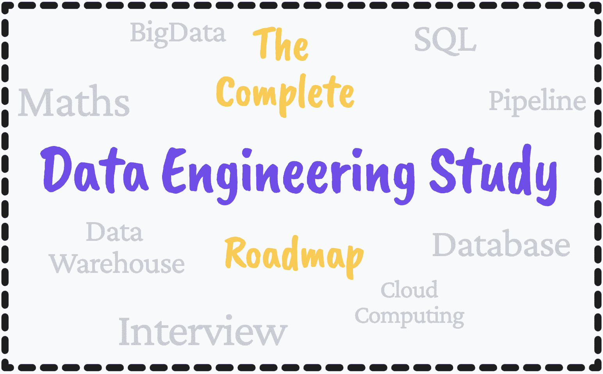

# 完整的数据工程学习路线图

> 原文：[`www.kdnuggets.com/2022/11/complete-data-engineering-study-roadmap.html`](https://www.kdnuggets.com/2022/11/complete-data-engineering-study-roadmap.html)

作者提供的图片

完整的数据科学学习路线图 似乎很受欢迎，所以我觉得做一个版本是个好主意。在这篇文章中，我将介绍成为数据工程师所需的一切。

* * *

## 我们的前三大课程推荐

 1\. [Google 网络安全证书](https://www.kdnuggets.com/google-cybersecurity) - 快速进入网络安全职业生涯

 2\. [Google 数据分析专业证书](https://www.kdnuggets.com/google-data-analytics) - 提升你的数据分析技能

 3\. [Google IT 支持专业证书](https://www.kdnuggets.com/google-itsupport) - 支持你所在的组织进行 IT 工作

* * *

# 1\. 打造你的基础

成为数据工程师有许多复杂之处，有时可能会让人感到有些不知所措。但唯一能让你坚持下去的就是建立一个坚实的基础。

你的基础将包括熟练掌握一到两种编程语言、SQL 以及更多关于服务器的知识。

## Python

如果你选择了 Python 作为编程语言，以下是一些推荐的课程：

+   [100 天代码挑战：2022 年完整 Python 专业实战营](https://www.udemy.com/course/100-days-of-code/) - Udemy

+   [人人皆可编程（Python 入门）](https://www.coursera.org/learn/python) - Coursera（密歇根大学）

## SQL

+   [终极 MySQL 实战营：从 SQL 初学者到专家](https://www.udemy.com/course/the-ultimate-mysql-bootcamp-go-from-sql-beginner-to-expert/) - Udemy

+   [完整的 SQL 精通课程](https://codewithmosh.com/p/complete-sql-mastery) - CodeWithMosh

## 基础知识

[使用 SQL、Python 和 PySpark 的数据工程基础](https://www.udemy.com/course/data-engineering-essentials-sql-python-and-spark/) - Udemy

# 2\. 数学和统计学

就像任何涉及数据分析和工程的职业一样，数学总是必需的。它将帮助你更好地理解日常任务，并更有效地运用你的技能。

这里有一些其他的资源来帮助你：

+   [Josh Starmer 的统计学基础](https://www.youtube.com/playlist?list=PLblh5JKOoLUK0FLuzwntyYI10UQFUhsY9) - YouTube

+   [机器学习的数学基础](https://www.udemy.com/course/machine-learning-data-science-foundations-masterclass/) - Udemy

+   [数据科学与商业分析的统计学](https://www.udemy.com/course/statistics-for-data-science-and-business-analysis/) - Udemy

# 2\. 数据库管理系统

作为数据工程师，你将频繁使用数据库管理系统——它们帮助处理大型数据集。市面上有很多数据库管理系统，因此不必感到需要掌握所有系统。这取决于你工作的公司或你偏好的工具。

+   [数据库管理原则](https://www.youtube.com/watch?v=o36Z_OqC2ac&list=PLdQddgMBv5zHcEN9RrhADq3CBColhY2hl) - YouTube

+   [数据库管理系统（DBMS）与 SQL：2022 完整包](https://www.udemy.com/course/relational-database-management-systemrdbms-complete-pack/) - Udemy

+   [DBMS 简介](https://www.geeksforgeeks.org/introduction-of-dbms-database-management-system-set-1/) - 文章/文档

+   [前 30 名最受欢迎的数据库管理软件](https://www.softwaretestinghelp.com/database-management-software/) - 博客

如果你还想了解更多关于 SQL 和数据库的免费课程，可以查看这个：免费 SQL 和数据库课程

# 4\. 数据仓储与数据管道

这一领域的重点是区分数据工程师和数据科学家的关键。两者都学习相同的基础知识并使用相同的编程语言、SQL 等。但数据仓储和数据管道是使数据工程师与众不同的因素——使他们成为优秀的数据工程师。

我推荐的数据仓库资源有：

+   [数据仓库工具包](https://aatinegar.com/wp-content/uploads/2016/05/Kimball_The-Data-Warehouse-Toolkit-3rd-Edition.pdf) - PDF 书籍。这本书由建立数据仓库基础之一的 Ralph Kimball 所著。

+   [数据仓储教程](https://www.tutorialspoint.com/dwh/dwh_data_warehousing.htm) - 文章

+   [数据库与数据仓库与数据湖的比较](https://www.youtube.com/watch?v=-bSkREem8dM) - YouTube

以下是学习数据管道的一些资源：

+   [数据管道解释](https://www.youtube.com/watch?v=6kEGUCrBEU0) - YouTube

+   [ETL 与 ELT](https://blog.hubspot.com/website/etl-vs-elt) - 文章

+   [用 Python 构建数据工程管道](https://www.datacamp.com/courses/building-data-engineering-pipelines-in-python?hl=GB) - DataCamp

# 5\. 云计算

最后但同样重要的是云计算。你不需要了解所有内容，但你应该对不同的服务提供商、他们的能力、局限性等有一个不错的了解。

你需要了解云计算的基础知识，如 IAAS、PAAS 和 SAAS，以及云计算的架构。

这里是一些关于云计算的资源：

+   [云计算教程和资源](https://www.w3schools.in/category/cloud-computing/)

+   [云数据工程](https://gb.coursera.org/learn/cloud-data-engineering-duke) - Coursera

+   [云计算课程](https://cloudacademy.com/library/) - cloudacademy

# 6\. 分析工程

分析工程也很重要。它包括：

+   ETL（提取、转换和加载）

+   创建数据模型（dbt 模型）

+   测试和文档编制

+   部署到云端和本地

+   使用分析应用（Google Data Studio 和 Metabase）可视化数据

你可以通过 [DataTalksClub YouTube 播放列表](https://www.youtube.com/watch?v=uF76d5EmdtU&list=PL3MmuxUbc_hJed7dXYoJw8DoCuVHhGEQb&index=33) 学习所有这些概念。

这里有一些额外的资源可以帮助你：

[dbt 免费课程](https://courses.getdbt.com/collections) - dbt

[分析工程训练营](https://www.udemy.com/course/analytics-engineering-bootcamp/?utm_source=adwords&utm_medium=udemyads&utm_campaign=BusinessAnalysis_v.PROF_la.EN_cc.UK&utm_content=deal4584&utm_term=_._ag_124679819482_._ad_634068702928_._kw__._de_c_._dm__._pl__._ti_dsa-1243351521355_._li_1006886_._pd__._&matchtype=&gclid=Cj0KCQiA4OybBhCzARIsAIcfn9kXW5C8aUX2iQ3H0txw72gYfeEvsheRnAToM36uQ29OoN3xWGxSCkAaAlCjEALw_wcB) - Udemy

[从零开始学习 DBT](https://www.udemy.com/course/learn-dbt-from-scratch/?utm_source=adwords&utm_medium=udemyads&utm_campaign=LongTail_la.EN_cc.UK&utm_content=deal4584&utm_term=_._ag_76288949676_._ad_634068702436_._kw__._de_c_._dm__._pl__._ti_dsa-787269366885_._li_1006886_._pd__._&matchtype=&gclid=Cj0KCQiA4OybBhCzARIsAIcfn9lPYsktBQIoL2g_uDHGNluneQov0txTkqFzgguIpx_UDEsgoXy5BUsaAgMYEALw_wcB) - Udemy

# 7. 项目

看起来这需要大量学习 - 的确如此。这就是为什么你在这些领域感到熟练至关重要，才能成为一名成功的数据工程师。你可以在学习过程中或之后完成这一阶段 - 由你决定。有些人喜欢在所有学习之后应用他们的知识和技能，有些人则喜欢在学习过程中应用，以测试自己。

所以下一阶段是应用你的代码并将你的技能付诸实践。你的项目清单应该旨在涵盖所有这些领域：

+   探索不同类型的数据格式

+   数据仓库

+   数据分析

+   数据源

+   大数据工具

## 数据工程项目的想法

1.  [数据工程 Zoomcamp](https://github.com/DataTalksClub/data-engineering-zoomcamp) - 真实世界项目

1.  [使用 Python、Kafka 和 Spark 抓取股票和 Twitter 数据](https://github.com/shafiab/HashtagCashtag)

1.  [通过网络抓取房地产数据](https://www.sspaeti.com/blog/data-engineering-project-in-twenty-minutes/)

1.  [构建数据平台](https://github.com/andkret/Cookbook/blob/master/sections/04-HandsOnCourse.md)

1.  [Snowflake 实时数据仓库](https://www.projectpro.io/project-use-case/snowflake-real-time-data-warehouse-project-for-beginners)

在数据工程之外，你可以通过 [LeetCode](https://leetcode.com/) 挑战来练习你的编码技能，不过这可以应用于大多数技术职业。

# 8. 面试准备

你们一直在等待但又感到紧张的时刻 - 面试。要记住的内容很多，因此准备好自己是你能做的最好的事情。

这里有一些资源可以帮助你：

+   [1001 个数据工程师面试问题](https://github.com/andkret/Cookbook/blob/master/sections/08-InterviewQuestions.md)

+   [2022 年 60+数据工程师面试问题及答案](https://www.guru99.com/data-engineer-interview-questions.html)

如果 Python 是你选择的编程语言，建议你熟悉一下[Google Python 风格指南](https://google.github.io/styleguide/pyguide.html)

不要忘记软技能：[面试时询问员工的 73 个问题](https://articles.bplans.com/hiring-employees-here-are-over-70-must-ask-interview-questions/)

# 进一步阅读

如果你想继续学习（这是很多人建议的），这里有一本书单是成为数据工程师的必备书籍。

如果你在寻找最终的数据工程课程，我推荐这个：[Google Cloud 认证准备：云数据工程师专业证书](https://gb.coursera.org/professional-certificates/gcp-data-engineering)

成为数据工程师的旅程不会轻松。你需要付出努力，但我向你保证，一旦你付出，就会得到回报。

**[尼莎·阿亚](https://www.linkedin.com/in/nisha-arya-ahmed/)**是一位数据科学家和自由职业技术作家。她特别感兴趣于提供数据科学职业建议或教程以及围绕数据科学的理论知识。她还希望探索人工智能在延长人类寿命方面的不同方式。作为一个热衷学习的人，她寻求拓宽自己的技术知识和写作技能，同时帮助指导他人。

### 更多相关话题

+   [KDnuggets 新闻，8 月 31 日：完整的数据科学学习路线图…](https://www.kdnuggets.com/2022/n35.html)

+   [完整的数据科学学习路线图](https://www.kdnuggets.com/2022/08/complete-data-science-study-roadmap.html)

+   [完整的机器学习学习路线图](https://www.kdnuggets.com/2022/12/complete-machine-learning-study-roadmap.html)

+   [完整的 MLOps 学习路线图](https://www.kdnuggets.com/2022/12/complete-mlops-study-roadmap.html)

+   [KDnuggets 新闻，12 月 14 日：3 个免费机器学习课程…](https://www.kdnuggets.com/2022/n48.html)

+   [超级学习指南：免费算法和数据结构电子书](https://www.kdnuggets.com/2022/06/super-study-guide-free-algorithms-data-structures-ebook.html)
