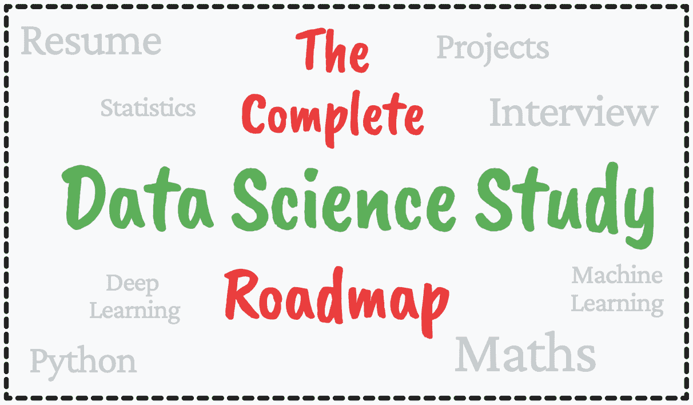

# 完整的数据科学学习路线图

> 原文：[`www.kdnuggets.com/2022/08/complete-data-science-study-roadmap.html`](https://www.kdnuggets.com/2022/08/complete-data-science-study-roadmap.html)

图片由作者提供

在这篇文章中，我将详细说明成为数据科学家的步骤。虽然这篇文章可能专为初学者准备，但现有的初级数据科学家可能会遗漏一些东西。我在这里帮助填补这些空白，让你在数据科学的旅程中不会感到冒名顶替或缺乏自信。

* * *

## 我们的前三个课程推荐

 1\. [谷歌网络安全证书](https://www.kdnuggets.com/google-cybersecurity) - 快速进入网络安全职业道路。

 2\. [谷歌数据分析专业证书](https://www.kdnuggets.com/google-data-analytics) - 提升你的数据分析技能

 3\. [谷歌 IT 支持专业证书](https://www.kdnuggets.com/google-itsupport) - 支持你的组织 IT

* * *

我将带你走过这些步骤——这终究是一张路线图。

# Python

Python 是目前最流行的编程语言之一，越来越多的人因其简单性而采用它。如果你打算进入数据科学但还没有选择编程语言——Python 总是一个好的开始。

以下是一些帮助你入门的课程：

+   [100 天代码：2022 年完整的 Python 专业训练营](https://www.udemy.com/course/100-days-of-code/) - Udemy

+   [编程入门（Python 入门指南）](https://www.coursera.org/learn/python) - Coursera（密歇根大学）

# 数据科学和机器学习

一旦你理解了字母表和元音的工作原理，就可以开始构建句子。我将编程语言以及数据科学和机器学习领域视作如此。

一旦你掌握了编程语言 Python，你应该能够很好地利用这个技能，将其应用于数据科学和/或机器学习。

以下是一些帮助你达到目标的课程：

+   [数据科学与机器学习 Python 训练营](https://www.udemy.com/course/python-for-data-science-and-machine-learning-bootcamp/) - Udemy

+   [数据科学课程 2022：完整的数据科学训练营](https://www.udemy.com/course/the-data-science-course-complete-data-science-bootcamp/) - Udemy

# 数学和统计学

由于对数据科学家、数据工程师、机器学习工程师等的需求很大，市场上有很多训练营。虽然它们都很棒，但其中一些忽视了数学和统计学在成为最佳数据科学家或机器学习工程师中的重要性。

数学和统计学非常重要，你需要彻底理解它们，以便将你的编码技能应用到实际世界中。虽然上述的数据科学和机器学习训练营课程会涉及数学和统计学，但这是你数据科学之旅中一个至关重要的元素，你需要搞清楚。

这里有一些其他资源可以帮助你：

+   [Josh Starmer 的统计学基础](https://www.youtube.com/playlist?list=PLblh5JKOoLUK0FLuzwntyYI10UQFUhsY9) - YouTube

+   [机器学习的数学基础](https://www.udemy.com/course/machine-learning-data-science-foundations-masterclass/) - Udemy

+   [数据科学与商业分析的统计学](https://www.udemy.com/course/statistics-for-data-science-and-business-analysis/) - Udemy

# 机器学习、深度学习与人工智能

如果你只是想成为一名数据科学家，这仍然很重要，你需要深入理解机器学习和深度学习的概念。人工智能涵盖了这三方面，并且它们之间有相似之处，因此了解和精通这些领域对你和你的职业生涯都有好处。

这里有一些课程可以进一步帮助你：

## 机器学习

+   [CS229 机器学习](https://online.stanford.edu/courses/cs229-machine-learning) - Stanford

+   [Andreas Mueller 的应用机器学习](https://www.youtube.com/watch?v=d79mzijMAw0&list=PL_pVmAaAnxIRnSw6wiCpSvshFyCREZmlM) - YouTube

+   [Josh Starmer 的机器学习](https://www.youtube.com/playlist?list=PLblh5JKOoLUICTaGLRoHQDuF_7q2GfuJF) - YouTube

## 深度学习

+   [freeCodeCamp.org 的初学者深度学习速成课程](https://www.youtube.com/watch?v=VyWAvY2CF9c) - YouTube

+   [Krish Naik 的完整深度学习课程](https://www.youtube.com/watch?v=YFNKnUhm_-s&list=PLZoTAELRMXVPGU70ZGsckrMdr0FteeRUi) - YouTube

+   [Andrew Ng 的深度学习专项课程](https://www.coursera.org/specializations/deep-learning) - Coursera

+   [深度学习 A-Z™：实践人工神经网络](https://www.udemy.com/course/deeplearning/) - Udemy

## 人工智能

+   [Microsoft Azure Cloud 的初学者人工智能课程](https://github.com/microsoft/ai-for-beginners) - GitHub。如果你想了解更多关于这个课程的信息，可以点击这个链接阅读我们首席编辑在 KDN 上撰写的博客。

+   [人工智能 A-Z™：学习如何构建 AI](https://www.udemy.com/course/artificial-intelligence-az/) - Udemy

# 项目

在学习阶段，通过实际问题应用你的技能总是很好且非常有用。如果你从事的是数据科学、机器学习、人工智能等领域，项目对你职业的发展至关重要。数据是新的黄金，你可以利用大量数据来解决问题、回答问题等。

以下是一些提供数据科学项目以及开放数据集网站的文章：

+   2022 年能让你获得工作的数据科学项目 由 Natassha Selvaraj 提供

+   Abid Ali Awan 的《数据科学项目完整合集》 – 第一部分 和 第二部分

+   [Kaggle](https://www.google.com/search?q=kaggle.&rlz=1C5CHFA_enGB920GB920&oq=kaggle.+&aqs=chrome..69i57j46i67i131i199i433i465j0i67j0i67i131i433j0i67j69i60l3.1348j0j7&sourceid=chrome&ie=UTF-8)

+   [UCI 机器学习资料库](https://archive.ics.uci.edu/ml/index.php)

# 简历

一旦你有了一些项目经验并且对编程感到自信，下一步就是申请工作。但在此之前，你需要一份简历。不仅仅是任何简历，而是一份好的简历，一份优秀的数据科学简历。

你正在进入一个新的领域，因此你将与不同类型的招聘人员或老板打交道。因此，拥有一份正确构建的简历将有助于你获得初次面试机会。

阅读这篇文章，了解你如何实现这一目标：

+   数据科学简历必备要素 由 Nisha Arya 提供

# 面试准备

每个人都害怕的部分，但也是每个人都在努力的部分——找到工作！这个行业的需求非常高，因此你不会缺少工作机会。然而，准备好并顺利通过面试才是难点。

记忆内容很多，当你在压力下被当场提问时，可能会很困难。然而，有数据科学备考课程、面试官常问的问题等，可以在这个阶段帮助你。

这里有一些资源：

+   Nisha Arya 的《数据科学面试指南》 – 第一部分：结构 和 第二部分：面试资源

+   [250+数据科学面试问题由 Krish Naik 提供](https://www.youtube.com/watch?v=Vo2zPqyFr6c&list=PLZoTAELRMXVMbpd_KBoOY_ecwMsDy92gS&index=1) - YouTube

+   21 份数据科学面试备考资料 由 Nate Rosidi 提供

+   [数据科学职业指南面试准备](https://www.udemy.com/course/data-science-career-guide-interview-preparation/) - Udemy

## 额外资源

+   免费大学数据科学资源

+   3 门免费的统计学课程用于数据科学

+   最值得关注的数据科学、机器学习和人工智能的 Instagram 账户

# 结论

我希望这个数据科学学习路线图能够激励你换个职业，或者最终迈出一步，开始学习数据科学。这些资源中的大多数要么因其优质内容而闻名，要么是畅销书，要么已被证明能帮助人们在数据科学旅程中取得进展。

祝一切顺利！

**[Nisha Arya](https://www.linkedin.com/in/nisha-arya-ahmed/)** 是一名数据科学家和自由技术写作人员。她特别感兴趣于提供数据科学职业建议或教程以及与数据科学相关的理论知识。她还希望探索人工智能如何能够或已经对人类寿命产生益处。作为一个热衷学习者，她寻求拓宽自己的技术知识和写作技能，同时帮助指导他人。

### 更多相关主题

+   [KDnuggets 新闻，8 月 31 日：完整的数据科学学习路线图…](https://www.kdnuggets.com/2022/n35.html)

+   [完整的数据工程学习路线图](https://www.kdnuggets.com/2022/11/complete-data-engineering-study-roadmap.html)

+   [完整的机器学习学习路线图](https://www.kdnuggets.com/2022/12/complete-machine-learning-study-roadmap.html)

+   [完整的 MLOps 学习路线图](https://www.kdnuggets.com/2022/12/complete-mlops-study-roadmap.html)

+   [KDnuggets 新闻，12 月 14 日：3 门免费的机器学习课程…](https://www.kdnuggets.com/2022/n48.html)

+   [超级学习指南：免费的算法和数据结构电子书](https://www.kdnuggets.com/2022/06/super-study-guide-free-algorithms-data-structures-ebook.html)
