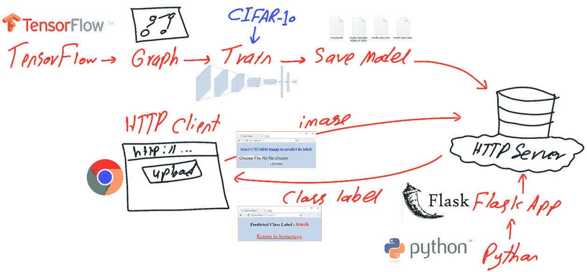
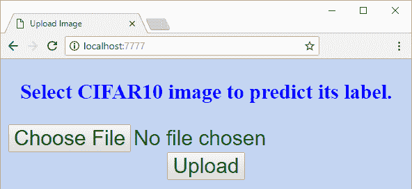
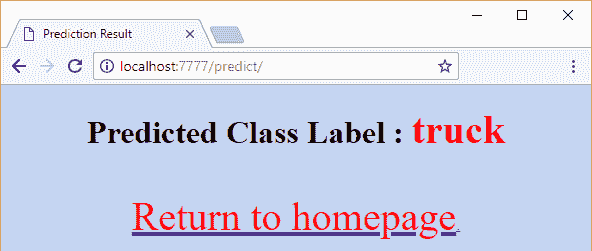

# 构建基于 TensorFlow 和 Flask RESTful Python API 的 ConvNet HTTP 应用程序完全指南

> 原文：[`www.kdnuggets.com/2018/05/complete-guide-convnet-tensorflow-flask-restful-python-api.html/2`](https://www.kdnuggets.com/2018/05/complete-guide-convnet-tensorflow-flask-restful-python-api.html/2)

 评论

### 4. 训练 CNN

在构建 CNN 的计算图后，接下来是对其进行训练，使用之前准备好的训练数据。训练是按照以下代码进行的。代码首先准备数据集的路径，并将其准备为一个占位符。请注意，路径应更改为适合你的系统。然后调用之前讨论的函数。训练好的 CNN 的预测用于衡量网络的成本，这些成本将通过梯度下降优化器进行最小化。注意：一些张量有一个名称，这在测试 CNN 时有助于检索这些张量。

```py
#Nnumber of classes in the dataset. Used to specify number of outputs in the last fully connected layer.
num_datatset_classes = 10
#Number of rows & columns in each input image. The image is expected to be rectangular Used to reshape the images and specify the input tensor shape.
im_dim = 32
#Number of channels in rach input image. Used to reshape the images and specify the input tensor shape.
num_channels = 3

#Directory at which the training binary files of the CIFAR10 dataset are saved.
patches_dir = "C:\\Users\\Dell\\Downloads\\Compressed\\cifar-10-python\\cifar-10-batches-py\\"
#Reading the CIFAR10 training binary files and returning the input data and output labels. Output labels are used to test the CNN prediction accuracy.
dataset_array, dataset_labels = get_dataset_images(dataset_path=patches_dir, im_dim=im_dim, num_channels=num_channels)
print("Size of data : ", dataset_array.shape)

"""
Input tensor to hold the data read above. It is the entry point of the computational graph.
The given name of 'data_tensor' is useful for retreiving it when restoring the trained model graph for testing.
"""
data_tensor = tensorflow.placeholder(tensorflow.float32, shape=[None, im_dim, im_dim, num_channels], name='data_tensor')

"""
Tensor to hold the outputs label. 
The name "label_tensor" is used for accessing the tensor when tesing the saved trained model after being restored.
"""
label_tensor = tensorflow.placeholder(tensorflow.float32, shape=[None], name='label_tensor')

#The probability of dropping neurons in the dropout layer. It is given a name for accessing it later.
keep_prop = tensorflow.Variable(initial_value=0.5, name="keep_prop")

#Building the CNN architecure and returning the last layer which is the fully connected layer.
fc_result2 = create_CNN(input_data=data_tensor, num_classes=num_datatset_classes, keep_prop=keep_prop)

"""
Predicitions probabilities of the CNN for each training sample.
Each sample has a probability for each of the 10 classes in the dataset.
Such tensor is given a name for accessing it later.
"""
softmax_propabilities = tensorflow.nn.softmax(fc_result2, name="softmax_probs")

"""
Predicitions labels of the CNN for each training sample.
The input sample is classified as the class of the highest probability.
axis=1 indicates that maximum of values in the second axis is to be returned. This returns that maximum class probability fo each sample.
"""
softmax_predictions = tensorflow.argmax(softmax_propabilities, axis=1)

#Cross entropy of the CNN based on its calculated probabilities.
cross_entropy = tensorflow.nn.softmax_cross_entropy_with_logits(logits=tensorflow.reduce_max(input_tensor=softmax_propabilities, reduction_indices=[1]),
                                                                labels=label_tensor)
#Summarizing the cross entropy into a single value (cost) to be minimized by the learning algorithm.
cost = tensorflow.reduce_mean(cross_entropy)
#Minimizng the network cost using the Gradient Descent optimizer with a learning rate is 0.01.
error = tensorflow.train.GradientDescentOptimizer(learning_rate=.01).minimize(cost)

#Creating a new TensorFlow Session to process the computational graph.
sess = tensorflow.Session()
#Wiriting summary of the graph to visualize it using TensorBoard.
tensorflow.summary.FileWriter(logdir="./log/", graph=sess.graph)
#Initializing the variables of the graph.
sess.run(tensorflow.global_variables_initializer())

"""
Because it may be impossible to feed the complete data to the CNN on normal machines, it is recommended to split the data into a number of patches.
A percent of traning samples is used to create each path. Samples for each path can be randomly selected.
"""
num_patches = 5#Number of patches
for patch_num in numpy.arange(num_patches):
    print("Patch : ", str(patch_num))
    percent = 80 #percent of samples to be included in each path.
    #Getting the input-output data of the current path.
    shuffled_data, shuffled_labels = get_patch(data=dataset_array, labels=dataset_labels, percent=percent)
    #Data required for cnn operation. 1)Input Images, 2)Output Labels, and 3)Dropout probability
    cnn_feed_dict = {data_tensor: shuffled_data,
                     label_tensor: shuffled_labels,
                     keep_prop: 0.5}
    """
    Training the CNN based on the current patch. 
    CNN error is used as input in the run to minimize it.
    SoftMax predictions are returned to compute the classification accuracy.
    """
    softmax_predictions_, _ = sess.run([softmax_predictions, error], feed_dict=cnn_feed_dict)
    #Calculating number of correctly classified samples.
    correct = numpy.array(numpy.where(softmax_predictions_ == shuffled_labels))
    correct = correct.size
    print("Correct predictions/", str(percent * 50000/100), ' : ', correct)

```

与其将整个训练数据喂给 CNN，不如将数据划分为若干补丁，并通过循环逐个补丁地输入网络。每个补丁包含训练数据的一个子集。使用 get_patch 函数返回这些补丁。该函数接受输入数据、标签以及要从数据中返回的样本百分比，然后根据输入的百分比返回数据的子集。

```py
def get_patch(data, labels, percent=70):

    """
    Returning patch to train the CNN.
    :param data: Complete input data after being encoded and reshaped.
    :param labels: Labels of the entire dataset.
    :param percent: Percent of samples to get returned in each patch.
    :return: Subset of the data (patch) to train the CNN model.
    """
    #Using the percent of samples per patch to return the actual number of samples to get returned.
    num_elements = numpy.uint32(percent*data.shape[0]/100)
    shuffled_labels = labels#Temporary variable to hold the data after being shuffled.
    numpy.random.shuffle(shuffled_labels)#Randomly reordering the labels.
    """
    The previously specified percent of the data is returned starting from the beginning until meeting the required number of samples. 
    The labels indices are also used to return their corresponding input images samples.
    """
    return data[shuffled_labels[:num_elements], :, :, :], shuffled_labels[:num_elements]

```

### 5. 保存训练好的 CNN 模型

在训练 CNN 后，模型会被保存以便在其他 Python 脚本中进行测试时重用。你还应该将模型保存路径更改为适合你系统的位置。

```py
#Saving the model after being trained.
saver = tensorflow.train.Saver()
save_model_path = "C:\\model\\"
save_path = saver.save(sess=sess, save_path=save_model_path+"model.ckpt")
print("Model saved in : ", save_path)

```

### 6. 准备测试数据和恢复训练好的 CNN 模型

在测试训练好的模型之前，需要准备测试数据并恢复之前训练好的模型。测试数据的准备类似于训练数据的处理，只不过只需解码一个二进制文件。测试文件会根据修改后的 get_dataset_images 函数进行解码。该函数调用 unpickle_patch 函数，过程与处理训练数据时相同。

```py
def get_dataset_images(test_path_path, im_dim=32, num_channels=3):

    """
    Similar to the one used in training except that there is just a single testing binary file for testing the CIFAR10 trained models.
    """
    print("Working on testing patch")
    data_dict = unpickle_patch(test_path_path)
    images_data = data_dict[b"data"]
    dataset_array = numpy.reshape(images_data, newshape=(len(images_data), im_dim, im_dim, num_channels))
    return dataset_array, data_dict[b"labels"]

```

### 7. 测试训练好的 CNN 模型。

准备好测试数据和恢复经过训练的模型后，我们可以根据以下代码开始测试模型。值得一提的是，我们的目标是仅返回输入样本的网络预测。这就是为什么 TF 会话运行时只返回预测结果。在训练 CNN 时，会话运行是为了最小化成本。在测试中，我们不再关心最小化成本。另一个有趣的点是，dropout 层的保持概率现在设置为 1\。这意味着不丢弃任何节点。这是因为我们在确定了丢弃哪些节点后，只使用预训练模型。现在我们只是使用模型之前的状态，而不再关心通过丢弃其他节点来进行修改。

```py
#Dataset path containing the testing binary file to be decoded.
patches_dir = "C:\\Users\\Dell\\Downloads\\Compressed\\cifar-10-python\\cifar-10-batches-py\\"
dataset_array, dataset_labels = get_dataset_images(test_path_path=patches_dir + "test_batch", im_dim=32, num_channels=3)
print("Size of data : ", dataset_array.shape)

sess = tensorflow.Session()

#Restoring the previously saved trained model.
saved_model_path = 'C:\\Users\\Dell\\Desktop\\model\\'
saver = tensorflow.train.import_meta_graph(saved_model_path+'model.ckpt.meta')
saver.restore(sess=sess, save_path=saved_model_path+'model.ckpt')

#Initalizing the varaibales.
sess.run(tensorflow.global_variables_initializer())

graph = tensorflow.get_default_graph()

"""
Restoring previous created tensors in the training phase based on their given tensor names in the training phase.
Some of such tensors will be assigned the testing input data and their outcomes (data_tensor, label_tensor, and keep_prop).
Others are helpful in assessing the model prediction accuracy (softmax_propabilities and softmax_predictions).
"""
softmax_propabilities = graph.get_tensor_by_name(name="softmax_probs:0")
softmax_predictions = tensorflow.argmax(softmax_propabilities, axis=1)
data_tensor = graph.get_tensor_by_name(name="data_tensor:0")
label_tensor = graph.get_tensor_by_name(name="label_tensor:0")
keep_prop = graph.get_tensor_by_name(name="keep_prop:0")

#keep_prop is equal to 1 because there is no more interest to remove neurons in the testing phase.
feed_dict_testing = {data_tensor: dataset_array,
                     label_tensor: dataset_labels,
                     keep_prop: 1.0}
#Running the session to predict the outcomes of the testing samples.
softmax_propabilities_, softmax_predictions_ = sess.run([softmax_propabilities, softmax_predictions],
                                                      feed_dict=feed_dict_testing)
#Assessing the model accuracy by counting number of correctly classified samples.
correct = numpy.array(numpy.where(softmax_predictions_ == dataset_labels))
correct = correct.size
print("Correct predictions/10,000 : ", correct)

```

### 8\. 构建 Flask Web 应用程序

训练 CNN 模型后，我们可以将其添加到 HTTP 服务器上，并允许用户在线使用它。用户将通过 HTTP 客户端上传图像。上传的图像将由 HTTP 服务器接收，或者更具体地说，由 Flask Web 应用程序接收。该应用程序将根据训练好的模型预测图像的类别标签，并最终将类别标签返回给 HTTP 客户端。这一讨论总结在图 5 中。

**图 5**



```py
import flask
#Creating a new Flask Web application. It accepts the package name.
app = flask.Flask("CIFAR10_Flask_Web_App")

"""
To activate the Web server to receive requests, the application must run.
A good practice is to check whether the file is whether the file called from an external Python file or not.
If not, then it will run.
"""
if __name__ == "__main__":
    """
    In this example, the app will run based on the following properties:
    host: localhost
    port: 7777
    debug: flag set to True to return debugging information.
    """
    app.run(host="localhost", port=7777, debug=True)

```

目前，服务器没有提供任何功能。服务器应该做的第一件事是允许用户上传图像。当用户访问应用程序的根 URL 时，应用程序不会执行任何操作。应用程序可以将用户重定向到一个 HTML 页面，用户可以在该页面上传图像。为此，应用程序有一个名为 redirect_upload 的函数，用于将用户重定向到一个上传图像的页面。让此函数在用户访问应用程序的根目录后执行的是通过以下代码创建的路由：

```py
app.add_url_rule(rule="/", endpoint="homepage", view_func=redirect_upload)

```

这一行表示，如果用户访问应用程序的根目录（标记为**"/"**），则会调用视图函数（redirect_upload）。该函数除了渲染一个名为**upload_image.html**的 HTML 页面之外，不执行其他操作。该页面位于服务器的特殊**templates**目录下。templates 目录中的页面是通过调用 render_template 函数进行渲染的。请注意，有一个名为 endpoint 的属性，使得可以方便地多次重用相同的路由，而无需硬编码。

```py
def redirect_upload():

    """
    A viewer function that redirects the Web application from the root to a HTML page for uploading an image to get classified.
    The HTML page is located under the /templates directory of the application.
    :return: HTML page used for uploading an image. It is 'upload_image.html' in this exmaple.
    """
    return flask.render_template(template_name_or_list="upload_image.html")
"""
Creating a route between the homepage URL (http://localhost:7777) to a viewer function that is called after getting to such URL. 
Endpoint 'homepage' is used to make the route reusable without hard-coding it later.
"""
app.add_url_rule(rule="/", endpoint="homepage", view_func=redirect_upload)

```

渲染的 HTML 页面屏幕如图 6 所示。

**图 6**



这是该页面的 HTML 代码。它是一个简单的表单，允许用户上传图像文件。提交该表单时，将返回一个 POST HTTP 消息到 URL [**http://localhost:7777/upload/**](http://localhost:7777/upload/)。

```py
<!DOCTYPE html>
<html lang="en">
<head>
    <link rel="stylesheet" type="text/css" href="{{url_for(endpoint='static', filename='project_styles.css')}}">
    <meta charset="UTF-8">
    <title>Upload Image</title>
</head>
<body>
<form enctype="multipart/form-data" method="post" action="http://localhost:7777/upload/">
    <center>
    <h3>Select CIFAR10 image to predict its label.</h3>
    <input type="file" name="image_file" accept="image/*"><br>
    <input type="submit" value="Upload">
    </center>
</form>
</body>
</html>

```

从 HTML 表单返回到服务器后，将调用与**form action**属性中指定的 URL 关联的 viewer 函数，即 upload_image 函数。该函数获取用户选择的图像并将其保存到服务器。

```py
def upload_image():

    """
    Viewer function that is called in response to getting to the 'http://localhost:7777/upload' URL.
    It uploads the selected image to the server.
    :return: redirects the application to a new page for predicting the class of the image.
    """
    #Global variable to hold the name of the image file for reuse later in prediction by the 'CNN_predict' viewer functions.
    global secure_filename
    if flask.request.method == "POST":#Checking of the HTTP method initiating the request is POST.
        img_file = flask.request.files["image_file"]#Getting the file name to get uploaded.
        secure_filename = werkzeug.secure_filename(img_file.filename)#Getting a secure file name. It is a good practice to use it.
        img_path = os.path.join(app.root_path, secure_filename)#Preparing the full path under which the image will get saved.
        img_file.save(img_path)#Saving the image in the specified path.
        print("Image uploaded successfully.")
        """
        After uploading the image file successfully, next is to predict the class label of it.
        The application will fetch the URL that is tied to the HTML page responsible for prediction and redirects the browser to it.
        The URL is fetched using the endpoint 'predict'.
        """
        return flask.redirect(flask.url_for(endpoint="predict"))
    return "Image upload failed."
"""
Creating a route between the URL (http://localhost:7777/upload) to a viewer function that is called after navigating to such URL. 
Endpoint 'upload' is used to make the route reusable without hard-coding it later.
The set of HTTP method the viewer function is to respond to is added using the 'methods' argument.
In this case, the function will just respond to requests of method of type POST.
"""
app.add_url_rule(rule="/upload/", endpoint="upload", view_func=upload_image, methods=["POST"])

```

在成功将图像上传到服务器后，我们准备好读取图像并使用先前训练的 CNN 模型预测其类别标签。为此，upload_image 函数将应用程序重定向到负责预测图像类别标签的 viewer 函数。可以通过其 endpoint 达到该 viewer 函数，如这一行所指定：

```py
return flask.redirect(flask.url_for(endpoint="predict"))

```

与 endpoint=**"predict"** 相关的方法将被调用，即 CNN_predict 函数。该方法读取图像并检查其是否符合 CIFAR-10 数据集的尺寸，即 32x32x3。如果图像符合 CIFAR-10 数据集的规格，则将传递给负责进行预测的函数，如下行所示：

```py
predicted_class = CIFAR10_CNN_Predict_Image.main(img)

```

负责预测图像类别标签的主要功能如下所示。它恢复了训练好的模型并运行一个会话，返回图像的预测类别。预测的类别会返回到 Flask Web 应用程序。

```py
def CNN_predict():

    """
    Reads the uploaded image file and predicts its label using the saved pre-trained CNN model.
    :return: Either an error if the image is not for CIFAR10 dataset or redirects the browser to a new page to show the prediction result if no error occurred.
    """
    """
    Setting the previously created 'secure_filename' to global.
    This is because to be able invoke a global variable created in another function, it must be defined global in the caller function.
    """
    global secure_filename
    #Reading the image file from the path it was saved in previously.
    img = scipy.misc.imread(os.path.join(app.root_path, secure_filename))

    """
    Checking whether the image dimensions match the CIFAR10 specifications.
    CIFAR10 images are RGB (i.e. they have 3 dimensions). It number of dimenions was not equal to 3, then a message will be returned.
    """
    if(img.ndim) == 3:
        """
        Checking if the number of rows and columns of the read image matched CIFAR10 (32 rows and 32 columns).
        """
        if img.shape[0] == img.shape[1] and img.shape[0] == 32:
            """
            Checking whether the last dimension of the image has just 3 channels (Red, Green, and Blue).
            """
            if img.shape[-1] == 3:
                """
                Passing all conditions above, the image is proved to be of CIFAR10.
                This is why it is passed to the predictor.
                """
                predicted_class = CIFAR10_CNN_Predict_Image.main(img)
                """
                After predicting the class label of the input image, the prediction label is rendered on an HTML page.
                The HTML page is fetched from the /templates directory. The HTML page accepts an input which is the predicted class.
                """
                return flask.render_template(template_name_or_list="prediction_result.html", predicted_class=predicted_class)
            else:
                # If the image dimensions do not match the CIFAR10 specifications, then an HTML page is rendered to show the problem.
                return flask.render_template(template_name_or_list="error.html", img_shape=img.shape)
        else:
            # If the image dimensions do not match the CIFAR10 specifications, then an HTML page is rendered to show the problem.
            return flask.render_template(template_name_or_list="error.html", img_shape=img.shape)
    return "An error occurred."#Returned if there is a different error other than wrong image dimensions.
"""
Creating a route between the URL (http://localhost:7777/predict) to a viewer function that is called after navigating to such URL. 
Endpoint 'predict' is used to make the route reusable without hard-coding it later.
"""
app.add_url_rule(rule="/predict/", endpoint="predict", view_func=CNN_predict)

```

负责预测图像类别标签的主要功能如下所示。它恢复了训练好的模型并运行一个会话，返回图像的预测类别。预测的类别会返回到 Flask Web 应用程序。

```py
def main(img):

    """
    The 'main' method accepts an input image array of size 32x32x3 and returns its class label.
    :param img:RGB image of size 32x32x3.
    :return:Predicted class label.
    """
    #Dataset path containing a binary file with the labels of classes. Useful to decode the prediction code into a significant textual label.
    patches_dir = "C:\\cifar-10-python\\cifar-10-batches-py\\"
    dataset_array = numpy.random.rand(1, 32, 32, 3)
    dataset_array[0, :, :, :] = img

    sess = tensorflow.Session()

    #Restoring the previously saved trained model.
    saved_model_path = 'C:\\model\\'
    saver = tensorflow.train.import_meta_graph(saved_model_path+'model.ckpt.meta')
    saver.restore(sess=sess, save_path=saved_model_path+'model.ckpt')

    #Initalizing the varaibales.
    sess.run(tensorflow.global_variables_initializer())

    graph = tensorflow.get_default_graph()

    """
    Restoring previous created tensors in the training phase based on their given tensor names in the training phase.
    Some of such tensors will be assigned the testing input data and their outcomes (data_tensor, label_tensor, and keep_prop).
    Others are helpful in assessing the model prediction accuracy (softmax_propabilities and softmax_predictions).
    """
    softmax_propabilities = graph.get_tensor_by_name(name="softmax_probs:0")
    softmax_predictions = tensorflow.argmax(softmax_propabilities, axis=1)
    data_tensor = graph.get_tensor_by_name(name="data_tensor:0")
    label_tensor = graph.get_tensor_by_name(name="label_tensor:0")
    keep_prop = graph.get_tensor_by_name(name="keep_prop:0")

    #keep_prop is equal to 1 because there is no more interest to remove neurons in the testing phase.
    feed_dict_testing = {data_tensor: dataset_array,
                         keep_prop: 1.0}
    #Running the session to predict the outcomes of the testing samples.
    softmax_propabilities_, softmax_predictions_ = sess.run([softmax_propabilities, softmax_predictions],
                                                          feed_dict=feed_dict_testing)
    label_names_dict = unpickle_patch(patches_dir + "batches.meta")
    dataset_label_names = label_names_dict[b"label_names"]
    return dataset_label_names[softmax_predictions_[0]].decode('utf-8')

```

图像返回的类别标签将根据 CNN_predict 函数在这一行的指示显示在名为**prediction_result.html**的新 HTML 页面上，如图 7 所示。

**图 7**



请注意，Flask 应用程序使用 Jinja2 模板引擎，允许 HTML 页面接受输入参数。此情况下传递的输入参数是 predicted_class=predicted_class。

```py
return flask.render_template(template_name_or_list="prediction_result.html", predicted_class=predicted_class)

```

这样的页面的 HTML 代码如下。

```py
<!DOCTYPE html>
<html lang="en">
<head>
    <link rel="stylesheet" type="text/css" href="{{url_for(endpoint='static', filename='project_styles.css')}}">
    <script type="text/javascript" src="{{url_for(endpoint='static', filename='result.js')}}"></script>
    <meta charset="UTF-8">
    <title>Prediction Result</title>
</head>
<body onload="show_alert('{{predicted_class}}')">
<center><h1>Predicted Class Label : <span>{{predicted_class}}</span></h1>
    <br>
    <a href="{{url_for(endpoint='homepage')}}"><span>Return to homepage</span>.</a>
</center>
</body>
</html>

```

这是一个模板，由图像的预测类别填充，该类别作为参数传递给 HTML 页面，如代码的这一部分所示：

```py
<span>{{predicted_class}}</span>

```

有关 Flask RESTful API 的更多信息，请访问此教程 [`www.tutorialspoint.com/flask/index.htm`](https://www.tutorialspoint.com/flask/index.htm)。

完整的项目可以在 Github 上通过此链接获取: [`github.com/ahmedfgad/CIFAR10CNNFlask`](https://github.com/ahmedfgad/CIFAR10CNNFlask)

**简历: [Ahmed Gad](https://www.linkedin.com/in/ahmedfgad/)** 于 2015 年 7 月获得埃及门努非亚大学计算机与信息学院（FCI）信息技术专业优秀荣誉学士学位。因在学院排名第一，他于 2015 年被推荐在埃及的一所学院担任助教，随后于 2016 年担任助教和研究员。他目前的研究兴趣包括深度学习、机器学习、人工智能、数字信号处理和计算机视觉。

[原文](https://www.linkedin.com/pulse/complete-guide-build-convnet-http-based-application-using-ahmed-gad/)。经许可转载。

**相关：**

+   使用 NumPy 从头构建卷积神经网络

+   从全连接网络逐步推导卷积神经网络

+   遗传算法优化入门

* * *

## 我们的前三大课程推荐

 1\. [Google 网络安全证书](https://www.kdnuggets.com/google-cybersecurity) - 快速进入网络安全职业道路。

 2\. [Google 数据分析专业证书](https://www.kdnuggets.com/google-data-analytics) - 提升您的数据分析技能

 3\. [Google IT 支持专业证书](https://www.kdnuggets.com/google-itsupport) - 支持您的组织的 IT 工作

* * *

### 更多相关主题

+   [每个数据科学家都应该知道的三个 R 库（即使你使用 Python）](https://www.kdnuggets.com/2021/12/three-r-libraries-every-data-scientist-know-even-python.html)

+   [为什么 Python 是初创公司理想的编程语言](https://www.kdnuggets.com/2021/12/makes-python-ideal-programming-language-startups.html)

+   [停止学习数据科学以寻找目标，寻找目标以…](https://www.kdnuggets.com/2021/12/stop-learning-data-science-find-purpose.html)

+   [一个 90 亿美元 AI 失败案例的分析](https://www.kdnuggets.com/2021/12/9b-ai-failure-examined.html)

+   [学习数据科学统计学的最佳资源](https://www.kdnuggets.com/2021/12/springboard-top-resources-learn-data-science-statistics.html)

+   [成功数据科学家的五个特征](https://www.kdnuggets.com/2021/12/5-characteristics-successful-data-scientist.html)
