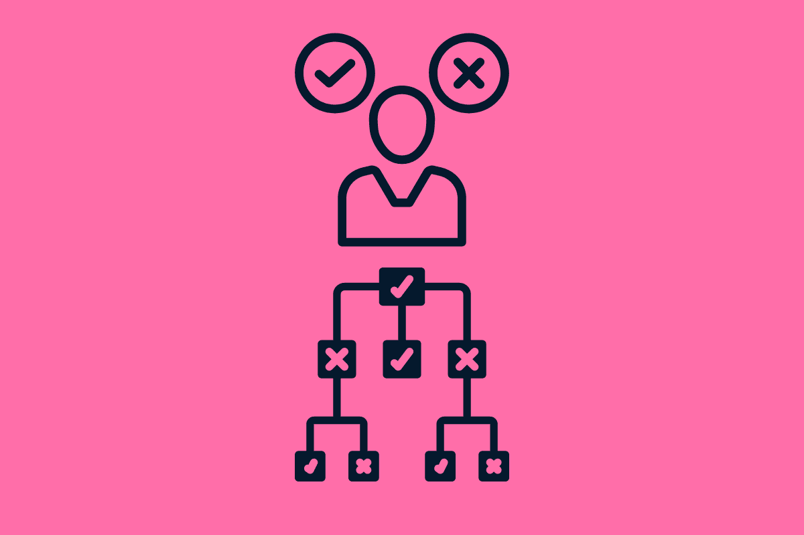

# 决策树软件的完整指南

> 原文：[`www.kdnuggets.com/2022/08/complete-guide-decision-tree-software.html`](https://www.kdnuggets.com/2022/08/complete-guide-decision-tree-software.html)

编辑器图片

# 什么是决策树？

* * *

## 我们的前三名课程推荐

 1\. [Google 网络安全证书](https://www.kdnuggets.com/google-cybersecurity) - 快速进入网络安全职业的快车道。

 2\. [Google 数据分析专业证书](https://www.kdnuggets.com/google-data-analytics) - 提升您的数据分析技能

 3\. [Google IT 支持专业证书](https://www.kdnuggets.com/google-itsupport) - 支持您组织的 IT 工作

* * *

**决策树软件**是一种以机器学习为主导的应用程序，帮助采取最佳行动并组织数据以形成最相关和最兼容的决策。从图示来看，决策树是一个类似树的框架，节点包含信息。

决策树将相关数据集分类并整理成有意义且易于解释的信息基础。此外，决策树还可以被训练以根据提交到框架的先前数据预测未来的行动。

# 决策树是如何工作的？

决策树模型用于将信息分类为有意义的顺序结果。

决策树由根节点组成——根节点是决策树的起始点。它进一步分为分支和内部节点。内部节点是查看者在得出结论之前分析的后续信息片段。

最终，决策树有多个叶节点。叶节点是终点，标志着在决策树中沿特定路径跟随时信息的结束。

内部节点描绘了条件，而叶节点则代表基于所选需求的最终决策。从根节点开始，用户或机器学习/人工智能模式建立所需的条件，最终到达提供最终决策的叶节点。

# 决策树用于什么？

决策树在各种行业中有着先进的应用场景：

## #1 数据挖掘

**决策树软件**用于构建数据挖掘的分类和回归模型。数据分析师可以通过预测值或类别标签轻松地可视化数据集的结果。

## #2 工程

不变尺度是一个分析函数，当尺度被乘以一个共同的因子时不会改变。决策树机器学习模型不受特征缩放的影响，因此被广泛用于分析与工程相关的数据集。

## #3 医学科学

决策树赋能医学科学中的知识支持、有效和可靠的决策。根据收集的信息，医疗从业者可以通过决策树中的相关信息快速推导出相关结果。

## #4 人工智能

人工智能驱动的动态决策树用于根据过去提供的数据预测未来的值。它帮助 AI 模式确定最佳的下一步行动，并避免不相关的结论。

## #5 认知科学

一个**决策树软件**绑定并展示了认知类别、教育方法、学习目标和结果测量之间的关系。此外，决策树还帮助分析认知，以理解模式和偏见。

## #6 客户服务

简单易用的[客户服务决策树生成器](https://knowmax.ai/decision-tree-maker/)提升了客户体验。客户服务人员可以通过下一步最佳行动方法迅速解决复杂的客户问题。根据客户反馈，决策树允许代理做出智能决策。此外，决策树还可以与聊天机器人集成，使自助服务渠道在解决问题时更加灵活和可靠。

# 使用决策树的优势是什么？

## #1 改善决策制定

决策树帮助矿工、数据科学家和分析师仔细整理数据，以做出最佳决策。决策树模型可以根据每个数据的核心值进行训练，以进行复杂分析，配置数据集的顺序流。同样，对于较简单的问题，易于使用的交互式决策树根据下一步最佳行动原则提供逻辑流的信息。

## #2 分类和回归分析

**决策树软件**在分类和回归分析中表现良好。**决策树软件**可以分析连续和离散数据集。它提供了数据集的多类分类。同样，决策树还解决了复杂的回归问题，以推动数据驱动的决策制定。

## #3 易于理解和可视化

训练过的决策树基于最佳替代原则来得出终端数据类别。决策树模型易于理解和解释，因为任何分支的相应值都是逻辑上最佳的替代方案。此外，数据集的树状表示进一步帮助简化和直观化数据库。

## #4 关系的快速分析

训练过的决策树模型通过快速映射数据点之间的关系来帮助数据探索。它识别出最重要的值，并能够迅速确定两个或更多数据值之间的关系性质。

## #5 数据准备

决策树不需要对数据集进行繁重的数据准备。它直接处理数据库中的值，不受节点中任何缺失值的影响。同样，决策树模型不需要像规范化和创建虚拟变量这样的分析准备。

# 决策树解决了哪些挑战？

决策树解决了各种问题：

## #1 信息杂乱

机器学习驱动的决策树通过关系整合大量数据值。由于决策树可以对连续和离散数据库进行分析，它们可以处理不同的数据集以组织数据并得出有意义的结果。

## #2 定位相关数据

**决策树软件**解决了延迟到达预期结果的问题。由于值通过关系被整合到决策树中，用户可以通过下一步最佳行动的方法迅速达到期望的结果。

在下一步最佳行动方法中，用户可以根据条件回答节点问题，并迅速做出最佳决策。

## #3 复杂分析

通常，分析模型和函数具有复杂的接口，需要进行解读和理解。相比之下，决策树则简单。树状框架可以很容易地解释，并且非技术人员也能进一步理解。

# 决策树和随机森林之间的关系是什么？

决策树和随机森林是两种流行的决策启用算法。如前所述，决策树是一个树状框架，具有顺序信息流。在这里，用户或机器学习/人工智能模式遵循节点中封装的条件的相关性。相反，随机森林结合了不相关的决策树。

随机森林在数据科学家需要从庞大而杂乱的数据中得出结果的领域更受欢迎。由于决策树遵循类似的思维过程，单一树给出的最终预测可能会受到偏见的影响。随机森林可以消除这种情况。

在这里，通过分析不同决策树给出的预测来做出决策。根据特定结果的出现频率来判断预测，最受欢迎的预测被选为结果。

# 读者还需要了解关于决策树和机器学习的什么？

**决策树软件**正在帮助数据科学家和分析师整合和学习各种数据。此外，机器学习驱动的决策帮助他们做出智能的数据驱动决策。有趣的是，决策树不仅限于分析。

除了复杂的基于研究的预测或分析，决策树在多个现代决策导向的实践中也有应用。许多基于机器学习的决策树 DIY 版本存在，帮助个人做出正确的决策。

从寻找 BFSI 领域的相关贷款计划到解决电信领域的互联网路由器相关问题，决策树正在强化可靠、相关且快速的决策方法。

未来，预计将出现更复杂的机器学习主导的决策树版本。

**[哈曼普里特·辛格·甘比尔](https://www.linkedin.com/in/harmanpreet-singh-ghambir-306318213/)** 是 [Knowmax](https://knowmax.ai/) 的客户成功专家，该公司提供企业知识库管理系统，用于客户服务。当他不在桌前时，他喜欢探索更多关于客户成功最佳实践的内容。

### 更多相关内容

+   [通过 Python 和 Scikit-learn 简化决策树可解释性](https://www.kdnuggets.com/2017/05/simplifying-decision-tree-interpretation-decision-rules-python.html)

+   [决策树算法详解](https://www.kdnuggets.com/2020/01/decision-tree-algorithm-explained.html)

+   [通过实施理解：决策树](https://www.kdnuggets.com/2023/02/understanding-implementing-decision-tree.html)

+   [讲述一个伟大的数据故事：可视化决策树](https://www.kdnuggets.com/2021/02/telling-great-data-story-visualization-decision-tree.html)

+   [随机森林与决策树：主要区别](https://www.kdnuggets.com/2022/02/random-forest-decision-tree-key-differences.html)

+   [KDnuggets™ 新闻 22:n09，3 月 2 日：讲述一个伟大的数据故事：A…](https://www.kdnuggets.com/2022/n09.html)
