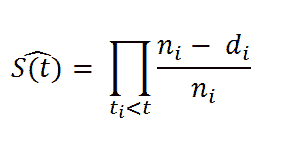
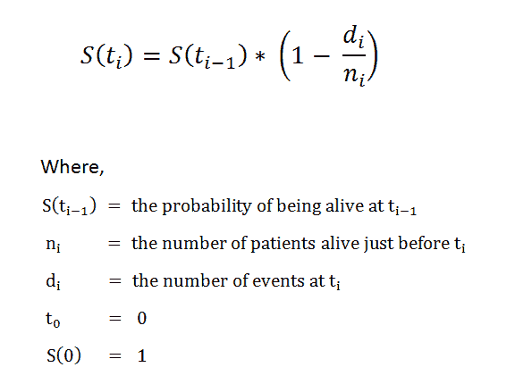
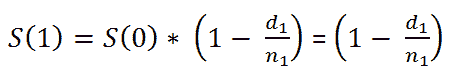
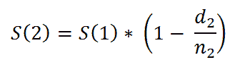
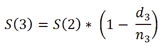
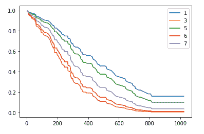

# 完整指南：Python 中的生存分析，第一部分

> 原文：[`www.kdnuggets.com/2020/07/complete-guide-survival-analysis-python-part1.html`](https://www.kdnuggets.com/2020/07/complete-guide-survival-analysis-python-part1.html)

评论

**由[Pratik Shukla](https://medium.com/@shuklapratik22)，有志的机器学习工程师**。

* * *

## 我们的前三大课程推荐

 1\. [谷歌网络安全证书](https://www.kdnuggets.com/google-cybersecurity) - 快速进入网络安全职业的快车道。

 2\. [谷歌数据分析专业证书](https://www.kdnuggets.com/google-data-analytics) - 提升你的数据分析能力。

 3\. [谷歌 IT 支持专业证书](https://www.kdnuggets.com/google-itsupport) - 支持你组织的 IT 需求。

* * *

### 生存分析基础

**生存分析**是一组统计方法，用于找出某个事件发生所需的时间。生存分析用于研究**时间**直到某个**事件**（通常指**死亡**）发生。时间可以以年、月、周、天等为单位。事件可以是任何感兴趣的事物，如实际的死亡、出生、退休等。

**如何分析持续的 COVID-19 疫情数据？**

(1) 我们可以找出患者出现 COVID-19 症状的天数。

(2) 我们可以发现哪个年龄组的死亡率更高。

(3) 我们可以找出哪种治疗方法具有最高的生存概率。

(4) 我们可以发现一个人的性别是否对他们的生存时间有显著影响？

(5) 我们还可以找出患者的生存天数中位数。

我们将对肺癌患者进行深入分析。别担心，一旦你理解了其中的逻辑，你将能够在任何数据集上应用它。**激动人心，不是吗？**

**生存分析**在以下领域中使用：

+   针对患者生存时间的癌症研究。

+   社会学中的“事件历史分析”。

+   在工程学中用于“失效时间分析”。

+   直到产品故障的时间。

+   从保修索赔开始到索赔完成的时间。

+   直到过程达到关键水平的时间。

+   从初次销售联系到完成销售的时间。

+   从员工入职到终止或离职的时间。

+   从销售人员入职到他们第一次销售的时间。

在**癌症研究**中，典型的研究问题包括：

(1) 某些临床特征对患者生存的影响是什么？例如，高血糖人群和非高血糖人群之间有何差异？

(2) 个体在特定时间段（年、月、天）内幸存的概率是多少？例如，给定一组癌症患者，如果诊断癌症后的 300（随机数字）天已过去，那么该人在那时仍然存活的概率为 0.7（随机数字）。

(3) 不同患者组之间的生存是否存在差异？例如，假设有 2 组癌症患者，这 2 组接受了两种不同的治疗。现在我们的目标是找出这两组基于所接受治疗的生存时间是否存在显著差异。

### 目标

在癌症研究中，大多数生存分析使用以下方法。

(1) *Kaplan-Meier 图* 用于可视化生存曲线。

(2) *Nelson-Aalen 图* 用于可视化累积风险。

(3) *Log-rank 检验* 用于比较两个或多个组的生存曲线

(4) *Cox 比例风险回归* 用于找出不同变量如年龄、性别、体重对生存的影响。

### 基本概念

这里，我们首先定义生存分析的基本术语，包括：

+   生存时间和事件。

+   数据删失。

+   生存函数和风险函数。

**癌症研究中的生存时间和事件类型**

生存时间：指一个受试者存活或积极参与调查的时间。

事件主要有三种类型，包括：

(1) **复发**：健康状况在暂时改善后的恶化。

(2) **进展**：逐渐发展或向更高级状态过渡的过程。（健康状况的改善。）

(3) **死亡**：某事物的毁灭或永久终结。

**删失**

如上所述，生存分析关注的是感兴趣事件的发生（例如，出生、死亡、退休）。但仍有可能因各种原因未观察到该事件。这些观察被称为删失观察。

删失可能以以下方式出现：

1.  患者在研究期间尚未（还未）经历感兴趣的事件（在我们的案例中为死亡或复发）。

1.  患者不再被跟踪。

1.  如果患者搬到另一个城市，那么医院工作人员可能无法进行跟踪。

这种删失类型，被称为*右删失*，在生存分析中处理。

删失一般分为三种类型：右删失、左删失和区间删失。

**右删失**：指人的死亡。

**左删失**：由于某种原因无法观察到事件。这包括实验开始前发生的事件。（例如，从出生开始到孩子开始走路的天数。）

**区间删失**：当我们只有一些区间的数据时。

**生存与风险函数**

我们通常使用两个相关的概率来分析生存数据。

(1) 生存概率

(2) 风险概率

要计算生存概率，我们将使用生存函数 S(t)，这就是 Kaplan-Meier 估计器。生存概率是指个体（例如患者）从时间起点（例如癌症诊断）到指定未来时间 t 存活的概率。例如，S(200) = 0.7 表示在癌症诊断后经过 200 天，患者的生存概率下降至 0.7。如果该人在实验结束时仍然活着，那么这些数据将被视为删失数据。

风险概率，用 h(t) 表示，是指在时间 t 观察下的个体（例如患者）在该时间发生事件（例如死亡）的概率。例如，如果 h(200) = 0.7，那么意味着在 t=200 天时该人死亡的概率是 0.7。

请注意，与关注事件未发生的生存函数不同，风险函数关注事件的发生。我认为我们可以清楚地看到，较高的生存概率和较低的风险概率对患者有利。

### 让我们继续进入有趣的编码部分吧！

你可以从[**这里**](http://www-eio.upc.edu/~pau/cms/rdata/datasets.html)**下载数据集**。

**数据描述**

**Kaplan-Meier 估计器**

**Kaplan–Meier 估计器** 是一种非参数统计方法，用于从生存数据中估计生存函数（个体存活的概率）。在医学研究中，它常用于测量患者在治疗后存活一段时间的比例。例如，计算某患者在被诊断为癌症或治疗开始后的存活时间（年、月、日）。该估计器以 **Edward L. Kaplan** 和 **Paul Meier** 的名字命名，他们各自向 *美国统计学会杂志* 提交了类似的稿件。

Kaplan-Meier 的公式如下：

在时间 ti，S(ti) 的概率计算为

我们也可以将其写成

生存函数

例如，

更一般地，我们可以说，

*生存函数简化版。*

例如，我们可以说，

在下一篇文章中，我们将使用 Python 实现 Kaplan-Meier 估计器和 Nelson-Aalen 估计器。

**最终结果**

在这个三部分系列的最后，你将能够绘制这样的图表，从中我们可以推断患者的生存情况。**坚持住！**

整个系列：

+   [Python 中生存分析的完整指南，第一部分](https://www.kdnuggets.com/2020/07/complete-guide-survival-analysis-python-part1.html) 这三部分系列涵盖了逐步解释和代码的回顾，展示了如何进行统计生存分析，以调查某些事件发生所需的时间，例如 COVID-19 大流行期间的患者生存时间、工程产品的故障时间，甚至是首次客户接触后的销售关闭时间。

+   [Python 中生存分析的完整指南，第二部分](https://www.kdnuggets.com/2020/07/guide-survival-analysis-python-part-2.html) 我们详细查看了 Kaplan-Meier 适配器理论和 Nelson-Aalen 适配器理论的实现示例，包含实例和共享代码。

+   [Python 中生存分析的完整指南，第三部分](https://www.kdnuggets.com/2020/07/guide-survival-analysis-python-part-3.html) 我们详细查看了基于不同组的 Kaplan-Meier 适配器、Log-Rank 检验和 Cox 回归的实现示例，包含实例和共享代码。

[原创](https://medium.com/@shuklapratik22/a-complete-guide-to-survival-analysis-in-python-956e6223c081)。经许可转载。

**简介：**[Pratik Shukla](https://medium.com/@shuklapratik22)是一位有抱负的机器学习工程师，喜欢将复杂理论以简单方式呈现。Pratik 在计算机科学领域完成了本科课程，并正在南加州大学攻读计算机科学硕士学位。 “瞄准月亮。即使错过了，你也会落在星星中。-- Les Brown”

**相关：**

+   [业务分析中的生存分析](https://www.kdnuggets.com/2017/11/survival-analysis-business-analytics.html)

+   [数据科学的 8 个基本统计概念](https://www.kdnuggets.com/2020/06/8-basic-statistics-concepts.html)

+   [构建预测客户流失模型的挑战](https://www.kdnuggets.com/2017/03/datascience-building-predictive-churn-model.html)

### 更多主题

+   [每个数据科学家都应该知道的三个 R 库（即使你使用 Python）](https://www.kdnuggets.com/2021/12/three-r-libraries-every-data-scientist-know-even-python.html)

+   [是什么让 Python 成为初创企业理想的编程语言](https://www.kdnuggets.com/2021/12/makes-python-ideal-programming-language-startups.html)

+   [停止学习数据科学以寻找目标，并寻找目标以...](https://www.kdnuggets.com/2021/12/stop-learning-data-science-find-purpose.html)

+   [90 亿美元的 AI 失败，详尽审视](https://www.kdnuggets.com/2021/12/9b-ai-failure-examined.html)

+   [学习数据科学统计学的顶级资源](https://www.kdnuggets.com/2021/12/springboard-top-resources-learn-data-science-statistics.html)

+   [成功的数据科学家的 5 个特征](https://www.kdnuggets.com/2021/12/5-characteristics-successful-data-scientist.html)
