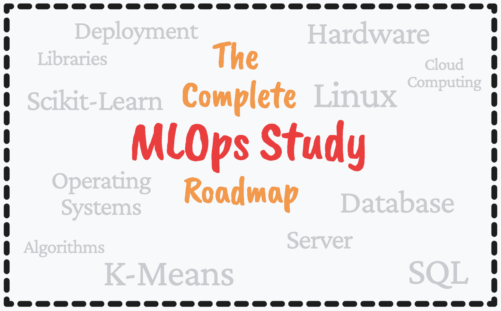

# 完整的 MLOps 学习路线图

> 原文：[`www.kdnuggets.com/2022/12/complete-mlops-study-roadmap.html`](https://www.kdnuggets.com/2022/12/complete-mlops-study-roadmap.html)

图片由作者提供

所以下一版的学习路线图是 MLOps - 机器学习、DevOps 和数据工程的结合体。目标是以可靠和高效的方式部署和维护机器学习系统。那么，如何成为一名 MLOps 工程师呢？

* * *

## 我们的前三个课程推荐

 1\. [谷歌网络安全证书](https://www.kdnuggets.com/google-cybersecurity) - 快速进入网络安全职业生涯。

 2\. [谷歌数据分析专业证书](https://www.kdnuggets.com/google-data-analytics) - 提升你的数据分析技能

 3\. [谷歌 IT 支持专业证书](https://www.kdnuggets.com/google-itsupport) - 支持你所在组织的 IT

* * *

# 1\. 基础

如果 MLOps 是机器学习、DevOps 和数据工程的结合体 - 你可以想象 MLOps 的基础也是这些子领域的基础。

那么基础是什么呢？

## Python

如果你选择 Python 作为你的编程语言，以下是一些推荐的课程：

+   [100 天代码：2022 完整 Python 高级训练营](https://www.udemy.com/course/100-days-of-code/) - Udemy

+   [人人编程（Python 入门）](https://www.coursera.org/learn/python) - Coursera（密歇根大学）

作为 MLOps 工程师，强烈建议使用脚本语言，因为你需要在高水平上自动化流程。Python、Go 和 Ruby 是你可以选择的流行脚本语言的例子。

## SQL:

+   [终极 MySQL 训练营：从 SQL 初学者到专家](https://www.udemy.com/course/the-ultimate-mysql-bootcamp-go-from-sql-beginner-to-expert/) - Udemy

+   [完整 SQL 精通](https://codewithmosh.com/p/complete-sql-mastery) - CodeWithMosh

## 数学：

+   [机器学习数学](https://mml-book.github.io/book/mml-book.pdf) - 书

+   [可汗学院的线性代数](https://www.khanacademy.org/math/linear-algebra) - YouTube

+   [??可汗学院的统计与概率](https://www.khanacademy.org/math/statistics-probability) - YouTube

+   [机器学习的数学基础](https://www.udemy.com/course/machine-learning-data-science-foundations-masterclass/) - Udemy

# 2\. 机器学习算法和库

作为一名 MLOps 工程师，你的日常任务将围绕机器学习算法展开，因此理解你所使用的模型至关重要。你还需要了解相关的库和框架，以便在你的角色中取得成功。

## 机器学习算法资源：

+   [理解机器学习：从理论到算法](https://books.google.co.uk/books?id=ttJkAwAAQBAJ&printsec=frontcover&dq=machine+learning+algorithms&hl=en&newbks=1&newbks_redir=1&sa=X&ved=2ahUKEwjhz9aZxK77AhXeSkEAHRDuBQsQ6AF6BAgGEAI) 由 Shai Shalev-Shwartz, Shai Ben-David - 书籍

+   1 分钟内解释机器学习算法 - 博客

+   流行的机器学习算法 - 博客

+   [Simplilearn 的机器学习算法](https://www.youtube.com/watch?v=7kyNYMwfYdw) - YouTube

## 机器学习库资源：

+   [Pandas](https://pandas.pydata.org/docs/user_guide/index.html#user-guide) - 管理表格数据

+   [NumPy](https://numpy.org/learn/) - 科学计算

+   [Matplotlib](https://matplotlib.org/stable/tutorials/index) - 数据可视化

+   [Scikit-Learn](https://scikit-learn.org/stable/user_guide.html) - 数据预处理和建模

+   [SciPy](https://docs.scipy.org/doc/scipy/tutorial/index.html#user-guide) - 科学计算

+   [NLTK](https://www.nltk.org/) - 文本处理

+   [TensorFlow](https://www.tensorflow.org/learn) - 深度学习

+   [Keras](https://keras.io/guides/) - 深度学习

+   [PyTorch](https://pytorch.org/docs/stable/index.html) - 深度学习

还有更多的库，但这些是你通常会使用的最受欢迎的库。

# 3\. 数据库

从数据工程师的角度来看，数据库及其管理系统是 MLOps 工程师角色和职责中的重要元素。为了以可靠和高效的方式维护机器学习系统，你需要数据库来帮助你完成这一任务。

以下是一些资源：

+   [数据库管理原则](https://www.youtube.com/watch?v=o36Z_OqC2ac&list=PLdQddgMBv5zHcEN9RrhADq3CBColhY2hl) - YouTube

+   免费 SQL 和数据库课程 - 博客

+   [终极 MySQL 速成班：从 SQL 初学者到专家](https://www.udemy.com/course/the-ultimate-mysql-bootcamp-go-from-sql-beginner-to-expert/) - Udemy

+   [完整 SQL 和数据库速成班：从零到精通](https://www.udemy.com/course/complete-sql-databases-bootcamp-zero-to-mastery/) - Udemy

# 4\. 模型部署

作为 MLOps 工程师，你需要学习如何部署你的模型。大型公司通常使用云平台来托管他们的应用程序，如 AWS、GCP 和 Microsoft Azure。因此，你很可能也会这样做，因此我强烈建议你对这些平台有良好的理解，因为作为 MLOps 工程师，你肯定会使用它们。

以下是一些资源来帮助你：

+   [云计算教程和资源](https://www.w3schools.in/category/cloud-computing/)

+   [终极 AWS 认证云从业者 2022](https://www.udemy.com/course/aws-certified-cloud-practitioner-new/) - Udemy

+   [GCP Associate Cloud Engineer Google Cloud Certification](https://www.udemy.com/course/google-cloud-certification-associate-cloud-engineer/) - Udemy

+   [Microsoft Azure: From Zero to Hero](https://www.udemy.com/course/microsoft-azure-from-zero-to-hero-the-complete-guide/) - Udemy

# 5\. 实验跟踪

对于一些数据工作者来说，他们的最终目标是实现模型部署。然而，作为一名 MLOps 工程师，实验跟踪至关重要。实验跟踪允许我们管理所有实验及其组件，如参数、指标等。这使我们更容易组织每个实验的组件，重现过去的结果并记录所有内容。

作为一名 MLOps 工程师，你应该了解可以用来跟踪实验的不同工具。我将列出最受欢迎的几种：

+   [MLFlow](https://mlflow.org/)

+   [Comet ML](https://www.comet.ml/site/)

+   [Neptune](https://neptune.ai/)

+   [Weights and Biases](https://www.wandb.com/)

+   [TensorBoard](https://www.tensorflow.org/tensorboard)

# 6\. 元数据管理

元数据是关于数据的数据，管理这种数据可以帮助你更好地理解、分组和排序数据以供其他用途。从模型中生成元数据可以用于训练参数、评估指标、测试管道输出等。

在工作流程生命周期中，糟糕的元数据管理可能导致信息冲突、对数据的不信任以及成本增加。

这里有一些资源可以帮助你更好地理解：

+   [Data Management - Metadata Management](https://www.youtube.com/watch?v=oAbHuJJTI5Y) - YouTube

+   [Data Management Masterclass](https://www.udemy.com/course/data-management-masterclass-the-complete-course/) - Udemy

+   [Prepare Data for Exploration](https://gb.coursera.org/learn/data-preparation) - Coursera

# 7\. 数据和管道版本管理

数据版本管理是对随着时间推移创建的不同版本的数据进行存储。数据随时间变化的原因有很多，例如数据科学家测试是否能够提高机器学习模型的效率或信息流动。数据版本管理的优势和必要性从商业角度来看，通过使消费者了解数据集是否有更新版本来提供帮助。

以下是用于数据版本管理的流行工具列表：

+   [DAGsHub](https://dagshub.com/)

+   [DVC](https://dvc.org/)

+   [Pachyderm](https://www.pachyderm.com/)

+   [lakeFS](https://github.com/treeverse/lakeFS)

# 8\. 模型监控

模型监控阶段在模型部署之后，是一个如其名所示的过程——监控模型。你需要注意模型退化、数据漂移等问题，以确保模型保持良好的性能水平。

这里有一些资源可以帮助你：

+   [Continuous monitoring](https://mlops-guide.github.io/MLOps/Monitoring/) - MLOps guide

+   [测试和监控机器学习模型部署](https://www.udemy.com/course/testing-and-monitoring-machine-learning-model-deployments/) - Udemy

+   机器学习模型监控检查清单：7 个跟踪项 - 博客

+   [IBM Watson OpenScale](https://www.ibm.com/docs/en/cloud-paks/cp-data/3.5.0?topic=services-watson-openscale) - 工具

# 9\. 项目

你应该对成为 MLOps 专业人员所需的技能有良好的理解和深入的知识。一旦掌握了这些技能，下一步就是通过项目进行测试——这些项目随后可以作为你的作品集的一部分。

这里有一些项目想法：

+   [Made With ML](https://madewithml.com/) - MLOps 的所有方面

+   [自动化典型的机器学习工作流程和模型部署](https://github.com/AlexIoannides/ml-workflow-automation)

+   [社会力量 NBA](https://www.kaggle.com/datasets/noahgift/social-power-nba)

+   [MLOPS 端到端实施](https://www.youtube.com/watch?v=Ly3Dor8HZUA&t=9s)

+   [使用 MLflow 进行实验跟踪](https://www.youtube.com/watch?v=r0do1KVEGqM)

实践你的技能并完善它们是这里的主要目标！

# 10\. 面试

现在我们已经准备好迎接面试了。在准备面试时，目标是准备、准备，然后放松！对于技术角色，有很多东西需要记住，有时紧张会导致你忘记一切。所以我总是建议人们保持冷静，享受这个阶段——享受你付出的所有努力，并证明解决这些挑战是轻而易举的！

这里有一些资源可以帮助你：

+   [前 30 名 MLOps 面试问题](https://www.mlstack.cafe/interview-questions/mlops) - 博客

+   [打好你下一个机器学习面试](https://www.interviewkickstart.com/courses/machine-learning-interview-masterclass) - 网络研讨会（免费）

+   [MLOps 社区会议播放列表](https://www.youtube.com/watch?v=JjUt1h66IrY&list=PLZoTAELRMXVOk1pRcOCaG5xtXxgMalpIe&index=2) - YouTube

+   [20 个 MLOps 面试问题及答案](https://climbtheladder.com/mlops-interview-questions/)

+   [机器学习面试准备](https://www.udacity.com/course/machine-learning-interview-prep--ud1001) - Udacity（免费）

+   [掌握机器学习面试](https://www.educative.io/courses/grokking-the-machine-learning-interview?affiliate_id=5073518643380224) - Educative

# 总结

由于 MLOps 涉及机器学习、DevOps 和 IT——有许多资源可以帮助你成为最成功的 MLOps 工程师。查看这篇文章的其他版本，来帮助你：

1.  完整的数据科学学习路线图

1.  完整的机器学习学习路线图

1.  完整的数据工程学习路线图

**[尼莎·阿雅](https://www.linkedin.com/in/nisha-arya-ahmed/)** 是一名数据科学家和自由职业技术写作人员。她特别关注提供数据科学职业建议或教程以及与数据科学相关的理论知识。她还希望探索人工智能如何/可以促进人类生命的持久性。她是一个热衷学习者，寻求拓宽她的技术知识和写作技能，同时帮助指导他人。

### 更多相关主题

+   [完整的数据科学学习路线图](https://www.kdnuggets.com/2022/08/complete-data-science-study-roadmap.html)

+   [完整的数据工程学习路线图](https://www.kdnuggets.com/2022/11/complete-data-engineering-study-roadmap.html)

+   [完整的机器学习学习路线图](https://www.kdnuggets.com/2022/12/complete-machine-learning-study-roadmap.html)

+   [KDnuggets 新闻，8 月 31 日：完整的数据科学学习路线图](https://www.kdnuggets.com/2022/n35.html)

+   [KDnuggets 新闻，12 月 14 日：3 个免费机器学习课程](https://www.kdnuggets.com/2022/n48.html)

+   [超级学习指南：一本免费的算法与数据结构电子书](https://www.kdnuggets.com/2022/06/super-study-guide-free-algorithms-data-structures-ebook.html)
