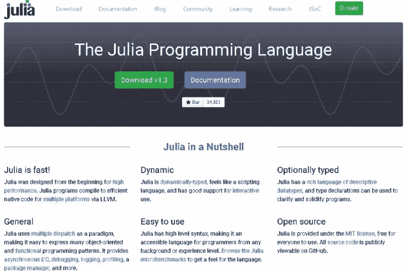
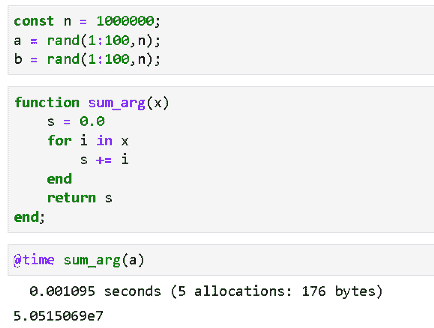
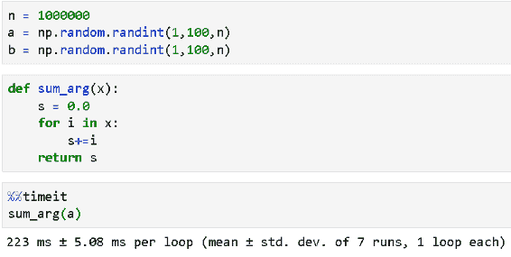
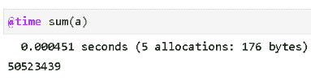
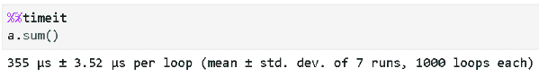
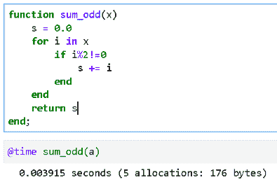
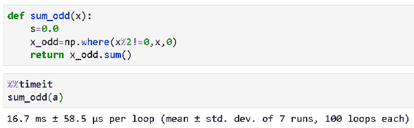
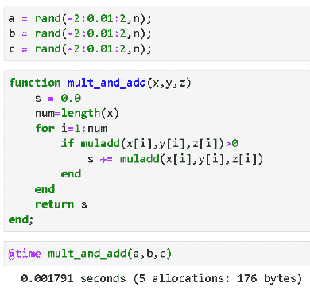
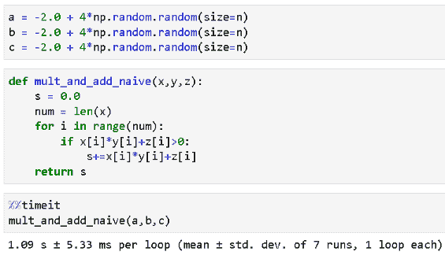
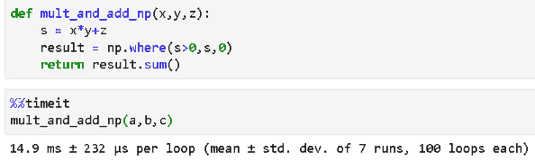

# 复杂逻辑以飞快速度：尝试使用 Julia 进行数据科学

> 原文：[`www.kdnuggets.com/2020/05/complex-logic-breakneck-speed-julia-data-science.html`](https://www.kdnuggets.com/2020/05/complex-logic-breakneck-speed-julia-data-science.html)

评论

注意：我正在建立一个包含 Julia 基础和数据科学示例的 Github 仓库。 [**点击这里查看**](https://github.com/tirthajyoti/Julia-data-science)。

* * *

## 我们的前三大课程推荐

 1\. [谷歌网络安全证书](https://www.kdnuggets.com/google-cybersecurity) - 快速进入网络安全职业生涯。

 2\. [谷歌数据分析专业证书](https://www.kdnuggets.com/google-data-analytics) - 提升你的数据分析水平

 3\. [谷歌 IT 支持专业证书](https://www.kdnuggets.com/google-itsupport) - 支持你的组织进行 IT 工作

* * *

### 介绍

*“像 Python 一样行走，像 C 一样运行”* — 这是对 Julia 的描述，这是一种现代编程语言，**专注于科学计算**，并且拥有越来越多的追随者和开发者。

Julia 是一种通用编程语言，专门用于科学计算。它是一种[**灵活的**](https://docs.julialang.org/en/v1/manual/types/)[**动态类型**](https://android.jlelse.eu/magic-lies-here-statically-typed-vs-dynamically-typed-languages-d151c7f95e2b)语言，**性能可与传统静态类型语言相媲美**。

Julia 试图提供一个足够高效的环境，既适合原型设计，又适合工业级应用。它是一种多范式语言，包含[函数式](https://codeburst.io/a-beginner-friendly-intro-to-functional-programming-4f69aa109569)和面向对象编程组件，尽管**大多数用户喜欢它的函数式编程方面**。

该编程语言的起源可以追溯到 2009 年。首席开发者 Alan Edelman、Jeff Bezanson、Stefan Karpinski 和 Viral Shah 开始致力于创建一种可以用于更好、更快数值计算的语言。开发者们在 2012 年 2 月推出了商业版本。

### 为什么它对数据科学如此出色？

Julia 是数据科学和机器学习工作的优秀选择，因为它在快速数值计算方面也表现出色。其优势包括，

+   **平滑的学习曲线**，以及广泛的基础功能。尤其是，如果你已经熟悉像 Python 和 R 这样的流行数据科学语言，掌握 Julia 将轻松自如。

+   **性能**：Julia 最初是编译语言，而 Python 和 R 是解释型语言。这意味着 Julia 代码直接在处理器上执行作为可执行代码。

+   **GPU 支持**：这与性能直接相关。GPU 支持由一些包如 `TensorFlow.jl` 和 `MXNet.jl` 透明地控制。

+   **分布式和并行计算支持**：Julia 通过多种拓扑结构透明地支持并行和分布式计算。同时，它也支持协程，例如 Go 编程语言中的协程，这些协程在多核架构上并行工作。对线程和同步的广泛支持主要旨在最大化性能并减少竞争条件的风险。

+   **丰富的数据科学和可视化库**：Julia 社区了解到它被设想为数据科学家和统计学家的首选语言。因此，专注于数据科学和分析的高性能库正在不断开发中。

+   **与其他语言/框架的协作**：Julia 与其他成熟的数据科学和机器学习语言及框架配合得非常好。使用 `PyCall` 或 `RCall` 可以在 Julia 脚本中使用原生的 Python 或 R 代码。`Plots` 包支持包括 `Matplotlib` 和 `Plotly` 在内的各种后端。流行的机器学习库如 `Scikit-learn` 或 `TensorFlow` 已经有 Julia 等效的实现或封装。

> Julia 是数据科学和机器学习工作的绝佳选择，原因之一是它在快速数值计算方面表现出色。

### 一些与 Python 脚本的基准测试

关于“**Julia 比 Python 更快吗？**”的问题存在很多争议。

就像生活中的几乎所有事情一样，答案是：***这要看情况。***

官方的 Julia 语言门户有一些相关数据，尽管基准测试是针对除了 Python 之外的各种语言进行的。

[**Julia 语言**](https://julialang.org/benchmarks/)

实际上，这个问题几乎总是涉及 Julia 与某种优化/矢量化的 Python 代码（如 Numpy 函数使用的代码）的比较。否则，由于编译代码执行，原生 Julia 几乎总是比 Python 快，而 [原生 Python 远慢于 Numpy 类型的执行](https://towardsdatascience.com/why-you-should-forget-for-loop-for-data-science-code-and-embrace-vectorization-696632622d5f)。

Numpy 的速度确实非常快。它是一个超优化函数的库（许多函数已经预编译），专注于为 Python 用户（尤其是数据科学家和 ML 工程师）提供接近 C 的速度。简单的 Numpy 函数如 sum 或标准差 [可以与等效的 Julia 实现相媲美或超越（尤其是对于大型输入数组）](https://github.com/kbarbary/website/blob/master/posts/julia-vs-numpy-arrays.rst)。

但是，为了充分利用 Numpy 函数，你必须从向量化代码的角度来思考。而且将复杂的逻辑写成向量化代码并不容易。

因此，与 Julia 的速度比较应在对数组进行某种处理时应用较复杂的逻辑时进行。

在这篇文章中，我们将展示几个这样的例子以说明这一点。

> 但是，为了充分利用 Numpy 函数，你必须从向量化代码的角度来思考。

### Julia 的 for 循环比 Python 的 for 循环表现得更好

让我们计算一百万个随机整数的总和来测试一下。

Julia 代码如下。该函数耗时稍微超过 **1 毫秒**。

Python 代码如下。我们保持了代码的相同功能性质（Julia 是函数式语言），以保持比较公平且易于验证。for 循环耗时 **超过 200 毫秒**！

### 那么 Julia 数组与 Numpy 数组相比如何？

在上面的代码中，我们创建了一个数组变量。这是 Julia 中最有用的数据结构，因为它可以直接用于统计计算或线性代数操作，开箱即用。

不需要额外的库或其他东西。Julia 数组的速度比 Python 列表快几个数量级。

但 Numpy 数组很快，让我们基准测试一下相同的求和操作。

Julia 代码使用 `sum()` 函数对数组进行求和。它需要约 **451 毫秒**（比 for 循环方法快，但仅为一半时间）。

这是 Numpy 执行的结果，

哇！ **353 毫秒**，这比 Julia 的速度还要快，几乎比天真的 Python for 循环代码快 628 倍。

那么，最终判决是倾向于 Numpy 数组吗？

不要太快。那如果我们只想对数组中的奇数求和呢？

> 不需要额外的库。Julia 数组的速度比 Python 列表快几个数量级。

### 下面是逻辑

对于 Julia，代码的更改将非常直接。我们只需使用 for 循环，检查数组的一个元素是否能被 2 整除，如果不能（即奇数），则将其添加到累加和中。尽可能的细致！

所以，这运行了 **接近 4 毫秒**。确实比单纯的盲目求和（使用 for 循环）慢，但差别不大（for 循环的普通求和也大约 1.1 毫秒）。

现在，我们显然无法用 Python 的 for 循环与这种速度竞争！我们知道结果会如何，对吧？所以，我们必须使用 Numpy 向量化代码。

但是如何在 Numpy 数组中检查奇数并只对其求和呢？幸运的是，我们有 `np.where()` 方法。

这是 Python 代码。并不那么直接（除非你知道如何正确使用 `np.where`，对吧？

但看看速度吧。即使是使用 Numpy 方法的一行矢量化代码，平均也花费了**16.7 毫秒**。

Julia 的代码更简单，运行得更快！

### 另一个稍微复杂的操作

假设我们有三个数组（比如 ***W***、***X*** 和 ***B***），其浮点数在 -2 到 2 之间随机分布，我们想计算一个特殊的量：两个数组的乘积加到第三个数组上，即 ***A***.***X***+***B***，但只有当逐元素线性组合超过零时，这个量才会被加到最终和中***。***

这个逻辑对你来说熟悉吗？这是任何密集连接神经网络（甚至是单个感知器）的变体，其中权重、特征和偏置向量的线性组合必须超过某个阈值才能传播到下一层。

所以，这里是 Julia 的代码。再次，简单且高效。花费了 ~**1.8 毫秒**。注意，它使用了一个名为 `muladd()` 的特殊函数，该函数将两个数字相乘并加到第三个数字上。

我们使用类似的代码（使用 for 循环）尝试了 Python，结果如预期般糟糕！平均花费了**超过一秒**。

我们再次尝试发挥创意，使用 Numpy 矢量化代码，结果比 for 循环要好，但比 Julia 的情况差，约为 **14.9 毫秒**。

### 那么，它看起来如何？

此时，趋势变得清晰。对于需要在某些数学操作之前检查复杂逻辑的数值操作，Julia 击败 Python（即使是 Numpy），因为**我们可以在 Julia 中用尽可能简单的代码编写逻辑，并将其遗忘**。得益于[即时编译器（JIT）](https://agilescientific.com/blog/2014/9/4/julia-in-a-nutshell.html)和内部类型相关的优化（Julia 具有[极其复杂的类型系统](https://en.wikibooks.org/wiki/Introducing_Julia/Types)来使程序以正确的数据类型快速运行，并相应地优化代码和内存）。

使用原生 Python 数据结构和 for 循环编写相同的代码效率极低。即使是 Numpy 的矢量化代码，随着复杂性的增加，其速度也比 Julia 慢。

Numpy 在处理数组自带的简单方法（如 `sum()`、`mean()` 或 `std()`）时非常出色，但与这些方法结合使用逻辑并不总是直观的，而且会显著降低操作速度。

**在 Julia 中，不用费心思考如何矢量化你的代码**。即使是看起来很笨的代码，使用普通的 for 循环和逐元素逻辑检查，也能运行得惊人快速！

> 对于需要在某些数学操作发生之前检查复杂逻辑的数值操作，Julia 绝对超过 Python（甚至 Numpy），因为我们可以用最简单的代码在 Julia 中编写逻辑，并且可以不用再考虑它。

### 摘要

在这篇文章中，我们展示了 Julia 和 Python 之间的数值计算对比基准——包括本地 Python 代码和优化的 Numpy 函数。

虽然在处理简单函数时，Numpy 的速度与 Julia 不相上下，但当计算问题中引入复杂逻辑时，Julia 的表现更胜一筹。Julia 代码本身很简单，无需过多考虑如何向量化函数。

随着数据科学和机器学习支持系统的不断发展，Julia 是未来几天最令人期待的新语言之一。这是一个初学数据科学者应该加入到他们工具库中的工具。

我正在构建一个包含 Julia 基础和数据科学示例的 Github 仓库。[**点击这里查看**](https://github.com/tirthajyoti/Julia-data-science)。

**附加阅读**

1.  [`docs.julialang.org/en/v1/manual/performance-tips/#man-performance-tips-1`](https://docs.julialang.org/en/v1/manual/performance-tips/#man-performance-tips-1)

1.  [`agilescientific.com/blog/2014/9/4/julia-in-a-nutshell.html`](https://agilescientific.com/blog/2014/9/4/julia-in-a-nutshell.html)

1.  [`en.wikibooks.org/wiki/Introducing_Julia/Types`](https://en.wikibooks.org/wiki/Introducing_Julia/Types)

1.  [`dev.to/epogrebnyak/julialang-and-surprises---what-im-learning-with-a-new-programming-language--21df`](https://dev.to/epogrebnyak/julialang-and-surprises---what-im-learning-with-a-new-programming-language--21df)

如果你有任何问题或想法，请通过 [**tirthajyoti[AT]gmail.com**](mailto:tirthajyoti@gmail.com) 联系作者。同时，你也可以查看作者的 [**GitHub**](https://github.com/tirthajyoti?tab=repositories)** 代码库 **，了解机器学习和数据科学的代码、想法和资源。如果你像我一样，对 AI/机器学习/数据科学充满热情，请随时 [在 LinkedIn 上添加我](https://www.linkedin.com/in/tirthajyoti-sarkar-2127aa7/) 或 [在 Twitter 上关注我](https://twitter.com/tirthajyotiS)。

**个人简介： [Tirthajyoti Sarkar](https://www.linkedin.com/in/tirthajyoti-sarkar-2127aa7/)** 是 ON Semiconductor 的高级首席工程师。

[原文](https://towardsdatascience.com/complex-logic-at-breakneck-speed-try-julia-for-data-science-bcd4dfa23541)。转载已获许可。

**相关信息：**

+   《使用 Julia 的游击学习指南》

+   《掌握数据科学的全世界》

+   《介绍 Gen：MIT 的新语言，想成为可编程推理的 TensorFlow》

### 更多相关话题

+   [5 本免费的 Julia 数据科学书籍](https://www.kdnuggets.com/2023/06/5-free-julia-books-data-science.html)

+   [3 个用于数据可视化的 Julia 包](https://www.kdnuggets.com/2023/02/3-julia-packages-data-visualization.html)

+   [使用 Julia 学习数据分析](https://www.kdnuggets.com/learn-data-analysis-with-julia)

+   [我应该学习 Julia 吗？](https://www.kdnuggets.com/2022/11/learn-julia.html)

+   [如何在 Jupyter Notebook 上设置 Julia](https://www.kdnuggets.com/2022/11/setup-julia-jupyter-notebook.html)

+   [在神经网络之前尝试的 10 件简单事](https://www.kdnuggets.com/2021/12/10-simple-things-try-neural-networks.html)
