# 卷积神经网络综合指南

> 原文：[`www.kdnuggets.com/2023/06/comprehensive-guide-convolutional-neural-networks.html`](https://www.kdnuggets.com/2023/06/comprehensive-guide-convolutional-neural-networks.html)

[人工智能](https://saturncloud.io/glossary/artificial-intelligence/) 近年来在缩小人类与机器能力之间的差距方面取得了巨大进展。研究人员和爱好者们在该领域的多个方面进行工作，创造出令人惊叹的成果。诸如此类的一个领域是 [计算机视觉](https://saturncloud.io/glossary/computer-vision)。

该领域的目标是使机器能够像人类一样看待世界，以类似的方式感知它，甚至利用这些知识完成多种任务，如图像和视频识别、图像分析与分类、媒体再创作、推荐系统、[自然语言处理](https://saturncloud.io/glossary/natural-language-processing-nlp/) 等。计算机视觉在 [深度学习](https://saturncloud.io/glossary/deep-learning/) 的进步中得到了构建和完善，主要是通过一个特定的 [算法](https://saturncloud.io/glossary/algorithm)——**卷积神经网络**。

* * *

## 我们的前三个课程推荐

 1. [Google 网络安全证书](https://www.kdnuggets.com/google-cybersecurity) - 快速进入网络安全职业生涯。

 2. [Google 数据分析专业证书](https://www.kdnuggets.com/google-data-analytics) - 提升您的数据分析技能

 3. [Google IT 支持专业证书](https://www.kdnuggets.com/google-itsupport) - 支持您的组织进行 IT 工作

* * *

## 介绍

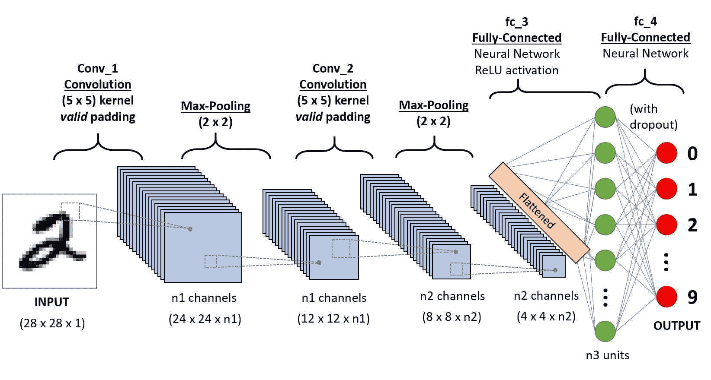

一个用于分类手写数字的 CNN 序列

**卷积神经网络 (ConvNet/CNN)** 是一种 [深度学习](https://saturncloud.io/glossary/deep-learning) 算法，它能够接受输入图像，对图像中的各个方面/对象赋予重要性（可学习的权重和偏置），并能够区分它们。与其他分类算法相比，ConvNet 所需的预处理要低得多。虽然在原始方法中过滤器是手工设计的，但经过足够的训练，ConvNets 有能力学习这些过滤器/特征。

ConvNet 的架构类似于人脑中神经元的连接模式，并且受到视觉皮层组织的启发。单个神经元仅对称称为感受野的视觉区域内的刺激作出反应。这些区域的集合重叠以覆盖整个视觉区域。

## 为什么选择 ConvNets 而不是前馈神经网络？

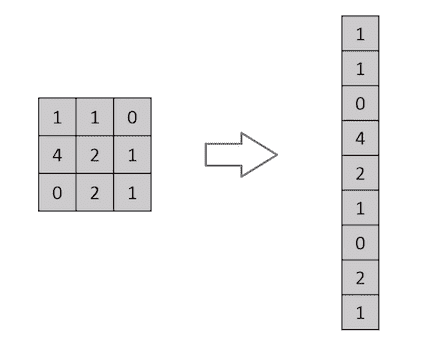

将一个 3x3 的图像矩阵展平为 9x1 的向量

图像无非就是像素值的矩阵，对吧？那么为什么不将图像展平（例如 3x3 的图像矩阵展平为 9x1 的向量）然后送入多层[感知机](https://saturncloud.io/glossary/perceptron)进行分类呢？嗯，不完全是这样。

对于极其简单的二值图像，这种方法在执行类别预测时可能会显示出一个平均的[精度](https://saturncloud.io/glossary/precision)得分，但对于具有像素依赖的复杂图像，准确率可能会很低或没有准确率。

ConvNet 能够通过应用相关滤波器**成功捕捉图像中的空间和时间依赖性**。由于参数数量的减少和权重的可重用性，该架构能够更好地拟合图像数据集。换句话说，网络可以被训练得更好地理解图像的复杂性。

## 输入图像

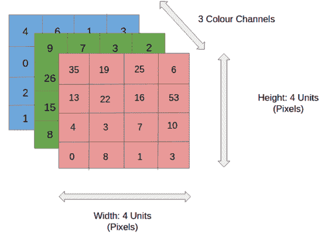

4x4x3 RGB 图像

在图中，我们有一张 RGB 图像，该图像已被分离成其三个颜色通道——红色、绿色和蓝色。图像存在于多种颜色空间中——灰度、RGB、HSV、CMYK 等。

你可以想象，当图像达到例如 8K (7680×4320)的尺寸时，计算量会变得多么庞大。ConvNet 的作用是将图像缩减成一种更易处理的形式，同时不丢失对获得良好预测至关重要的特征。当我们设计一种不仅擅长学习特征而且能够扩展到大规模数据集的架构时，这一点尤为重要。

## 卷积层——卷积核

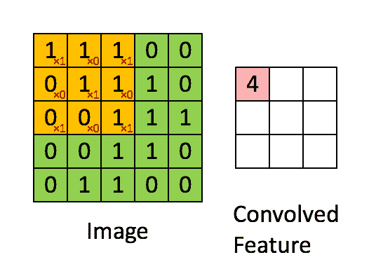

用一个 3x3x1 的核对一个 5x5x1 的图像进行卷积以获得一个 3x3x1 的卷积特征

图像尺寸 = 5（高度）x 5（宽度）x 1（通道数，例如 RGB）

在上述演示中，绿色部分类似于我们的**5x5x1 输入图像，I**。卷积层第一部分中涉及的元素被称为**卷积核/滤波器，K**，用黄色表示。我们选择了**K 作为一个 3x3x1 矩阵**。

```py
Kernel/Filter, K =
1  0  1
0  1  0
1  0  1
```

由于**步幅长度 = 1（无步幅）**，卷积核移动 9 次，每次执行**逐元素****乘法操作**（[哈达玛积](https://en.wikipedia.org/wiki/Hadamard_product_%28matrices%29#:~:text=In%20mathematics%2C%20the%20Hadamard%20product,elements%20i%2C%20j%20of%20the)），在卷积核悬停的图像区域`K`和`P`部分之间。

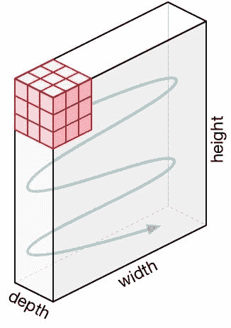

卷积核的移动

滤波器以一定的步幅值向右移动，直到遍历完整的宽度。接着，它跳回图像的开始（左侧），以相同的步幅值重复这个过程，直到整个图像被遍历。

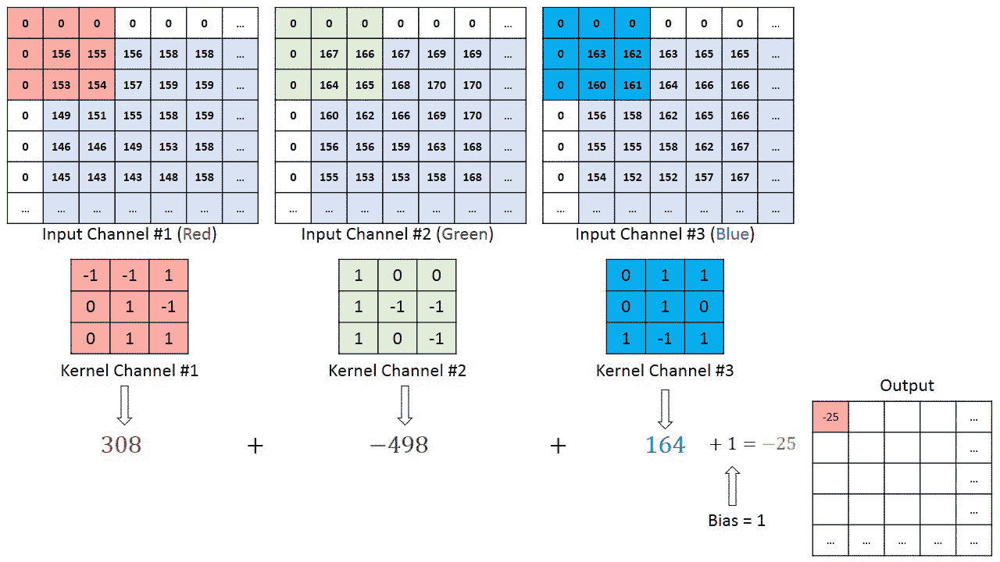

在一个 MxNx3 图像矩阵上进行的卷积操作，使用 3x3x3 卷积核。

对于具有多个通道（例如 RGB）的图像，卷积核的深度与输入图像相同。进行`Kn`与`In`堆叠（[K1, I1]; [K2, I2]; [K3, I3]）之间的矩阵乘法，并将所有结果与偏差相加，以给出一个压缩的一深度通道卷积特征输出。

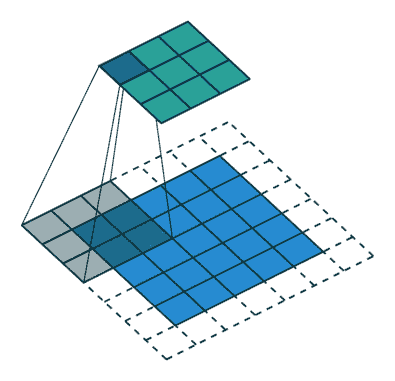

步幅长度 = 2 的卷积操作

卷积操作的目标是**提取高级特征**，如边缘，从输入图像中。卷积网络不必仅限于一个卷积层。传统上，第一个卷积层负责捕捉低级特征，如边缘、颜色、梯度方向等。通过添加更多层，架构还适应高级特征，给我们一个对数据集中的图像有全面理解的网络，就像我们自己一样。

操作有两种结果——一种是卷积特征的维度相对于输入减少，另一种是维度增加或保持不变。这通过在前者情况下应用**有效填充**，或在后者情况下应用**相同填充**来实现。

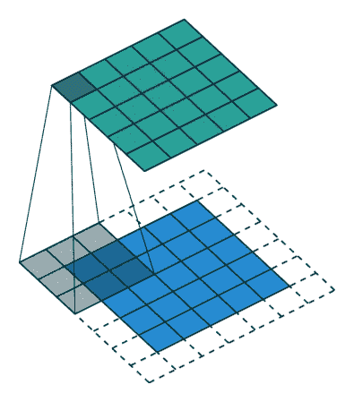

当我们将 5x5x1 图像扩展到 6x6x1 图像，并对其应用 3x3x1 卷积核时，我们发现卷积矩阵的尺寸为 5x5x1。因此，称之为**相同填充**。

另一方面，如果我们在没有填充的情况下执行相同的操作，我们会得到一个尺寸为卷积核本身（3x3x1）的矩阵——**有效填充**。

以下仓库包含许多这样的 GIF，有助于更好地理解填充和步幅长度如何协同工作，以实现与我们需求相关的结果。

[**vdumoulin/conv_arithmetic**](https://github.com/vdumoulin/conv_arithmetic)

关于深度学习中的卷积算术的技术报告 - [vdumoulin/conv_arithmetic](https://github.com/vdumoulin/conv_arithmetic)

## 池化层

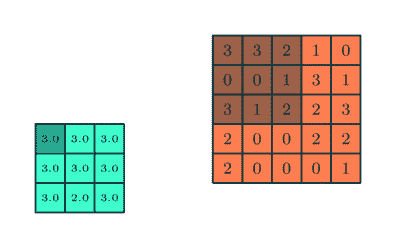

类似于卷积层，池化层负责减少卷积特征的空间大小。这样做是为了**降低处理数据所需的计算能力**，通过[降维](https://saturncloud.io/glossary/dimensionality-reduction)。此外，它对于**提取主导特征**非常有用，这些特征在旋转和位置上是不变的，从而保持了有效训练模型的过程。

池化有两种类型：[最大池化](https://saturncloud.io/glossary/max-pooling)和平均池化。**最大池化**返回内核覆盖的图像部分的**最大值**。另一方面，**平均池化**返回内核覆盖的图像部分的**所有值的平均值**。

最大池化还充当**噪声抑制器**。它完全丢弃噪声激活，并且在降维的同时也进行去噪处理。另一方面，平均池化仅作为噪声抑制机制执行降维。因此，我们可以说**最大池化比平均池化效果要好得多**。

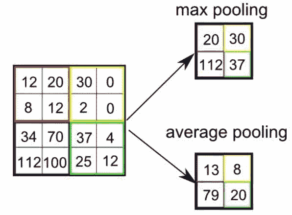

池化类型

卷积层和池化层共同构成卷积神经网络的第 i 层。根据图像中的复杂性，这些层的数量可能会增加，以进一步捕捉低级细节，但这也需要更多的计算能力。

经过上述过程后，我们成功地使模型理解了特征。接下来，我们将展平最终输出，并将其输入到一个普通的神经网络中进行分类。

### 分类 — 全连接层（FC 层）

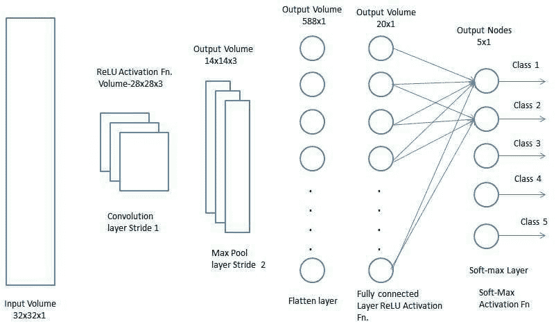

添加一个全连接层通常是一种廉价的方法，用于学习卷积层输出表示的高级特征的非线性组合。全连接层在该空间中学习一个可能的非线性函数。

现在我们已经将输入图像转换为适合我们的多层感知机的形式，我们将把图像展平成列向量。展平后的输出被输入到前馈神经网络中，并在每次训练迭代中应用反向传播。经过多次训练周期，模型能够区分图像中的主导特征和某些低级特征，并使用**Softmax 分类**技术对其进行分类。

目前有各种 CNN 架构可供使用，它们在构建算法方面发挥了关键作用，并将在可预见的未来继续推动整体人工智能的发展。以下是其中一些架构：

1.  LeNet

1.  AlexNet

1.  VGGNet

1.  GoogLeNet

1.  ResNet

1.  ZFNet

**[Sumit Saha](https://in.linkedin.com/in/linksumitsaha)** 是一位数据科学家和机器学习工程师，目前致力于构建以人工智能驱动的产品。他对人工智能在社会公益方面的应用充满热情，尤其是在医学和医疗保健领域。我有时也会进行一些技术博客写作。

[原文](https://saturncloud.io/blog/a-comprehensive-guide-to-convolutional-neural-networks-the-eli5-way/)。已获许可转载。

### 更多相关主题

+   [使用卷积神经网络（CNNs）进行图像分类](https://www.kdnuggets.com/2022/05/image-classification-convolutional-neural-networks-cnns.html)

+   [关于可信赖图神经网络的全面调查：…](https://www.kdnuggets.com/2022/05/comprehensive-survey-trustworthy-graph-neural-networks-privacy-robustness-fairness-explainability.html)

+   [使用 PyTorch 构建卷积神经网络](https://www.kdnuggets.com/building-a-convolutional-neural-network-with-pytorch)

+   [在使用神经网络之前尝试的 10 件简单事情](https://www.kdnuggets.com/2021/12/10-simple-things-try-neural-networks.html)

+   [使用 PyTorch 进行可解释的神经网络](https://www.kdnuggets.com/2022/01/interpretable-neural-networks-pytorch.html)

+   [深度神经网络不会引导我们迈向 AGI](https://www.kdnuggets.com/2021/12/deep-neural-networks-not-toward-agi.html)
