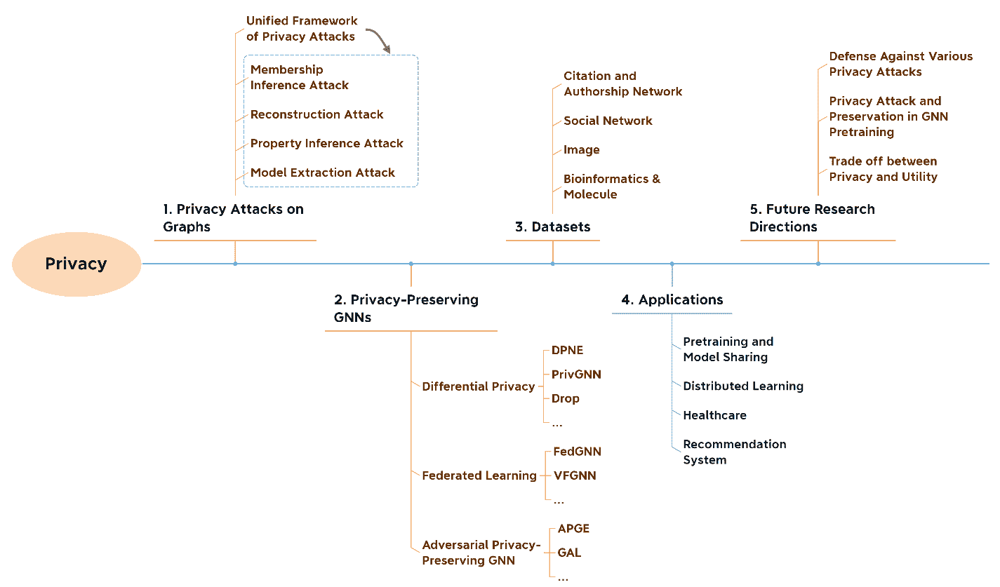
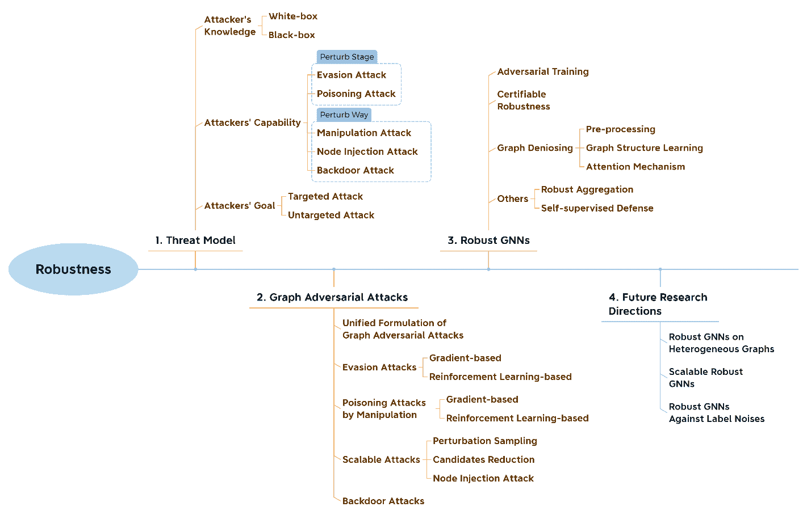
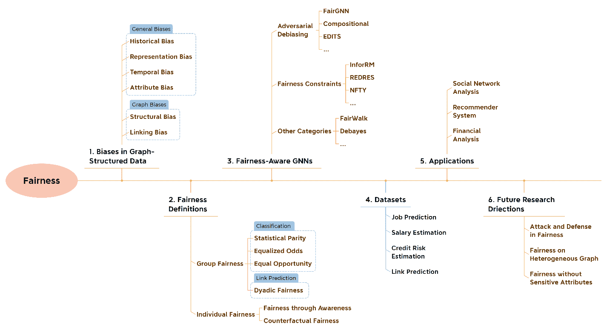
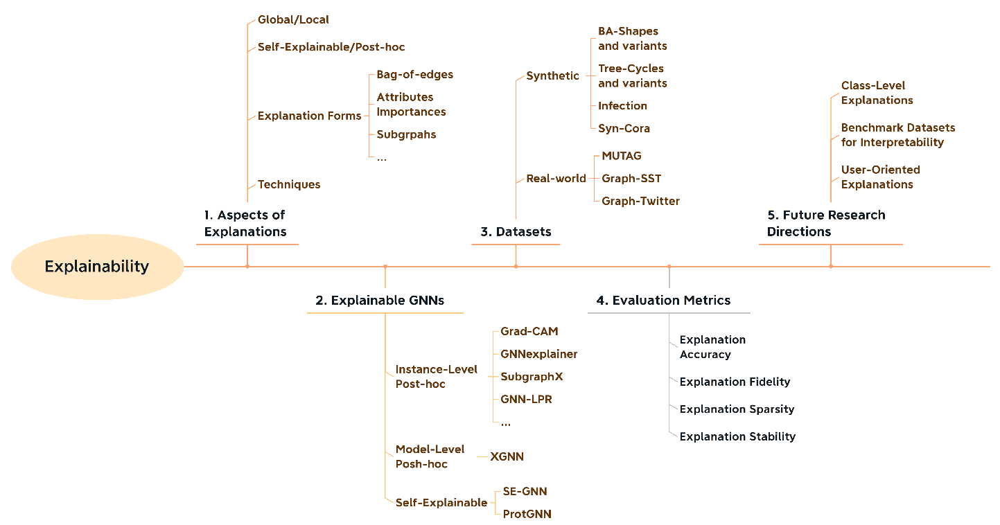

# 关于可信赖的图神经网络的综合调查：隐私、鲁棒性、公平性和可解释性

> 原文：[`www.kdnuggets.com/2022/05/comprehensive-survey-trustworthy-graph-neural-networks-privacy-robustness-fairness-explainability.html`](https://www.kdnuggets.com/2022/05/comprehensive-survey-trustworthy-graph-neural-networks-privacy-robustness-fairness-explainability.html)

*作者：[戴恩艳](https://enyandai.github.io/)，[赵天翔](https://tianxiangzhao.github.io/)，和[王苏杭](https://suhangwang.ist.psu.edu/)*

**调查链接：** [`arxiv.org/pdf/2204.08570.pdf`](https://arxiv.org/pdf/2204.08570.pdf)

图结构数据在现实世界中广泛存在，如社交网络、交通网络、知识图谱和蛋白质互作网络。图神经网络（GNNs）通过汇聚邻域信息来更新表示，从而扩展了神经网络以处理图结构数据。GNNs 的消息传递机制在图建模中取得了巨大成功。例如，Pinterest 已经将 GNNs 应用于他们的图像推荐系统中。也有努力将 GNNs 应用于信用风险估计。然而，与其他深度学习模型类似，GNNs 也存在一些信任问题，引发了极大的关注：

+   **隐私**和**鲁棒性**在图神经网络（GNNs）中并不保证。GNNs 易受到隐私攻击，这些攻击窃取私人数据或对抗性攻击，这些攻击可以欺骗模型。例如，黑客可以利用 GNNs 的输出或节点嵌入来推断社交网络中的节点属性信息和好友信息。他们还可能通过注入恶意链接或节点来欺骗用于信用风险估计的 GNNs，从而导致个人、机构和社会的重大财务损失。

+   GNN 模型自身在**公平性**和**可解释性**方面存在问题。更具体地说，GNNs 被证明会放大数据中的偏差，从而导致对性别、种族和其他受保护敏感属性的歧视。由于模型的高度非线性，GNNs 的预测结果难以理解，这在很大程度上限制了 GNNs 的应用。

这些弱点严重阻碍了 GNNs 在现实世界应用中的采纳，特别是在金融和医疗等高风险场景中。因此，如何构建可信赖的 GNN 模型已成为一个重点话题。在我们最近的调查论文[6]中，我们从隐私、鲁棒性、公平性和可解释性等计算视角对现有可信赖的 GNNs 进行了全面回顾，并讨论了有前景的未来工作。在这篇博客中，我们简要介绍了调查中每个方面的结构和涵盖的主题。

图 1\. 调查中隐私部分（第三部分）的结构。

# 隐私

如前所述，由于隐私攻击，用户的私人信息可能会从模型发布或提供的服务中泄露。然而，现有的调查主要关注于独立同分布（i.i.d）数据（如图像和文本）的隐私问题，而这些方法无法处理 GNNs 的图结构和信息传递机制。因此，我们概述了针对 GNNs 的隐私攻击以及隐私保护 GNNs 的方法。所涉及的主题如图 1 所示。我们首先制定了一个统一的框架来描述现有的图隐私攻击方法。然后，详细介绍了四种类型的隐私攻击，即成员推断攻击、重建攻击、属性推断攻击和模型提取攻击。至于隐私保护方法，我们将其分为三类，即差分隐私、联邦学习和对抗隐私保护。我们在图中列出了部分讨论的方法。有关更多方法和详细信息，请参阅调查论文中的第三部分。我们还包括了各个领域相关的数据集以及隐私保护 GNNs 的应用。我们发现，对图上的许多隐私攻击（如属性信息攻击和模型提取攻击）的防御方法研究较少。因此，防御各种隐私攻击是一个有前景的研究方向。还讨论了其他一些方向。详细信息请参见我们的调查。

图 2\. 调查中鲁棒性部分（第四部分）的组织结构。

# **鲁棒性**

**鲁棒性**是可信度的另一个重要方面。由于信息传递机制和图结构，GNNs 可能会受到图结构和节点属性上的对抗扰动的负面影响。例如，欺诈者可以创建多个有意选择高信用用户的交易，以逃避基于 GNN 的欺诈检测器。这表明有必要在安全关键领域（如医疗保健和金融系统）研究鲁棒的 GNNs。

关于图结构数据的鲁棒性已经有几个调查。因此，在我们的调查中，我们更多地关注于新兴方向中的方法，例如可扩展攻击、图后门攻击和最近的防御方法。具体而言，扰动采样和扰动候选减少是两个已被探索以提高现有攻击方法可扩展性的方向。此外，节点注入攻击，其注入一个节点的时间复杂度与图大小线性相关，是另一个有前景的方向。至于图后门攻击，我们详细介绍了少数现有工作。我们将现有的针对图对抗攻击的鲁棒 GNNs 进行分类，如*图 2*所示。带有自监督的防御是一个新方向，之前很少讨论。因此，我们详细介绍了这一方向的方法，如 SimP-GNN [1]。对于其他类别，我们添加了最新的方法，如 RS-GNN [2]，该方法同时处理标签稀疏性和对抗扰动。我们还讨论了鲁棒 GNNs 的一些未来研究方向。更多细节可以在调查的第四部分中找到。

图 3. 我们调查中公平性部分（第五部分）的组织结构。

# 公平性

我们最近的研究[3]表明，与 MLP 相比，GNNs 的消息传递机制可能会放大偏差，这验证了研究专门针对图结构数据的公平算法的必要性。近年来，许多研究工作已经出现，旨在开发公平感知的 GNNs，以在不同任务中实现各种类型的公平性。因此，我们从多个方面全面回顾了图神经网络的公平性，这些方面在图 3 中展示。

首先，我们讨论了图结构数据中的潜在偏差，包括所有数据格式中普遍存在的偏差和由图拓扑造成的独特偏差。在公平性研究中，最重要的问题之一是如何以数学方式定义公平性。我们列出了文献中关于公平 GNNs 的广泛使用的公平性定义。除二分公平性外，大多数定义适用于 i.i.d 数据和图结构数据，二分公平性是专门为链路预测设计的。

我们将公平 GNNs 分为对抗性去偏差、公平性约束和其他类别。部分代表性的方法在图 3 中展示。对于对抗性去偏差和公平性约束，统一的框架和目标函数已经制定。接着，介绍了现有方法的详细实现和目标公平性。用于训练和评估公平 GNNs 的数据集需要包含用户的敏感属性，这可能很难获得。因此，我们列出了各种应用领域中用于公平感知 GNNs 的图数据集。

图 4。我们调查中解释性部分（第六部分）的组织结构。

# 解释性

由于复杂图结构的离散性和高度非线性，以及图神经网络（GNNs）中消息传递机制的使用，GNN 模型通常缺乏可解释性。开发可解释的 GNNs 是非常重要的。解释可以增强从业者对 GNN 的信任。此外，解释可以揭示捕获的知识，帮助我们评估潜在的偏差和对抗攻击。因此，许多工作已投入到可解释的 GNNs 中，我们提供了关于可解释 GNNs 的综合综述。解释性部分的总体组织结构如图 4 所示。我们首先讨论 GNNs 中的解释分类。然后，我们将可解释 GNNs 分为实例级后处理、模型级后处理和自解释方法。值得一提的是，自解释 GNNs 是一个新的方向，之前的综述未曾涉及。我们详细介绍了自解释 GNN 方法，如 SE-GNN [4] 和 ProtGNN [5]。对于其他方法组，我们进一步基于实现技术提供了更低级的分类。由于在实际图中获得真实解释非常困难，数据集和评估指标也是验证学习到的解释正确性的重大挑战。而解释性基准数据集可以成为未来研究 GNN 解释性的有前景的研究方向。更多细节可以在我们的调查论文中找到。

## 参考文献

[1] Jin, Wei, Tyler Derr, Yiqi Wang, Yao Ma, Zitao Liu, and Jiliang Tang. "节点相似性保留图卷积网络。" 见第 14 届 ACM 国际网页搜索与数据挖掘会议论文集，第 148-156 页。2021 年。

[2] Dai, Enyan, Wei Jin, Hui Liu, and Suhang Wang. "面向噪声图和稀疏标签的鲁棒图神经网络。" 第 15 届 ACM 国际网页搜索与数据挖掘会议论文集。2022 年。

[3] Dai, Enyan, and Suhang Wang. "说不对歧视：利用有限的敏感属性信息学习公平的图神经网络。" 第 14 届 ACM 国际网页搜索与数据挖掘会议论文集。2021 年。

[4] Dai, Enyan, and Suhang Wang. "面向自解释图神经网络。" 第 30 届 ACM 国际信息与知识管理会议论文集。2021 年。

[5] Zhang, Zaixi, Qi Liu, Hao Wang, Chengqiang Lu, and Cheekong Lee. "ProtGNN：面向自解释图神经网络。" arXiv 预印本 arXiv:2112.00911 (2021)。

[6] 戴恩言，赵天翔，朱怀生，徐俊杰，郭志萌，刘辉，唐继良，王苏航。 "关于可信赖图神经网络的全面调查：隐私、鲁棒性、公平性和可解释性。" arXiv 预印本 arXiv:2204.08570 (2022)。

* * *

## 我们的前三大课程推荐

 1\. [Google 网络安全证书](https://www.kdnuggets.com/google-cybersecurity) - 快速进入网络安全职业生涯。

 2\. [Google 数据分析专业证书](https://www.kdnuggets.com/google-data-analytics) - 提升你的数据分析能力

 3\. [Google IT 支持专业证书](https://www.kdnuggets.com/google-itsupport) - 支持组织的 IT 工作

* * *

### 更多相关主题

+   [通过数据隐私学习如何实施技术隐私解决方案…](https://www.kdnuggets.com/2022/04/manning-data-privacy-learn-implement-technical-privacy-solutions-tools-scale.html)

+   [卷积神经网络全面指南](https://www.kdnuggets.com/2023/06/comprehensive-guide-convolutional-neural-networks.html)

+   [ML 模型可解释性如何加速 AI 采用过程…](https://www.kdnuggets.com/2022/07/ml-model-explainability-accelerates-ai-adoption-journey-financial-services.html)

+   [专家见解：开发安全、可靠和可信的 AI 框架](https://www.kdnuggets.com/expert-insights-on-developing-safe-secure-and-trustworthy-ai-frameworks)

+   [学习如何设计、测量和实施可信的 A/B 测试…](https://www.kdnuggets.com/2023/01/sphere-design-measure-implement-trustworthy-ab-tests-ronny-kohavi.html)

+   [审计 ML 公平性的快速有效方法](https://www.kdnuggets.com/2023/01/fast-effective-way-audit-ml-fairness.html)
