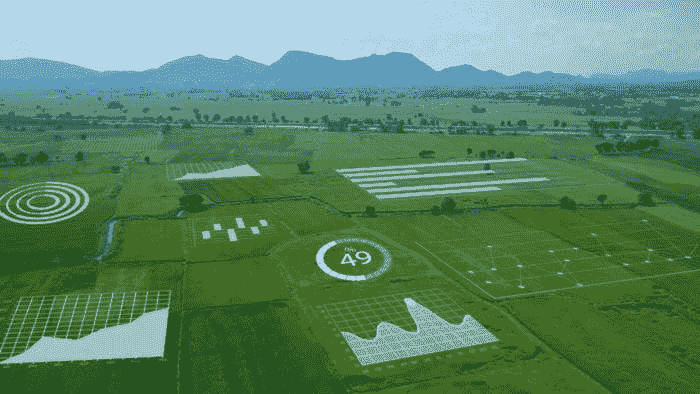
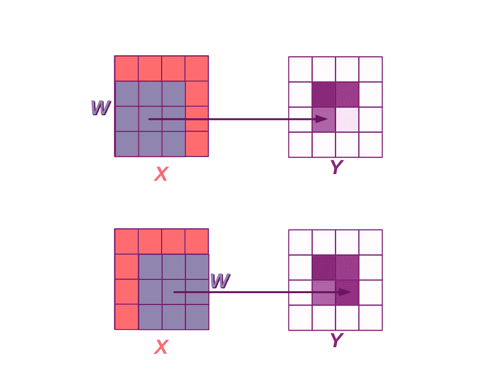
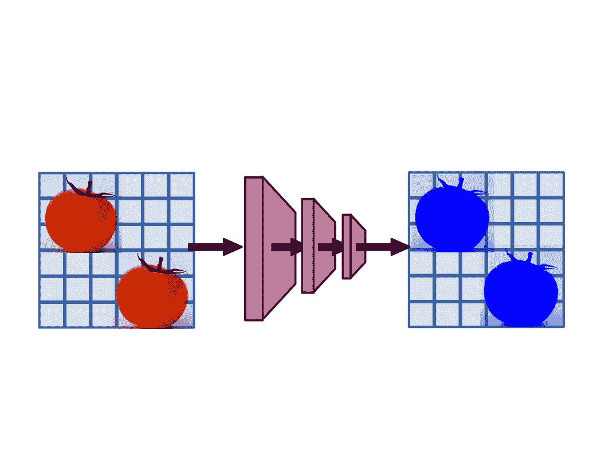
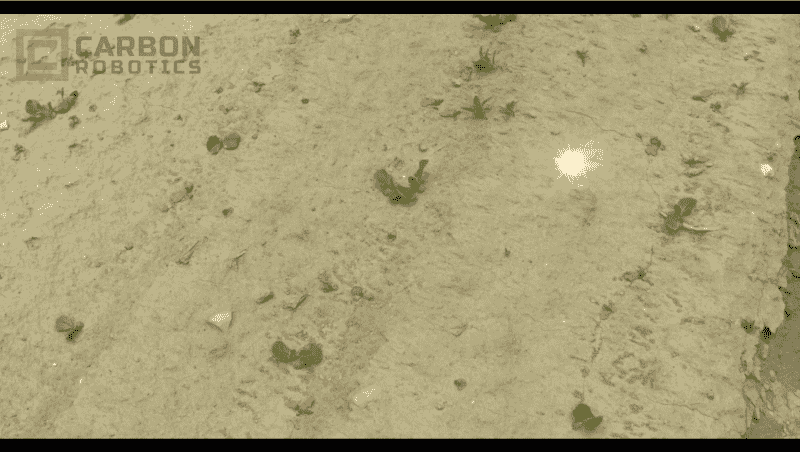
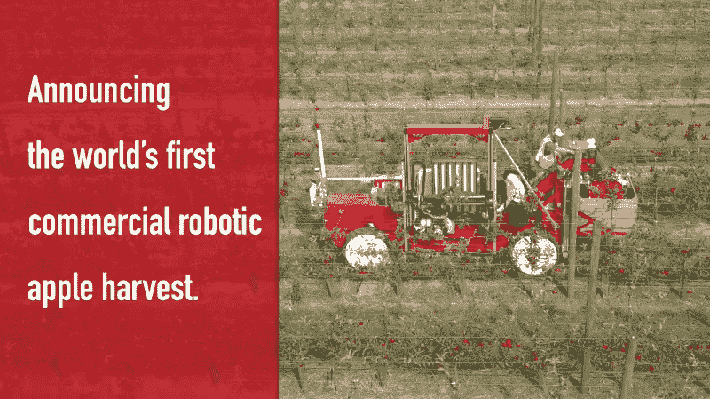

# 农业中的计算机视觉

> 原文：[`www.kdnuggets.com/2021/09/computer-vision-agriculture.html`](https://www.kdnuggets.com/2021/09/computer-vision-agriculture.html)

评论

### 田间的深度学习：现代计算机视觉在农业中的应用

* * *

## 我们的前三个课程推荐

 1\. [谷歌网络安全证书](https://www.kdnuggets.com/google-cybersecurity) - 快速进入网络安全职业生涯。

 2\. [谷歌数据分析专业证书](https://www.kdnuggets.com/google-data-analytics) - 提升你的数据分析技能

 3\. [谷歌 IT 支持专业证书](https://www.kdnuggets.com/google-itsupport) - 支持你组织的 IT 工作

* * *

在当今快节奏的城市生活和压力重重的工作生活失衡中，尤其是在（希望是）疫情隔离措施的尾声，许多年轻人渴望更接近自然和家庭。面对重新出现的通勤问题以及回到办公室与混合或完全远程工作的拉锯战，许多年轻机器人宁愿放弃现状，回到乡村像他们的祖先一样从土地上谋生。他们还会带上激光器。

当然，我们不是在谈论那些在一年幸福的居家工作后被驱赶回办公室的疲惫的办公室职员，而是那些配备深度学习计算机视觉系统和精密驱动器的新型农业自动化机器人。这种新型自动化农业有望减少现代农业的投入和副作用，同时帮助农民应对从劳动力短缺到气候变化等各种挑战。

[深度学习](https://www.exxactcorp.com/blog/Deep-Learning)不仅仅用于投放广告或识别猫。相反，一些年轻的初创公司已经开始将计算机视觉的进步，通过越来越大的神经网络，应用于实际工作中的机器人。

对于大多数这些新兴企业来说，初始产品提供类似：去除那些讨厌的杂草（和讨厌的人力除草工）。每种机器人的选择武器可能大相径庭，从激光到除草剂施用器、机械干扰甚至火焰，但使这一切成为可能的计算机视觉进步都继承自现代机器学习和深度卷积网络。去除杂草可能是展示农业智能自动化的自然最小可行产品，但这不是唯一的选择。

其他项目正在从采摘细腻水果到全自动奢华温室等方面展开工作。

### 解决拖拉机视觉问题的合适方案：卷积神经网络

本文中描述的大多数农业机器人系统的关键组件是计算机视觉。基于过去十年中我们逐渐熟悉的深度学习框架和卷积神经网络，这些模型可以处理分类、定位，以及语义和实例分割。

深度学习的老手可以跳过下一部分，该部分将概述卷积神经网络的一些特性，使现代计算机视觉如此有效。

卷积神经网络（CNNs）由多个卷积层构建，卷积是一种操作，其中权重的滑动窗口与输入矩阵相乘，每个点乘积的总和就是卷积的输出。

*卷积层在输入矩阵（如图像）上应用滑动窗口中的权重。图示来源于公共领域，*[*source.*](https://rivesunder.github.io/public_domain/2021/07/25/public_domain.html)

卷积的一个关键特性，也是使其成为视觉系统理想组件的原因，是输入位置的平移不变性（更准确地说是平移等变性）。由于滑动窗口（在神经网络中称为卷积核），无论西红柿出现在左中部还是右下角，该位置的卷积结果都是一样的。旋转不变性则是另一回事，卷积模型通常不具备这种特性。但对于从顶部俯视作物和杂草的拖拉机来说，这不太可能成为主要问题，因为有大量的训练数据和许多从上方观看的植物的径向对称性。

卷积神经网络作为视觉系统的另一个吸引人的方面是与动物视觉系统的紧密类比。在深度卷积网络中连续应用卷积核，使人联想到视网膜（以及视觉系统更远处）中一束束神经元，它们对按照特定模式出现的刺激作出共同反应。这些称为[感受野](https://en.wikipedia.org/wiki/Receptive_field)，它们与卷积核在简单训练目标下学习到的边缘、点、圆圈以及更抽象的特征非常相似。

*卷积具有一个宝贵的特性，即对图像中不同位置出现的物体具有鲁棒性；图像左上角的西红柿与右下角的西红柿会被同样识别。图示来源于公共领域，*[*source.*](https://rivesunder.github.io/public_domain/2021/07/25/public_domain.html)

### 谁在解决农业自动化问题？

目前有不少初创公司同时致力于通过深度学习增强农业自动化。对于许多公司来说，第一个产品类似于配备卷积神经网络视觉系统的自主除草拖拉机（或半自主拖拉机附件）。另一种流行的方法是将视觉引导自动化应用于大规模室内园艺，在极端情况下，这看起来像是一个与整个温室一样大的机器人。

我们将主要关注机器除草的案例，并在最后简要提及其他正在开发的应用。

**半自主：牵引式设备**

在人工操作农用设备与将 5 吨农业工业设备配备自主智能和 150 瓦激光器之间存在一个中间点，一些公司选择了这一初步路径。实际情况是在传统拖拉机上添加一个配备摄像头传感器、执行器和分析软件的附件，但仍然依赖人工驾驶员和监督员。

这是瑞士公司 Ecorobotix 的[ Ara 挂载喷雾器](https://www.ecorobotix.com/en/ara_mounted_sprayer/)的方法。Ara 利用计算机视觉引导除草剂、杀菌剂或杀虫剂的施用，目标是由机载摄像头捕捉到的植物，公司声称这可以减少 95%的 pesticide 输入。这也是[ 蓝河科技](https://bluerivertechnology.com/ourmethods/)采取的方法，总部位于加利福尼亚，他们开发了[ “See & Spray”技术](https://www.youtube.com/watch?v=XH-EFtTa6IU)。公司对“See & Spray”的声明是平均减少 77%的除草剂使用量。

针对杂草进行定点喷洒的主要激励之一是，相比于均匀喷洒整个田地（广播喷洒），杂草和其他植物会随着时间的发展对各种杀虫剂产生耐药性。这导致了对草甘膦（即“RoundUp”）等除草剂喷洒的耐受性增加，因为在每个季节受到强烈暴露的选择压力。

这有点像抗生素耐药性，新的抗生素使用后耐药性迅速出现。青霉素作为第一个现代抗生素的耐药性[早在 1940 年](https://www.ncbi.nlm.nih.gov/pmc/articles/PMC5369031/)就被注意到了，这一现象与其发展同步，且早于其在人体患者中的广泛使用。事实上，草甘膦耐药性在著名的“RoundUp Ready”转基因作物于 1990 年代推向市场之前就通过定向进化实验[早已出现](https://www.semanticscholar.org/paper/Selection-of-Glyphosate-Tolerant-Tobacco-Calli-and-Singer-McDaniel/6f19cf8f6dcf8fdaff540059a783bbc407608474)，因此杂草在增加选择压力下发展耐药性并不令人惊讶。

有针对性的喷洒相比于广泛喷洒的主要优势在于减少了对整个田地的选择性压力，并且伴随着与较低投入相关的成本下降。然而，这只是一个部分解决方案，如果可能的话，完全摆脱化学除草解决方案还有额外的好处。通常这可能意味着激进的机械耕作或需要额外（且缓慢）人工的手工除草，但下一节的初创公司正在开发一系列机器人替代方案。

**全自主除草机器人**

*自主除草机器人，[来源](https://youtu.be/0QzevFlKrkc)*

本节中描述的解决方案将除草自动化向前推进了一步，从有针对性的除草到精确除草。这些自主农业机器人尺寸从几百磅到近 5 吨或更多不等！

每种解决方案在细节上有所不同，最明显的区别在于除草工具的选择，这些工具包括激光、机械破坏、除草剂，甚至电流。还有许多相似之处：大多数这些机器人使用深度学习计算机视觉解决方案来定位杂草，避开作物植物，通过物理执行器或光学定位来施加除草工具。

[碳机器人](https://carbonrobotics.com/) 是一个引人注目的例子，展示了一家公司如何解决自主除草问题。这一点尤其体现在他们开发的强大除草平台上：这是一台重达近五吨的激光重型机械，它利用相机、GPS 和激光雷达传感器的组合在大田中作业。制造商声称，他们的机器人可以减少除草剂和人工的需求，降低成本，并且不会破坏土壤。在这些优势之上，这种机器人方法已获得在完全有机农场上使用的认证。

| 碳机器人的深度学习、激光使用、农场机器人

+   9,500 磅的自动化除草平台

+   12 个相机

+   由 NVIDIA 提供动力的机器学习视觉系统。

+   8 150W CO2 激光器

+   前后驱动相机

+   GPS 导航

+   激光雷达

+   有机

|

[Small Robot Company](https://www.smallrobotcompany.com/) 是一家在英国开发农业技术的初创公司，他们的机器人提供了一个轻便的田间监测和杂草管理解决方案。他们将机器人功能拆分成三个独立的实体：Tom，一个处理田间监测的移动传感器平台；Dick，一个配备强大电击的除草机器人；以及 Wilma，一套机器学习和分析工具，协调这一工作。第三个机器人 Harry 也在开发中。像本文中的其他机器人除草器一样，除草机器人 Dick 使用深度卷积网络来定位作物中的杂草。与其他机器人不同的是，它对杂草施加电流，燃烧不需要的植物的核心。

你会记住[Ecorobotix](https://www.ecorobotix.com/en/)的“亚拉”挂载喷雾器在拖车部分的描述。他们还开发了一个独立的机器人，[Avo](https://www.ecorobotix.com/en/avo-autonomous-robot-weeder/)，用于完全自主操作。他们声称 Avo 与亚拉一样可以减少 95%的除草剂使用，并且节省 50%的成本。除了视觉系统，Avo 还使用 GPS、激光雷达和超声波进行导航和障碍物检测。与大型拖拉机相比，Avo 重 750 公斤，并承诺在操作过程中减少土壤压实。

一些开发了自动化农场服务的公司提供机器人拖拉机作为服务，而不是直接销售或租赁资本设备。采取这种方法的企业包括[Farmwise](https://www.farmwise.io/services)，他们在加利福尼亚的部分地区试验了一台大型自动化除草拖拉机服务。

### 机器人温室、自动化搬运车和采摘机器人

另一个正在经历兴趣激增的“农业技术”类别是先进的温室自动化。这些温室使用包括视觉、土壤湿度、温度和湿度在内的多种感应方式，记录大量数据，并在需要采取行动时提醒操作员。追求这种自动化温室方法的公司包括[Iron Ox](https://ironox.com/)和[iUNU](https://iunu.com/)。其中，iUNU 似乎采取了一种更随意的方法，将自动化和分析添加到现有温室系统中，而 Iron Ox 的网站上展示了一台时尚的医疗白色机器，看起来就像是在医院或动画电影中出现的设备。

另一个应用领域是自动化搬运农产品和植物。[Harvest Automation](https://www.public.harvestai.com/)提供了 HV-100，这是一种中型机器人，对植物苗圃的作用类似于仓库机器人对分销中心的作用。[Burro.ai](https://burro.ai/)提供了一种工作马自驾车，它与人力工人一起工作，将手工采摘的农产品从田间搬运到附近的加工中心。可以把同名的 Burro 机器人看作是一种重型手推车，具备全面的自驾能力，不同于某些提供该功能的汽车，这台机器确实可以在没有人驾驶的情况下运行。

承担自主运输采摘产品的负担是一个有用的功能，但实际的收获呢？[Tevel](https://www.tevel-tech.com/)和[Abundant Robotics](https://www.abundantrobotics.com/)是两家早期公司，正在开发用于采摘水果的机器人。它们都首先关注果园的收获，但它们的方法大相径庭。Tevel 正在开发一群飞行无人机，通过果园的行间快速穿梭，使用前置夹具抓取水果，而 Abundant 则建造了一种看起来像巨大的机械毛毛虫的东西，它在行间滚动时吸取苹果。看起来它确实是一只非常饥饿的毛毛虫。然而，它们无疑有一个共同点，那就是使用深度卷积神经网络来驱动视觉系统，使其能够精准锁定目标。

*自动化机器人采摘产品，[来源](https://youtu.be/aijzVv6UeLQ)*

### 为什么计算机视觉农业创新？

大量早期阶段的初创公司可能让人相信，使用自主机器人进行除草和其他劳动密集型（但又精细）的农业任务是一个新想法。实际上，这更多的是一种缓慢的进展（随后是疯狂的冲刺），十多年前就有类似的项目在为农场制造自主机器人。早在 2007 年，“Hortibot”就因其发明者来自奥胡斯大学而获得了主流的，[尽管不是特别有声望](https://www.theregister.com/2007/07/05/the_robo_peasantry_r_revolting/)，新闻报道。Hortibot 是一种自动化拖拉机，主要用于针对性喷洒除草剂以控制杂草。

实际上，它的目标与本文描述的深度学习驱动的除草机器人非常相似。尽管 Hortibot 项目似乎已经没有太多进展（旧网站是奇怪的丹麦垃圾邮件混合体），但它至少是一个足够现实的前景，以至于在 2012 年[《新科学家》](https://archive.is/TdQ0Y)的关于农业机器人的文章中再次被提及，这些主要是学术项目，不太可能推广到实际农业中。

像这样的机器人项目总是随着脆弱的实施与混乱的现实之间的碰撞而起伏不定，人们可能会被诱使认为这批热切的农场初创公司与过去的农业机器人项目没有什么不同。然而，正如凯文·邓拉普为[《风险投资》](https://venturebeat.com/2021/07/17/farming-is-finally-ready-for-robots/)撰写的那样，风险投资家在 2020 年对农业技术初创公司的投资比前一年多了 60%，几乎是 2010 年的 20 倍。时间会证明这些投资是否像它们投资的机器人一样聪明。

农场自动化的提升在过去二十年中形成了一种缓慢而稳步的趋势，而 SARS-CoV-2 疫情加速了这种技术的发展，就像它对许多其他趋势一样。与病毒相关的劳动和供应链中断[可能会促使农民重新考虑](https://pitchbook.com/news/reports/q4-2020-emerging-tech-research-agtech)那些可能曾经不确定、风险过高或其他原因使其不值得尝试的技术解决方案。

**作者： [Kevin Vu](https://www.kdnuggets.com/author/kevin-vu)** 负责管理 Exxact Corp 博客，并与许多撰写关于深度学习不同方面的才华横溢的作者合作。

[原文](https://www.exxactcorp.com/blog/Deep-Learning/computer-vision-in-agriculture)。已获许可转载。

**相关内容：**

+   3 种数据采集、注释和增强工具

+   计算机视觉的开源数据集

+   用 5 行代码提取图像和视频中的对象

### 更多相关话题

+   [TensorFlow 在计算机视觉中的应用 - 转移学习变得简单](https://www.kdnuggets.com/2022/01/tensorflow-computer-vision-transfer-learning-made-easy.html)

+   [探索计算机视觉的世界：介绍 MLM 最新的…](https://www.kdnuggets.com/2024/01/mlm-discover-the-world-of-computer-vision-ebook)

+   [计算机视觉的 5 种应用](https://www.kdnuggets.com/2022/03/5-applications-computer-vision.html)

+   [你需要知道的 6 个数据管理事项及其重要性…](https://www.kdnuggets.com/2022/05/6-things-need-know-data-management-matters-computer-vision.html)

+   [KDnuggets 新闻 2022 年 3 月 9 日：5 分钟内构建机器学习网页应用](https://www.kdnuggets.com/2022/n10.html)

+   [DINOv2：Meta AI 的自监督计算机视觉模型](https://www.kdnuggets.com/2023/05/dinov2-selfsupervised-computer-vision-models-meta-ai.html)
