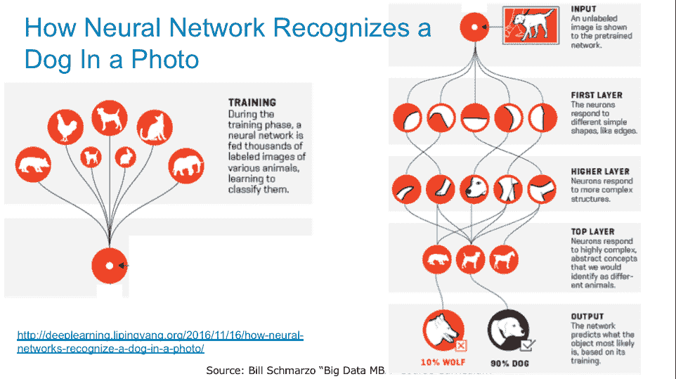

# 使用混淆矩阵来量化错误的成本

> 原文：[`www.kdnuggets.com/2018/10/confusion-matrices-quantify-cost-being-wrong.html`](https://www.kdnuggets.com/2018/10/confusion-matrices-quantify-cost-being-wrong.html)

 评论

统计学中有很多令人困惑且有时甚至违反直觉的概念。 我是说，来吧……即使解释零假设和替代假设之间的区别也可能是一场折磨。 我所想做的就是理解并量化我的分析模型出错的成本。

例如，假设我是一名视力不佳的牧羊人，难以区分狼和牧羊犬。这显然是一个不好的特质，因为错误的成本非常高：

+   有时我会把狼误认为是牧羊犬而不采取任何行动，这导致羊群的损失。 这一事件每次花费我$2,000，发生的概率是 10%。

+   另一方面，有时我会把牧羊犬误认为是狼，并意外地杀死牧羊犬，这导致羊群无人保护。 这一事件每次花费我$5,000，发生的概率是 5%。

* * *

## 我们的前三个课程推荐

 1\. [Google 网络安全证书](https://www.kdnuggets.com/google-cybersecurity) - 快速进入网络安全职业。

 2\. [Google 数据分析专业证书](https://www.kdnuggets.com/google-data-analytics) - 提升你的数据分析水平

 3\. [Google IT 支持专业证书](https://www.kdnuggets.com/google-itsupport) - 支持你的组织的 IT

* * *

好吧，我可能不是一个很好的牧羊人，但我确实是一个非常高明的牧羊人，并且我已经建立了一个神经网络应用来区分牧羊犬和狼。 经过大量的“狼检测”神经网络训练，我现在拥有一个可以以 95%准确率正确区分牧羊犬和狼的工具（见图 1）。

**图 1: 来源: “为什么深度学习突然改变了你的生活”** [**(http://fortune.com/ai-artificial-intelligence-deep-machine-learning/?xid=for_em_sh)**](http://fortune.com/ai-artificial-intelligence-deep-machine-learning/?xid=for_em_sh)

好吧，这似乎相当不错，但考虑到假阳性和假阴性的成本，95%的准确率是否*足够好*？ 我是否应该投入更多的时间和精力来提高这个准确率，以确保我的模型是“有利可图的”；量化那 5%的不准确性，这使我的分析模型出错？

进入混淆矩阵（如果有哪个名字能准确描述某样东西，这个名字就是了）。

### **理解混淆矩阵**

那么如何利用混淆矩阵量化错误的成本呢？也就是说，确定一个模型在例如 95%的准确率下是否在给定业务情况和错误成本的情况下是*足够好的*。

在讨论混淆矩阵时，会使用“真实条件”（“正面结果”）和“预测条件”（“负面结果”）这两个术语。这意味着你需要理解 I 型和 II 型错误的差异（以及最终与之相关的成本）。

+   I 型错误（或假阳性）是一种结果，表明给定条件存在时实际上并不存在。在我们的牧羊人示例中，这将是错误地将动物识别为狼，而实际上它是一只狗。

+   II 型错误（或假阴性）是一种结果，表明给定条件不存在时实际上是存在的。在我们的牧羊人示例中，这将是错误地将动物识别为狗，而实际上它是一只狼。

首先，让我们为测试条件“那只树林中的动物是狼吗？”建立混淆矩阵。正面条件是“动物是狼”，在这种情况下，我将采取适当的行动（可能不会尝试去抚摸它）。以下是我们用例的 2x2 混淆矩阵。

| 真实情况 |
| --- |
| 预测条件 |  | 真实（狼） | 错误（狗） |
| 真实（狼） | TP | FP |
| 错误（狗） | FN | TN |

其中：

+   真实阳性（TP）是指真实情况是狼，模型准确地预测为狼。

+   真实阴性（TN）是指真实情况是狗，模型准确地预测为狗。

+   假阳性（FP）是一种 I 型错误，其中真实情况是狗，但模型不准确地预测为狼（这样我就可能误伤保护羊群的狗）。

+   假阴性（FN）是一种 II 型错误，其中真实情况是狼，但模型不准确地预测为狗（这样我就忽视了狼，狼就能在羊群盛宴上大快朵颐）。

一旦神经网络模型生成了覆盖上述四种情况的混淆矩阵，我们就可以计算适配度和有效性指标，如模型的精确度、灵敏度和特异性。

| 真实情况 |
| --- |
| 预测条件 | 单元概率 | 真实（狼） | 错误（狗） |
| 真实（狼） | 精确度 TP / (TP + FP) | FP / (TP + FP) |
| 错误（狗） | FN /(TN + FN) | TN / (TN + FN) |
|  | 召回率 / 灵敏度 TP / (TP + FN) | 特异性 TN / (FP + TN) |

然后可以利用混淆矩阵创建适配度和模型准确度的以下指标。

+   精确度 = TP / (TP + FP)

+   召回率或灵敏度 = TP / (TP + FN)

+   特异性 = TN / (FP + TN)

+   准确率 = (TP + TN) / (TP + FP + TN + FN)

### **将混淆矩阵付诸实践**

现在我们回到牧羊人的例子。我们想要确定模型错误的成本，或者神经网络提供的节省。我们需要确定模型提供的改进是否足够优于牧羊人自己已经做的工作。

在使用狼检测应用之前，我（作为牧羊人）有以下混淆矩阵，其中：

+   假阳性 10%的时间，他将狼误认为牧羊犬，未采取行动，狼造成$2,000 的损害。

+   假阴性 5%的时间，他将牧羊犬误认为狼，意外杀死牧羊犬，导致羊群无人保护，造成$5,000 的损失。

| 无狼检测应用 |
| --- |
| 真实情况 |
| 预测情况 | 5,000 观察 | 真实（狼） | 假（狗） |
| 真实（狼） | 真阳性 = 75% | 假阳性 = 10% |
| 假（狗） | 假阴性 = 5% | 真阴性 = 10% |
|  |  |  |

根据之前的定义，不使用狼检测应用的相应指标为：

+   精确度 = 88%

+   召回率/敏感度 = 94%

+   特异性 = 50%

+   准确率 = 85%

现在使用狼检测应用，我们得到下面的混淆矩阵：

| 使用狼检测应用 |
| --- |
| 真实情况 |
| 预测情况 | 5,000 观察 | 真实（狼） | 假（狗） |

| 真实（狼） | 真阳性 = 4,000 无成本

4000 / 5000 = 80% | 假阳性 = 200 每次成本 = $2,000

200 / 5000 = 4% |

| 假（狗） | 假阴性 = 50 每次成本 = $5,000

50 / 5000 = 1% | 真阴性 = 750 无成本

750 / 5000 = 15% |

|  |  |  |
| --- | --- | --- |

使用狼检测应用的混淆矩阵指标为：

+   精确度 = 95%

+   召回率/敏感度 = 99%

+   特异性 = 79%

+   准确率 = 95%

将这些内容整合成一个表格：

|  | 无狼检测应用 | 有狼检测应用 | 改进 | % 改进 |
| --- | --- | --- | --- | --- |
| 精确度 | 88% | 95% | 7 分 | 8.0% |
| 召回率/敏感度 | 94% | 99% | 5 分 | 5.3% |
| 特异性 | 50% | 79% | 29 分 | 58.0% |
| 准确率 | 85% | 95% | 10 分 | 11.8% |

投资回报率则等于：

+   假阳性从 10%减少到 4%（每次减少$2,000）

+   假阴性从 5%减少到 1%（每次减少$5,000）

**最终，每次预测的期望值（EvP）=**

= ($2000 * 假阳性变化%) + ($5000 * 假阴性变化%)

= ($2000*.06) + ($5000*.04)

**= 每晚平均节省$320**

### **总结**

并非所有的 I 型和 II 型错误都具有相同的价值。需要投入时间来理解 I 型和 II 型错误相对于特定情况的成本。真正的挑战是确定分析模型的性能改进是否“足够好”。混淆矩阵可以帮助我们做出这个判断。

如果有人仍然对 I 型和 II 型错误的概念感到困惑，希望下面的图像能帮助澄清差异。 呵呵

特别感谢我的高级数据科学家之一，Larry Berk，感谢他对本博客的指导。他对混淆矩阵的理解仍然远胜于我！

### **来源：**

“[混淆矩阵术语简单指南](https://www.dataschool.io/simple-guide-to-confusion-matrix-terminology/)”

“[混淆矩阵](https://en.wikipedia.org/wiki/Confusion_matrix)”来自维基百科（顺便提一下，我确实向维基百科做了一个[捐款](https://donate.wikimedia.org/w/index.php?title=Special:LandingPage&country=XX&uselang=en&utm_medium=sidebar&utm_source=donate&utm_campaign=C13_en.wikipedia.org)。他们是这些主题的宝贵信息来源）。

**相关内容：**

+   为构建你的数据科学团队制定一个成功的游戏计划

+   数据集成与数据工程之间有什么区别？

+   伟大的数据科学家不仅是跳出框框思考，他们还重新定义了框框

### 更多相关话题

+   [白痴指南：精确度、召回率和混淆矩阵](https://www.kdnuggets.com/2020/01/guide-precision-recall-confusion-matrix.html)

+   [在 Scikit-learn 中可视化混淆矩阵](https://www.kdnuggets.com/2022/09/visualizing-confusion-matrix-scikitlearn.html)

+   [混淆矩阵、精确度和召回率的解释](https://www.kdnuggets.com/2022/11/confusion-matrix-precision-recall-explained.html)

+   [KDnuggets 新闻，11 月 16 日：LinkedIn 如何使用机器学习 •…](https://www.kdnuggets.com/2022/n45.html)

+   [我如何在 2 个月内获得 4 个数据科学职位并使收入翻倍…](https://www.kdnuggets.com/2021/01/data-science-offers-doubled-income-2-months.html)

+   [数据科学家的挑战](https://www.kdnuggets.com/2022/02/data-scientist-challenges.html)
