# 混淆矩阵、精确度和召回率解释

> 原文：[`www.kdnuggets.com/2022/11/confusion-matrix-precision-recall-explained.html`](https://www.kdnuggets.com/2022/11/confusion-matrix-precision-recall-explained.html)

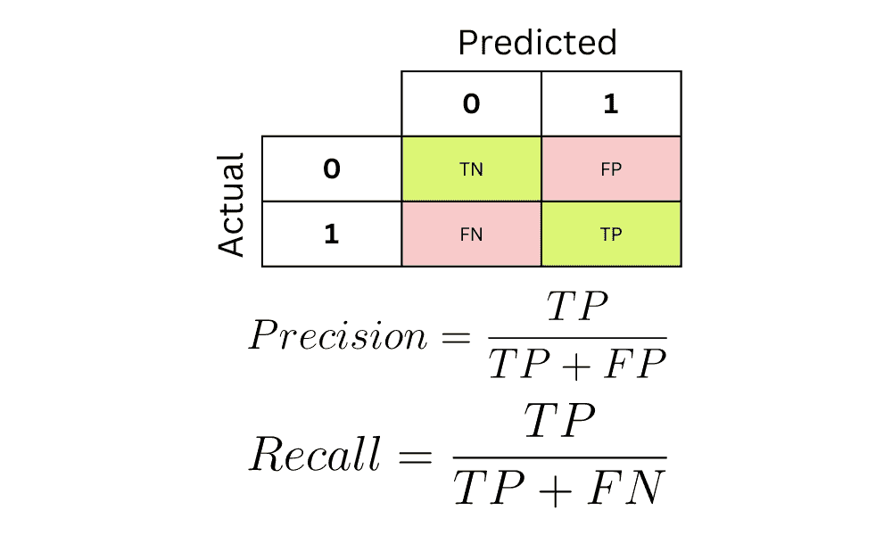

图片由编辑提供

混淆矩阵是用于总结分类模型性能的表格。

* * *

## 我们的三大课程推荐

 1\. [谷歌网络安全证书](https://www.kdnuggets.com/google-cybersecurity) - 快速进入网络安全职业生涯。

 2\. [谷歌数据分析专业证书](https://www.kdnuggets.com/google-data-analytics) - 提升你的数据分析能力

 3\. [谷歌 IT 支持专业证书](https://www.kdnuggets.com/google-itsupport) - 支持组织的 IT 部门

* * *

如果你不太熟悉，分类模型是用于解决具有分类结果的问题的机器学习算法，例如预测电子邮件是否为垃圾邮件。

**准确率**是评估分类模型最常用的指标。

然而，它并不总是最可靠的，这就是为什么数据科学家生成**混淆矩阵**并使用如**精确度**和**召回率**等指标的原因。

混淆矩阵是数据科学面试中最常测试的概念之一。招聘经理经常要求候选人解释混淆矩阵，或者提供一个用例并要求他们手动计算模型的精确度和召回率。

因此，彻底了解这些技术如何工作以及何时应使用这些技术来代替准确率是非常重要的。

在本文中，我们将涵盖以下概念，以巩固你对分类指标的理解：

1.  分类准确率的局限性

1.  什么是混淆矩阵，为什么要使用它？

1.  如何读取混淆矩阵

1.  什么是精确度和召回率，它们如何克服分类准确率的局限性？

1.  如何在 Python 中生成混淆矩阵

# 分类准确率的局限性

让我们看一个简单的例子来理解分类准确率失败的地方：

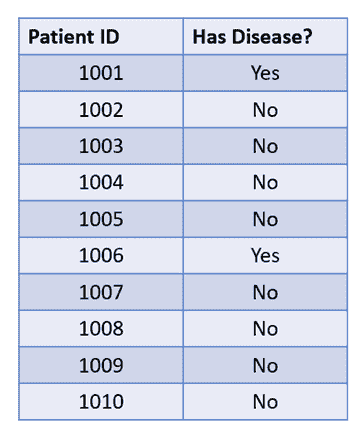

上表包含与 10 名患者相关的数据。10 名患者中有 8 名没有罕见疾病，而 2 名有。

这是一个**不平衡分类问题**的例子。

如果你的数据集具有不平衡的比例，即一个类别的过度代表和另一个类别的不足代表，那么数据集是不平衡的。

在这种情况下，即使你构建的分类模型总是预测多数类，准确率也会很高。

在这个例子中，如果模型总是预测患者没有疾病，它会在 10 次中有 8 次预测正确，准确度为 80%：

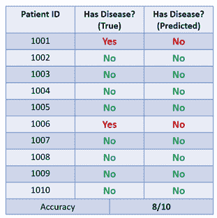

这是一个糟糕的模型，因为它总是预测多数类别，但其高准确度可能会欺骗我们，让我们认为模型表现良好。

由于准确度并不总是显示出完整的情况，我们可以使用混淆矩阵来告诉我们模型的实际表现如何。

# 什么是混淆矩阵？

混淆矩阵总结了分类器的性能，并使我们能够识别准确度无法告诉我们的细节。

为了更好地理解它是如何工作的，让我们基于上表构建一个混淆矩阵：

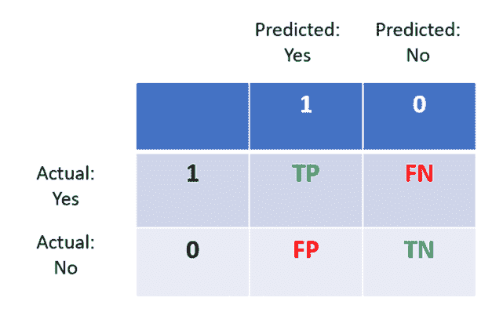

上面的图显示了混淆矩阵的结构。以下是如何解读它：

1.  列表示实际值，行表示预测。

1.  如果一个人实际上有疾病，而模型准确地预测出他们有疾病，那么这称为**真正的** **阳性**。

1.  如果一个人没有疾病而模型预测为“否”，那么这就是**真正的** **阴性**。

1.  真阳性和真阴性在混淆矩阵中形成对角线。我们可以用以下公式计算模型的准确度：

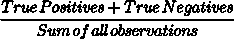

1.  如果一个人有疾病（是）但模型预测为“否”，这就是**假阴性**。

1.  最后，如果一个人没有疾病（否），但模型预测为“是”，那么这就是**假阳性**。

现在，让我们根据疾病预测数据填写混淆矩阵。


步骤 1：真阳性

请记住，这表示准确预测为有疾病的人数。由于模型对每位患者的预测都是“没有”，所以数据集中有**0 个真阳性**。

步骤 2：真阴性

有 8 名没有疾病的患者，模型成功识别了他们所有人。所以有**8 个真阴性**。

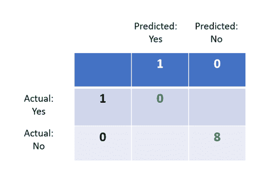

步骤 3：假阳性

这些人没有疾病，但模型预测为“是”。由于我们的模型从未预测“是”，所以有**0 个假阳性**。

步骤 4：假阴性

这些人确实有疾病，但模型预测为“没有”。数据集中有**2 个假阴性**。

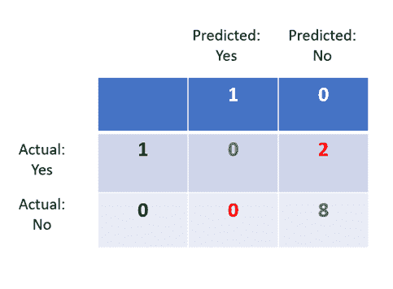

现在，虽然我们知道这个模型的准确度是 80%，但通过观察其混淆矩阵，我们可以看出模型存在一些问题。

混淆矩阵中“*预测: 是*”这一列全是零，这表明模型没有预测出任何一个人有疾病。

该模型仅预测了多数类“*否*”，表明其在疾病分类方面表现不佳，需要进一步改进。

# 精确度和召回率

现在你了解了混淆矩阵的工作原理，让我们深入探讨两个可以从中计算的指标。

精确度和召回率是数据科学家用来优化模型性能的两个流行分类指标。它们提供了准确率无法告诉我们的模型性能洞察。

## 精确度

精确度是一个指标，用于衡量正面预测的质量。在所有被预测有疾病的人中，有多少人实际上有这种疾病？

计算公式如下：

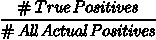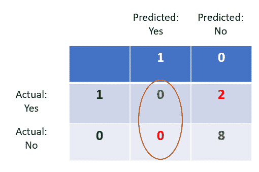

在这种情况下，我们只关注混淆矩阵的左侧。

**真正阳性**的数量是 0。

所有预测的正面包括**真正阳性**和**虚假阳性**的总和，也为 0。

因此，模型的精确度是 0/0+0 = 0。

## 召回率

召回率告诉我们模型识别真正阳性的能力。所有有疾病的患者中，有多少被正确识别？

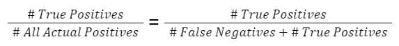

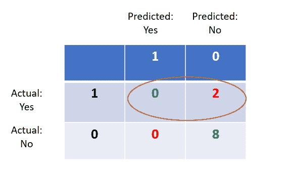

在这种情况下，真正阳性的数量是 0。虚假阴性的数量是 2。

因此，模型的召回率是 0/2+0 = 0。

请注意，这个例子中精确度和召回率都为零。这是因为模型没有真正阳性，使得分类器无用，因为它无法做出一个正确的正面预测。

## 什么是“好的”分类模型？

一个好的分类器应具备高准确率、精确度和召回率。

在某些用例中，数据科学家会根据场景优化其模型以提高精确度或召回率。

一种召回率高于精确度的模型通常会做出更多的正面预测。这种模型会带来更多的虚假阳性和较低的虚假阴性。

在疾病预测这类场景中，模型应始终优化召回率。与虚假阴性相比，虚假阳性在医疗行业中更为可接受。

另一方面，精确度较高的模型会有较少的虚假阳性和更多的虚假阴性。如果你要为在线商店构建一个机器人检测机器学习模型，你可能会希望优化较高的精确度，因为禁止合法用户访问网站将导致销售下降。

正确理解这一概念很重要，因为数据科学面试官经常会提出如上所述的使用案例，并询问候选人是否优化精确度还是召回率。

# 如何在 Python 中构建混淆矩阵

你可以运行以下代码行来使用 Python 中的 Scikit-Learn 构建混淆矩阵：

```py
from sklearn.metrics import confusion_matrix

true = [1, 0, 0, 0, 0, 1, 0, 0, 0, 0]

predicted = [0, 0, 0, 0, 0, 0, 0, 0, 0, 0]

print(confusion_matrix(true, predicted))
```

**[Natassha Selvaraj](https://www.natasshaselvaraj.com/)** 是一位自学成才的数据科学家，热衷于写作。你可以在[LinkedIn](https://www.linkedin.com/in/natassha-selvaraj-33430717a/)上与她联系。

### 主题更多信息

+   [KDnuggets 新闻，11 月 16 日：LinkedIn 如何使用机器学习 •…](https://www.kdnuggets.com/2022/n45.html)

+   [精确度、召回率与混淆矩阵的白痴指南](https://www.kdnuggets.com/2020/01/guide-precision-recall-confusion-matrix.html)

+   [分类指标教程：逻辑回归与…](https://www.kdnuggets.com/2022/10/classification-metrics-walkthrough-logistic-regression-accuracy-precision-recall-roc.html)

+   [在 Scikit-learn 中可视化混淆矩阵](https://www.kdnuggets.com/2022/09/visualizing-confusion-matrix-scikitlearn.html)

+   [NumPy Linalg Norm 中的向量和矩阵范数](https://www.kdnuggets.com/2023/05/vector-matrix-norms-numpy-linalg-norm.html)

+   [Python 中的稀疏矩阵表示](https://www.kdnuggets.com/2020/05/sparse-matrix-representation-python.html)
