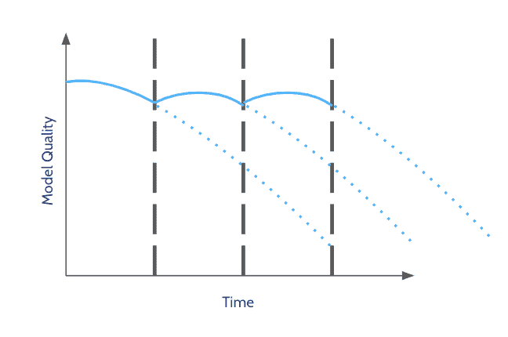
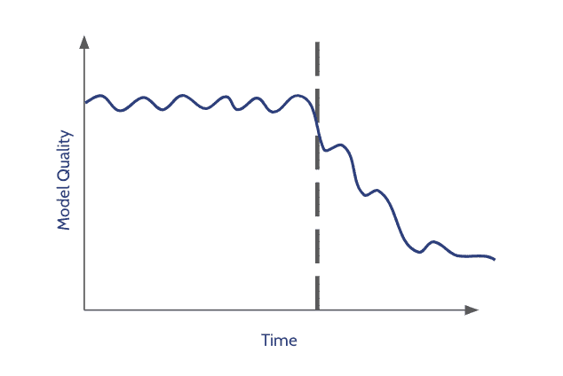
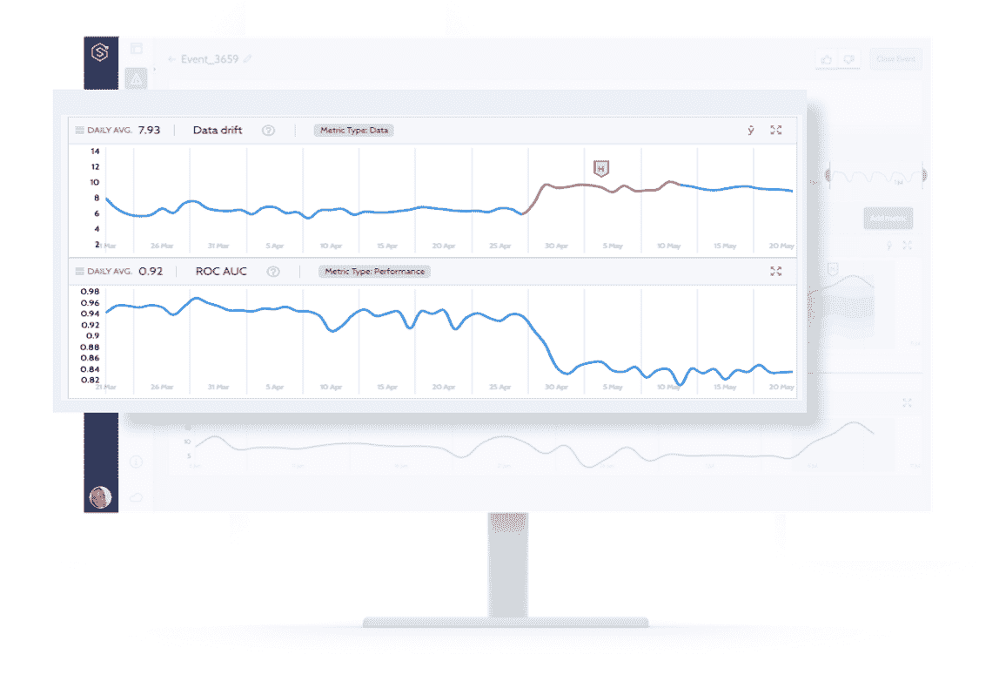
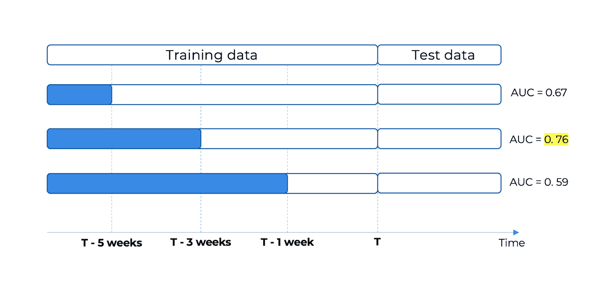
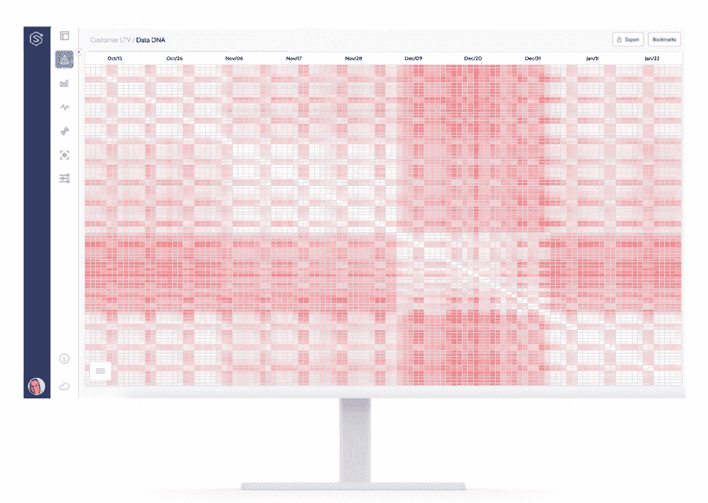
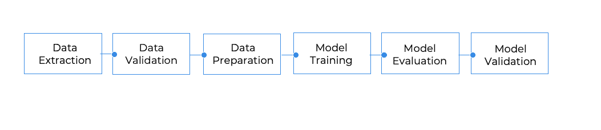

# 机器学习的持续训练 – 成功策略的框架

> 原文：[`www.kdnuggets.com/2021/04/continuous-training-machine-learning.html`](https://www.kdnuggets.com/2021/04/continuous-training-machine-learning.html)

评论

**由 [Or Itzary](https://www.linkedin.com/in/or-itzary/) 和 [Liran Nahum](https://www.linkedin.com/in/nahumliran/)，Superwise.ai 数据科学家**。

*照片由 Monika Pejkovska 提供，来源 Unsplash。*

‍机器学习模型的构建基于假设，即生产中使用的数据将与我们训练模型时观察到的数据相似。虽然对于某些特定用例这可能是正确的，但大多数模型在数据动态变化的环境中工作，在这种环境中“概念漂移”很可能发生并对模型的准确性和可靠性产生不利影响。

为了解决这个问题，机器学习模型需要定期重新训练。正如谷歌在 “[MLOps: Continuous delivery and automation pipelines in machine learning](https://cloud.google.com/solutions/machine-learning/mlops-continuous-delivery-and-automation-pipelines-in-machine-learning)” 中所述：

> “*为了应对这些挑战并保持模型在生产中的准确性，你需要执行以下操作：积极监控生产中模型的质量 [...] 并频繁重新训练你的生产模型。*”

这个概念被称为‘**持续训练**’（CT），是 MLOps 实践的一部分。持续训练旨在自动和持续地重新训练模型，以适应数据中可能发生的变化。

有不同的方法/方法论来执行持续再训练，每种方法都有其优缺点和成本。然而，与赤脚行走的鞋匠类似，我们--数据科学家--似乎过度使用再训练，有时是手动进行的，常常将其作为“默认”解决方案，而没有足够的生产驱动洞察。

每个机器学习用例都有其自身动态的数据环境，可能会导致概念漂移：从实时交易到欺诈检测，面对对手改变数据分布，或是推荐引擎面临大量新电影和新趋势。然而，无论用例如何，在设计持续训练策略时需要解决三个主要问题：

**1 - 何时应重新训练模型？** 由于目标是保持运行的模型在任何时候都高度相关且表现最佳，模型应该多久重新训练一次？

**2 - 应使用什么数据？** 选择适当数据集的常见假设是数据的相关性与其时效性相关，这引发了一系列问题：我们应该仅使用新数据还是添加到旧数据集？旧数据和新数据之间的良好平衡是什么？多新的数据算作新数据，或者说旧数据和新数据的分界线在哪里？

**3 - 应该重新训练什么？** 我们可以仅仅替换数据并用相同的超参数重新训练相同的模型吗？还是应该采取更具侵入性的方法，运行一个完整的流程来模拟我们的研究过程？

上述三个问题中的每一个都可以单独回答，并有助于确定每种情况的最佳策略。然而，在回答这些问题时，还有一些需要考虑的因素，我们在这里进行调查。对于每个问题，我们描述了对应不同自动化水平和机器学习过程成熟度的不同方法。

### 何时重新训练？

三种最常见的策略是周期性重新训练、基于性能的重新训练，或者基于数据变化的重新训练。

**周期性重新训练**

周期性重新训练时间表是最简单直接的方法。通常，它是基于时间的：每三个月重新训练一次模型——但也可以基于数量，即每 100K 个新标签进行一次重新训练。

周期性重新训练的优势同样直截了当：这是一个非常直观且易于管理的方法，因为很容易知道下一个重新训练的迭代什么时候发生，并且**易于实施**。

**不过，这种方法通常被证明是不适合或效率低下的。** 你多久重新训练一次模型？每天？每周？每三个月？每年一次？虽然我们希望频繁重新训练以保持模型更新，但在没有实际原因（即没有概念漂移）的情况下过于频繁地重新训练模型是成本高昂的。此外，即使重新训练是自动化的，它仍然需要重要的资源——包括计算资源和数据科学团队的资源，这些团队需要监督重新训练过程以及部署后新模型在生产中的表现。然而，长时间间隔的重新训练可能会错过持续重新训练的关键，无法适应数据的变化，更不用说在噪声数据上重新训练的风险了。

> *归根结底，如果周期性重新训练的频率与领域的动态性相一致，那是有意义的。否则，选择一个随机的时间/里程碑可能会让你面临风险，并使你拥有的模型的相关性低于其之前的版本。*

**基于性能的触发器**

这几乎是一个常识性的说法，基于古老的工程格言：“如果没有坏，就不要修理。” 第二种最常见的确定何时重新训练的方法是利用基于性能的触发器，一旦检测到性能下降，就重新训练模型。

这种方法，比第一个方法更具经验性，假设你对生产中模型的性能有持续的监控视角。

仅依赖性能的主要限制是获取真实数据所需的时间——如果你能够获取的话。在用户转化预测的情况下，可能需要 30 或 60 天才能获得真实数据，或者在交易欺诈检测或 LTV 等情况中可能需要 6 个月或更长时间。如果你需要等待这么长时间才能获得全面反馈，这意味着你将会在业务已经受到影响之后才重新训练模型。

另一个需要回答的非琐碎问题是：什么被视为‘性能退化’? 你可能依赖于阈值的敏感性和校准的准确性，这可能导致你过于频繁或不够频繁地重新训练。

> *总体来说，使用基于性能的触发器适用于反馈快速且数据量大的用例，如实时竞价，在这种情况下，你可以尽可能接近预测时间来测量模型的性能，时间间隔短且置信度高（数据量大）。*

**由数据变化驱动**

这种方法是最具动态性的，它自然地从领域的动态中触发重新训练。通过测量输入数据的变化，即模型使用的特征分布的变化，你可以检测到数据漂移，这表明你的模型可能已经过时，需要在新数据上进行重新训练。

对于没有快速反馈或无法实时评估模型在生产环境中性能的情况，这是一种替代基于性能的方法。此外，即使在有快速反馈的情况下，将这种方法结合使用也是一种良好的实践，因为它可能表明性能不佳，即使没有退化。**理解数据变化以启动重新训练过程是非常有价值的，尤其是在动态环境中。**

*来自 superwise.ai 的截图。*

上图由监控服务生成，展示了一个营销用例的数据漂移指标（上图）和性能 KPI（下图）。数据漂移图是一个时间轴，Y 轴显示了每一天的漂移水平（即该日的数据）相对于训练集。在这个营销用例中，新活动非常频繁地引入，业务扩展到新国家。**显然，生产中的数据正在漂移，与模型训练时的数据变得越来越不相似。**通过对模型在生产中的全面了解，重新训练迭代可以在业务观察到性能退化之前触发。

> *那么什么时候重新训练？这取决于一些关键因素，如反馈的可用性、数据的量以及对模型性能的可见性。总体而言，选择合适的重新训练时间没有“一刀切”的答案。相反，根据你的资源，目标应该尽可能以生产驱动为主。*

### 应该使用什么数据？

虽然我们已经看到时机决定一切（即，什么时候重新训练我的模型？），现在让我们来看所有 MLOps 的核心：数据。在重新训练时，我如何选择要使用的正确数据？

**固定窗口大小**

最简单的方法是使用固定窗口大小作为训练集。例如，使用过去 X 个月的数据。显然，该方法的优势在于其简单性，非常直接。

缺点来源于选择合适窗口的挑战：如果窗口过宽，可能会错过新的趋势；如果窗口过窄，则会出现过拟合和噪声。窗口大小的选择还应考虑重新训练的频率：如果你只使用最近一个月的数据作为训练集，那么每三个月重新训练一次是没有意义的。

此外，所选的数据可能与在生产中流入的数据差异很大，因为它可能发生在变化点之后（在快速/突发变化的情况下），或者可能包含不规则事件（例如假期或特殊日子如选举日）、数据问题等。

> *总的来说，固定窗口方法，像其他所有“静态”方法一样，是一种简单的启发式方法，可能在某些情况下效果良好，但在变化率多样化且不规则事件（如假期或技术问题）常见的环境中，它将无法捕捉到环境的高度动态性。*

**动态窗口大小**

动态窗口大小方法试图通过以更数据驱动的方式确定应包含多少历史数据，并将窗口大小视为可以优化的另一个超参数，从而解决一些预定义窗口大小的限制。

这种方法最适合于快速反馈的情况（例如实时竞价或食品配送预估）。可以将最相关的数据用作测试集，并在其上优化窗口大小，就像模型的其他超参数一样。在下面的案例中，通过取最近 3 周的数据来获得最佳性能，这就是本次迭代应选择的窗口。对于未来的迭代，可以根据与测试集的比较选择不同的窗口。

动态窗口大小方法的优势在于它更具数据驱动性，基于模型性能，这是最终标准，因此在高度时间敏感的环境中更为稳健。

缺点是它需要更复杂的训练流程（见下一个问题“训练什么”）来测试不同的窗口大小并选择最佳窗口，并且计算密集度更高。此外，像固定窗口大小一样，它假设最新的数据是最相关的，这并不总是正确的。

**动态数据选择**

选择数据以训练模型的第三种方法旨在实现任何重新训练策略的基本目标，也就是任何 ML 模型的基本假设：使用与生产数据相似的训练数据。换句话说，模型应该在尽可能与实际预测数据相似的数据上进行重新训练。这种方法复杂且需要对生产数据有很高的可见性。

**要做到这一点，你需要对生产数据的演变进行透彻分析，以了解它是否以及如何随时间变化。** 一种方法是计算每对日期之间的输入数据漂移，即某一天的数据与另一天天的数据有多不同，并生成一个热图，揭示数据随时间变化的模式，如下图所示。下面的热图是随时间变化的漂移评估的可视化，其中轴（列和行）是日期，每个点（矩阵中的单元格）表示两天之间的漂移水平，漂移越大，单元格越红。

*Superwise 数据 DNA 视图。*

上面，你可以看到由 superwise.ai 自动生成的这种分析结果，帮助发现与当前流数据尽可能相似的数据。从这个视图中可以轻松得出不同类型的见解：

1 - 十二月份的数据与其他时间的数据（前后）非常不同。这一见解使我们能够避免将整个时期视为一个整体，并在你想重新训练时排除这些天，因为这个月的数据不能代表你在生产中观察到的正常数据。

数据的季节性可以被可视化——这可能引发关于在工作日和周末使用不同模型的必要性的讨论。

> ‍*还有一点非常强大的是：你实际上可以得到一个图像证明最新的数据不一定是最相关的。*

‍简而言之，选择合适的数据来重新训练你的模型需要对生产数据行为有透彻的了解。虽然使用固定或动态窗口大小可能帮助你“勾选”选项，但这通常仍然是猜测，可能比高效更昂贵。

### 应该重新训练什么？

现在我们已经分析了何时重新训练以及使用什么数据，接下来解决第三个问题：应该重新训练什么？可以选择仅基于新数据重新训练（重新拟合）模型实例，包含一些或所有的数据准备步骤，或者采取更具侵入性的方法，运行一个模拟研究过程的完整管道。

重新训练的基本假设是，研究阶段训练的模型由于概念漂移将变得过时，因此需要重新训练。然而，在大多数情况下，模型实例只是研究阶段构建的更广泛管道的最后阶段，包括数据准备步骤。问题是：漂移的严重程度及其影响如何？或者在重新训练的背景下，模型管道的哪些部分应受到挑战？

在研究阶段，你会在模型管道步骤中尝试和评估许多元素，以优化模型。这些元素可以分为两个高层次的部分：数据准备和模型训练。数据准备部分负责准备数据（显然！）以供模型使用，包括特征工程、缩放、填补、降维等方法，模型训练部分负责选择最佳模型及其超参数。最后，你会得到一个顺序步骤的管道，这些步骤处理数据，准备数据以供模型使用，并使用模型预测目标结果。

仅用新相关数据对模型进行重新训练，即管道中的最后一步，是最简单和天真的方法，可能足以避免性能下降。然而，在某些情况下，这种仅模型的方法可能不够全面，应采取更全面的方法来进行重新训练的范围。扩展重新训练的范围可以从两个方面进行：

1 - **重新训练什么？** 管道中的哪些部分应该使用新数据进行重新训练？

2 - **重新训练的层次：** 你只是用新数据重新拟合模型（或其他步骤）吗？你会进行超参数优化吗？还是挑战模型本身的选择并测试其他模型类型？

另一种看法是，在重新训练过程中，你基本上是在尝试自动化并避免数据科学家在没有自动重新训练过程的情况下进行的模型优化研究的手动工作。因此，你需要决定你想在多大程度上模拟手动研究过程，如下图所示。

*如《MLOps: Continuous delivery and automation pipelines in machine learning》中所述的模型研究阶段。*

请注意，自动化流程的第一步更加复杂，随着这些实验周围自动化的增加，过程变得更加强健和灵活，以适应变化，但也增加了复杂性，因为需要考虑更多的终端情况和检查。

### 示例与结论

以一个简单的模型管道为例，这个管道是我们出色的数据科学团队为某些分类任务进行手动研究的结果：

你可以采取简单的方法，仅仅重新训练模型本身，让它学习一个新的树，或者你可以包括一些（或全部）数据准备步骤（例如，重新学习填补器中的均值或缩放器中的最小/最大值）。但除了选择要重新训练的步骤之外，你还需要决定到什么程度。例如，即使你选择仅重新训练模型，也可以在多个层次上进行。你可以仅仅重新训练模型本身，让它学习一个新的树，即 *model.fit* (*new_X*, *new_y*)，或者你可以搜索和优化模型超参数（最大深度、最小叶子大小、最大叶子节点等），甚至挑战模型本身的选择，测试其他模型类型（例如，逻辑回归和随机森林）。数据准备步骤也可以（且应该）重新训练，以测试不同的缩放器或不同的填补方法，甚至测试不同的特征选择。

当选择更全面的方法并执行超参数优化/模型搜索时，你还可以使用旨在自动化构建和优化模型管道过程的 Auto-ML 框架，包括数据准备、模型搜索和超参数优化。它不必涉及复杂的元学习。它可以很简单：用户选择一系列模型和参数。有很多工具可用：[AutoKeras](https://autokeras.com/)，[Auto SciKitLearn](https://github.com/automl/auto-sklearn)。然而，尽管 AutoML 非常吸引人，但它并不免除用户必须拥有一个强健的过程来跟踪、测量和监控模型在整个生命周期中的表现，特别是在生产环境中部署前后。

到头来，“翻转开关”和自动化你的流程必须伴随强健的流程，以确保你对数据和模型保持控制。

***为了实现高效的持续培训，你应该能够以生产驱动的见解为主导。对于任何和每个用例，创建一个强健的机器学习基础设施严重依赖于对模型健康状况和生产中的数据健康状况的可见性和控制能力。这就是成为数据驱动的数据科学家的要求。***

[原文](https://www.superwise.ai/resources/framework-for-a-successful-continuous-training-strategy)。经许可转载。

**相关：**

+   [机器学习模型监控检查清单：7 个要跟踪的事项](https://www.kdnuggets.com/2021/03/machine-learning-model-monitoring-checklist.html)

+   [MLOps：模型监控 101](https://www.kdnuggets.com/2021/01/mlops-model-monitoring-101.html)

+   [模型重新训练终极指南](https://www.kdnuggets.com/2019/12/ultimate-guide-model-retraining.html)

* * *

## 我们的前三个课程推荐

 1\. [谷歌网络安全证书](https://www.kdnuggets.com/google-cybersecurity) - 快速进入网络安全职业生涯

 2\. [谷歌数据分析专业证书](https://www.kdnuggets.com/google-data-analytics) - 提升你的数据分析技能

 3\. [谷歌 IT 支持专业证书](https://www.kdnuggets.com/google-itsupport) - 支持你的组织 IT

* * *

### 更多相关话题

+   [数据质量在成功机器学习中的重要性](https://www.kdnuggets.com/2022/03/significance-data-quality-making-successful-machine-learning-model.html)

+   [成功数据科学家的 5 个特征](https://www.kdnuggets.com/2021/12/5-characteristics-successful-data-scientist.html)

+   [如何在 2022 年成为成功的数据科学自由职业者](https://www.kdnuggets.com/2022/02/become-successful-data-science-freelancer-2022.html)

+   [KDnuggets 新闻，6 月 22 日：主要的监督学习算法](https://www.kdnuggets.com/2022/n25.html)

+   [Django 框架中的社交用户认证](https://www.kdnuggets.com/2023/01/social-user-authentication-django-framework.html)

+   [AI/ML 模型风险管理框架](https://www.kdnuggets.com/2022/03/risk-management-framework-aiml-models.html)
