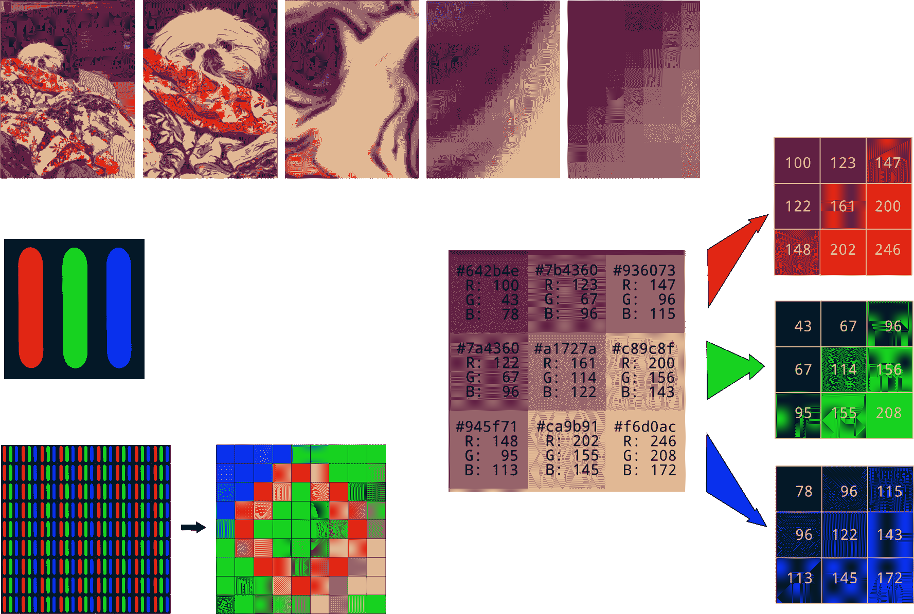
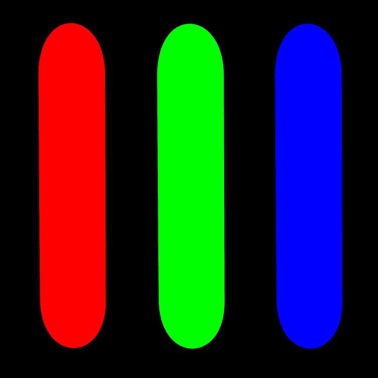
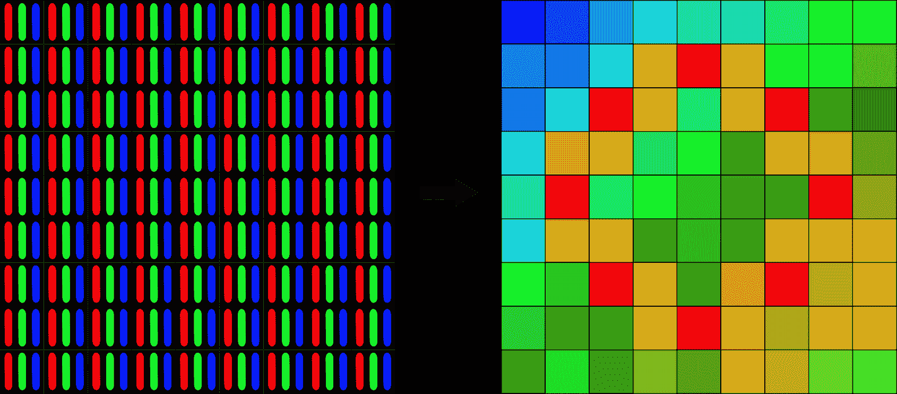
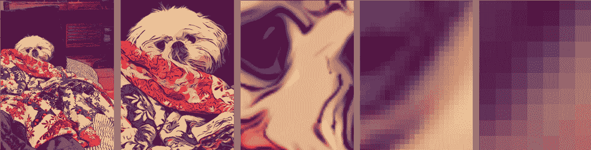
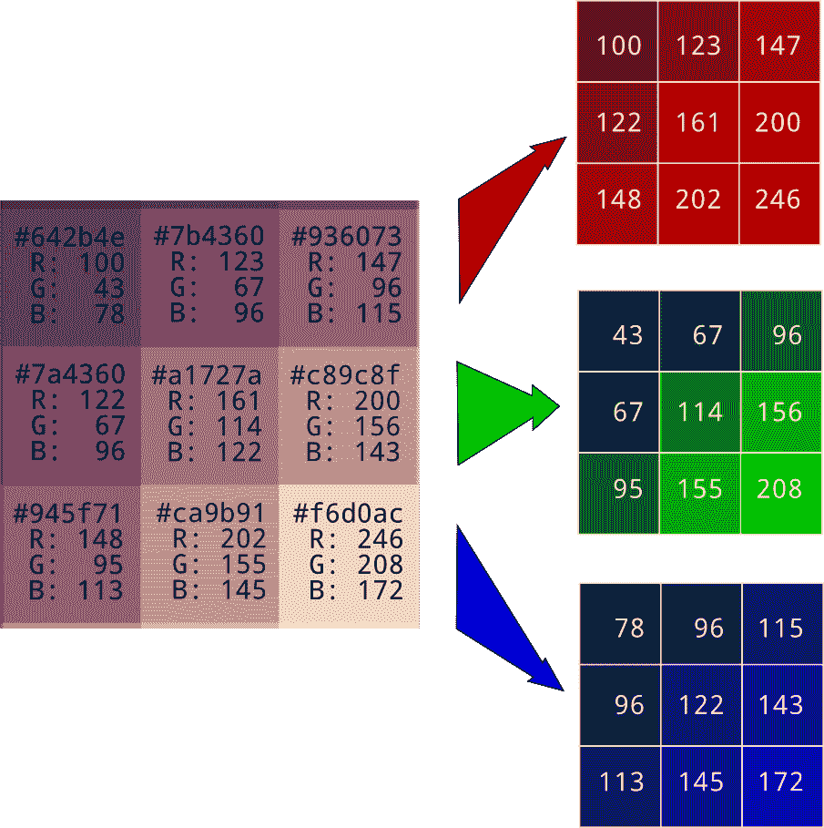
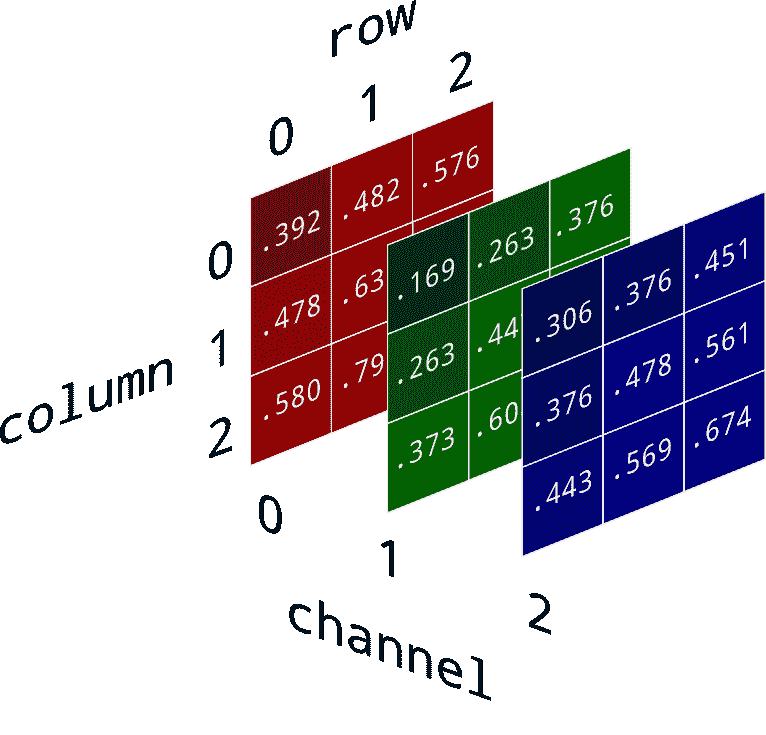

# 如何将图片转换为数字

> 原文：[`www.kdnuggets.com/2020/01/convert-picture-numbers.html`](https://www.kdnuggets.com/2020/01/convert-picture-numbers.html)

评论

体验周围世界几乎无法用几句话来捕捉，从蚂蚁的细致步伐，到巴勃罗·毕加索和比阿特丽克斯·波特的作品，再到孤独而庄严的橡树。认为我们能将一切归结为零和一是荒谬的。尽管如此，我们确实做到了。事实上，我们的图像现在如此逼真，以至于我们费尽心思重新引入伪影，比如宝丽来相片的褪色颜色或胶卷上的划痕。

这可能对浪漫主义是一种打击，但对机器学习从业者来说却是极大的好运。将图像转换为数字使其可以进行计算。

* * *

## 我们的前三名课程推荐

 1\. [谷歌网络安全证书](https://www.kdnuggets.com/google-cybersecurity) - 加速进入网络安全职业道路。

 2\. [谷歌数据分析专业证书](https://www.kdnuggets.com/google-data-analytics) - 提升你的数据分析技能

 3\. [谷歌 IT 支持专业证书](https://www.kdnuggets.com/google-itsupport) - 支持你的组织的 IT

* * *



### 颜色感知

颜色吸引我，因为它更多的是关于人类感知的生理学和心理学，而不是物理学。我们所有的标准都是由人类感知决定的。需要覆盖的范围、表示颜色所需的通道数量、必须指定颜色的分辨率，以及信息密度和存储需求，都取决于人类的视网膜和视觉皮层。

这也意味着，与所有人类事务一样，存在很大的变异性。存在一些缺陷，比如[color blindness](https://en.m.wikipedia.org/wiki/Color_blindness)（我自己有[deuteranomaly](https://en.m.wikipedia.org/wiki/Color_blindness#Deuteranomaly)，一种红绿色盲的类型），也有一些具有非凡能力的人，比如[tetrachromats](https://en.m.wikipedia.org/wiki/Tetrachromacy)，他们有四种颜色感受器，而不是三种，能够区分其他人无法识别的颜色。因此，请记住，我们对感知所做的所有陈述仅仅是概括，并且会存在个体差异。

尽管光子在所有频率上振动，我们有三种不同类型的颜色感知锥体，每种锥体都有其特征频率响应，对特定颜色有强烈的反应。这意味着，通过精心选择颜色和强度的三种光源的组合，可以使我们体验到自然界中我们能够看到的任何颜色。

### 制造颜色

在计算机屏幕中，这通常是通过红色、绿色和蓝色光源来完成的，通常是发光二极管（LED）。



实际上，计算机屏幕上的红色、绿色和蓝色 LED 无法表示我们能看到的所有颜色。为了制造彩色 LED，引入了一种化学物质，该物质在大致正确的颜色下发光。这些接近理想的红色、蓝色和绿色，但并不完美。因此，现实世界中你能看到的颜色范围（[色域](https://en.wikipedia.org/wiki/Gamut)）与计算机屏幕上能看到的颜色之间存在一定的差距。

作为附带说明，激光能够产生更接近理想的颜色。市售的激光投影系统覆盖了更多的人类可见色域，激光微阵列用于计算机屏幕是当前的研究和开发课题。

### 将颜色转换为数字

屏幕上的每个像素都是一个由红色、绿色和蓝色光源组成的三元组，但当你从足够远的地方看这些像素时，它们太小以至于你的眼睛无法区分，它们看起来像是一小块单一的颜色。确定产生哪种颜色的一种方法是指定每个光源的强度水平。由于人类对颜色强度的[可觉察差异 (JND)](https://en.wikipedia.org/wiki/Just-noticeable_difference)往往保持在百分之一左右，使用 256 个离散级别提供了足够精细的控制，使颜色渐变看起来很平滑。



256 个强度级别可以用 8 位或 1 字节表示。它也可以用两个十六进制数字表示，范围从 0x00（零亮度）到 0xff（最大亮度）。指定三种颜色的强度需要三倍的位数：6 个十六进制数字（24 位或 3 字节）。十六进制表示提供了一种简洁的方式来表示红-绿-蓝颜色。前两位数字显示红色级别，第二对数字对应绿色级别，第三对数字对应蓝色级别。以下是一些极端的示例。


有许多更有用的[颜色十六进制代码](https://www.color-hex.com/)。为了方便和代码的可读性，颜色也可以表示为十进制三元组，例如(255, 255, 255)表示白色，或(0, 255, 0)表示绿色。

### 从像素构建图像

为了重建整个图像，计算机使用可靠的技巧，即将图像切割成小块。为了生成高质量图像，需要将小块做得非常小，以至于人眼难以单独识别它们。

 图像来源：黛安·罗赫

每个像素的颜色可以用 6 位十六进制数字或 0 到 255 之间的三元组表示。在图像处理中，通常采用后者。为了方便，红色、绿色和蓝色的像素值被分离到各自的数组中。



### 将图像读取到 Python 代码中

读取图像到 Python 的一个可靠方法是使用[Pillow](https://pillow.readthedocs.io/en/stable/)，这是经典 Python 图像库或 PIL 的一个积极维护的分支，以及 Numpy。

```py
import numpy as np
from PIL import Image
img = np.asarray(Image.open("image_filename.jpg"))
```

当读取彩色图像时，结果对象`img`是一个三维的 Numpy 数组。数据类型通常是[`numpy.uint8`](https://docs.scipy.org/doc/numpy/user/basics.types.html)，这是表示 0 到 255 之间颜色级别的自然且高效的方法。我尚未确定这总是如此，因此在开始处理数据集中的图像之前，最好确认一下。

为了便于计算，我发现将图像值转换为 0 到 1 之间的浮点数最为方便。在 python3 中，最简单的方法是除以 255：`img *= 1/255`

记住图像在存储和传输时，可以用各种令人眼花缭乱的格式表示。这些解析是一个单独的工作。我们将依赖`Image.open()`和`numpy.asarray()`为我们完成所有这些转换。我仍然没找到绕过验证像素范围和数据类型的方法，但我会继续关注。

现在我们将所有图像信息以紧凑的数字集合形式存储。在我们的数组中，第 0 维表示像素行，从图像的顶部到底部。第 1 维表示从左到右的列。第 2 维表示红色、绿色和蓝色的颜色通道，按此顺序。



在这种格式中，你可以通过`img[row, column, channel]`获取所需的任何值。左上角像素的绿色值由`img[0, 0, 1]`给出。左下角像素的红色值是`img[2, 0, 0]`。你可以使用[Numpy 的切片和索引工具](https://docs.scipy.org/doc/numpy/reference/arrays.indexing.html)。

不要被第 0 行在图像顶部的事实困扰。当你向上数行号时，你实际上是在向图像底部移动。这与我们的 (x, y) 坐标轴约定不符，但与我们二维数组的 [行, 列] 布局完全匹配。

还可以有一个第四个颜色通道表示像素的透明度，称为 alpha。它控制图像下方的内容透过的程度。如果像素范围是 0 到 1，那么 alpha 为 1 完全不透明，alpha 为 0 完全透明。如果不存在 alpha，则假定 alpha 完全不透明。

另一种特殊情况是灰度图像，其中每个像素的三个颜色通道具有相同的值。由于重复，为了节省空间，只存储一个颜色通道，其他的则隐含。二维数组也可以用于任何类型的单色图像。按定义，它们只有一个颜色通道。

### 让乐趣开始吧

现在我们可以将图像转换为浮点数组，我们可以真正大展身手。我们可以对像素值进行加法、乘法和重新排列。我们可以调整色调和亮度，裁剪和滤镜。我们可以去除错误的像素，甚至在神经网络的帮助下识别不同的狗种。所有这些都因为我们看到的东西现在变成了数字格式。

将图像转换为数字并不会亵渎它，反而是对它的一种致敬。这个过程需要小心和对媒介的深深尊重。它还需要大量的磁盘空间。一张 8 百万像素的彩色图像未压缩时占据 24 兆字节。他们说一图胜千言，但这一点他们错了。它的价值是百万倍的。

[原文](https://brohrer.github.io/images_to_numbers.html)。经许可转载。

**相关内容：**

+   [如何将 RGB 图像转换为灰度图](https://www.kdnuggets.com/2019/12/convert-rgb-image-grayscale.html)

+   [如何使用 Python 的 datetime](https://www.kdnuggets.com/2019/06/how-use-datetime.html)

+   [数据科学课程路线图](https://www.kdnuggets.com/2019/12/data-science-curriculum-roadmap.html)

### 更多相关话题

+   [如何在不标记图像的情况下找到图像中的图片](https://www.kdnuggets.com/2022/09/find-picture-image-without-marking.html)

+   [解锁数字在健康经济学和结果研究中的力量](https://www.kdnuggets.com/2023/07/unlocking-power-numbers-health-economics-outcomes-research.html)

+   [如何将 RGB 图像转换为灰度图](https://www.kdnuggets.com/2019/12/convert-rgb-image-grayscale.html)

+   [如何使用 ChatGPT 将文本转换为 PowerPoint 演示文稿](https://www.kdnuggets.com/2023/08/chatgpt-convert-text-powerpoint-presentation.html)

+   [使用 tfidfvectorizer 将文本文件转换为 TF-IDF 矩阵](https://www.kdnuggets.com/2022/09/convert-text-documents-tfidf-matrix-tfidfvectorizer.html)

+   [将 Python 字典转换为 JSON：初学者教程](https://www.kdnuggets.com/convert-python-dict-to-json-a-tutorial-for-beginners)
