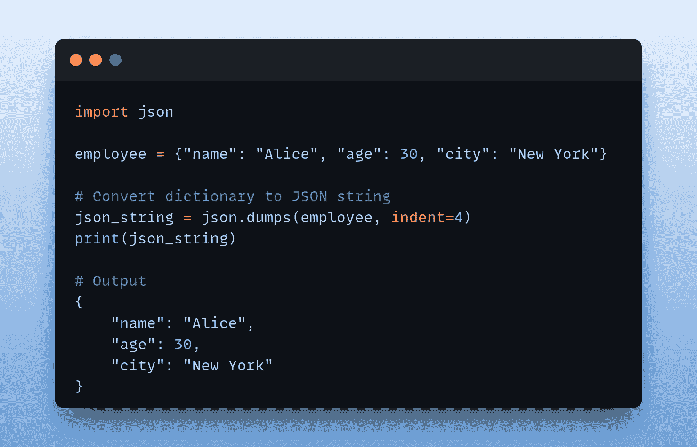

# 将 Python 字典转换为 JSON：初学者教程

> 原文：[`www.kdnuggets.com/convert-python-dict-to-json-a-tutorial-for-beginners`](https://www.kdnuggets.com/convert-python-dict-to-json-a-tutorial-for-beginners)



图片由作者提供

在用 Python 构建应用程序时，JSON 是你将经常使用的数据格式之一。如果你曾经处理过 API，你可能已经熟悉从 API 解析 JSON 响应。

* * *

## 我们的前三大课程推荐

 1\. [谷歌网络安全证书](https://www.kdnuggets.com/google-cybersecurity) - 快速开启网络安全职业生涯。

 2\. [谷歌数据分析专业证书](https://www.kdnuggets.com/google-data-analytics) - 提升你的数据分析技能

 3\. [谷歌 IT 支持专业证书](https://www.kdnuggets.com/google-itsupport) - 支持你的组织进行 IT

* * *

如你所知，JSON 是一种基于文本的数据交换格式，它以键值对的形式存储数据，并且易于人类阅读。Python 字典也是以键值对的形式存储数据。这使得将 JSON 字符串加载到字典中进行处理以及将字典中的数据转储为 JSON 字符串变得直观。

在本教程中，我们将学习如何使用 [内置的 json 模块](https://docs.python.org/3/library/json.html)将 Python 字典转换为 JSON。所以让我们开始编码吧！

# 将 Python 字典转换为 JSON 字符串

要将 Python 字典转换为 JSON 字符串，你可以使用 json 模块中的 `dumps()` 函数。`dumps()` 函数接受一个 Python 对象，并返回 JSON 字符串表示。然而，实际上你需要转换的不是单个字典，而是一个集合，例如字典列表。

那么我们来选择一个这样的例子。假设我们有 `books`，这是一个字典列表，每个字典包含一本书的信息。所以每本书的记录都是一个包含以下键的 Python 字典：title、author、publication_year 和 genre。

在调用 `json.dumps()` 时，我们设置了可选的 `indent` 参数——JSON 字符串中的缩进，这有助于提高可读性（是的，我们在进行 JSON 的漂亮打印 ??）：

```py
import json

books = [
	{
    	"title": "The Great Gatsby",
    	"author": "F. Scott Fitzgerald",
    	"publication_year": 1925,
    	"genre": "Fiction"
	},
	{
    	"title": "To Kill a Mockingbird",
    	"author": "Harper Lee",
    	"publication_year": 1960,
    	"genre": "Fiction"
	},
	{
    	"title": "1984",
    	"author": "George Orwell",
    	"publication_year": 1949,
    	"genre": "Fiction"
	}
]

# Convert dictionary to JSON string
json_string = json.dumps(books, indent=4)
print(json_string)
```

当你运行上述代码时，你应该会得到类似的输出：

```py
**Output >>>**
[
	{
    	"title": "The Great Gatsby",
    	"author": "F. Scott Fitzgerald",
    	"publication_year": 1925,
    	"genre": "Fiction"
	},
	{
    	"title": "To Kill a Mockingbird",
    	"author": "Harper Lee",
    	"publication_year": 1960,
    	"genre": "Fiction"
	},
	{
    	"title": "1984",
    	"author": "George Orwell",
    	"publication_year": 1949,
    	"genre": "Fiction"
	}
]
```

# 将嵌套的 Python 字典转换为 JSON 字符串

接下来，让我们以一个嵌套的 Python 字典列表为例，并获取它的 JSON 表示。我们将通过添加一个 “reviews” 键来扩展 `books` 字典。这个键的值是一个字典列表，每个字典包含关于评论的信息，即 “user”、“rating” 和 “comment”。

所以我们将 `books` 字典修改如下：

```py
import json

books = [
	{
    	"title": "The Great Gatsby",
    	"author": "F. Scott Fitzgerald",
    	"publication_year": 1925,
    	"genre": "Fiction",
    	"reviews": [
        	{"user": "Alice", "rating": 4, "comment": "Captivating story"},
        	{"user": "Bob", "rating": 5, "comment": "Enjoyed it!"}
    	]
	},
	{
    	"title": "To Kill a Mockingbird",
    	"author": "Harper Lee",
    	"publication_year": 1960,
    	"genre": "Fiction",
    	"reviews": [
        	{"user": "Charlie", "rating": 5, "comment": "A great read!"},
        	{"user": "David", "rating": 4, "comment": "Engaging narrative"}
    	]
	},
	{
    	"title": "1984",
    	"author": "George Orwell",
    	"publication_year": 1949,
    	"genre": "Fiction",
    	"reviews": [
        	{"user": "Emma", "rating": 5, "comment": "Orwell pulls it off well!"},
        	{"user": "Frank", "rating": 4, "comment": "Dystopian masterpiece"}
    	]
	}
]

# Convert dictionary to JSON string
json_string = json.dumps(books, indent=4)
print(json_string)
```

注意，我们使用了相同的缩进值 4，运行脚本得到如下输出：

```py
**Output >>>**

[
	{
    	"title": "The Great Gatsby",
    	"author": "F. Scott Fitzgerald",
    	"publication_year": 1925,
    	"genre": "Fiction",
    	"reviews": [
        	{
            	"user": "Alice",
            	"rating": 4,
            	"comment": "Captivating story"
        	},
        	{
            	"user": "Bob",
            	"rating": 5,
            	"comment": "Enjoyed it!"
        	}
    	]
	},
	{
    	"title": "To Kill a Mockingbird",
    	"author": "Harper Lee",
    	"publication_year": 1960,
    	"genre": "Fiction",
    	"reviews": [
        	{
            	"user": "Charlie",
            	"rating": 5,
            	"comment": "A great read!"
        	},
        	{
            	"user": "David",
            	"rating": 4,
            	"comment": "Engaging narrative"
        	}
    	]
	},
	{
    	"title": "1984",
    	"author": "George Orwell",
    	"publication_year": 1949,
    	"genre": "Fiction",
    	"reviews": [
        	{
            	"user": "Emma",
            	"rating": 5,
            	"comment": "Orwell pulls it off well!"
        	},
        	{
            	"user": "Frank",
            	"rating": 4,
            	"comment": "Dystopian masterpiece"
        	}
    	]
	}
]
```

# 将 Python 字典转换为 JSON 时排序键

`dumps` 函数有几个可选参数。我们已经使用了其中一个可选参数 `indent`。另一个有用的参数是 `sort_keys`。当你需要在将 Python 字典转换为 JSON 时排序键时，这尤其有用。

因为 `sort_keys` 默认为 `False`，所以如果你需要在转换为 JSON 时排序键，可以将其设置为 `True`。

这是一个简单的 `person` 字典：

```py
import json

person = {
	"name": "John Doe",
	"age": 30,
	"email": "john@example.com",
	"address": {
    	"city": "New York",
    	"zipcode": "10001",
    	"street": "123 Main Street"
	}
}

# Convert dictionary to a JSON string with sorted keys
json_string = json.dumps(person, sort_keys=True, indent=4)
print(json_string)
```

如所示，键按字母顺序排序：

```py
**Output >>>**
{
	"address": {
    	"city": "New York",
    	"street": "123 Main Street",
    	"zipcode": "10001"
	},
	"age": 30,
	"email": "john@example.com",
	"name": "John Doe"
}
```

# 处理不可序列化的数据

在我们到目前为止编写的示例中，字典的键和值都是 JSON 可序列化的。具体来说，值都是字符串或整数。但情况可能并非总是如此。一些常见的不可序列化数据类型包括 `datetime`、`Decimal` 和 `set`。

不用担心。你可以通过为这些数据类型定义自定义序列化函数来处理不可序列化的数据类型。然后将 `json.dumps()` 的 `default` 参数设置为你定义的自定义函数。

这些自定义序列化函数应该将不可序列化的数据转换为 JSON 可序列化的格式（谁能猜到呢！）。

这是一个简单的 `data` 字典：

```py
import json
from datetime import datetime

data = {
	"event": "Meeting",
	"date": datetime.now()
}

# Try converting dictionary to JSON
json_string = json.dumps(data, indent=2)
print(json_string)
```

我们像以前一样使用了 `json.dumps()`，所以我们会遇到以下 TypeError 异常：

```py
Traceback (most recent call last):
  File "/home/balapriya/djson/main.py", line 10, in <module>
	json_string = json.dumps(data, indent=2)
              	^^^^^^^^^^^^^^^^^^^^^^^^^^
  File "/usr/lib/python3.11/json/__init__.py", line 238, in dumps
	**kw).encode(obj)
      	^^^^^^^^^^^
...
  File "/usr/lib/python3.11/json/encoder.py", line 180, in default
	raise TypeError(f'Object of type {o.__class__.__name__} '
TypeError: Object of type datetime is not JSON serializable</module>
```

错误的相关部分是：对象类型 datetime 不能被 JSON 序列化。好吧，现在我们做以下操作：

+   定义一个 `serialize_datetime` 函数，将 `datetime` 对象转换为 ISO 8601 格式，使用 `isoformat()` 方法。

+   在调用 `json.dumps()` 时，我们将 `default` 参数设置为 `serialize_datetime` 函数。

所以代码如下：

```py
import json
from datetime import datetime

# Define a custom serialization function for datetime objects
def serialize_datetime(obj):
	if isinstance(obj, datetime):
    	return obj.isoformat()

data = {
	"event": "Meeting",
	"date": datetime.now()
}

# Convert dictionary to JSON 
# with custom serialization for datetime
json_string = json.dumps(data, default=serialize_datetime, indent=2)
print(json_string)
```

这里是输出结果：

```py
**Output >>>**
{
  "event": "Meeting",
  "date": "2024-03-19T08:34:18.805971"
}
```

# 结论

就这样！

总结一下：我们讨论了将 Python 字典转换为 JSON，并根据需要使用 `indent` 和 `sort_keys` 参数。我们还学习了如何处理 JSON 序列化错误。

你可以在 [GitHub](https://github.com/balapriyac/python-basics/tree/main/dict-to-json) 上找到代码示例。我会在另一个教程中见到大家。在那之前，继续编码吧！

**[](https://twitter.com/balawc27)**[Bala Priya C](https://www.kdnuggets.com/wp-content/uploads/bala-priya-author-image-update-230821.jpg)**** 是一位来自印度的开发者和技术作者。她喜欢在数学、编程、数据科学和内容创作的交汇点工作。她的兴趣和专长领域包括 DevOps、数据科学和自然语言处理。她喜欢阅读、写作、编码和喝咖啡！目前，她正在通过编写教程、操作指南、观点文章等，学习并与开发者社区分享她的知识。Bala 还创建了引人入胜的资源概述和编码教程。

### 更多相关内容

+   [将字节转换为字符串：初学者教程](https://www.kdnuggets.com/convert-bytes-to-string-in-python-a-tutorial-for-beginners)

+   [如何将 JSON 数据转换为 Pandas 数据框](https://www.kdnuggets.com/how-to-convert-json-data-into-a-dataframe-with-pandas)

+   [如何编写高效的 Python 代码：初学者教程](https://www.kdnuggets.com/how-to-write-efficient-python-code-a-tutorial-for-beginners)

+   [如何将 RGB 图像转换为灰度图像](https://www.kdnuggets.com/2019/12/convert-rgb-image-grayscale.html)

+   [如何使用 ChatGPT 将文本转换为 PowerPoint 演示文稿](https://www.kdnuggets.com/2023/08/chatgpt-convert-text-powerpoint-presentation.html)

+   [将文本文件转换为 TF-IDF 矩阵，使用 tfidfvectorizer](https://www.kdnuggets.com/2022/09/convert-text-documents-tfidf-matrix-tfidfvectorizer.html)
