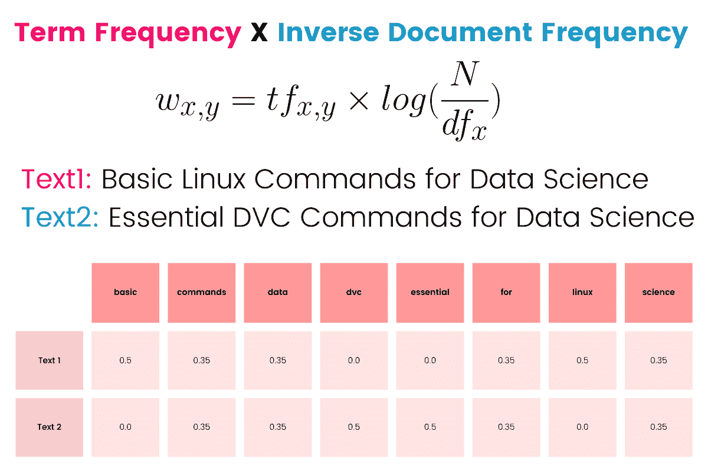
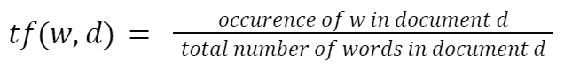
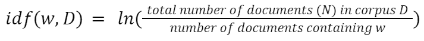
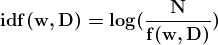
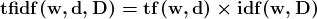
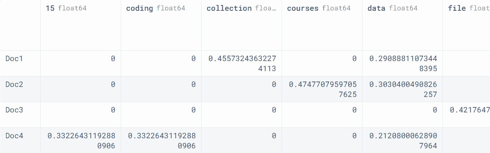
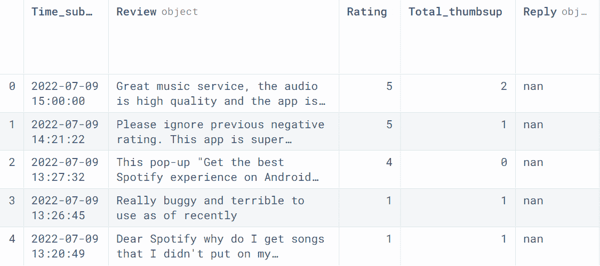

# 使用 tfidfvectorizer 将文本文档转换为 TF-IDF 矩阵

> 原文：[`www.kdnuggets.com/2022/09/convert-text-documents-tfidf-matrix-tfidfvectorizer.html`](https://www.kdnuggets.com/2022/09/convert-text-documents-tfidf-matrix-tfidfvectorizer.html)



图片来源于作者

# TF-IDF 矩阵

* * *

## 我们的前三名课程推荐

 1\. [谷歌网络安全证书](https://www.kdnuggets.com/google-cybersecurity) - 快速进入网络安全职业生涯。

 2\. [谷歌数据分析专业证书](https://www.kdnuggets.com/google-data-analytics) - 提升你的数据分析技能

 3\. [谷歌 IT 支持专业证书](https://www.kdnuggets.com/google-itsupport) - 支持你的组织的 IT

* * *

词频-逆文档频率 (TFIDF) 是一个统计公式，用于根据单词的相关性将文本文档转换为向量。它基于词袋模型来创建一个包含文档中相关性较低和较高单词信息的矩阵。

TF-IDF 在自然语言处理任务、主题建模和机器学习任务中特别有用。它帮助算法利用单词的重要性来预测结果。

## 词频 (TF)

它是文档 (d) 中单词 (w) 出现次数与文档中总单词数的比率。通过这个简单的公式，我们测量的是一个单词在文档中的频率。

例如，如果句子有 6 个单词，其中包含两个“the”，这个单词的 TF 比率就是 (2/6)。



## 逆文档频率 (IDF)

IDF 计算单词在语料库 D 中的重要性。像“of, we, are”这样的高频词几乎没有意义。它通过将语料库中文档的总数除以包含该单词的文档数来计算。





## 词频-逆文档频率 (TFIDF)

TF-IDF 是词频和逆文档频率的乘积。它对语料库中稀有而文档中常见的单词给予更多重要性。



来自 [Vaibhav Jayaswal](https://towardsdatascience.com/text-vectorization-term-frequency-inverse-document-frequency-tfidf-5a3f9604da6d) 博客的 TF-IDF 矩阵示例：

语料库中有两个文档：文本 A 和文本 B。我们将使用它们来创建 TF-IDF 矩阵。

+   **文本 A**: 木星是最大的行星

+   **文本 B**: 火星是离太阳第四近的行星

下表显示了 A 和 B 的 TF 值、IDF 值以及 A 和 B 的 TFIDF 值。

| **Words** | **TF ( A )** | **TF ( B )** | **IDF** | **TFIDF ( A )** | **TFIDF ( B )** |
| --- | --- | --- | --- | --- | --- |
| jupiter  | 1/5 | 0 | In (2/1)=0.69 | 0.138 | 0 |
| is  | 1/5 | 1/8 | In (2/2)=0 | 0 | 0 |
| the  | 1/5 | 2/8 | In (2/2)=0 | 0 | 0 |
| largest  | 1/5 | 0 | In (2/1)=0.69 | 0.138 | 0 |
| planet  | 1/5 | 1/8 | In (2/2)=0 | 0.138 | 0 |
| mars  | 0 | 1/8 | In (2/1)=0.69 | 0 | 0.086 |
| fourth  | 0 | 1/8 | In (2/1)=0.69 | 0 | 0.086 |
| from  | 0 | 1/8 | In (2/1)=0.69 | 0 | 0.086 |
| sun  | 0 | 1/8 | In (2/1)=0.69 | 0 | 0.086 |

# TF-IDF 教程

在本教程中，我们将使用[scikit-learn 中的 TfidfVectorizer](https://scikit-learn.org/stable/modules/generated/sklearn.feature_extraction.text.TfidfVectorizer.html)将文本转换并查看 TF-IDF 矩阵。

在下面的代码中，我们有一个包含 4 个文档的小语料库。首先，我们将使用`TfidfVectorizer()`创建一个向量化对象，并将文本数据拟合和转换为向量。之后，我们将使用向量化器提取单词名称。

```py
from sklearn.feature_extraction.text import TfidfVectorizer

corpus = [
          'KDnuggets Collection of data science Projects',
          '3 Free Statistics Courses for data science',
          'Parallel Processing Large File in Python',
          '15 Python Coding Interview Questions You Must Know For data science',
 ]

vectorizer = TfidfVectorizer()

*# TD-IDF Matrix*
X = vectorizer.fit_transform(corpus)

*# extracting feature names*
tfidf_tokens = vectorizer.get_feature_names_out()
```

我们现在将使用 TF-IDF 令牌和向量创建一个 pandas 数据框。

1.  将向量转换为数组，并将其添加到数据参数中。

1.  四个索引是手动创建的。

1.  tfidf_tokens 名称已添加到列中。

```py
import pandas as pd

result = pd.DataFrame(
    data=X.toarray(), 
    index=["Doc1", "Doc2", "Doc3", "Doc4"], 
    columns=tfidf_tokens
)

result
```

pandas 数据框将列显示为单词，行显示为文档。

在下面的数据框中，每个单词都有一个基于 TF-IDF 公式的重要值。



# TF-IDF 用于文本分类

让我们更进一步，使用 TF-IDF 将文本转换为向量，然后用它来训练文本分类模型。为了训练模型，我们将使用[Kaggle 上的 Spotify App Reviews](https://www.kaggle.com/datasets/mfaaris/spotify-app-reviews-2022)数据。

我们将使用 read_csv 加载数据并查看前五行。

```py
import pandas as pd

spotify = pd.read_csv("reviews.csv")
spotify.head()
```

我们只会使用**Review**和**Rating**列来训练模型。



我们将把**Review**列转换为向量，并将**Rating**作为目标。之后，我们将拆分数据集用于训练和测试。

```py
from sklearn.feature_extraction.text import TfidfVectorizer
from sklearn.model_selection import train_test_split

*# Transform features*
X = spotify.Review
X_tfidf = vectorizer.fit_transform(X)

*# create target*
y = spotify.Rating

*# split the dataset for training and testing*
X_train, X_test, y_train, y_test = train_test_split(
    X_tfidf, y, test_size=0.33, random_state=42
)
```

我们不会深入探讨特征工程、文本处理或超参数优化。我们将选择一个简单的模型（SGDClassifier）并在 X_train 和 y_train 上训练它。

对于模型验证，我们将使用 X_test 预测值，并打印分类报告。

```py
from sklearn.linear_model import SGDClassifier
from sklearn.metrics import classification_report

*# Training classifier model* 
clf = SGDClassifier()
clf.fit(X_train, y_train)

*# model validation*
y_pred = clf.predict(X_test)

print(classification_report(y_test, y_pred))
```

正如我们所观察到的，通过在默认配置上训练，我们得到了 0.69 的 F1 分数。我们可以通过交叉验证、超参数优化、文本清理和处理以及特征工程来提高模型性能。

```py
               precision    recall  f1-score   support
           1       0.57      0.90      0.69      5817
           2       0.25      0.03      0.05      2274
           3       0.28      0.06      0.10      2293
           4       0.41      0.19      0.26      2556
           5       0.73      0.91      0.81      7387

accuracy                               0.62     20327
macro avg          0.45      0.42      0.38     20327
weighted avg       0.54      0.62      0.54     20327
```

> “感谢您阅读本教程。希望我能帮助您理解 TF-IDF 的基础知识。如果您有任何进一步的问题，请在下面输入或通过 LinkedIn 联系我。”

**[Abid Ali Awan](https://www.polywork.com/kingabzpro)** ([@1abidaliawan](https://twitter.com/1abidaliawan)) 是一位认证的数据科学专业人士，热爱构建机器学习模型。目前，他专注于内容创作，并撰写关于机器学习和数据科学技术的技术博客。Abid 拥有技术管理硕士学位和电信工程学士学位。他的愿景是通过图神经网络为那些面临心理健康问题的学生构建一个 AI 产品。

### 更多相关内容

+   [使用 BERT 对长文本进行分类](https://www.kdnuggets.com/2022/02/classifying-long-text-documents-bert.html)

+   [使用 CountVectorizer 将文本文档转换为词频计数](https://www.kdnuggets.com/2022/10/converting-text-documents-token-counts-countvectorizer.html)

+   [如何使用 ChatGPT 将文本转换为 PowerPoint 演示文稿](https://www.kdnuggets.com/2023/08/chatgpt-convert-text-powerpoint-presentation.html)

+   [GPT4All 是您文档的本地 ChatGPT 并且是免费的！](https://www.kdnuggets.com/2023/06/gpt4all-local-chatgpt-documents-free.html)

+   [如何将 RGB 图像转换为灰度图像](https://www.kdnuggets.com/2019/12/convert-rgb-image-grayscale.html)

+   [将 Python 字典转换为 JSON：初学者教程](https://www.kdnuggets.com/convert-python-dict-to-json-a-tutorial-for-beginners)
