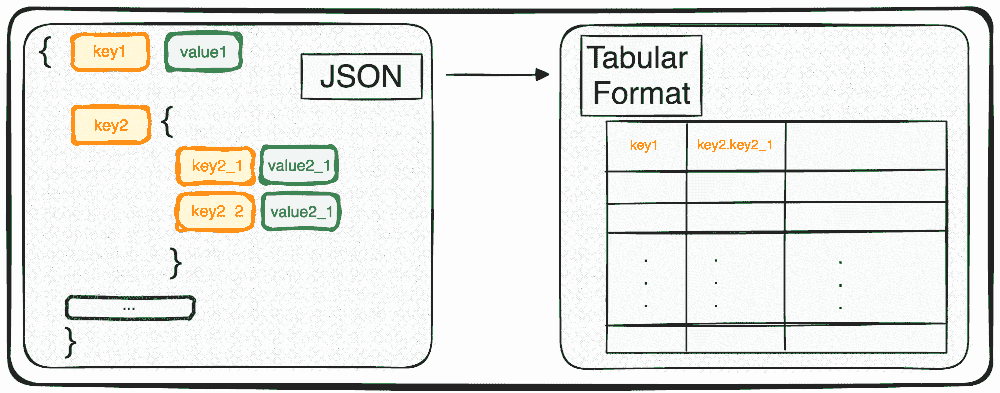
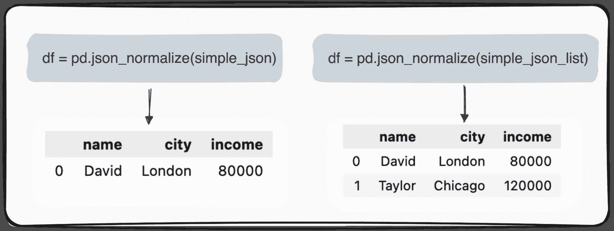
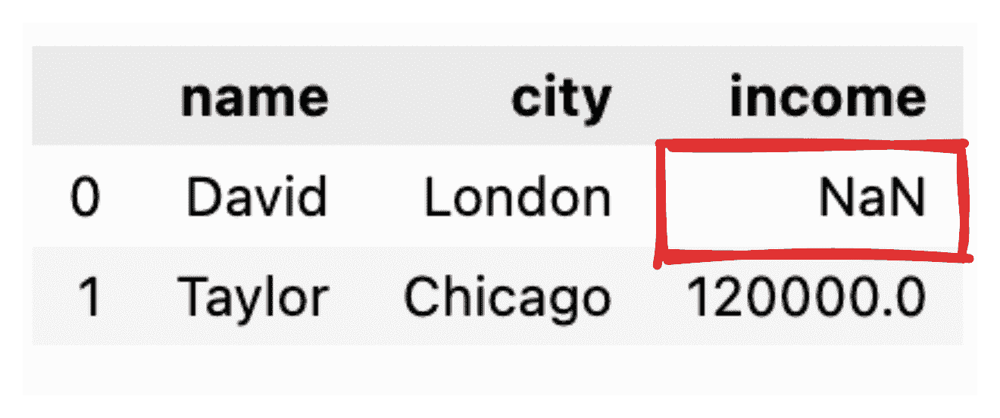
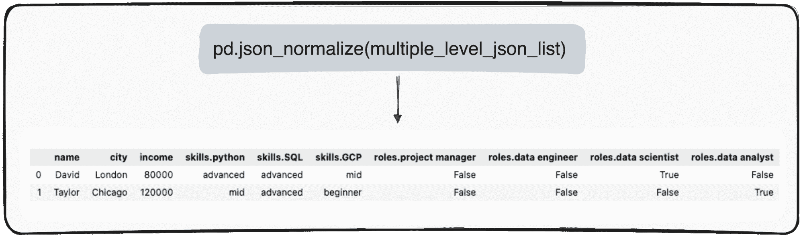
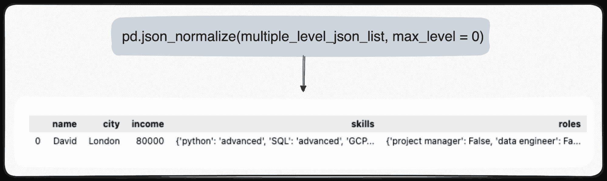
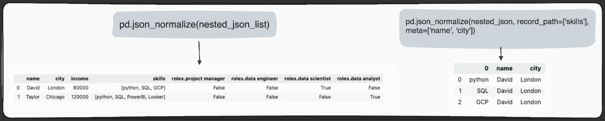

# 将 JSON 转换为 Pandas DataFrames：正确解析

> 原文：[`www.kdnuggets.com/converting-jsons-to-pandas-dataframes-parsing-them-the-right-way`](https://www.kdnuggets.com/converting-jsons-to-pandas-dataframes-parsing-them-the-right-way)



图片由作者提供

深入数据科学和机器学习的世界，你会遇到的基本技能之一就是数据读取的艺术。如果你已经有一些经验，你可能对 JSON（JavaScript 对象表示法）很熟悉，它是一种流行的数据存储和交换格式。

* * *

## 我们的前三名课程推荐

 1\. [Google Cybersecurity Certificate](https://www.kdnuggets.com/google-cybersecurity) - 快速进入网络安全职业生涯。

 2\. [Google Data Analytics Professional Certificate](https://www.kdnuggets.com/google-data-analytics) - 提升您的数据分析技能

 3\. [Google IT Support Professional Certificate](https://www.kdnuggets.com/google-itsupport) - 支持您的组织的 IT

* * *

想象一下 NoSQL 数据库如 MongoDB 喜欢以 JSON 格式存储数据，或者 REST API 经常以相同的格式响应。

然而，虽然 JSON 非常适合存储和交换，但在原始形式下，它还不适合深入分析。这时我们需要将其转换成更适合分析的格式——表格格式。

所以，无论你是处理单个 JSON 对象还是一个令人愉快的 JSON 数组，从 Python 的角度来看，你实际上是在处理一个字典或一个字典列表。

一起探索这种转换如何展开，使我们的数据准备好进行分析 ????

今天我将解释一个神奇的命令，它能让我们在几秒钟内轻松地将任何 JSON 解析为表格格式。

这就是…… pd**.**json_normalize()

那么让我们看看不同类型的 JSON 是如何工作的。

# 1\. 处理简单的 JSON 和 JSON 列表

我们可以处理的第一种类型的 JSON 是单级 JSON，具有少量的键和值。我们定义我们的第一个简单 JSON 如下：

代码由作者提供

所以让我们模拟一下处理这些 JSON 的需要。我们都知道，在 JSON 格式下做的事情不多。我们需要将这些 JSON 转换成一些可读且可修改的格式……这就意味着 Pandas DataFrames！

## 1.1 处理简单的 JSON 结构

首先，我们需要导入 pandas 库，然后可以使用命令 pd.json_normalize()，如下所示：

```py
import pandas as pd
pd.json_normalize(json_string)
```

通过将此命令应用于单条记录的 JSON，我们得到最基本的表格。然而，当我们的数据稍微复杂一些并呈现 JSON 列表时，我们仍然可以使用相同的命令，且不会出现进一步的复杂情况，输出将对应于一个包含多个记录的表格。



作者提供的图像

简单吧？

下一个自然的问题是当一些值丢失时会发生什么。

## 1.2 处理空值

假设某些值没有被提供，例如，David 的收入记录丢失。当我们将 JSON 转换为简单的 pandas 数据框时，相应的值将显示为 NaN。



作者提供的图像

如果我只想获取一些字段怎么办？

## 1.3 仅选择感兴趣的列

如果我们只想将某些特定字段转换为表格 pandas DataFrame，则 `json_normalize()` 命令不允许我们选择要转换的字段。

因此，应对 JSON 进行小规模预处理，过滤出那些感兴趣的列。

```py
# Fields to include
fields = ['name', 'city']

# Filter the JSON data
filtered_json_list = [{key: value for key, value in item.items() if key in fields} for item in simple_json_list]

pd.json_normalize(filtered_json_list) 
```

所以，让我们深入研究一些更复杂的 JSON 结构。

# 2\. 处理多级 JSON

在处理多级 JSON 时，我们会发现不同级别中存在嵌套的 JSON。程序与之前相同，但在这种情况下，我们可以选择想要转换的层级数量。默认情况下，命令总是扩展所有层级，并生成包含所有嵌套层级名称的列。

所以如果我们规范化以下 JSON。

作者提供的代码

我们将获得如下表格，其中在字段 skills 下有 3 列：

+   skills.python

+   skills.SQL

+   skills.GCP

并在字段 roles 下有 4 列

+   roles.项目经理

+   roles.数据工程师

+   roles.数据科学家

+   roles.数据分析师



作者提供的图像

但是，假设我们只想转换顶层。我们可以通过将参数 `max_level` 设定为 0（我们想扩展的最大层级）来实现。

```py
pd.json_normalize(mutliple_level_json_list, max_level = 0)
```

待处理的值将保留在 JSON 中，并存在于我们的 pandas DataFrame 中。



作者提供的图像

# 3\. 处理嵌套列表 JSON

最后一种情况是 JSON 字段中包含嵌套列表。所以我们首先定义要使用的 JSON。

作者提供的代码

我们可以使用 Python 中的 Pandas 有效管理这些数据。`pd.json_normalize()` 函数在这种情况下特别有用。它可以将 JSON 数据（包括嵌套列表）展平为适合分析的结构化格式。当此函数应用于我们的 JSON 数据时，它会生成一个规范化的表格，其中将嵌套列表作为字段的一部分。

此外，Pandas 提供了进一步完善此过程的能力。通过利用 `pd.json_normalize()` 中的 `record_path` 参数，我们可以指定函数专门规范化嵌套列表。

这个操作会生成一个专门的表格，仅包含列表的内容。默认情况下，此过程只会展开列表中的元素。然而，为了丰富该表格的额外上下文，例如为每条记录保留相关的 ID，我们可以使用 meta 参数。



图片由作者提供

# 结论

总之，使用 Python 的 Pandas 库将 JSON 数据转换为 CSV 文件既简单又有效。

JSON 仍然是现代数据存储和交换中最常见的格式，特别是在 NoSQL 数据库和 REST API 中。然而，当处理原始格式的数据时，它也带来了一些重要的分析挑战。

Pandas 的 pd.json_normalize() 在处理此类格式并将数据转换为 pandas DataFrame 方面发挥了关键作用。

希望本指南对你有所帮助，下次处理 JSON 数据时，你可以更有效地进行操作。

你可以在[以下 GitHub 仓库](https://github.com/rfeers/Twitter/blob/main/Python/JSON_to_CSVs.ipynb)查看对应的 Jupyter Notebook。

**[](https://www.linkedin.com/in/josep-ferrer-sanchez/)**[Josep Ferrer](https://www.linkedin.com/in/josep-ferrer-sanchez)** 是一位来自巴塞罗那的分析工程师。他拥有物理工程学位，目前在应用于人类流动的数据科学领域工作。他还是一名兼职内容创作者，专注于数据科学和技术。Josep 撰写有关 AI 的所有内容，涵盖了该领域的持续爆炸性应用。

### 更多相关主题

+   [用 SQL 查询你的 Pandas DataFrames](https://www.kdnuggets.com/2021/10/query-pandas-dataframes-sql.html)

+   [在 Pandas DataFrames 中使用 apply() 方法](https://www.kdnuggets.com/2022/07/apply-method-pandas-dataframes.html)

+   [简化合并 Pandas DataFrames](https://www.kdnuggets.com/2022/09/combining-pandas-dataframes-made-simple.html)

+   [如何合并 Pandas DataFrames](https://www.kdnuggets.com/2023/01/merge-pandas-dataframes.html)

+   [合并 Pandas DataFrames 的 3 种方法](https://www.kdnuggets.com/2023/03/3-ways-merge-pandas-dataframes.html)

+   [如何高效合并大型 DataFrames 使用 Pandas](https://www.kdnuggets.com/how-to-merge-large-dataframes-efficiently-with-pandas)
