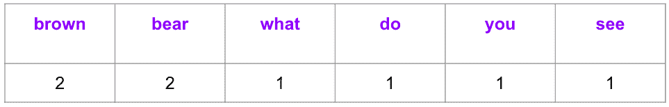
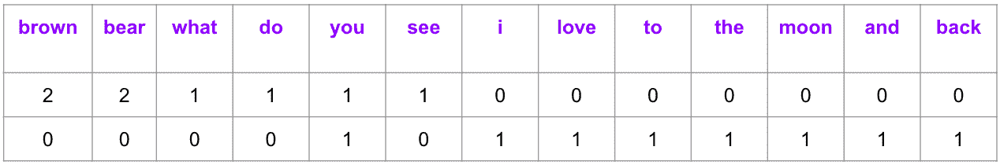
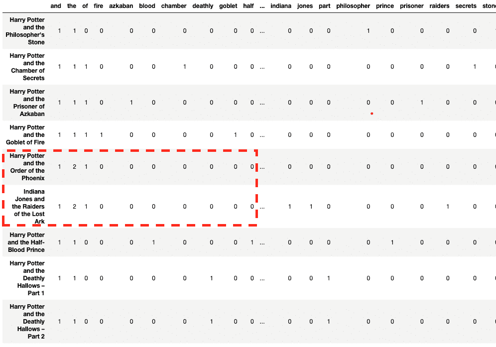
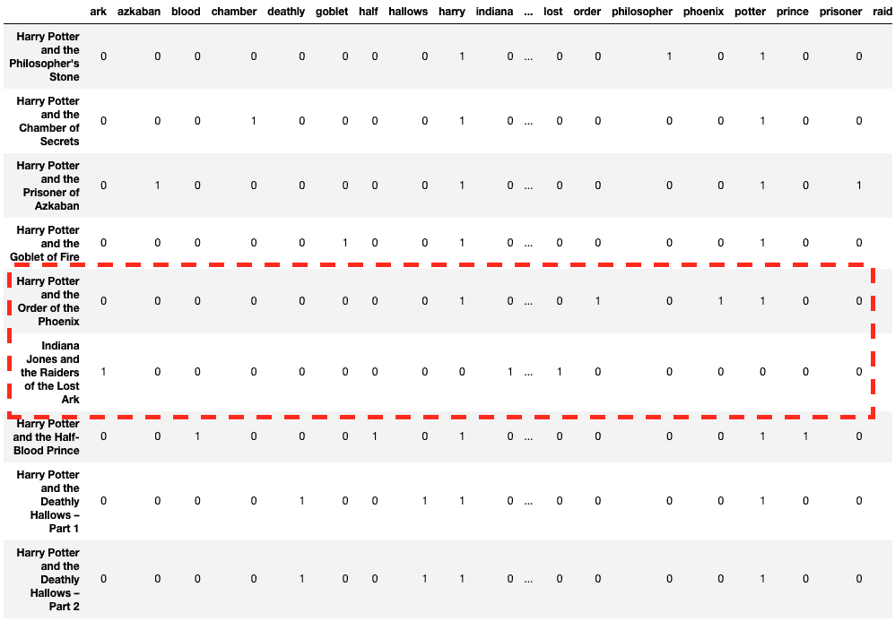
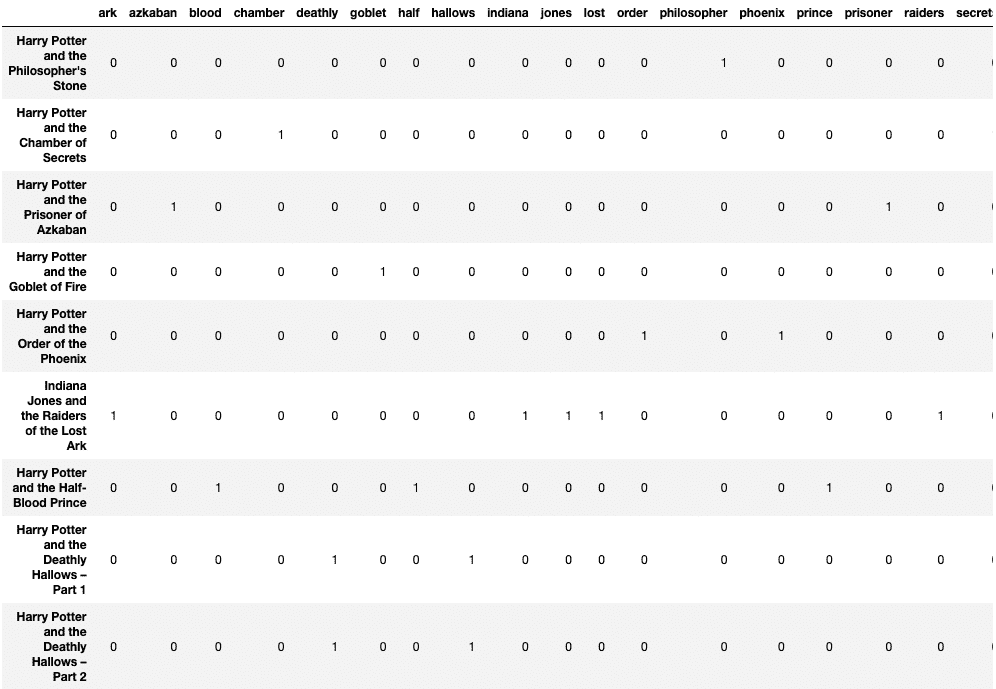
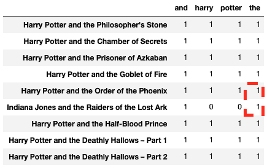

# 使用 CountVectorizer 将文本文件转换为令牌计数

> 原文：[`www.kdnuggets.com/2022/10/converting-text-documents-token-counts-countvectorizer.html`](https://www.kdnuggets.com/2022/10/converting-text-documents-token-counts-countvectorizer.html)

我们每天都在与机器互动——无论是询问“OK Google，设置早上 6 点的闹钟”还是“Alexa，播放我喜欢的播放列表”。但这些机器并不理解自然语言。那么当我们与设备交谈时会发生什么？它需要将语音即文本转换为数字，以便处理信息并学习上下文。在这篇文章中，你将学习一种使用 CountVectorizer 将语言转换为数字的流行工具。[Scikit-learn 的 CountVectorizer](https://scikit-learn.org/stable/modules/generated/sklearn.feature_extraction.text.CountVectorizer.html) 用于将文本语料库重新转换并预处理为令牌计数向量表示。


[来源](https://img.freepik.com/free-vector/human-hand-typing-computer-with-different-symbols-located-near-cup-coffee-side-view-open-laptop-flat-vector-illustration-new-technologies-millennials-work-concept_74855-21931.jpg?w=1480&t=st=1665332617~exp=1665333217~hmac=75d8c5ae364cabb50f74dbc02bc175292145468ab3c10b2f506adff151278f11)

* * *

## 我们的前三大课程推荐

 1\. [谷歌网络安全证书](https://www.kdnuggets.com/google-cybersecurity) - 快速进入网络安全职业生涯。

 2\. [谷歌数据分析专业证书](https://www.kdnuggets.com/google-data-analytics) - 提升你的数据分析技能

 3\. [谷歌 IT 支持专业证书](https://www.kdnuggets.com/google-itsupport) - 支持组织的 IT 工作

* * *

# 它是如何工作的？

我们以一本流行儿童书的书名为例来说明 CountVectorizer 是如何工作的。

```py
text = ["Brown Bear, Brown Bear, What do you see?"]
```

向量中有六个独特的词，因此向量表示的长度为六。该向量表示每个令牌/词在文本中的出现频率。



让我们添加另一个文档到我们的语料库中，以观察结果矩阵的维度如何增加。

```py
text = ["Brown Bear, Brown Bear, What do you see?", “I love you to the moon and back”]
```

CountVectorizer 将生成以下输出，通过添加一个文档，矩阵从 1 X 6 变为 2 X 13。



矩阵中的每一列表示由语料库中的所有令牌组成的字典中的唯一令牌（单词），而每一行表示一个文档。上述示例有两个书名，即由两行表示的文档，每个单元格包含一个值，标识文档中对应的单词计数。由于这种表示方式，某些单元格在对应文档中令牌缺失时会有零值。

值得注意的是，随着语料库规模的增加，将巨大的矩阵存储在内存中变得不可管理。因此，CountVectorizer 将它们存储为稀疏矩阵，这是一种压缩形式的完整矩阵。

# 实操！

让我们选择《哈利·波特》系列的八部电影和一部《印第安纳·琼斯》电影进行演示。这将帮助我们了解 CountVectorizer 的一些重要属性。

首先导入 Pandas 库和来自 Sklearn > feature_extraction > text 的 CountVectorizer。

```py
import pandas as pd
from sklearn.feature_extraction.text import CountVectorizer
```

将文档声明为字符串列表。

```py
text = [
    "Harry Potter and the Philosopher's Stone",
    "Harry Potter and the Chamber of Secrets",
    "Harry Potter and the Prisoner of Azkaban",
    "Harry Potter and the Goblet of Fire",
    "Harry Potter and the Order of the Phoenix",
    "Indiana Jones and the Raiders of the Lost Ark",
    "Harry Potter and the Half-Blood Prince",
    "Harry Potter and the Deathly Hallows - Part 1",
    "Harry Potter and the Deathly Hallows - Part 2"
]
```

## 向量化

初始化 CountVectorizer 对象时设置 lowercase=True（默认值）以将所有文档/字符串转换为小写。接下来，调用 fit_transform 并将文档列表作为参数传递，然后将列和行名称添加到数据框中。

```py
count_vector = CountVectorizer(lowercase = True)
count_vektor = count_vector.fit_transform(text)
count_vektor = count_vektor.toarray()
df = pd.DataFrame(data = count_vektor, columns = count_vector.get_feature_names())
df.index = text
df
```

好消息！文档已转换为数字。但仔细观察会发现，“哈利·波特与凤凰令”与“印第安纳·琼斯与失落的圣杯”相比，与其他哈利·波特电影相似——至少在初步观察时是这样。



你一定在想像 ‘and’、‘the’ 和 ‘of’ 这样的令牌是否对我们的特征集添加了任何信息。这引导我们到下一步，即去除停用词。

## stop_words

像 ‘and’、‘the’ 和 ‘of’ 这样的无用令牌称为停用词。去除停用词很重要，因为它们会影响文档的相似性，并不必要地扩展列的维度。

参数 ‘stop_words’ 删除这些预先识别的停用词——指定 ‘english’ 会删除特定于英语的停用词。你还可以显式添加一个停用词列表，即 stop_words = [‘and’, ‘of’, ‘the’]。

```py
count_vector = CountVectorizer(lowercase = True, stop_words =
    'english')
count_vektor = count_vector.fit_transform(text)
count_vektor = count_vektor.toarray()
df = pd.DataFrame(data = count_vektor, columns = count_vector.get_feature_names())
df.index = text
df
```

看起来更好！现在行向量看起来更有意义。



## max_df

像 “Harry” 和 “Potter” 这样的单词不是“停用词”，但它们相当常见，对 Count Matrix 添加的信息很少。因此，你可以添加 max_df 参数来将重复的单词作为特征进行处理。

```py
count_vector = CountVectorizer(lowercase = True, max_df = 0.2)
count_vektor = count_vector.fit_transform(text)
count_vektor = count_vektor.toarray()
df = pd.DataFrame(data = count_vektor, columns = count_vector.get_feature_names())
df.index = text
df
```

以下输出演示了停用词以及“harry”和“potter”从列中被删除：



## min_df

它正好与 max_df 相反，表示应具有特定特征的最小文档数量（或比例和百分比）。

```py
count_vector = CountVectorizer(lowercase = True, min_df = 2)
count_vektor = count_vector.fit_transform(text)
count_vektor = count_vektor.toarray()
df = pd.DataFrame(data = count_vektor, columns = count_vector.get_feature_names())
df.index = text
df
```

以下列（单词）在至少两个文档中出现。


## max_features

它代表最常出现的特征/单词/列。

```py
count_vector = CountVectorizer(lowercase = True, max_features = 4)
count_vektor = count_vector.fit_transform(text)
count_vektor = count_vektor.toarray()
df = pd.DataFrame(data = count_vektor, columns = count_vector.get_feature_names())
df.index = text
df
```

选择了下列四个最常出现的单词。


## binary

binary 参数将文档中所有正出现的单词替换为‘1’。它表示单词或令牌的存在与否，而不是频率，并且在情感分析或产品评论等分析中非常有用。

```py
count_vector = CountVectorizer(lowercase = True, binary = True,
    max_features = 4)
count_vektor = count_vector.fit_transform(text)
count_vektor = count_vektor.toarray()
df = pd.DataFrame(data = count_vektor, columns = count_vector.get_feature_names())
df.index = text
df
```

与先前的输出进行比较后，名为“the”的列的频率表在下方结果中被限制为‘1’：



## vocabulary_

它返回列的位置，并用于将算法结果映射到可解释的单词。

```py
count_vector = CountVectorizer(lowercase = True)
count_vector.fit_transform(text)
count_vector.vocabulary_
```

上述代码的输出如下所示。

```py
{
    'harry': 10,
    'potter': 19,
    'and': 0,
    'the': 25,
    'philosopher': 17,
    'stone': 24,
    'chamber': 4,
    'of': 14,
    'secrets': 23,
    'prisoner': 21,
    'azkaban': 2,
    'goblet': 7,
    'fire': 6,
    'order': 15,
    'phoenix': 18,
    'indiana': 11,
    'jones': 12,
    'raiders': 22,
    'lost': 13,
    'ark': 1,
    'half': 8,
    'blood': 3,
    'prince': 20,
    'deathly': 5,
    'hallows': 9,
    'part': 16
}
```

# 摘要

本教程讨论了文本预处理的重要性，即将其矢量化作为机器学习算法的输入。文章还展示了 sklearn 实现 CountVectorizer 的各种输入参数在一小组文档上的应用。

**[Vidhi Chugh](https://vidhi-chugh.medium.com/)** 是一位获奖的 AI/ML 创新领袖和 AI 伦理学家。她在数据科学、产品和研究的交汇点上工作，以提供业务价值和见解。她倡导以数据为中心的科学，是数据治理领域的领先专家，致力于构建值得信赖的 AI 解决方案。

### 相关主题

+   [使用 BERT 对长文本文档进行分类](https://www.kdnuggets.com/2022/02/classifying-long-text-documents-bert.html)

+   [使用 tfidfvectorizer 将文本文档转换为 TF-IDF 矩阵](https://www.kdnuggets.com/2022/09/convert-text-documents-tfidf-matrix-tfidfvectorizer.html)

+   [5 种将非结构化数据转换为结构化见解的方法](https://www.kdnuggets.com/5-ways-of-converting-unstructured-data-into-structured-insights-with-llms)

+   [将 JSON 转换为 Pandas DataFrames：正确解析 JSON](https://www.kdnuggets.com/converting-jsons-to-pandas-dataframes-parsing-them-the-right-way)

+   [GPT4All 是您文档的本地 ChatGPT，而且是免费的！](https://www.kdnuggets.com/2023/06/gpt4all-local-chatgpt-documents-free.html)

+   [如何使用 ChatGPT 将文本转换为 PowerPoint 演示文稿](https://www.kdnuggets.com/2023/08/chatgpt-convert-text-powerpoint-presentation.html)
