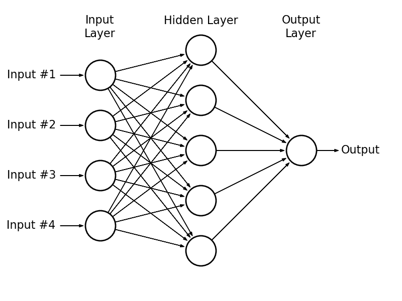
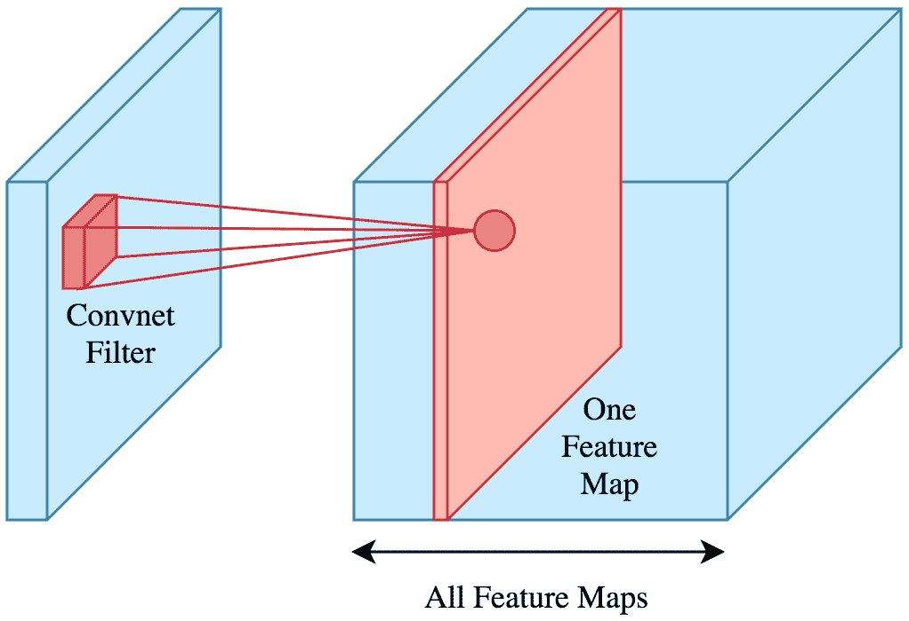
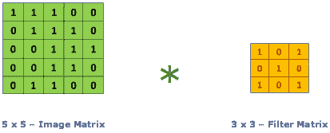
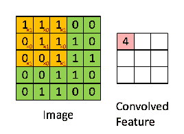

# 卷积神经网络：使用 TensorFlow 和 Keras 的 Python 教程

> 原文：[`www.kdnuggets.com/2019/07/convolutional-neural-networks-python-tutorial-tensorflow-keras.html`](https://www.kdnuggets.com/2019/07/convolutional-neural-networks-python-tutorial-tensorflow-keras.html)

评论

卷积神经网络是深度学习在过去十年频繁上头条的原因之一。今天我们将训练一个**图像分类器**，利用 TensorFlow 的 eager API 来判断图像中是否包含狗或猫。

人工神经网络最近对多个行业产生了影响，因为它们在许多领域展现出了前所未有的能力。然而，不同的**深度学习架构**在每个领域都有所擅长：

+   图像分类（卷积神经网络）。

+   图像、音频和文本生成（GANs, RNNs）。

+   时间序列预测（RNNs, LSTM）。

+   推荐系统（玻尔兹曼机）。

+   大量其他内容（例如，回归分析）。

* * *

## 我们的前三推荐课程

 1\. [Google 网络安全证书](https://www.kdnuggets.com/google-cybersecurity) - 快速开启网络安全职业生涯。

 2\. [Google 数据分析专业证书](https://www.kdnuggets.com/google-data-analytics) - 提升你的数据分析技能

 3\. [Google IT 支持专业证书](https://www.kdnuggets.com/google-itsupport) - 支持你的组织的 IT 工作

* * *

今天我们将重点关注列表中的第一个项目，虽然每一个都值得单独写一篇文章。

### 什么是卷积神经网络？

在多层感知器（MLP），也就是*普通*神经网络中，每一层的神经元都连接到下一层的**所有**神经元。这种层被称为**全连接层**。

*一个多层感知器。来源：[astroml](http://www.astroml.org/book_figures/appendix/fig_neural_network.html)*

卷积神经网络是不同的：它们具有卷积层。

在全连接层上，每个神经元的输出将是对上一层的线性变换，并与一个非线性[激活函数](http://www.datastuff.tech/machine-learning/why-do-neural-networks-need-an-activation-function/)（例如，*ReLu* 或 *Sigmoid*）组合。

相反，**卷积层**中每个神经元的输出仅是上一层**子集**的一个函数。

*来源：[Brilliant](https://brilliant.org/wiki/convolutional-neural-network/)*

卷积层上的输出将是对上一层的一个**子集**应用**卷积**的结果，然后是一个激活函数。

### 什么是卷积？

卷积操作，给定一个输入矩阵*A*（通常是前一层的值）和一个（通常小得多的）权重矩阵，称为**卷积核**或**滤波器** *K*，将输出一个新的矩阵*B*。

*来源于@[RaghavPrabhu](https://medium.com/@RaghavPrabhu/understanding-of-convolutional-neural-network-cnn-deep-learning-99760835f148)*

如果*K*是一个*CXC*矩阵，*B*中的第一个元素将是：

+   取*A*的第一个*CXC*子矩阵。

+   将每个元素乘以其在*K*中的相应权重。

+   将所有的乘积相加。

这最后两个步骤等同于将*A*的子矩阵和*K*展平，并计算结果向量的点积。

然后我们将*K*向右滑动以获取下一个元素，依此类推，重复这个过程直到*A*的每一行。

*卷积可视化，来源于@[RaghavPrabhu](https://medium.com/@RaghavPrabhu/understanding-of-convolutional-neural-network-cnn-deep-learning-99760835f148)*

根据我们的需求，我们可以选择仅从卷积核居中于*Cth*行和列的位置开始，以避免“越界”，或者假设“A 之外”的所有元素具有某种默认值（通常是 0）——这将决定*B*的大小是否小于*A*的大小或相同。

如你所见，如果*A*是一个*NxM*矩阵，那么现在*B*中的每个神经元的值将不再依赖于*N*M*权重，而仅依赖于*C*C*（少得多）个权重。

这使得卷积层比全连接层轻得多，帮助卷积模型学习得更快。

当然，我们在每一层会使用许多卷积核（每一层的输出是一个矩阵的堆叠）。然而，这仍然需要比我们老旧的多层感知机（MLP）少得多的权重。

### 为什么这样做有效？

为什么我们可以**忽略**每个神经元对大多数其他神经元的影响？因为整个系统的前提是每个神经元**受其“邻居”强烈影响**。然而，远处的神经元对它只有很小的影响。

这个假设在图像中是**直观正确的**——如果我们考虑输入层，每个神经元将是一个像素或像素的 RGB 值。这也是为什么这种方法在图像分类中效果如此之好的部分原因。

例如，如果我选择一张有蓝天的图片区域，附近的区域很可能也会显示蓝天，使用类似的色调。

像素的邻居通常会有类似的 RGB 值。如果没有，那么这可能意味着我们在图形或物体的边缘。

如果你用笔和纸（或计算器）进行一些卷积操作，你会发现某些卷积核会在某种边缘上增加输入的强度，而在其他边缘上则可能会减少它。

例如，考虑以下卷积核 *V* 和 *H*：

*用于垂直和水平边缘的滤波器*

*V* 过滤器处理垂直边缘（即上方和下方颜色差异很大的地方），而 *H* 过滤器处理水平边缘。注意其中一个是另一个的转置版本。

### 通过示例了解卷积

这是未经过滤的小猫图片：

如果我们分别应用水平和垂直边缘滤镜，会发生以下情况：

我们可以看到一些特征变得更加明显，而其他特征则逐渐消失。有趣的是，每个滤镜展示了不同的特征。

这就是卷积神经网络如何学习识别图像中的特征。

让它们自行调整内核权重要比任何手动方法都简单。想象一下尝试手动表达像素之间的关系！

为了真正理解每个卷积对图像的作用，我强烈建议你在 [这个网站](http://setosa.io/ev/image-kernels/) 上玩一玩。它比任何书籍或教程都对我帮助更大。去吧，收藏它。这很有趣。

好了，你已经学了一些理论知识。现在让我们进入实际操作部分。

### 如何在 TensorFlow 中训练卷积神经网络？

TensorFlow 是 Python 最受欢迎的深度学习框架。

我也听说过 PyTorch 很不错，尽管我从未有机会尝试。

我已经写过一个关于 [如何使用 TensorFlow 的 Keras API 训练神经网络](http://www.datastuff.tech/machine-learning/autoencoder-deep-learning-tensorflow-eager-api-keras/)，重点讲解了 AutoEncoders。

今天会有所不同：我们将尝试三种不同的架构，看看哪一种效果更好。

和往常一样，所有代码都可以在 [GitHub](https://github.com/StrikingLoo/Cats-and-dogs-classifier-tensorflow-CNN) 上找到，你可以自己尝试或跟随操作。当然，我也会展示 Python 代码片段。

### 数据集

我们将训练一个神经网络来预测图像中是否包含狗或猫。为此，我们将使用 Kaggle 的 [cats and dogs Dataset](https://www.kaggle.com/c/dogs-vs-cats)。它包含 12500 张猫的图片和 12500 张狗的图片，分辨率各异。

### 使用 NumPy 加载和预处理我们的图像数据

神经网络接收一个特征向量或矩阵作为输入，通常具有 **固定尺寸**。我们如何从图片中生成这个特征向量或矩阵？

幸运的是，Python 的图像库为我们提供了一种简单的方法，将图像加载为 NumPy 数组。即一个 HeightxWidth 的 RGB 值矩阵。

我们已经在 [Python 中的图像滤镜](http://www.datastuff.tech/machine-learning/k-means-clustering-with-dask-editing-pictures-of-kittens/) 中做过这个，所以我将重用那段代码。

不过我们仍然需要解决固定尺寸的问题：我们为 **输入层** 选择什么 **尺寸**？

这很重要，因为我们需要**调整每张图片的大小**到所选择的分辨率。我们不希望扭曲**长宽比**过多，以免带来过多**噪声给网络**。

这是我们可以查看数据集中最常见的形状的方式。

我对前 1000 张图片进行了抽样，尽管当我查看 5000 张时结果没有变化。

最常见的形状是 375×500，不过我决定将其缩小到网络输入的 1/4。

这就是我们现在的图像加载代码的样子。

最后，你可以使用这段代码加载数据。我选择使用 4096 张图片作为训练集，1024 张作为验证集。然而，这只是因为我的 PC 由于 RAM 大小无法处理更多数据。

如果你在家尝试，可以将这些数字增加到最大值（例如训练集 10K 和验证集 2500）！

### 训练我们的神经网络

首先，作为一个基准，让我们看看普通**MLP**在这个任务上的表现。如果卷积神经网络如此革命性，我期望这次实验的结果会非常**糟糕**。

这是一个单隐层全连接神经网络。

本文的所有训练都使用了 AdamOptimizer，因为它是最快的。我仅为每个模型调整了学习率（这里是 1e-5）。

我训练了这个模型 10 个轮次，它基本上收敛到**随机猜测**。

我确保**打乱训练数据**，因为我按顺序加载它可能会导致模型偏差。

我使用了**MSE**作为损失函数，因为它通常**更直观**。如果你的 MSE 在二分类中是 0.5，你就相当于**总是预测为 0**。然而，具有更多层的 MLP 或不同损失函数**表现没有更好**。

从历史上看，其他成熟的监督学习算法，如[Boosted Trees (使用 XGBoost)](http://www.datastuff.tech/machine-learning/xgboost-predicting-life-expectancy-with-supervised-learning/)，在图像分类上的表现甚至更差。

### 训练卷积神经网络

一个卷积层能带来多大好处？我们来给模型添加一个卷积层看看。

对于这个网络，我决定添加一个卷积层（24 个卷积核），然后是 2 个全连接层。

最大池化仅仅是将每四个神经元减少为一个神经元，取四者中的最高值。

仅经过 5 个训练轮次，它的表现已经**好得多**，比之前的网络要好。

通过 0.36 的验证 MSE，它已经比随机猜测好很多。然而，请注意，我不得不使用**小得多的学习率**。

此外，尽管它在更少的训练轮次中学到了更多，但**每个训练轮次**花费的时间**要长得多**。模型也变得相当沉重（200+ MB）。

我决定开始测量预测与验证标签之间的 Pearson 相关性。这个模型得分为 15.2%。

### 具有两个卷积层的神经网络

由于那个模型表现更好，我决定尝试一个更大的模型。我添加了**另一个卷积层**，并将两个层都做得更大（每个 48 个卷积核）。

这意味着模型可以从图像中学习**更复杂的特征**。但这也意味着我的 RAM 几乎要爆炸了。此外，训练时间也**长得多**（15 个周期需要半小时）。

结果非常出色。预测和标签之间的皮尔逊相关系数达到了 0.21，验证 MSE 低至 0.33。

让我们测量一下网络的准确率。由于 1 表示猫，0 表示狗，我可以说“如果模型预测的值高于某个阈值 t，那么预测为*猫*。否则预测为*狗*。”

尝试了 10 个直接阈值后，这个网络的**最高准确率为 61%**。

### 更大的卷积神经网络

既然**增加模型的大小**明显使模型学得更好，我尝试将两个卷积层都**做得更大**，每个**128 个滤波器**。

我保持了模型的其他部分不变，也没有改变学习率。

这个模型最终达到了 30%的相关性！它的最佳**准确率为 67%**，这意味着它在三分之二的情况下是正确的。

我仍然认为一个更大的模型可能会更好地拟合数据。

因此，对于下一次训练，我决定将**全连接层的大小**增加**一倍**，达到 512 个神经元。

不过，我确实将**第一个卷积层的大小**减少了**一半**，只保留了 64 个滤波器。

通常，我发现如果我把第一个卷积层做得更小，并在它们更深时增加其大小，我会得到更好的模型性能。

幸运的是，我的预测是正确的！

拥有两倍大小的全连接层的模型达到了**0.75 的验证损失**和**42%的相关性**。

它的**准确率为 75%**，这意味着它在 4 次中正确预测了 3 次！

这清楚地表明它学到了东西，即使这不是最先进的分数（更不用说打败人类了）。

这证明了，至少在这种情况下，**增加全连接层的大小比增加卷积滤波器的数量效果更好**。

我本可以继续尝试越来越大的模型，但收敛已经花了大约一个小时。

通常，模型的**大小**和**时间限制**之间存在**权衡**。

模型的大小限制了网络对数据的拟合程度（**小模型**会**欠拟合**），但我不想等 3 天让我的模型学习。

如果你有业务截止日期，通常也会面临相同的问题。

### 结论

我们已经看到卷积神经网络在**图像分类**任务上比普通架构**明显更好**。我们还尝试了不同的**度量标准**来衡量**模型性能**（相关性、准确率）。

我们了解了**模型大小**（防止欠拟合）和**收敛速度**之间的**权衡**。

最后，我们使用了 TensorFlow 的 eager API 来轻松训练深度神经网络，并使用 numpy 进行（尽管简单的）图像预处理。

对于未来的文章，我相信我们可以在不同的池化层、滤波器大小、步幅以及不同的预处理上进行更多实验。

你觉得这篇文章有用吗？你是否希望了解更多其他内容？是否有任何不够清楚的地方？请在评论中告诉我！

*如果你有任何问题，或者想要联系我，请在[Twitter](https://www.twitter.com/strikingloo)、[Medium](https://www.medium.com/@strikingloo)或[Dev.to](http://www.dev.to/strikingloo)找到我。*

*如果你想成为数据科学家，这里是我推荐的[机器学习阅读清单](http://www.datastuff.tech/data-science/3-machine-learning-books-that-helped-me-level-up-as-a-data-scientist/)。*

**个人简介：[卢西亚诺·斯特里卡](http://www.datastuff.tech)** 是布宜诺斯艾利斯大学的计算机科学学生，同时也是 MercadoLibre 的数据科学家。他还在[**www.datastuff.tech**](http://www.datastuff.tech)上撰写关于机器学习和数据的文章。

[原文](http://www.datastuff.tech/machine-learning/convolutional-neural-networks-an-introduction-tensorflow-eager)。经许可转载。

**相关：**

+   3 本帮助我成为数据科学家的机器学习书籍

+   训练神经网络以模仿洛夫克拉夫特的写作风格

+   每个数据科学家都应该了解的 5 种概率分布

### 更多相关内容

+   [每个数据科学家都应该知道的三个 R 语言库（即使你使用 Python）](https://www.kdnuggets.com/2021/12/three-r-libraries-every-data-scientist-know-even-python.html)

+   [是什么让 Python 成为初创公司的理想编程语言](https://www.kdnuggets.com/2021/12/makes-python-ideal-programming-language-startups.html)

+   [停止学习数据科学以寻找目标，并寻找目标以……](https://www.kdnuggets.com/2021/12/stop-learning-data-science-find-purpose.html)

+   [一个 90 亿美元的人工智能失败案例分析](https://www.kdnuggets.com/2021/12/9b-ai-failure-examined.html)

+   [学习数据科学统计学的最佳资源](https://www.kdnuggets.com/2021/12/springboard-top-resources-learn-data-science-statistics.html)

+   [成功数据科学家的 5 个特征](https://www.kdnuggets.com/2021/12/5-characteristics-successful-data-scientist.html)
