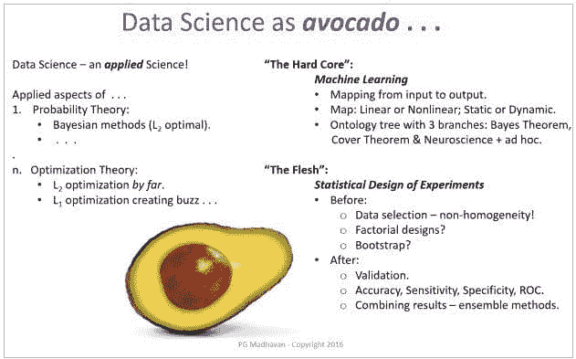
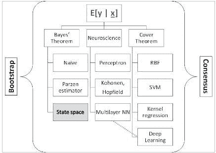

# 数据科学的核心

> 原文：[`www.kdnuggets.com/2016/08/core-data-science.html`](https://www.kdnuggets.com/2016/08/core-data-science.html)

 评论

**作者：[PG Madhavan, Ph.D.](http://www.linkedin.com/in/pgmad)，算法学家 - 商业数据科学。**

阅读了一些最近的博客后，我感到数据科学从业者对他们领域的性质感到一丝焦虑。数据科学到底是什么——这个问题似乎一直潜伏在表面下方……

* * *

## 我们的前三课程推荐

 1\. [谷歌网络安全证书](https://www.kdnuggets.com/google-cybersecurity) - 快速进入网络安全职业的快车道。

 2\. [谷歌数据分析专业证书](https://www.kdnuggets.com/google-data-analytics) - 提升你的数据分析技能

 3\. [谷歌 IT 支持专业证书](https://www.kdnuggets.com/google-itsupport) - 支持你所在组织的 IT 工作

* * *

作为一个年轻的研究和工作领域，数据科学的定义自然需要时间才能明朗。在此期间，看看这是否适合你……

数据科学是许多理论的应用方面。我的方向是贝叶斯的，因此我把概率论放在首位。许多其他科学也起着重要作用——例如，物理学和统计力学就发挥了重要作用。我们已经很长时间习惯于 L2 优化（欧几里得距离度量），但目前在 L1 优化（出租车距离度量）方面有了越来越多的活动。L1 优化将我们从均方误差最优性的舒适区中推了出来，带来了 2 阶思维的挑战！

毫无疑问，数据科学的核心是机器学习（ML）——这个话题的确是“核心”！机器学习基本上关注于找到输入和输出向量空间之间极其重要的“映射”（有关该主题的完整开发，请参见“[SYSTEMS Analytics: Adaptive Machine Learning workbook](http://www.jininnovation.com/NEW-Book.html)”）。有很多工具和技巧，使得对机器学习的全面理解可能会让人感到沮丧；所以我在下面整理了一个本体，组织了我们对机器学习的所有知识。重点是将大量材料分为 3 个主题：贝叶斯定理、覆盖定理和神经科学与特定方法。在机器学习实践中，这些方法被“自助”方法和“共识”方法“包裹”起来。

“鳄梨的核心”在大的括号内。

+   覆盖定理说明（来自[Haykin, 2006](https://www.amazon.com/Neural-Networks-Learning-Machines-3rd/dp/0131471392)）：“在高维空间中非线性地转换的复杂模式分类问题，比在低维空间中更可能是线性可分的，前提是空间不是密集填充的。”

+   从输出的条件概率密度函数中估计条件期望值 E[ y | x]，其中‘y’是输出，‘x’是输入，是硬核概率方法的核心内容。我个人最喜欢的是使用状态空间数据模型和卡尔曼滤波器来估计参数。

+   中间分支是一个由神经科学主导的“包罗万象”的领域，从感知机开始。深度学习是这种方法在本体论中最新的表现形式（结合了高维度）。

统计实验设计提供了周围的“实质”！

**输入侧：自助方法**

目标是最大化训练集信息的使用。

+   有许多方法：

    +   自助训练集；有放回地抽样训练集。

    +   蒙特卡罗方法；用于概率密度估计。

    +   特征子空间。

    +   统计学中的实验设计原则；“分组”、因子设计等。

    +   还有更多。

**输出侧：共识方法**

使用独立的机器学习方法解决问题并结合结果。

+   结合“弱学习者”。

    +   随机森林。

    +   AdaBoost。

    +   还有更多。

大多数机器学习工作倾向于学习输入和输出之间的静态映射，然后将其投入“生产”，隐含假设这种关系将保持不变！我挑战这种假设，并提供了在现实生活中动态变化的情况下最佳解决方法的方式，详见本博客：“[对动态机器学习的需求：贝叶斯精确递归估计](https://www.linkedin.com/pulse/need-dynamical-machine-learning-bayesian-exact-pg-madhavan?trk=hp-feed-article-title-publish)”。

机器学习映射的实际使用需要严格的实验设计框架（[Box 等](https://www.amazon.com/Statistics-Experimenters-Design-Innovation-Discovery/dp/0471718130)，一本老经典）。正如我们在上面的本体树中看到的，当你用强有力的统计实验学科围绕坚实的机器学习映射时，我们可以从数据科学中获得稳健、可重复且实际有用的结果！

在实现数据科学解决方案方面，数据科学是一项“团队运动”和“对抗性运动”。

没有数据科学就没有与数据的持续接触。数据会影响算法、代码、业务应用和日常使用。

数据科学解决方案的开发需要 (1) 一位具备深厚和广泛数学技能的算法专家，(2) 一位拥有数据库和云操作系统技能的编码员，以及 (3) 一位具有定量倾向的商业专业人员。我还没有遇到过具备这三种技能到所需深度的个人！同样重要的是，每种角色的个人气质差异明显。因此，**快速的数据科学解决方案开发需要一个真实或虚拟的三人团队**。数据科学解决方案的部署和操作通常可以由具备应用统计学思维的合格 STEM 毕业生完成（该人欣赏日常业务应用中的统计实验方面）。

数据科学的最佳时光尚未到来！还有其他科学可以挖掘以获取新技术，更多的计算能力意味着可以完成更多的任务，很快，由数据科学提供的强大“**智能增强**”将改变商业、工作和娱乐的性质，带来更好的变革——下一次“工业”革命！

**简介：[PG Madhavan, Ph.D.](http://www.linkedin.com/in/pgmad)** 是一位数据科学专家 + 教练，在机器学习算法、产品和业务方面有着深厚且均衡的经验。

**相关：**

+   理论数据发现：利用物理学理解数据科学

+   构建数据科学投资组合：机器学习项目第一部分

+   如何为您的团队确定合适的数据科学家？

### 更多相关内容

+   [数据掩码：确保 GDPR 和其他法规合规的核心](https://www.kdnuggets.com/2023/05/data-masking-core-ensuring-gdpr-regulatory-compliance-strategies.html)

+   [停止学习数据科学以寻找目标，寻找目标以…](https://www.kdnuggets.com/2021/12/stop-learning-data-science-find-purpose.html)

+   [数据科学基础：您需要了解的 10 项关键技能](https://www.kdnuggets.com/2020/10/data-science-minimum-10-essential-skills.html)

+   [KDnuggets™ 新闻 22:n06，2 月 9 日：数据科学编程…](https://www.kdnuggets.com/2022/n06.html)

+   [数据科学定义幽默：奇特名言合集](https://www.kdnuggets.com/2022/02/data-science-definition-humor.html)

+   [5 个数据科学项目以学习 5 项关键数据科学技能](https://www.kdnuggets.com/2022/03/5-data-science-projects-learn-5-critical-data-science-skills.html)
