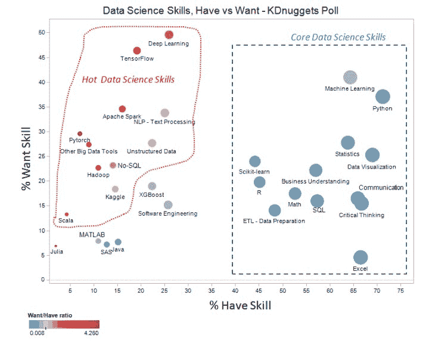

# 新调查：你拥有哪些数据科学技能，哪些技能是你想要的？立即投票

> 原文：[`www.kdnuggets.com/2020/08/core-hot-data-science-skills-poll.html`](https://www.kdnuggets.com/2020/08/core-hot-data-science-skills-poll.html)

调查已结束 - 以下是结果：

> [**现代数据科学技能：8 个类别、核心技能和热门技能**](https://www.kdnuggets.com/2020/09/modern-data-science-skills.html "永久链接到现代数据科学技能：8 个类别、核心技能和热门技能")
> 
> 我们分析了数据科学技能调查的结果，包括 8 个技能类别，超过 50% 的受访者掌握的 13 项核心技能，数据科学家希望学习的热门/新兴技能，以及数据科学家希望学习的顶级技能。

* * *

## 我们的前三个课程推荐

 1\. [谷歌网络安全证书](https://www.kdnuggets.com/google-cybersecurity) - 快速进入网络安全职业生涯。

 2\. [谷歌数据分析专业证书](https://www.kdnuggets.com/google-data-analytics) - 提升你的数据分析能力

 3\. [谷歌 IT 支持专业证书](https://www.kdnuggets.com/google-itsupport) - 支持你的组织进行 IT 工作

* * *

~~新的 KDnuggets 调查提出了两个相关问题：~~

> **1\. 你目前掌握哪些技能/知识领域（能够在工作或研究中使用的水平）？**
> 
> 2\. 你希望添加或改进哪些技能？

**图 1\. 来自 去年数据科学技能调查分析 的结果。**

技能被收集到几个相关的子部分，读者被要求指出他们目前掌握哪些技能以及他们希望添加或改进哪些技能。请注意，你可能既有某项技能又希望改进它。

你可以 **在这里阅读去年的调查分析**。

### 更多相关主题

+   [停止学习数据科学以寻找目标，寻找目标来…](https://www.kdnuggets.com/2021/12/stop-learning-data-science-find-purpose.html)

+   [每个数据科学家都应该知道的三个 R 库（即使你使用 Python）](https://www.kdnuggets.com/2021/12/three-r-libraries-every-data-scientist-know-even-python.html)

+   [学习数据科学统计的顶级资源](https://www.kdnuggets.com/2021/12/springboard-top-resources-learn-data-science-statistics.html)

+   [成功数据科学家的 5 个特征](https://www.kdnuggets.com/2021/12/5-characteristics-successful-data-scientist.html)

+   [90 亿美元 AI 失败，深入剖析](https://www.kdnuggets.com/2021/12/9b-ai-failure-examined.html)

+   [是什么让 Python 成为初创公司的理想编程语言](https://www.kdnuggets.com/2021/12/makes-python-ideal-programming-language-startups.html)
