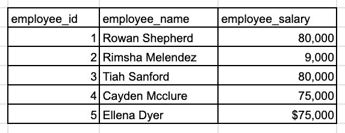
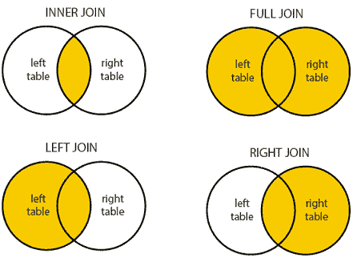
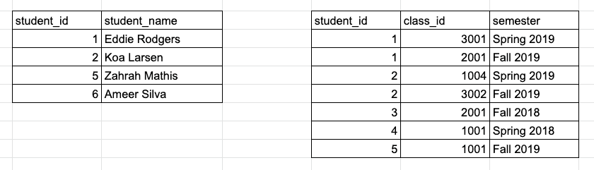
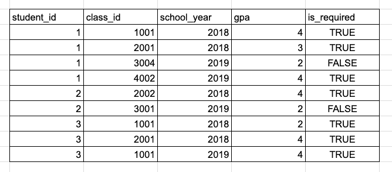
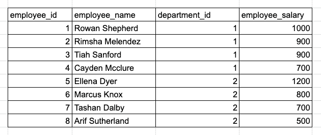
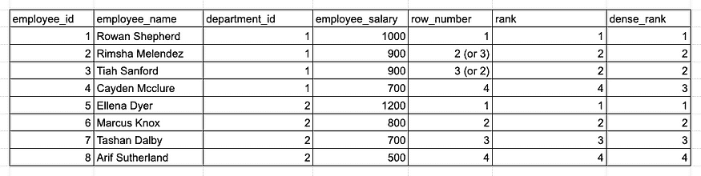

# 破解 SQL 面试

> 原文：[`www.kdnuggets.com/2020/12/crack-sql-interviews.html`](https://www.kdnuggets.com/2020/12/crack-sql-interviews.html)

评论

**由 [Xinran Waibel](https://medium.com/@xinran.waibel), Netflix 数据工程师**。


*照片由 [Green Chameleon](https://unsplash.com/@craftedbygc?utm_source=unsplash&utm_medium=referral&utm_content=creditCopyText) 提供，来自 [Unsplash](https://unsplash.com/s/photos/exam?utm_source=unsplash&utm_medium=referral&utm_content=creditCopyText)。*

[SQL](https://en.wikipedia.org/wiki/SQL) 是数据分析和数据处理最重要的编程语言之一，因此 SQL 问题总是数据科学相关职位面试的一部分，如数据分析师、数据科学家和 [数据工程师](https://towardsdatascience.com/introduction-to-data-engineering-e16c9942dc2c)。SQL 面试旨在评估候选人的技术和解决问题的能力。因此，不仅要基于样本数据编写正确的查询，还要考虑各种场景和边界情况，就像处理实际数据集一样。

我曾帮助设计和进行数据科学候选人的 SQL 面试问题，并且自己也经历了许多大型科技公司和初创公司的 SQL 面试。在这篇博客文章中，我将解释 SQL 面试问题中常见的模式，并提供如何在 SQL 查询中整洁处理它们的技巧。

### 提问

要顺利通过 SQL 面试，最重要的是确保你掌握了给定任务和数据样本的所有细节，通过提出尽可能多的问题来理解需求。这将节省你后来在解决问题上的时间，并使你能够妥善处理边界情况。

我注意到许多候选人往往直接进入解决方案，而没有对 SQL 问题或数据集有充分的理解。后来，当我指出他们解决方案中的问题时，他们不得不反复修改查询。最终，他们在迭代过程中浪费了很多面试时间，甚至可能没有找到正确的解决方案。

我建议把 SQL 面试当作与工作中的业务伙伴合作来对待。在提供解决方案之前，你需要收集所有关于数据请求的需求。

**示例**

> *找出薪资最高的前三名员工。*



*样本 employee_salary 表。*

你应该询问面试官澄清“前三名”的定义。我是否需要在结果中包含确切的三名员工？如何处理平局情况？此外，仔细查看样本员工数据。薪资字段的数据类型是什么？是否需要在计算之前清理数据？

### 哪种 JOIN



*来源：[dofactory](https://www.dofactory.com/sql/join).*

在 SQL 中，JOIN 经常用于将多个表的信息结合起来。有 [四种不同的 JOIN 类型](https://www.w3schools.com/sql/sql_join.asp)，但在大多数情况下，我们只使用 INNER、LEFT 和 FULL JOIN，因为 RIGHT JOIN 不太直观，并且可以很容易地用 LEFT JOIN 替代。在 SQL 面试中，你需要根据给定问题的具体要求选择合适的 JOIN。

**示例**

> *找出每个学生修过的课程总数。（提供学生 ID、姓名和修课数。）*

* *

*示例学生和* class_history *表。*

正如你可能注意到的，并不是所有出现在 *class_history* 表中的学生都在 *student* 表中，这可能是因为这些学生已不再在校。（在事务型数据库中，这其实很典型，因为记录通常在不活跃后会被删除。）根据面试官是否希望结果中包含不活跃学生，我们需要使用 LEFT JOIN 或 INNER JOIN 来结合两个表：

```py
WITH class_count AS (
    SELECT student_id, COUNT(*) AS num_of_class
    FROM class_history
    GROUP BY student_id
)
SELECT
    c.student_id,
    s.student_name,
    c.num_of_class
FROM class_count c
-- CASE 1: include only active students
JOIN student s ON c.student_id = s.student_id
-- CASE 2: include all students
-- LEFT JOIN student s ON c.student_id = s.student_id

```


*图片由 [petr sidorov](https://unsplash.com/@m_malkovich?utm_source=unsplash&utm_medium=referral&utm_content=creditCopyText) 提供，来自 [Unsplash](https://unsplash.com/s/photos/order-by?utm_source=unsplash&utm_medium=referral&utm_content=creditCopyText)。*

### GROUP BY

GROUP BY 是 SQL 中最重要的函数，因为它广泛用于数据汇总。如果你在 SQL 问题中看到 sum、average、minimum 或 maximum 等关键词，这通常是一个很大的提示，表明你可能需要在查询中使用 GROUP BY。一个常见的陷阱是将 WHERE 和 HAVING 混合使用在与 GROUP BY 相关的数据过滤中——我见过很多人犯这个错误。

**示例**

> *计算每个学生每学年的平均必修课 GPA，并找出每学期符合院长名单要求的学生（GPA ≥ 3.5）。*

* *

*示例 GPA 历史表。*

由于我们在 GPA 计算中仅考虑必修课程，我们需要使用 *WHERE is_required = TRUE* 排除选修课程。我们需要每个学生每年的平均 GPA，因此我们将按 *student_id* 和 *school_year* 列进行 GROUP BY，并计算 *gpa* 列的平均值。最后，我们仅保留学生平均 GPA 高于 3.5 的行，这可以通过 HAVING 实现。让我们把一切整合在一起：

```py
SELECT
    student_id,
    school_year,
    AVG(gpa) AS avg_gpa
FROM gpa_history
WHERE is_required = TRUE
GROUP BY student_id, school_year
HAVING AVG(gpa) >= 3.5

```

请记住，每当在查询中使用 GROUP BY 时，你只能选择分组列和聚合列，因为其他列的行级信息已被丢弃。

有些人可能会疑惑 WHERE 和 HAVING 之间的区别，或者为什么我们不直接写 *HAVING avg_gpa >= 3.5* 而不指定函数。我将在下一节中详细解释。

### SQL 查询执行顺序

大多数人从 SELECT 开始自上而下地编写 SQL 查询，但你知道 SELECT 是 SQL 引擎执行的最后几个函数之一吗？下面是 SQL 查询的执行顺序：

1.  FROM, JOIN

1.  WHERE

1.  GROUP BY

1.  HAVING

1.  SELECT

1.  DISTINCT

1.  ORDER BY

1.  LIMIT, OFFSET

再次考虑前面的例子。因为我们想在计算平均 GPA 之前筛选出可选课程，我使用了 *WHERE is_required = TRUE* 而不是 HAVING，因为 WHERE 在 GROUP BY 和 HAVING 之前执行。我不能写 *HAVING avg_gpa >= 3.5* 的原因是 *avg_gpa* 是作为 SELECT 的一部分定义的，因此在 SELECT 之前执行的步骤中无法引用它。

我建议在编写查询时遵循执行顺序，这对于那些在编写复杂查询时遇到困难的人很有帮助。


*照片由 [Stefano Ghezzi](https://unsplash.com/@steghe?utm_source=unsplash&utm_medium=referral&utm_content=creditCopyText) 提供，来自 [Unsplash](https://unsplash.com/s/photos/window?utm_source=unsplash&utm_medium=referral&utm_content=creditCopyText)。*

### 窗口函数

[窗口函数](https://mode.com/sql-tutorial/sql-window-functions/) 也经常出现在 SQL 面试中。常见的窗口函数有五种：

+   **RANK**/**DENSE_RANK**/**ROW_NUMBER**：这些函数通过对特定列进行排序来为每行分配一个排名。如果给定了任何分区列，行会在它所属的分区组内排名。

+   **LAG**/**LEAD**：它从指定顺序和分区组中检索前一行或后一行的列值。

在 SQL 面试中，理解排名函数的区别并知道何时使用 LAG/LEAD 是非常重要的。

**示例**

> *找到每个部门中薪资最高的前 3 名员工。*



*另一个示例* employee_salary *表。*

当 SQL 问题要求“TOP N”时，我们可以使用 ORDER BY 或排名函数来回答问题。然而，在这个例子中，它要求计算“每个 Y 中的 TOP N X”，这强烈暗示我们应该使用排名函数，因为我们需要在每个分区组内对行进行排名。

以下查询准确地找到 3 名薪资最高的员工，无论是否有并列：

```py
WITH T AS (
SELECT
    *,
    ROW_NUMBER() OVER (PARTITION BY department_id ORDER BY employee_salary DESC) AS rank_in_dep
FROM employee_salary)
SELECT * FROM T
WHERE rank_in_dep <= 3
-- Note: When using ROW_NUMBER, each row will have a unique rank number and ranks for tied records are assigned randomly. For exmaple, Rimsha and Tiah may be rank 2 or 3 in different query runs.

```

此外，根据如何处理并列情况，我们可以选择不同的排名函数。细节很重要！



*ROW_NUMBER*、*RANK* 和 *DENSE_RANK* 函数的结果比较。


*照片由 [Héctor J. Rivas](https://unsplash.com/@hjrc33?utm_source=unsplash&utm_medium=referral&utm_content=creditCopyText) 提供，来自 [Unsplash](https://unsplash.com/s/photos/order?utm_source=unsplash&utm_medium=referral&utm_content=creditCopyText)。*

### 复制

另一个常见的 SQL 面试陷阱是忽略数据重复。虽然某些列在样本数据中似乎有不同的值，但候选人需要考虑所有可能性，就像他们在处理真实世界的数据集一样。例如，在前面的*employee_salary*表中，可能会有员工共享相同的姓名。

避免潜在重复问题的一种简单方法是始终使用 ID 列来唯一标识不同记录。

**示例**

> *使用**employee_salary**表计算所有部门每个员工的总工资。*

正确的解决方案是通过*employee_id*进行分组，并使用*SUM(employee_salary)*计算总工资。如果需要员工姓名，可以在最后与员工表连接以检索员工姓名信息。

错误的方法是通过*employee_name*进行分组。

### NULL

在 SQL 中，任何谓词都可能产生三种值之一：true、false 和[NULL](https://towardsdatascience.com/demystify-null-values-in-sql-bc7e7e1b913a)，一个保留的关键字表示*未知或缺失的数据值*。处理 NULL 数据集可能出乎意料地棘手。在 SQL 面试中，面试官可能会特别关注你的解决方案是否处理了 NULL 值。有时候，如果一个列不允许 NULL（例如 ID 列），这点是明显的，但对于大多数其他列，可能会存在 NULL 值。

我建议确认样本数据中的关键列是否允许 NULL，如果允许，请使用*IS (NOT) NULL*、*IFNULL*和*COALESCE*等函数来处理这些边界情况。

(想了解更多关于如何处理 NULL 值的信息？查看[我关于 SQL 中 NULL 处理的指南](https://towardsdatascience.com/demystify-null-values-in-sql-bc7e7e1b913a)。)

### 沟通

最后但同样重要的是——在 SQL 面试中保持沟通。

我面试过许多候选人，他们除了有问题时几乎不说话，这在他们最终提出完美解决方案的情况下是可以接受的。然而，在技术面试中，保持沟通通常是一个好主意。例如，你可以讨论你对问题和数据的理解，计划如何解决问题，为什么选择某些函数而不是其他替代方案，以及你考虑了哪些边界情况。

**总结：**

+   始终先提问以获取所需的详细信息。

+   仔细选择 INNER、LEFT 和 FULL JOIN。

+   使用 GROUP BY 来汇总数据，并正确使用 WHERE 和 HAVING。

+   理解三种排名函数之间的区别。

+   了解何时使用 LAG/LEAD 窗口函数。

+   如果你在创建复杂查询时遇到困难，可以尝试遵循 SQL 执行顺序。

+   考虑潜在的数据问题，如重复和 NULL 值。

+   与面试官沟通你的思路。

为了帮助你了解如何在实际的 SQL 面试中运用这些策略，我将在下面的视频中带你逐步解答一个 SQL 面试问题：

[原文](https://towardsdatascience.com/crack-sql-interviews-6a5fc90ec763)。经授权转载。

**简介：** [**Xinran Waibel**](https://medium.com/@xinran.waibel) 是一位经验丰富的数据工程师，位于旧金山湾区，目前在 Netflix 工作。她也是《Towards Data Science》、《Google Cloud》和《The Startup》在 Medium 上的技术作者。

**相关：**

+   [数据工程师面试终极指南](https://www.kdnuggets.com/2020/12/ultimate-guide-data-engineer-interviews.html)

+   [如何在虚拟数据面试中表现出色](https://www.kdnuggets.com/2020/05/pragmatic-rock-virtual-data-interview.html)

+   [数据科学面试学习指南](https://www.kdnuggets.com/2020/01/data-science-interview-study-guide.html)

* * *

## 我们的前 3 个课程推荐

 1\. [谷歌网络安全证书](https://www.kdnuggets.com/google-cybersecurity) - 快速进入网络安全职业生涯。

 2\. [谷歌数据分析专业证书](https://www.kdnuggets.com/google-data-analytics) - 提升你的数据分析能力

 3\. [谷歌 IT 支持专业证书](https://www.kdnuggets.com/google-itsupport) - 支持你的组织在 IT 领域

* * *

### 更多相关话题

+   [成为优秀数据科学家需要的 5 项关键技能](https://www.kdnuggets.com/2021/12/5-key-skills-needed-become-great-data-scientist.html)

+   [每个初学者数据科学家应掌握的 6 个预测模型](https://www.kdnuggets.com/2021/12/6-predictive-models-every-beginner-data-scientist-master.html)

+   [2021 年最佳 ETL 工具](https://www.kdnuggets.com/2021/12/mozart-best-etl-tools-2021.html)

+   [数据科学面试中的 24 个 A/B 测试面试问题](https://www.kdnuggets.com/2022/09/24-ab-testing-interview-questions-data-science-interviews-crack.html)

+   [破解机器学习工程师面试的要素](https://www.kdnuggets.com/2022/10/interview-kickstart-crack-machine-learning-engineer-interviews.html)

+   [停止学习数据科学，寻找目的，并找到目的去…](https://www.kdnuggets.com/2021/12/stop-learning-data-science-find-purpose.html)
