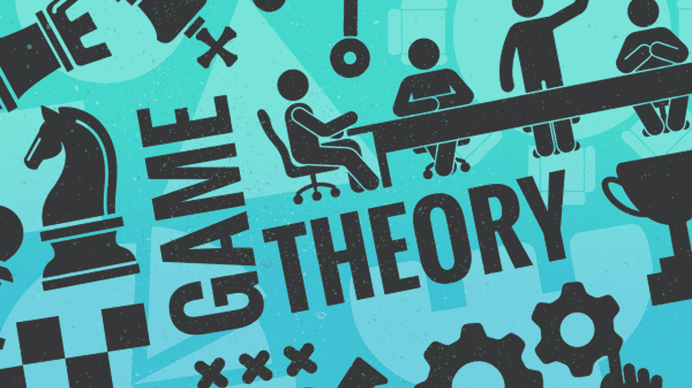
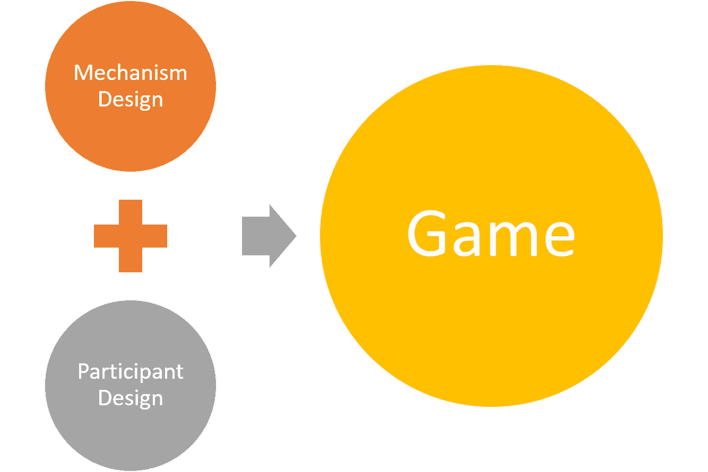
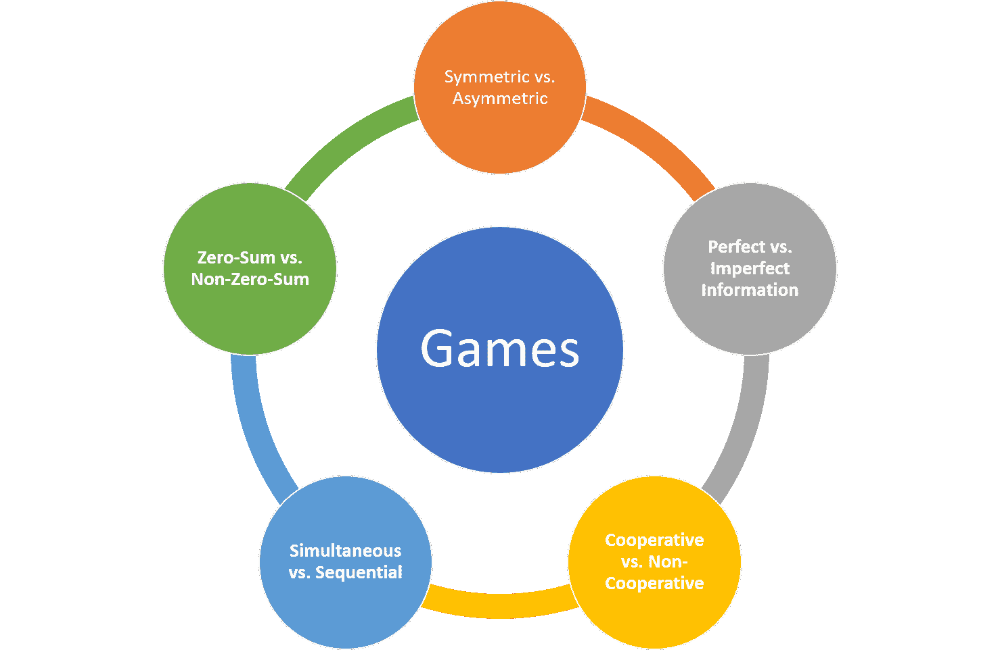
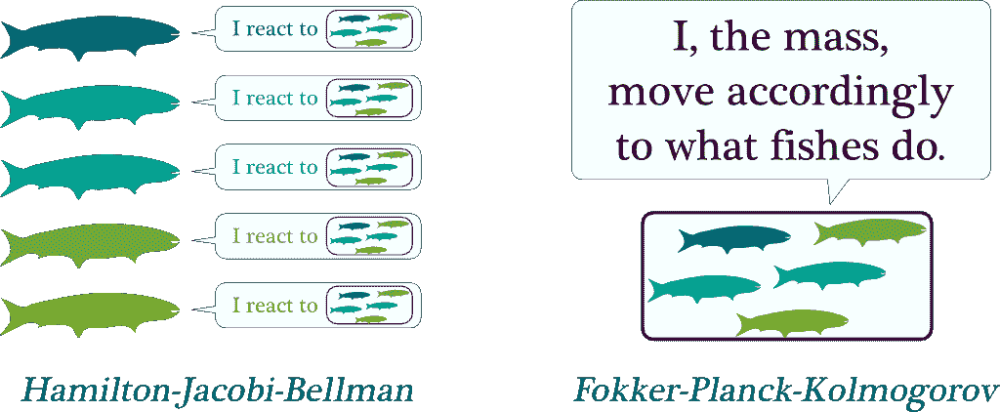
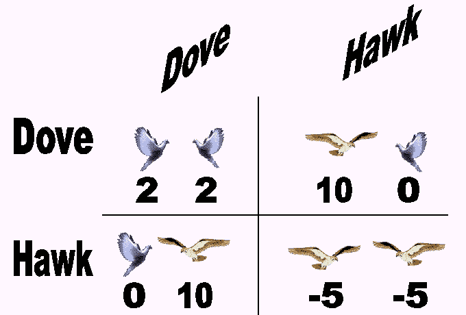

# 机器学习中的博弈论速成课程：经典与新观念

> 原文：[`www.kdnuggets.com/2020/03/crash-course-game-theory-machine-learning.html`](https://www.kdnuggets.com/2020/03/crash-course-game-theory-machine-learning.html)

评论

博弈论是数学中最迷人的领域之一，它影响了经济学、社会科学、生物学以及计算机科学等多个领域。关于博弈论的思考方式有很多种，但我发现一种虽然过于简化但非常有用的方式是：

> * * *
> 
> ## 我们的三大课程推荐
> ## 
>  1\. [谷歌网络安全证书](https://www.kdnuggets.com/google-cybersecurity) - 快速进入网络安全职业道路。
> 
>  2\. [谷歌数据分析专业证书](https://www.kdnuggets.com/google-data-analytics) - 提升你的数据分析技能
> 
>  3\. [谷歌 IT 支持专业证书](https://www.kdnuggets.com/google-itsupport) - 支持你所在组织的 IT 工作
> 
> * * *
> 
> 博弈论是带有激励的概率

游戏在人工智能（AI）的发展中扮演了关键角色。首先，游戏环境正在成为强化学习或模仿学习等领域的热门训练机制。理论上，任何多智能体 AI 系统都可以接受其参与者之间的游戏化互动。制定游戏原理的数学分支称为博弈论。在人工智能（AI）和深度学习系统的背景下，博弈论对实现多智能体环境中的关键能力至关重要，在这些环境中，不同的 AI 程序需要互动或竞争以实现目标。

博弈论的历史与计算机科学的历史息息相关。目前博弈论的许多研究可以追溯到计算机科学先驱如[艾伦·图灵](https://en.wikipedia.org/wiki/Alan_Turing)或[约翰·冯·诺依曼](https://en.wikipedia.org/wiki/John_von_Neumann)的工作。由电影[《美丽心灵》](https://en.wikipedia.org/wiki/A_Beautiful_Mind_(film))普及的著名纳什均衡是现代系统中许多人工智能交互的基石。然而，使用博弈论原理来建模人工智能宇宙时，往往超出了纳什均衡的范围。理解使用博弈论原理设计人工智能系统的影响，一个好的起点是理解我们在社会或经济交互中通常遇到的不同类型的游戏。

我们每天参与数百次基于游戏动态的互动。然而，这些游戏化环境的架构完全不同，参与者的激励和目标也各异。如何将这些原则应用于 AI 代理建模？这是一个推动整个 AI 研究领域（如多智能体强化学习）的挑战。

尽管游戏显然是博弈论的最直观体现，但这远不是这些概念唯一应用的领域。从这个角度来看，还有许多其他领域可以受到博弈论与 AI 结合的影响。事实上，大多数涉及多个“参与者”合作或竞争以完成任务的场景都可以通过 AI 技术进行游戏化和改进。尽管之前的陈述是一种概括，但我希望它传达了博弈论与 AI 是一种思考和建模软件系统的方法，而不是具体的技术。

为了使一个 AI 场景成为使用博弈论的良好候选者，它应该涉及多个参与者。例如，像 Salesforce Einstein 这样的销售预测优化 AI 系统并不是应用博弈论原则的理想候选者。然而，在多参与者环境中，博弈论可以极为有效。设计 AI 系统中的游戏动态可以总结为两个基本步骤：

+   **参与者设计：** 博弈论可以用来优化参与者的决策，以获得最大效用。

+   **机制设计：** 反向博弈论专注于为一组智能参与者设计游戏。拍卖是机制设计的经典例子。

### 数据科学家应该了解的 5 种游戏类型

假设我们正在建模一个涉及多个代理的 AI 系统，这些代理将合作和竞争以实现特定目标。这是博弈论的经典例子。自 20 世纪 40 年代以来，博弈论一直专注于建模我们现在在多智能体 AI 系统中每天看到的最常见的互动模式。理解环境中的不同游戏动态是设计高效游戏化 AI 系统的关键要素。在高层次上，我喜欢使用五个要素标准来理解 AI 环境中的游戏动态：

### 对称与不对称。

最简单的游戏分类之一是基于其对称性。对称博弈描述了一种环境，在这种环境中每个玩家有相同的目标，结果仅取决于所涉及的策略。棋类游戏是对称博弈的经典例子。我们在现实世界中遇到的许多情境缺乏数学对称的优雅，因为参与者通常有不同甚至冲突的目标。商业谈判是一个不对称博弈的例子，在这种博弈中，每一方有不同的目标，并从不同的角度评估结果（例如：赢得合同与最小化投资）。

### 完美信息与不完美信息

另一种重要的游戏分类是基于可用信息的类型。完美信息博弈指的是每个玩家都可以看到其他玩家的动作的环境。棋类游戏再次是完美信息博弈的一个例子。许多现代互动基于这样一种环境，即每个玩家的动作对其他玩家是隐藏的，博弈理论将这些情境分类为不完美信息博弈。从扑克牌游戏到自动驾驶汽车场景，不完美信息博弈无处不在。

### 合作博弈与非合作博弈

合作博弈环境是指不同的参与者可以建立联盟以最大化最终结果的环境。合同谈判通常被建模为合作博弈。不合作情境描述的是禁止玩家形成联盟的环境。战争是非合作博弈的终极例子。

### 同时博弈与顺序博弈

顺序博弈发生在一个玩家对其他玩家早期行动有信息的环境中。棋盘游戏大多本质上是顺序的。同时博弈则代表了两个玩家可以采取同时行动的情境。证券交易是同时博弈的一个例子。

### 零和博弈与非零和博弈

零和博弈指的是一种情境，其中一个玩家的获胜总是转化为其他玩家的损失。棋盘游戏是零和博弈的例子。非零和博弈通常出现在多个玩家可以从一个玩家的行动中获益的情境中。经济互动中多个参与者合作以增加市场规模就是非零和博弈的一个例子。

### 纳什均衡

对称博弈主宰了人工智能世界，其中大多数基于过去一个世纪最著名的数学理论之一：纳什均衡。

纳什均衡以 [约翰·福布斯·纳什](https://en.wikipedia.org/wiki/John_Forbes_Nash_Jr.) 的名字命名，这位美国数学家因在电影 [《美丽心灵》](https://en.wikipedia.org/wiki/A_Beautiful_Mind_(film)) 中由拉塞尔·克劳饰演而被铭记。基本上，纳什均衡描述了一种情况，其中每个玩家都选择了一种策略，并且没有玩家可以通过改变策略来获得更大的利益，同时其他玩家保持其策略不变。

纳什均衡是一个美丽且极其强大的数学模型，用于解决许多博弈论问题，但在许多不对称博弈环境中也存在不足。首先，纳什方法假设玩家具有无限的计算能力，而这在现实世界中几乎不可能发生。此外，许多纳什均衡模型未能考虑到风险这一概念，而风险在大多数不对称博弈和经济市场中是普遍存在的。因此，有许多不对称博弈场景很难使用纳什均衡进行实现。这在需要在解决方案的数学优雅性与实施的实际性之间找到正确平衡的多智能体 AI 系统中尤为重要。

### 对机器学习产生影响的博弈论新思想

多智能体 AI 系统是 AI 生态系统中最令人着迷的研究领域之一。近期在多智能体系统等领域的进展正在推动博弈论的边界，依赖于该领域的一些最复杂的思想。以下是一些在现代机器学习中非常常见的博弈论子学科的例子。

### 平均场博弈

[平均场博弈（MFG）](https://en.wikipedia.org/wiki/Mean_field_game_theory) 是博弈论领域中相对较新的一个领域。MFG 理论在 2006 年由 Minyi Huang、Roland Malhamé 和 Peter Caines 在蒙特利尔，以及 Jean-Michel Lasry 和菲尔兹奖得主 Pierre-Louis Lions 在巴黎发表的一系列独立论文中首次提出。从概念上讲，MFG 包括用于研究具有大量理性玩家的微分博弈的方法和技术。这些代理不仅对自身状态（如财富、资本）有偏好，还对群体中其余个体的分布有偏好。MFG 理论研究这些系统的广义纳什均衡。

平均场博弈的经典例子是鱼群如何以协调的方式朝同一方向游动。从理论上讲，这种现象确实很难解释，但它的根源在于鱼对最近群体行为的反应。更具体地说，每条鱼并不关心其他鱼的个体行为，而是关心附近的鱼群整体的运动。如果我们将其转化为数学术语，鱼对鱼群的反应可以用哈密顿-雅可比-贝尔曼方程来描述。另一方面，鱼群行为的聚合决定了质量的运动，对应于福克-普朗克-科尔莫戈罗夫方程。均场博弈理论就是这两个方程的结合。

### 随机游戏

随机游戏可以追溯到 1950 年代，由诺贝尔经济学奖得主[Lloyd Shapley](https://en.wikipedia.org/wiki/Lloyd_Shapley)引入。从概念上讲，随机游戏是由有限数量的玩家在有限状态空间上进行的，每个状态下，每个玩家选择有限个行动之一；这些行动的结果决定了每个玩家的奖励以及对后继状态的概率分布。

一个经典的随机游戏形式是哲学家就餐问题，其中有 n + 1 名哲学家（n ≥ 1）坐在一个圆桌旁，中间有一碗米饭。任何两个相邻的哲学家之间都有一根筷子，两个哲学家都可以使用。由于桌子是圆的，所以筷子的数量与哲学家的数量相同。要从碗里吃饭，哲学家需要同时获得他能接触到的两根筷子。因此，如果一个哲学家在吃饭，那么他的两个邻居不能同时吃饭。哲学家的生活非常简单，包括思考和吃饭；为了生存，哲学家需要不断地思考和吃饭。任务是设计一个协议，使所有哲学家都能生存。

### 演化博弈

演化博弈论（EGT）受达尔文进化理论的启发。EGT 的起源可以追溯到 1973 年，[约翰·梅纳德·史密斯](https://en.wikipedia.org/wiki/John_Maynard_Smith)和[乔治·R·普赖斯](https://en.wikipedia.org/wiki/George_R._Price)对竞赛的形式化分析，研究了策略的数学标准，以预测竞争策略的结果。从概念上讲，EGT 是将博弈论的概念应用于一个多样化策略的群体在时间上互动以形成稳定解决方案的情况，这个过程是通过选择和复制的演化过程来实现的。EGT 的主要思想是许多行为涉及到一个群体中多个代理的互动，而这些代理中的任何一个的成功取决于其策略如何与其他代理的策略互动。虽然经典博弈论关注的是静态策略，也就是说那些不会随时间变化的策略，但演化博弈论则不同于经典博弈论，它关注的是策略如何随着时间演变，以及哪些动态策略在这一演化过程中最成功。

EGT 的一个经典例子是鹰鸽博弈，该博弈模拟了鹰与鸽子之间对可分享资源的争夺。在游戏中，每个参赛者都会遵循以下两种策略中的一种：

+   **鹰**：发起攻击性行为，直到受伤或对手退却为止。

+   **鸽子**：如果对手发起攻击性行为，则立即撤退。

如果我们假设（1）每当两个个体都发起攻击性行为时，最终会发生冲突，并且两个个体受伤的可能性相同，（2）冲突的成本会将个体适应度降低一个常数值*C*，（3）当一只鹰遇到一只鸽子时，鸽子会立即撤退，鹰获得资源，以及（4）当两只鸽子相遇时，资源将被平分，那么鹰鸽博弈的适应度收益可以根据以下矩阵总结：

### 逆博弈论

在许多情况下，问题不是优化参与者在博弈中的策略，而是围绕理性参与者的行为设计博弈。这就是逆博弈论的作用。拍卖被认为是逆博弈论的一个主要例子。

博弈论正在经历一场由人工智能和多智能体系统进化推动的复兴。由计算机科学传奇人物如艾伦·图灵或约翰·冯·诺依曼制定的博弈论原则，如今已成为地球上一些最智能系统的核心，最近在人工智能领域的进展也在推动博弈论研究。随着人工智能的不断发展，我们应当看到博弈论领域出现新的、更具创新性的思想，这些思想将融入主流的深度学习系统中。

[原文](https://towardsdatascience.com/a-crash-course-in-game-theory-for-machine-learning-classic-and-new-ideas-50e33ba2636d)。经许可转载。

**相关内容：**

+   博弈论介绍（第一部分）

+   2020 年机器学习趋势

+   马尔可夫链介绍

### 更多相关话题

+   [免费人工智能与深度学习快速课程](https://www.kdnuggets.com/2022/07/free-artificial-intelligence-deep-learning-crash-course.html)

+   [免费 Python 快速入门课程](https://www.kdnuggets.com/2022/07/free-python-crash-course.html)

+   [免费的 MLOps 入门快速课程](https://www.kdnuggets.com/2022/08/free-mlops-crash-course.html)

+   [免费中级 Python 编程快速课程](https://www.kdnuggets.com/2022/12/free-intermediate-python-programming-crash-course.html)

+   [通过这个免费的 DevOps 快速课程释放你的潜力](https://www.kdnuggets.com/2023/03/corise-unlock-potential-with-this-free-devops-crash-course.html)

+   [机器学习评估指标：理论与概述](https://www.kdnuggets.com/machine-learning-evaluation-metrics-theory-and-overview)
