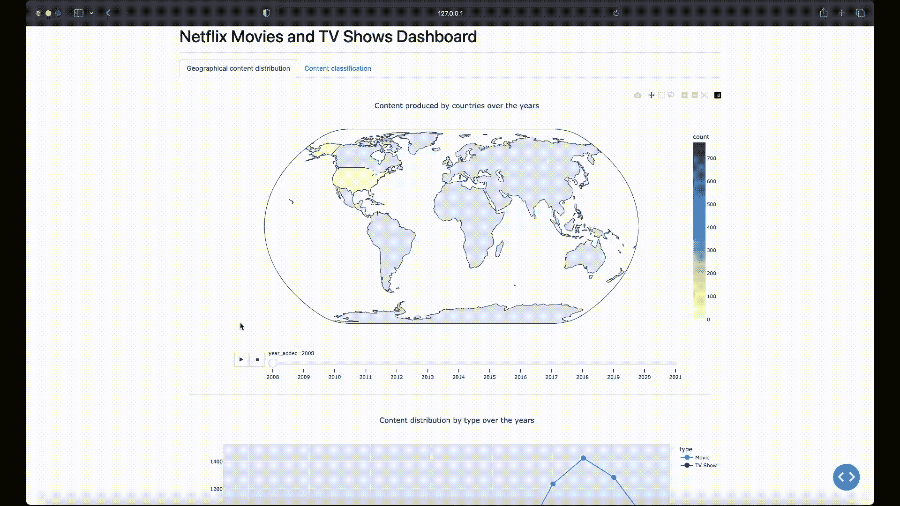
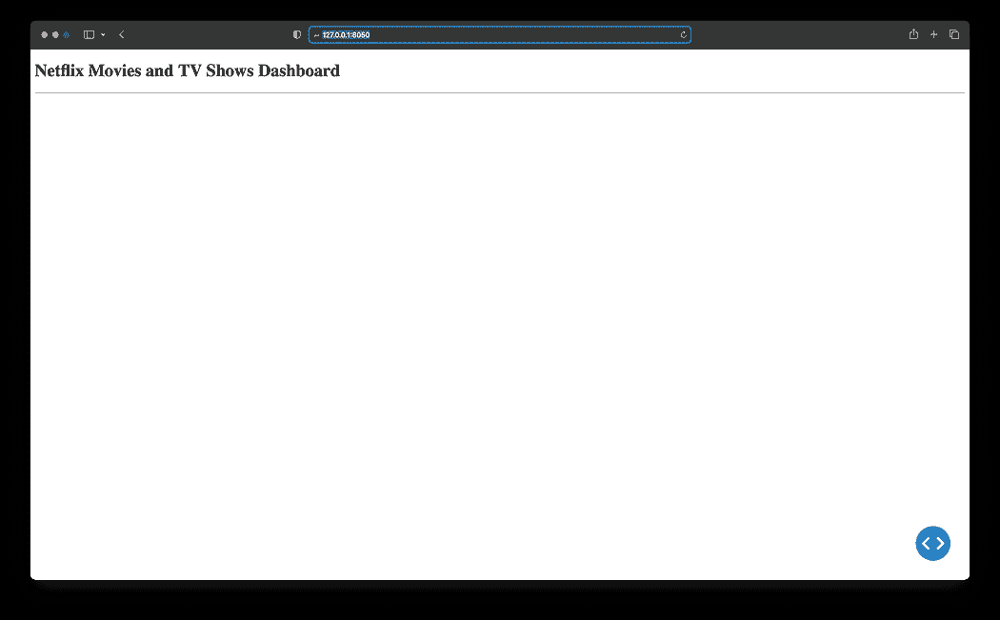
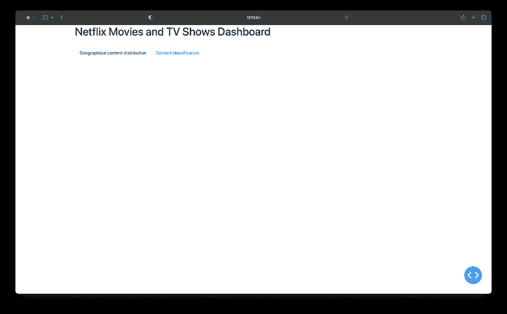
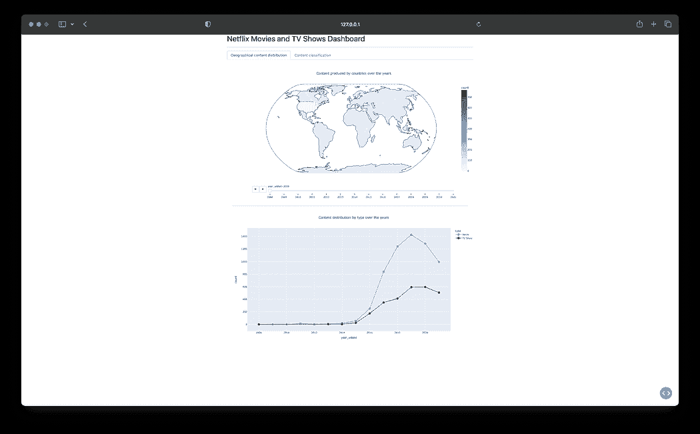

# 使用 Python 和 Dash 创建仪表盘

> 原文：[`www.kdnuggets.com/2023/08/create-dashboard-python-dash.html`](https://www.kdnuggets.com/2023/08/create-dashboard-python-dash.html)

# 介绍

在数据科学和分析的领域中，数据的力量不仅在于提取洞察力，还在于有效地传达这些洞察力；这就是**数据可视化**发挥作用的地方。


数据可视化是信息和数据的图形化表现。它使用图表、图形和地图等视觉元素，使得更容易看出原始数据中的模式、趋势和异常值。对于数据科学家和分析师而言，数据可视化是一个重要工具，它有助于更快、更准确地理解数据，支持数据故事讲述，并有助于做出数据驱动的决策。

在这篇文章中，你将学习如何使用**Python**和**Dash**框架创建一个**仪表盘**来可视化 Netflix 的内容分布和分类。



# 什么是 Dash？

[Dash](https://dash.plotly.com/) 是一个由**Plotly**开发的开源低代码框架，用于在纯 Python 中创建分析性 Web 应用程序。传统上，为了实现这些目的，人们可能需要使用**JavaScript 和 HTML**，这需要你在后台（Python）和前端（JavaScript、HTML）技术方面都有专业知识。

然而，Dash 弥补了这一差距，使数据科学家和分析师能够*仅使用 Python*构建交互式、美观的仪表盘。这种低代码开发的特点使 Dash 成为创建分析仪表盘的合适选择，尤其是对于那些主要使用 Python 的人。

# 数据集分析

现在你已经了解了 Dash，让我们开始我们的实践项目。你将使用[**Netflix 电影和电视节目数据集**](https://www.kaggle.com/datasets/shivamb/netflix-shows)，该数据集由**Shivam Bansal**创建，并可以在**Kaggle**上获得。

该数据集包含了截至 2021 年 Netflix 上可用的电影和电视节目的详细信息，如内容类型、标题、导演、演员、制作国家、发行年份、评级、时长等。

> **尽管数据集创建于 2021 年，但它仍然是发展数据可视化技能和理解媒体娱乐趋势的宝贵资源。**

使用该数据集，你的目标是创建一个仪表盘，允许可视化以下几点：

1.  **地理内容分布**：一张地图图表展示了内容生产在不同国家之间的年度变化。

1.  **内容分类**：这个可视化将 Netflix 的内容分为电视节目和电影，以查看哪些类型最为突出。

# 设置项目工作区

让我们开始创建一个名为*netflix-dashboard*的项目目录，然后通过以下命令初始化和激活 Python 虚拟环境：

```py
# Linux & MacOS
mkdir netflix-dashboard && cd netflix-dashboard
python3 -m venv netflix-venv && source netflix-venv/bin/activate
```

```py
# Windows Powershell
mkdir netflix-dashboard && cd netflix-dashboard
python -m venv netflix-venv && .\netflix-venv\Scripts\activate
```

接下来，你需要安装一些外部包。你将使用`pandas`进行数据处理，`dash`创建仪表板，`plotly`绘制图表，以及`dash-bootstrap-components`为仪表板添加一些样式：

```py
# Linux & MacOS
pip3 install pandas dash plotly dash-bootstrap-components
```

```py
# Windows Powershell
pip install pandas dash plotly dash-bootstrap-components
```

# 清理数据集

在 Netflix 数据集中，你会发现`director`、`cast`和`country`列中有缺失值。将`date_added`列的`string`值转换为`datetime`以便于分析也会很方便。

要清理数据集，你可以创建一个新的文件*clean_netflix_dataset.py*，其中包含以下代码，然后运行它：

```py
import pandas as pd

# Load the dataset
df = pd.read_csv('netflix_titles.csv')

# Fill missing values
df['director'].fillna('No director', inplace=True)
df['cast'].fillna('No cast', inplace=True)
df['country'].fillna('No country', inplace=True)

# Drop missing and duplicate values
df.dropna(inplace=True)
df.drop_duplicates(inplace=True)

# Strip whitespaces from the `date_added` col and convert values to `datetime`
df['date_added'] = pd.to_datetime(df['date_added'].str.strip())

# Save the cleaned dataset
df.to_csv('netflix_titles.csv', index=False)
```

# 开始使用 Dash

设置好工作空间并清理数据集后，你准备开始制作仪表板了。创建一个新的文件*app.py*，其中包含以下代码：

```py
from dash import Dash, dash_table, html
import pandas as pd

# Initialize a Dash app
app = Dash(__name__)

# Define the app layout
app.layout = html.Div([
        html.H1('Netflix Movies and TV Shows Dashboard'),
        html.Hr(),
])

# Start the Dash app in local development mode
if __name__ == '__main__':
    app.run_server(debug=True)
```

让我们解析一下*app.py*中的代码：

+   `app = Dash(__name__)`：这一行初始化了一个新的 Dash 应用程序。可以把它看作是你应用的基础。

+   `app.layout = html.Div(…)`：`app.layout`属性允许你编写**类似 HTML 的代码**来设计应用的用户界面。上述布局使用了`html.H1(…)`标题元素作为仪表板标题，并在标题下方添加了一个水平规则`html.Hr()`元素。

+   `app.run(debug=True)`：这一行启动了一个开发服务器，在本地开发模式下提供你的 Dash 应用。Dash 使用[**Flask**](https://flask.palletsprojects.com/en/2.3.x/)，一个轻量级的 web 服务器框架，将你的应用提供给 web 浏览器。

运行*app.py*后，你会在终端中看到一条消息，指示你的 Dash 应用正在运行并可以在[`127.0.0.1:8050/`](http://127.0.0.1:8050/)访问。打开此 URL 以在你的 web 浏览器中查看：



你的第一个 Dash 应用程序！

结果看起来很简单，对吧？别担心！这一部分旨在展示最基本的 Dash 应用结构和组件。你很快会添加更多功能和组件，使其成为一个令人惊叹的仪表板！

# 纳入 Dash Bootstrap 组件

下一步是编写仪表板布局的代码并为其添加一些样式！为此，你可以使用**Dash Bootstrap Components (DBC)**，一个为 Dash 提供 Bootstrap 组件的库，使你能够开发具有响应式布局的样式化应用。

仪表板将以**选项卡布局**样式化，这提供了一种在同一空间内组织不同类型信息的紧凑方式。每个选项卡将对应于一个独特的可视化。

让我们继续修改*app.py*的内容以纳入 DBC：

```py
from dash import Dash,dcc, html
import pandas as pd
import dash_bootstrap_components as dbc

# Initialize the Dash app and import the Bootstrap theme to style the dashboard
app = Dash(__name__, external_stylesheets=[dbc.themes.BOOTSTRAP])

app.layout = dbc.Container(
    [
        dcc.Store(id='store'),
        html.H1('Netflix Movies and TV Shows Dashboard'),
        html.Hr(),
        dbc.Tabs(
            [
                dbc.Tab(label='Geographical content distribution', tab_id='tab1'),
                dbc.Tab(label='Content classification', tab_id='tab2'),
            ],
            id='tabs',
            active_tab='tab1',
        ),
        html.Div(id='tab-content', className='p-4'),
    ]
)

if __name__ == '__main__':
    app.run(debug=True)
```

在这个修改后的布局中，你会看到新的组件：

+   `dbc.Container`：使用`dbc.Container`作为顶级组件将整个仪表板布局包裹在一个响应式和灵活的容器中。

+   `dcc.Store`：这个 Dash Core 组件允许你将数据存储在客户端（用户的浏览器）上，通过本地存储数据来提升应用性能。

+   `dbc.Tabs`和`dbc.Tab`：每个`dbc.Tab`代表一个独立的标签页，包含不同的可视化内容。`label`属性显示在标签页上，`tab_id`用于标识标签页。`dbc.Tabs`的`active_tab`属性用于指定 Dash 应用启动时的活动标签页。

现在运行*app.py*。生成的仪表板将具有 Bootstrap 样式布局，包含两个空标签页：



集成 Bootstrap 以实现标签样式布局

干得不错！你终于准备好将可视化内容添加到仪表板中。

# 添加回调和可视化

在使用 Dash 时，通过**回调函数**实现交互性。回调函数是在输入属性变化时自动调用的函数。之所以称为“回调”，是因为它是一个被 Dash 在应用发生变化时“回调”的函数。

在这个仪表板中，你将使用回调函数在选定的标签页中呈现相关的可视化，每个可视化将存储在*components*目录下的独立 Python 文件中，以便更好地组织和模块化项目结构。

## 地理内容分布可视化

创建一个名为*components*的新目录，在其中创建一个*geographical_content.py*文件，该文件将生成一个**区域图**，展示 Netflix 的内容生产如何随年份在各国之间变化：

```py
import pandas as pd
import plotly.express as px
from dash import dcc, html

df = pd.read_csv('netflix_titles.csv')

# Filter out entries without country information and if there are multiple production countries,
# consider the first one as the production country
df['country'] = df['country'].str.split(',').apply(lambda x: x[0].strip() if isinstance(x, list) else None)

# Extract the year from the date_added column
df['year_added'] = pd.to_datetime(df['date_added']).dt.year
df = df.dropna(subset=['country', 'year_added'])

# Compute the count of content produced by each country for each year
df_counts = df.groupby(['country', 'year_added']).size().reset_index(name='count')

# Sort the DataFrame by 'year_added' to ensure the animation frames are in ascending order
df_counts = df_counts.sort_values('year_added')

# Create the choropleth map with a slider for the year
fig1 = px.choropleth(df_counts,
                     locations='country',
                     locationmode='country names',
                     color='count',
                     hover_name='country',
                     animation_frame='year_added',
                     projection='natural earth',
                     title='Content produced by countries over the years',
                     color_continuous_scale='YlGnBu',
                     range_color=[0, df_counts['count'].max()])
fig1.update_layout(width=1280, height=720, title_x=0.5)

# Compute the count of content produced for each year by type and fill zeros for missing type-year pairs
df_year_counts = df.groupby(['year_added', 'type']).size().reset_index(name='count')

# Create the line chart using plotly express
fig2 = px.line(df_year_counts, x='year_added', y='count', color='type',
               title='Content distribution by type over the years',
               markers=True, color_discrete_map={'Movie': 'dodgerblue', 'TV Show': 'darkblue'})
fig2.update_traces(marker=dict(size=12))
fig2.update_layout(width=1280, height=720, title_x=0.5)

layout = html.Div([
    dcc.Graph(figure=fig1),
    html.Hr(),
    dcc.Graph(figure=fig2)
])
```

上述代码通过`'country'`和`'year_added'`过滤和分组数据，然后计算每个国家在`df_counts`数据框中每年的内容生产量。

然后，`px.choropleth`函数使用`df_counts`数据框中的列作为其参数值来构建地图图表：

+   `locations='country'`：允许你指定`'country'`列中包含的地理位置值。

+   `locationmode='country names'`：这个参数“告诉函数”提供的`locations`是国家名称，因为 Plotly Express 也支持其他位置模式，如 ISO-3 国家代码或美国州名。

+   `color='count'`：用于指定用于着色地图的数值数据。这里，它指的是`'count'`列，该列包含每个国家每年的内容生产量。

+   `color_continuous_scale='YlGnBu'`：为地图中的每个国家构建一个连续的颜色比例，当`color`指定的列包含数值数据时。

+   `animation_frame='year_added'`：这个参数在`'year_added'`列上创建动画。它在地图图表中添加一个年份滑块，允许你查看表示各国内容生产演变的动画。

+   `projection='natural earth'`：这个参数没有使用`df_counts` DataFrame 中的任何列；然而，`'natural earth'`值用于设置地球世界地图的投影。

在层析图地图下方，还包含了一个**带标记的折线图**，展示了内容数量的变化情况，按类型（电视节目或电影）分类，显示多年变化。

为了生成折线图，创建了一个新的 DataFrame`df_year_counts`，该 DataFrame 通过`'year_added'`和`'type'`列对原始`df`数据进行分组，统计每种组合的内容数量。

然后使用`px.line`处理这些分组数据，其中`'x'`和`'y'`参数分别分配给`'year_added'`和`'count'`列，`'color'`参数设置为`'type'`以区分电视节目和电影。

## 内容分类可视化

下一步是创建一个名为 c*ontent_classification.py*的新文件，该文件将生成一个**树图**图表，以从类型和类别的角度可视化 Netflix 的内容：

```py
import pandas as pd
import plotly.express as px
from dash import dcc, html

df = pd.read_csv('netflix_titles.csv')

# Split the listed_in column and explode to handle multiple genres
df['listed_in'] = df['listed_in'].str.split(', ')
df = df.explode('listed_in')

# Compute the count of each combination of type and genre
df_counts = df.groupby(['type', 'listed_in']).size().reset_index(name='count')

fig = px.treemap(df_counts, path=['type', 'listed_in'], values='count', color='count',
                 color_continuous_scale='Ice', title='Content by type and genre')

fig.update_layout(width=1280, height=960, title_x=0.5)
fig.update_traces(textinfo='label+percent entry', textfont_size=14)

layout = html.Div([
    dcc.Graph(figure=fig),
])
```

在上述代码中，数据加载后，对`'listed_in'`列进行调整，通过拆分和展开每个内容的多种类型来处理多个类型，为每个类型创建一个新行。

接下来，创建`df_counts` DataFrame，以`'type'`和`'listed_in'`列对数据进行分组，并计算每种类型-类别组合的数量。

然后，将`df_counts` DataFrame 中的列用作`px.treemap`函数参数的值，如下所示：

+   `path=['type', 'listed_in']`：这些是树图中表示的层次类别。`'type'`和`'listed_in'`列分别包含内容的类型（电视节目或电影）和类别。

+   `values='count'`：树图中每个矩形的大小对应于`'count'`列，表示每种类型-类别组合的内容数量。

+   `color='count'`：`'count'`列也用于为树图中的矩形着色。

+   `color_continous_scale='Ice'`：当由`color`表示的列包含数字数据时，为树图中的每个矩形构建一个连续的颜色刻度。

在创建了两个新的可视化文件后，你当前的项目结构应该如下所示：

```py
netflix-dashboard
├── app.py
├── clean_netflix_dataset.py
├── components
│   ├── content_classification.py
│   └── geographical_content.py
├── netflix-venv
│   ├── bin
│   ├── etc
│   ├── include
│   ├── lib
│   ├── pyvenv.cfg
│   └── share
└── netflix_titles.csv
```

## 实现回调函数

最后一步是修改*app.py*，以导入*components*目录中的两个新可视化，并实现回调函数，以在选择标签时渲染图表：

```py
from dash import Dash, dcc, html, Input, Output
import dash_bootstrap_components as dbc
from components import (
    geographical_content,
    content_classification
)

app = Dash(__name__, external_stylesheets=[dbc.themes.BOOTSTRAP])

app.layout = dbc.Container(
    [
        dcc.Store(id='store'),
        html.H1('Netflix Movies and TV Shows Dashboard'),
        html.Hr(),
        dbc.Tabs(
            [
                dbc.Tab(label='Geographical content distribution', tab_id='tab1'),
                dbc.Tab(label='Content classification', tab_id='tab2'),
            ],
            id='tabs',
            active_tab='tab1',
        ),
        html.Div(id='tab-content', className='p-4'),
    ]
)

# This callback function switches between tabs in a dashboard based on user selection.
# It updates the 'tab-content' component with the layout of the newly selected tab.
@app.callback(Output('tab-content', 'children'), [Input('tabs', 'active_tab')])
def switch_tab(at):
    if at == 'tab1':
        return geographical_content.layout
    elif at == 'tab2':
        return content_classification.layout

if __name__ == '__main__':
    app.run(debug=True)
```

回调装饰器`@app.callback`监听`'tabs'`组件的`'active_tab'`属性的变化，由`Input`对象表示。

每当`'active_tab'`发生变化时，`switch_tab`函数会被触发。这个函数检查`'active_tab'`的 id，并返回要在`'tab-content'` Div 中渲染的相应布局，如`Output`对象所示。因此，当你切换标签时，相关的可视化会出现。

最后，再次运行*app.py*以查看包含新可视化的更新仪表板：



Netflix 电影和电视节目仪表板 — 最终结果

# 总结

本文教会了您如何创建一个仪表板来探索和可视化 Netflix 的内容分布和分类。通过利用 Python 和 Dash 的力量，您现在已经能够创建自己的可视化，从而为您的数据提供宝贵的洞察。

您可以在以下 GitHub 仓库查看此项目的完整代码：[`github.com/gutyoh/netflix-dashboard`](https://github.com/gutyoh/netflix-dashboard)

如果您觉得这篇文章对您有帮助，并且想扩展对 Python 和数据科学的知识，考虑查看 Hyperskill 上的[**数据科学入门课程**](https://hyperskill.org/tracks?utm_source=fcc_hs&utm_medium=social&utm_campaign=dash&category=13)。

如果您对本博客有任何问题或反馈，请在下面的评论中告诉我。

**[赫尔曼·罗斯](https://www.linkedin.com/in/hrosch/)** 是 Hyperskill Go 编程课程的技术作者，他将对教育科技的热情与赋能下一代软件工程师的使命融合在一起。同时，作为伊利诺伊大学厄本那-香槟分校的硕士生，他还深入数据领域。

[原始](https://python.plainenglish.io/create-a-dashboard-using-python-and-dash-fdf2ec20f8ac). 经许可转载。

* * *

## 我们的前三个课程推荐

 1\. [谷歌网络安全证书](https://www.kdnuggets.com/google-cybersecurity) - 快速进入网络安全职业生涯。

 2\. [谷歌数据分析专业证书](https://www.kdnuggets.com/google-data-analytics) - 提升您的数据分析技能

 3\. [谷歌 IT 支持专业证书](https://www.kdnuggets.com/google-itsupport) - 支持您的组织 IT

* * *

### 进一步阅读此主题

+   [创建时间序列比率分析仪表板](https://www.kdnuggets.com/2023/06/wolfer-create-time-series-ratio-analysis-dashboard.html)

+   [如何在 Python 中创建自定义上下文管理器](https://www.kdnuggets.com/how-to-create-custom-context-managers-in-python)

+   [如何为 Python 应用程序创建最小化 Docker 镜像](https://www.kdnuggets.com/how-to-create-minimal-docker-images-for-python-applications)

+   [如何为您的数据项目创建抽样计划](https://www.kdnuggets.com/2022/11/create-sampling-plan-data-project.html)

+   [如何为机器学习创建数据集](https://www.kdnuggets.com/2022/02/create-dataset-machine-learning.html)

+   [使用 Tableau 创建高效的综合数据源](https://www.kdnuggets.com/2022/05/create-efficient-combined-data-sources-tableau.html)
