# 如何为机器学习创建数据集

> 原文：[`www.kdnuggets.com/2022/02/create-dataset-machine-learning.html`](https://www.kdnuggets.com/2022/02/create-dataset-machine-learning.html)

### 为什么为机器学习（ML）创建数据集很重要

一些非凡的事情正在发生。

**算法领域的入门门槛正在逐日降低**。这意味着任何拥有正确目标和技能的人都可以找到适用于机器学习（ML）和人工智能（AI）任务的优秀算法——计算机视觉、自然语言处理、推荐系统，甚至是自动驾驶。

开源计算已经取得了长足的进展，许多开源倡议推动了数据科学、数字分析和 ML 的发展。大学和企业研发实验室的研究人员每天都在创造新的算法和 ML 技术。我们可以放心地说，算法、编程框架、ML 包，甚至是学习这些技术的教程和课程已经不再是稀缺资源。

但高质量数据确实是稀缺的。**数据集——经过妥善策划和标注的——仍然是稀缺资源**。

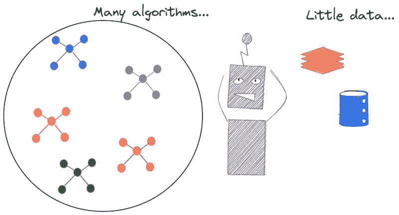

**图 1**：算法太多，但几乎没有好的数据集

### 高质量数据即使在基本 ML 任务中也很具有挑战性

通常，讨论的重点不是如何为你正在开发的酷炫 AI 驱动的旅行或时尚应用获取高质量数据。这类消费者、社交或行为数据的收集本身就存在问题。

**每个应用领域都有其特定的数据需求挑战**，例如，自主驾驶车辆所需的 LiDAR 数据需要特定的 3D 点云数据集来进行对象识别和语义分割，这些数据集非常难以人工标注。

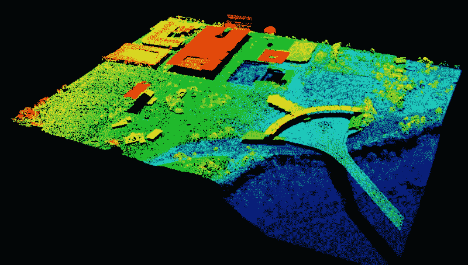

**图 2**：一个 LiDAR 3D 点云数据集 - 训练时极难手动标注。图片 [来源于此论文](https://www.researchgate.net/publication/321142803_Airborne_LiDAR_Technology_A_Review_of_Data_Collection_and_Processing_Systems)

然而，即使**获得用于基本 ML 算法测试和构思的高质量数据集也是一种挑战**。假设一位 ML 工程师从头开始学习，最理智的建议是从简单的小规模数据集入手，他/她可以将数据绘制在二维平面上，以直观地理解数据模式，并以直观的方式查看 ML 算法的内部工作方式。然而，随着数据维度的增加，视觉判断必须扩展到更复杂的领域——例如*学习和样本复杂性*、*计算效率*、*类别不平衡*等概念。

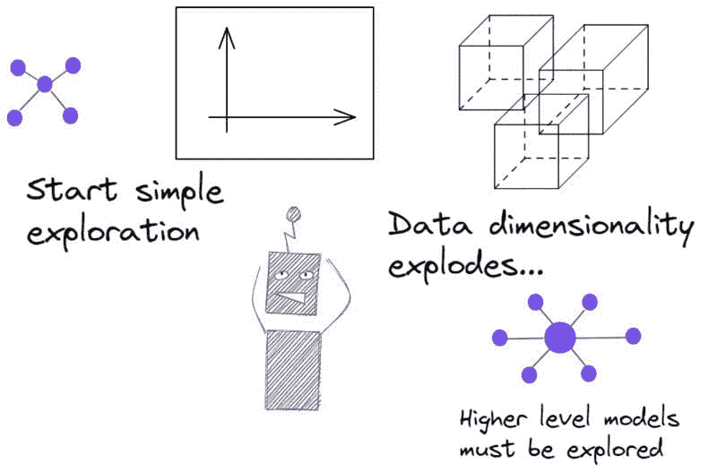

**图 3**：数据和机器学习模型的探索从简单开始——然后爆炸。数据集也必须不断演变。

### 合成数据集的救援

人们总是可以通过实验来评估和调整机器学习算法，获取真实数据集或生成数据点。然而，使用固定的数据集时，样本数量、潜在模式和正负样本之间的类别分离度都是固定的。这样的固定数据集无法测试或评估机器学习算法的许多方面。以下是一些例子：

+   测试数据和训练数据的比例如何影响算法的性能和鲁棒性

+   在不同程度的类别不平衡面前，指标的鲁棒性如何

+   必须进行哪些类型的偏差-方差权衡

+   算法在训练数据和测试数据中的各种噪声特征下的表现（即标签和特征集中的噪声）

**合成数据集**在所有这些情况下都能派上用场。合成数据是**通过人工制造而非真实世界事件生成的信息**。这种数据最适合用于模型的简单验证，但也用于帮助训练。合成数据集的潜在好处在于**敏感应用——医学分类或金融建模**，在这些领域中，获取高质量标注数据集通常是昂贵且禁止的。

### 适用于机器学习的好数据集的特征（合成的或真实的）

合成数据集是通过程序生成的，真实数据集则来源于各种渠道——社交或科学实验、医疗治疗历史、商业交易数据、网页浏览活动、传感器读数或自动摄像机或激光雷达拍摄的图像的人工标记。不论来源如何，数据集都应该具备一些理想的特征，以便对机器学习算法的开发和性能调整具有价值。

以下是一些例子：

+   数据集应具有**数字、二进制或分类**（有序或无序）特征的**混合**，并且特征的数量和数据集的长度应当具有一定的复杂性

+   对于合成数据，应该以可控的方式注入随机噪声

+   数据集必须具备一定的**随机性**

+   如果是合成的，用户应该能够选择多种统计分布来生成这些数据，即底层的随机过程/参数可以精确控制和调整

+   如果用于分类算法，则**类别分离度**应足够大，以实现良好的分类准确性，但也不应过大，以免使问题变得简单。对于合成数据，这应当是可控的，以便将学习问题设置为简单或困难

+   **生成速度**应相当高，以便对特定机器学习算法进行大量不同数据集的实验，即如果合成数据基于真实数据集的数据增强，则增强算法必须计算高效。

+   对于真实数据集，**数据生成成本**应低且**过程应资源高效**，以确保机器学习训练不会过度影响业务目标。

+   对于回归问题，可以使用复杂的非线性生成过程来获取数据——**真实物理模型或物理过程的计算机模拟**可以帮助实现这一目标。

### 回归、分类和聚类数据集创建用于机器学习

**[Scikit-learn](https://www.exxactcorp.com/blog/Deep-Learning/scikit-learn-1-0-released)** 是基于 Python 的数据科学软件栈中最流行的机器学习库。除了优化的机器学习例程和管道构建方法外，它还拥有丰富的**合成数据生成工具**。我们可以创建各种数据集用于常规机器学习算法训练和调优。

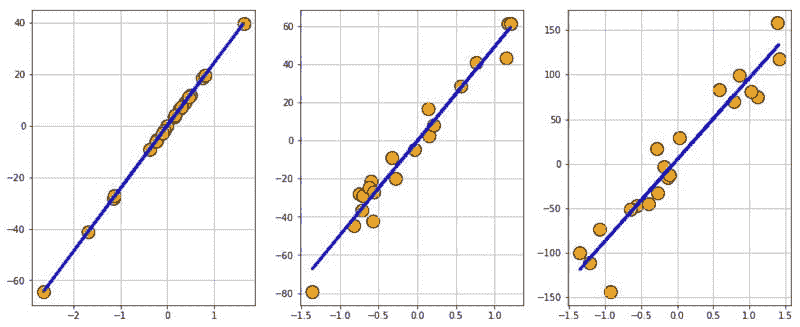

**图 4**：使用 Scikit-learn 创建的回归数据集。

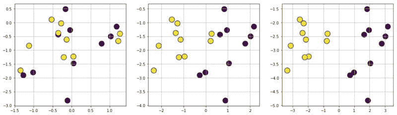

**图 5**：使用 Scikit-learn 创建的分类数据集。

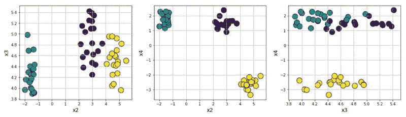

**图 6**：使用 Scikit-learn 创建的聚类数据集。

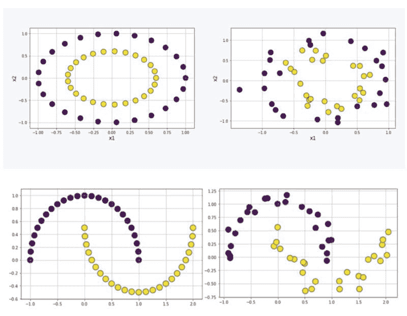

**图 7**：用于测试基于核的算法的非线性数据集。

### 高斯混合模型

高斯混合模型（GMM）是非常有趣的研究对象。它们在无监督学习和主题建模领域被广泛使用，特别是在大规模文本处理/自然语言处理任务中。即使在自动驾驶和机器人导航算法中，它们也有许多应用。只需少量代码，就可以创建有趣的数据集，模拟具有任意形状和复杂性的 GMM 过程。

以下是一些相同的合成数据示例：

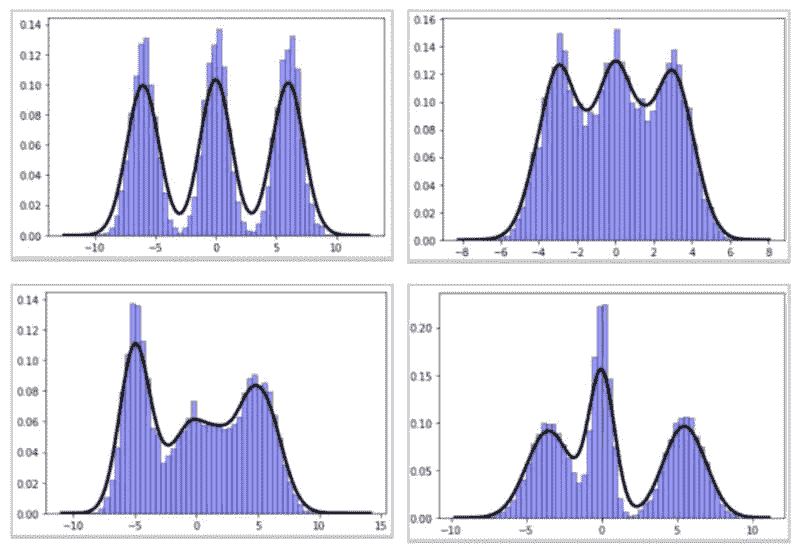

**图 8**：合成创建的高斯混合模型数据集。

### 从符号表达式生成数据集

通常，可能需要一种可控的方法来生成基于明确定义函数的机器学习数据集（涉及线性、非线性、理性或甚至超越项）。

例如，您可能希望评估各种核化支持向量机分类器在具有越来越复杂分隔符（从线性到非线性）的数据集上的效果，或展示线性模型在由有理或超越函数生成的数据集上的局限性。通过混合随机变量生成和符号表达式处理库如**SymPy**的力量，您可以创建与用户定义函数对应的有趣数据集。

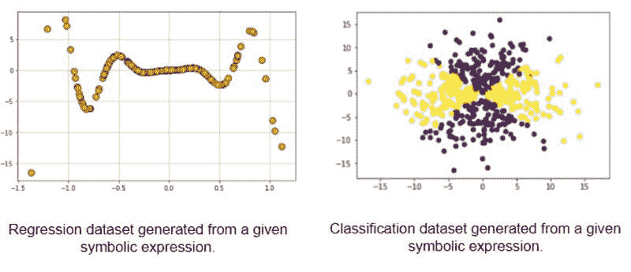

**图 9**：用于高级机器学习算法测试的符号函数生成数据集。

### 工业问题的时间序列/异常数据生成

时间序列分析在现代工业环境中有许多丰富的应用，其中众多传感器不断地从机器、工厂、操作员和业务流程中生成源源不断的数字数据。这种**数字废料**是**工业 4.0**革命的核心特征。

**异常检测**在这些数据流中是所有现代数据分析产品、服务和初创公司的核心内容。他们使用了从经过验证的时间序列算法到最新的基于神经网络的序列模型的所有技术。然而，在内部测试这些算法时，有时需要创建合成数据集，模拟时间序列中各种性质的异常。

本文深入探讨了这一理念，并展示了一些示例：[**在 Python 中创建具有异常签名的合成时间序列**](https://towardsdatascience.com/create-synthetic-time-series-with-anomaly-signatures-in-python-c0b80a6c093c)**。**

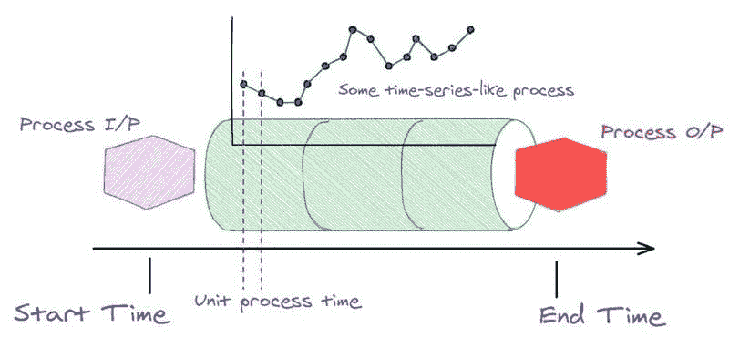

**图 10**：工业应用中时间序列数据集的核心生成过程。

可以生成各种规模的异常，

**图 11**：具有各种规模异常的时间序列。

**数据漂移**可能在任何方向和任何规模上发生。数据可能会改变其一个或多个统计属性——例如均值或方差。这也应该被建模并用于数据集生成。

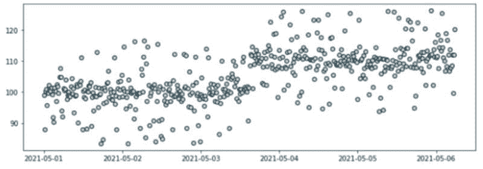

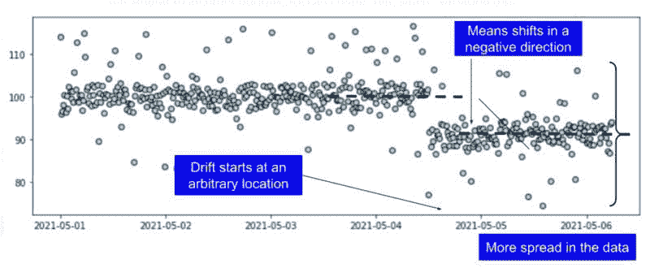

**图 12**：具有异常和数据漂移结合的时间序列数据集。

### 图像数据增强用于机器学习

已经有许多优秀的图像数据集可用于基本的深度学习模型训练和调整。然而，对于特定的任务或应用领域，机器学习工程师通常需要从相对较小的一组高质量图像开始，并通过巧妙的图像处理技术进行扩充。

这里有一篇博客详细讨论了[图像数据的增强技巧](https://neptune.ai/blog/data-augmentation-in-python)作为示例：

基本上，可以使用增强技术从一些种子高质量图像创建各种深度和复杂性的图像数据集：

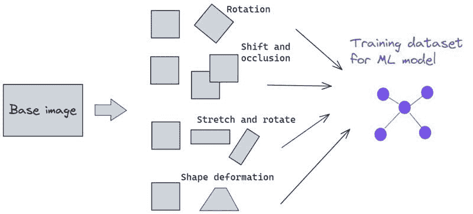

**图 13**：用于创建丰富且强健的数据集的图像数据增强，适用于深度学习训练。

还可以尝试各种**噪声通道添加**来扩增数据集，以使机器学习模型在噪声环境中表现良好。

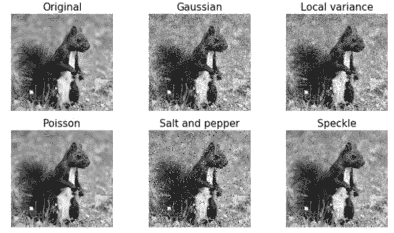

**图 14**：图像数据增强，添加各种噪声通道。

### 总结

在本文中，我们讨论了创建高质量机器学习数据集的基本动机和一些期望的特性。业务流程、科学实验、医学和社交媒体历史——这些是并将继续是训练机器学习算法的最可信的真实数据来源。

然而，合成数据集因其在评估和优化机器学习算法中的强大功能和灵活性而越来越受到需求。

我们简要介绍了许多用于生成此类机器学习数据集的工具、框架和技术，以及它们如何精准地满足算法开发的需求。该领域将继续增长，并有助于开发和繁荣新的、令人兴奋的机器学习算法、框架和技术。

**[Kevin Vu](https://www.kdnuggets.com/author/kevin-vu)** 负责管理 Exxact Corp 博客，并与许多才华横溢的作者合作，这些作者撰写有关深度学习不同方面的文章。

[原文](https://exxactcorp.com/blog/Deep-Learning/how-to-create-a-dataset-for-machine-learning)。经授权转载。

### 相关主题

+   [如何从大型数据集中正确选择样本进行机器学习](https://www.kdnuggets.com/2019/05/sample-huge-dataset-machine-learning.html)

+   [无监督的解缠结表示学习在类别不平衡数据集中的应用](https://www.kdnuggets.com/2023/01/unsupervised-disentangled-representation-learning-class-imbalanced-dataset-elastic-infogan.html)

+   [为您的数据集选择合适的聚类算法](https://www.kdnuggets.com/2019/10/right-clustering-algorithm.html)

+   [如何生成合成表格数据集](https://www.kdnuggets.com/2022/03/generate-tabular-synthetic-dataset.html)

+   [ChatGPT 驱动的数据探索：解锁数据集中的隐藏洞察](https://www.kdnuggets.com/2023/07/chatgptpowered-data-exploration-unlock-hidden-insights-dataset.html)

+   [如何使用 Pandas 处理数据集中的异常值](https://www.kdnuggets.com/how-to-handle-outliers-in-dataset-with-pandas)
