# 使用 Voila 和 Saturn Cloud 创建并部署仪表板

> 原文：[`www.kdnuggets.com/2021/06/create-deploy-dashboards-voila-saturn-cloud.html`](https://www.kdnuggets.com/2021/06/create-deploy-dashboards-voila-saturn-cloud.html)

评论

**由 [Dhrumil Patel](http://linkedin.com/in/dhrumilcse)，NVIDIA 性能分析实习生**

### ****筛选和可视化银行交易数据****

* * *

## 我们的前三名课程推荐

 1\. [Google 网络安全证书](https://www.kdnuggets.com/google-cybersecurity) - 快速进入网络安全职业生涯。

 2\. [Google 数据分析专业证书](https://www.kdnuggets.com/google-data-analytics) - 提升你的数据分析技能

 3\. [Google IT 支持专业证书](https://www.kdnuggets.com/google-itsupport) - 支持你组织的 IT 工作

* * *

处理和训练大型数据集，将它们全部维护在一个地方，并将它们部署到生产环境中是一项具有挑战性的工作。但如果我告诉你，有一种方法只需点击几下即可处理所有这些问题，你会怎么想？

让我们了解如何轻松做到这一点。在本文中，我们将创建一个仪表板（使用 Python 和 Voila），它运行一个机器学习模型来去除欺诈交易，并用可视化显示剩余数据，并将其发布到 Saturn Cloud 的生产服务器以便更方便地访问。以下是文章的大纲，如果你已经了解相关细节，可以随意跳过某些部分。

1.  什么是 [Saturn Cloud](https://www.saturncloud.io/s/freehosted/?utm_source=Dhrumil%3A%20Deploy%20Dashboards%20using%20Voila&utm_medium=try%20saturn)?

1.  创建仪表板（数据筛选和可视化）

1.  部署仪表板（本地和生产）

1.  结束语

### **什么是 Saturn Cloud**

Saturn Cloud 是一个自动化 DevOps 和 ML 基础设施的机器学习平台。除此之外，他们使用 jupyter 和 dash 来扩展 Python 处理大量数据。以下是 Saturn Cloud 提供的一些其他功能：

+   你可以使用 [Dask](https://www.saturncloud.io/s/aboutdask/?utm_source=Dhrumil%3A%20Deploy%20Dashboards%20using%20Voila&utm_medium=dask) 在你需要的任意多台机器上并行运行代码

+   你可以轻松地在 GPU 上运行你的代码

+   你可以在不依赖于单独团队的情况下部署你的工作

+   它完全基于开源工具构建

+   它还可以在你的 AWS 账户中运行。此外，Saturn Cloud 连接到你现有的数据，你不需要移动它。添加所需的凭据，你就可以开始使用了。

+   你可以从 Google Colab 连接到 Dask。你也可以连接到任何可以托管 Python 的 GCP 服务。

这不是很酷吗？让我们学习如何使用 Saturn 在几个简单的步骤中创建一个仪表板并将其发布到生产环境中。

### **创建仪表板**

****Voila 101****

在部署仪表盘之前，首先让我们使用 Python 和 [Voila](https://voila.readthedocs.io/en/stable/using.html) 创建一个基础仪表盘。使用 Voila 创建仪表盘有三个主要组件，分别是：

1.  定义小部件（按钮点击或搜索字段以供交互）

1.  为你在第 1 步中创建的交互式字段定义逻辑（事件处理程序）（基于类或基于函数）

1.  一个输出小部件（你的结果将显示在这里）

以 [虚假交易数据](https://github.com/Dhrumilcse/fradulent-transaction/tree/main/data) 为例，让我们构建一个仪表盘，它会在移除欺诈交易后提供筛选数据，并展示交易在不同货币下的多样性。假设你有一个能够识别欺诈交易的机器学习模型。为了简化本文，我们将仅使用一个 if 语句，但别担心，我会告诉你如何导入你自己的模型（如果你有的话）。

****基础仪表盘****

首先，你需要定义一个小部件。对于我们的用例，我们希望用户上传数据，并在移除欺诈交易后提供筛选数据和图表。我们将从定义上传按钮开始。

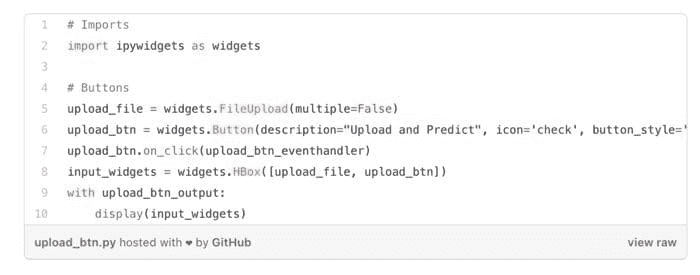

这里我们有两个按钮——一个用于上传文件（upload_file），另一个（upload_btn）让我们的事件处理程序（upload_btn_eventhandler）知道何时执行操作。我知道，你一定会想我们的事件处理程序在哪里？我们将在接下来定义它。但在此之前，input_widgets 只是将两个按钮组合在一起，并借助我们的输出小部件（upload_btn_output）来显示这些按钮。首先，让我们编写事件处理程序。

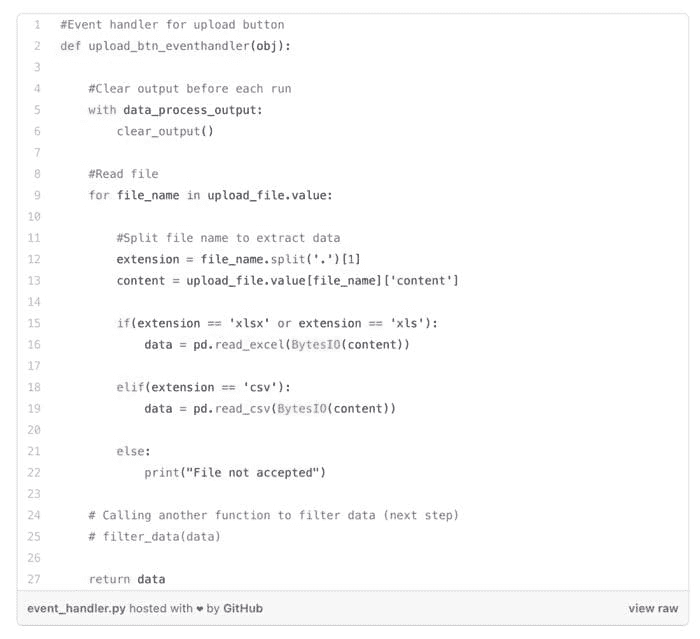

一旦我们点击上传按钮，我们的事件处理程序将接收文件并将其转换为 pandas 数据框，以便轻松处理数据。我通过句点分割文件名来找到文件的扩展名，然后根据文件是否为 Excel 或 CSV 来存储数据。现在进入最后一部分，输出小部件。如果你还记得，我们已经编写了一个名为 upload_btn_output 的输出小部件，所以我们就按这个名字来做。

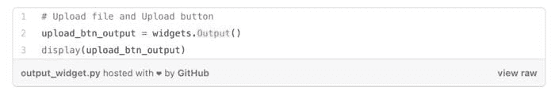

现在，如果你还没有安装 voila，你需要安装它以便在本地运行，你可以在[这里](https://voila.readthedocs.io/en/stable/using.html)找到安装说明。但我将向你展示一种使用 Saturn Cloud 的简单方法。创建一个账户并登录，在他们的仪表盘上，你会看到“部署仪表盘”，点击它，然后启动 jupyter lab。现在，将我们刚刚创建的笔记本上传到 Saturn Cloud 的 jupyter lab 中。你可以在我的 GitHub 上找到完整的 jupyter notebook，[这里](https://github.com/Dhrumilcse/fradulent-transaction)。此外，你还可以选择 Saturn Cloud 提供的其他加速数据科学库和管道。

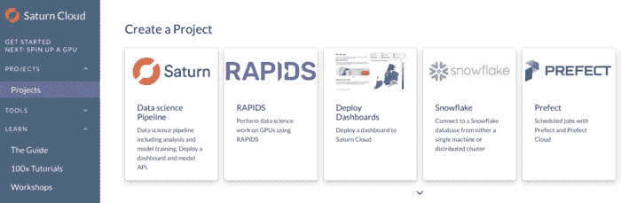

完成了吗？完美。现在复制 URL，粘贴到新标签页中，并将 …./your-username/dashboard/…. 替换为 /your-username/dashboard/voila，然后导航到 projects>examples>dashboard.ipynb 并运行它。你应该能够看到我们的上传按钮。

如果你遇到任何问题，或者想了解更多关于在 Saturn Cloud 上使用 Voila 创建仪表板的内容，请参考这个[指南](https://www.saturncloud.io/docs/examples/dashboards/voila_dash/)。

****欺诈交易****

目前我们还没有任何过滤后的数据，我们只是上传了一个文件并存储了其内容。让我们再写一些代码来处理欺诈交易。

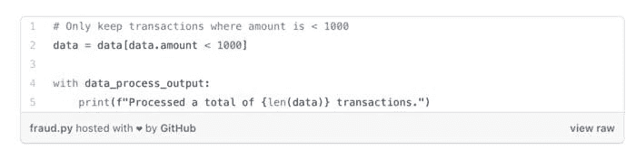

我已经生成了一个包含假数据的 csv 文件，你可以在这里找到，随意使用。这里，我将删除超出特定阈值的值，视其为欺诈。如果所有金额 > 1000 的交易都是欺诈交易，我们可以通过在 upload_btn_eventhandler 中写入以下内容来实现。

如果你的数据在 AWS 等云端，完全不用担心。你只需要获取凭证即可开始。你可以通过使用 **s3fs** 库轻松完成，这是一种用于访问 AWS 文件系统的 Python 库。你可以在[文档](https://s3fs.readthedocs.io/en/latest/)中了解更多信息。

****使用预训练模型（额外）****

如果你有一个预训练的模型想要使用，可以像我下面这样导入，但如果你只是想了解 Voila 的工作原理，并且对导入机器学习模型不感兴趣，可以跳过下面的代码。我们基本上是使用 joblib 加载计数向量化器和模型，然后进行预测。

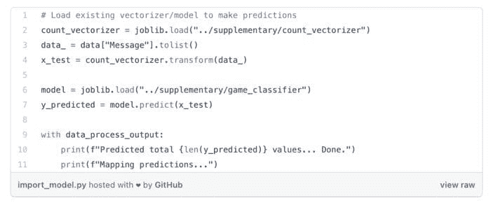

**过滤数据**

太棒了，现在我们有了没有欺诈交易的干净数据。我们来添加一个功能，以便根据货币过滤交易吧？我们可以通过创建另一个逻辑来实现，就像我们为上传按钮创建的那样。现在我们只需传递我们创建的干净数据框。让我们看看代码：

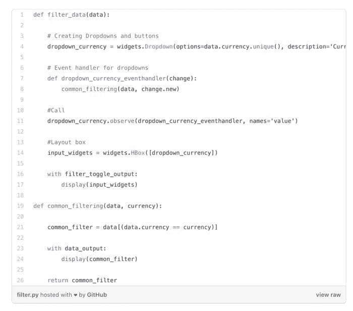

我们在这里也会遵循相同的模式。首先，我们为货币列中的所有唯一值创建一个下拉框。然后，我们创建一个事件处理程序，它会调用另一个函数 common_filtering，该函数基本上会匹配货币并只给出那些货币匹配的值，换句话说，即过滤。然后我们将其显示到刚刚创建的输出小部件上。如果你使用的是我添加的相同数据文件，它应该是这样的。

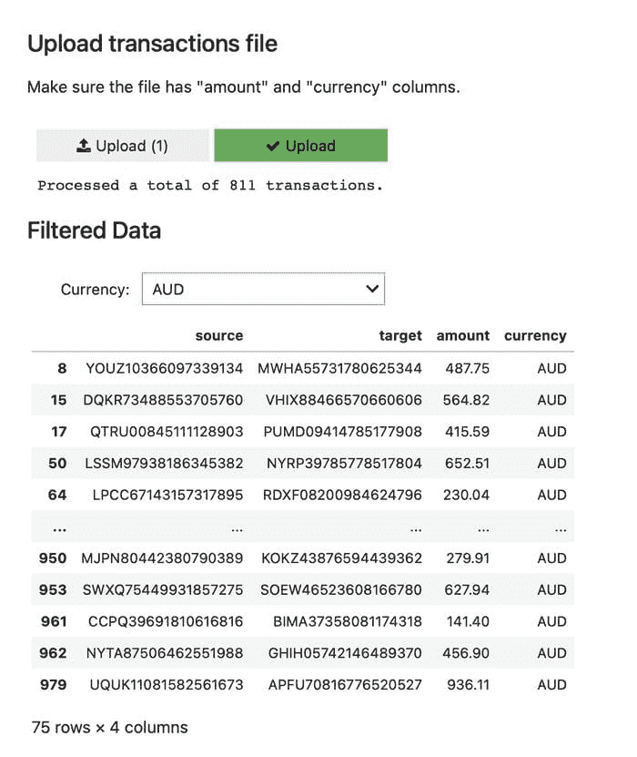

****可视化****

让我们继续可视化我们筛选后的数据。我们将制作一个货币计数的折线图，以查看交易在几个货币之间的分布情况。

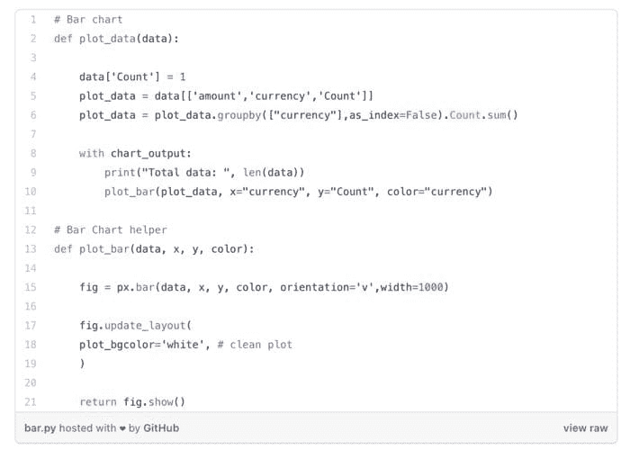

首先，我们创建一个新的列计数，并计算每种货币的出现次数。然后我们将其作为`plot_data`传递，其中 X 轴保持货币，Y 轴保持计数。我们在这里使用 plotly——`import plotly as px`——并保留一个单独的辅助函数来调用绘图。如果一切顺利，你可以在仪表板上看到类似的柱状图。

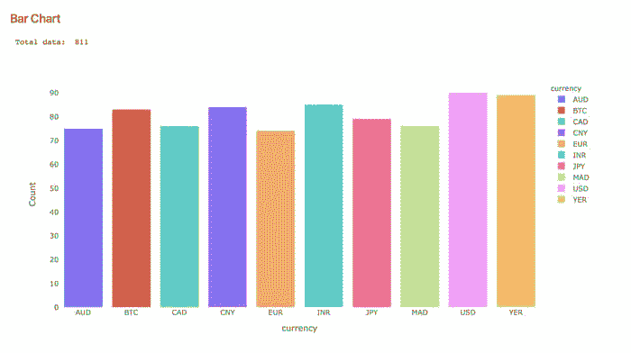

然后，瞧（有点玩笑的意思），你有了一个工作中的仪表板。现在我们可以使用 Saturn Cloud 将其发布到生产中，这就像点击几下那么简单。

### ****发布到生产****

要创建部署，请访问项目页面并点击“创建部署”按钮。

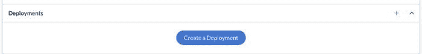

**创建部署**

你将看到配置页面。正如你在下面看到的，你只需要设置一个名称和命令，你就可以开始了。然而；Saturn Cloud 上有很多选项可以探索，你可以在[这里](https://www.saturncloud.io/docs/using-saturn-cloud/jobs_and_deployments/#deployments)找到。

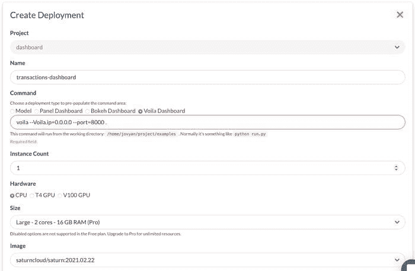

**配置**

现在配置已经准备好，你将能够看到仪表板，点击 URL 旁边的小播放按钮，一旦它激活，访问该 URL 以访问你的仪表板。

### ****附录****

在这篇文章中，我们介绍了 Saturn Cloud 是什么以及它如何加速你的端到端管道，如何使用 Voila 和 Python 创建仪表板，并仅通过几个简单步骤使用 Saturn Cloud 发布到生产中。拥有合适的工具对你帮助很大，如果你希望加速你的处理或数据科学管道，Saturn Cloud 就是其中之一。如果你有任何问题，可以通过[twitter](https://twitter.com/dhrumilcse)或[Linkedin](https://linkedin.com/in/dhrumilcse)联系我，或者随时过来打个招呼。

**个人简介：[Dhrumil Patel](http://linkedin.com/in/dhrumilcse)** ([@Dhrumilcse](https://twitter.com/Dhrumilcse)) 是 NVIDIA 的性能分析实习生。他的兴趣在于处理大规模数据和使用现代框架（如 Django）进行 Web 应用开发。他还具备处理大量社交媒体数据的 NLP 实践经验。工作之外，他喜欢阅读书籍和折纸。

**相关：**

+   使用 Saturn Cloud 在 GPU 上为 Python 与 Pandas 加速

+   数据科学家，你需要了解如何编程

+   当良好的数据分析未能提供预期结果时

### 更多相关主题

+   [为有效的 Tableau 和 Power BI 仪表板准备数据](https://www.kdnuggets.com/2022/06/prepare-data-effective-tableau-power-bi-dashboards.html)

+   [如何成功部署数据科学项目](https://www.kdnuggets.com/2022/01/successfully-deploy-data-science-projects.html)

+   [学习如何设计和部署负责任的人工智能系统](https://www.kdnuggets.com/2023/10/teradata-design-deploy-responsible-ai-systems-whitepaper)

+   [学习如何设计和部署负责任的人工智能系统](https://www.kdnuggets.com/2023/11/teradata-design-deploy-responsible-ai-systems-whitepaper)

+   [调查：机器学习项目仍然经常无法部署](https://www.kdnuggets.com/survey-machine-learning-projects-still-routinely-fail-to-deploy)

+   [使用 Heroku 部署机器学习 Web 应用](https://www.kdnuggets.com/2022/04/deploy-machine-learning-web-app-heroku.html)
