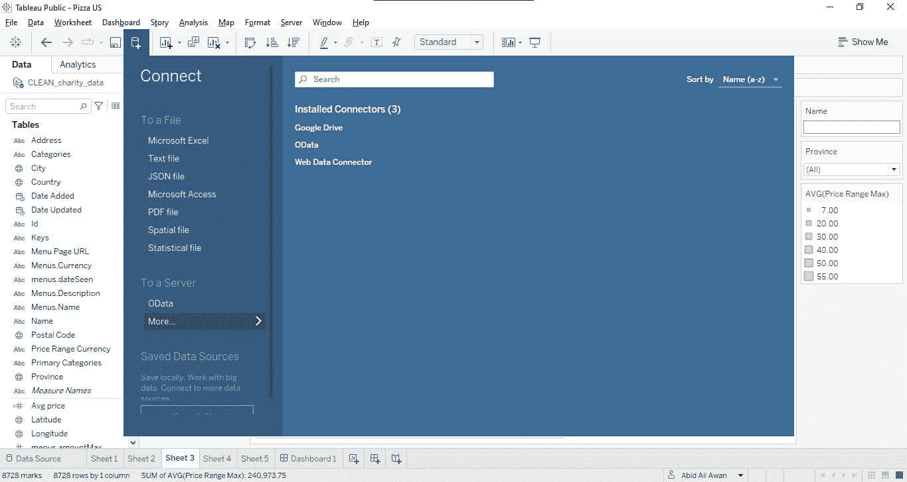
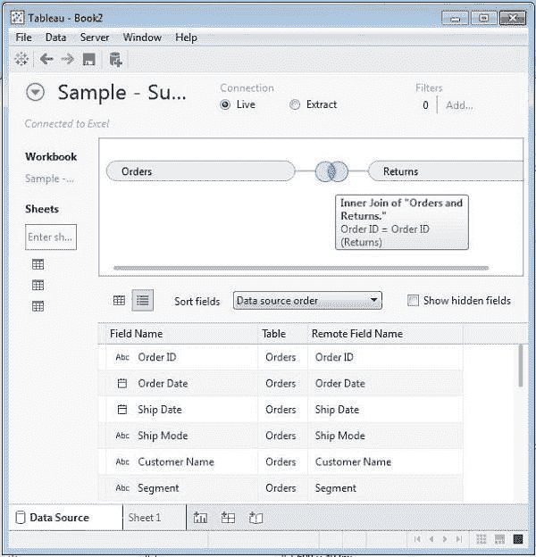
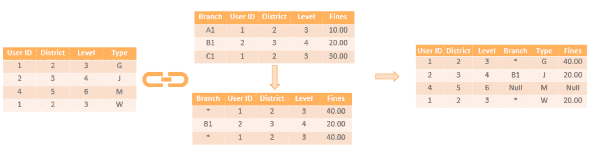
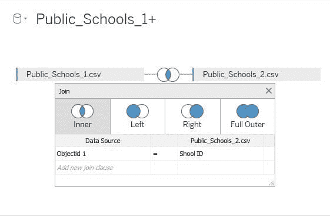
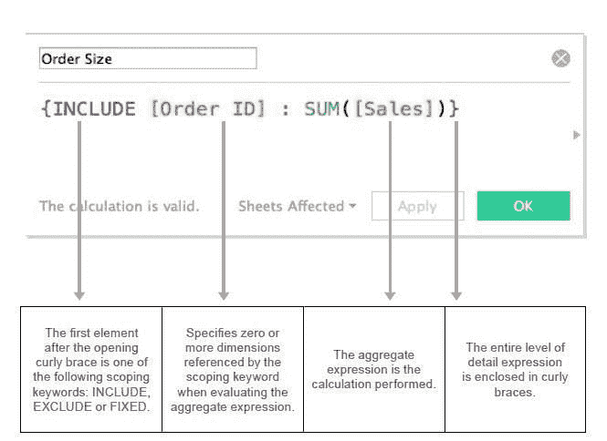

# 使用 Tableau 创建高效的合并数据源

> 原文：[`www.kdnuggets.com/2022/05/create-efficient-combined-data-sources-tableau.html`](https://www.kdnuggets.com/2022/05/create-efficient-combined-data-sources-tableau.html)

图片由编辑提供

你在 Tableau 上花费了大量时间和资源。现在，合并数据集的时机已经到来。需要合并 Excel 文件或 SPSS 文件吗？如何将多个数据源整合到一个 Tableau 数据源中，或者将外部数据与内部数据合并？使用本指南节省时间和精力，教你如何在 Tableau 中执行数据连接操作。

* * *

## 我们的前三名课程推荐

 1\. [Google 网络安全证书](https://www.kdnuggets.com/google-cybersecurity) - 加速你的网络安全职业生涯。

 2\. [Google 数据分析专业证书](https://www.kdnuggets.com/google-data-analytics) - 提升你的数据分析技能

 3\. [Google IT 支持专业证书](https://www.kdnuggets.com/google-itsupport) - 支持你的组织的 IT

* * *

# 那么，什么是 Tableau？

你可能听过“Tableau”这个词在不同的语境中出现，但你可能不清楚它的真正含义。

Tableau 是一套用于分析数据和实现商业目标的软件工具，通过全局视角来帮助你从数据中获取洞察，以便做出明智的决策，并规划业务发展方向。

从数据中获取洞察的最佳方法之一是构建 Tableau 中的数据表格。数据表格有助于合并数据源、深入分析数据并立即获得可视化的答案！

# 数据合并方法：概述

在 Tableau 中合并数据有两种方式：*数据连接和数据混合*。数据连接是指在同一来源（例如来自同一数据库的表格、同一工作簿中的 Excel 表格、同一目录中的文本文件）中处理多个表格或视图。在大多数情况下，Tableau 在进行数据连接时表现良好。

图 1 展示了使用内部数据连接技术的 Tableau 数据连接方法。图 2 则表示 Tableau 中的数据混合方法。

图 1 Tableau 中的数据连接（来源（tutorialspoint, n.d.））

图 2 Tableau 中的数据混合（来源（Upasana, 2021, 12））

要使用数据连接，你需要知道两件事：如何在 SQL 中创建连接以及如何告诉 Tableau 连接的内容。通过数据连接，一旦你连接了需要合并的表格或视图，所有你需要做的就是添加一个额外的步骤，将连接两个表格的字段拖到“连接”架上。

# Tableau 中的数据源

Tableau 中的数据源将你的源数据连接到 Tableau。它仅仅是你的数据的总和（无论是作为实时连接还是提取），连接的元数据、包含数据的表或工作表的名称，以及你在 Tableau 中对数据所做的修改。这包括计算、重命名的特征和默认布局等元数据，以及数据的集成方式。

图 3 Tableau 中的数据源（来源（Dmitry Anoshin, Teodora Matic, Slaven Bogdanovic, Tania Lincoln, 2019））

# 有效地合并数据源

Tableau 允许你创建高效的合并数据源，这样你只需做一次工作，然后可以将该数据源用于多个报告。

以下是创建这些数据源的一些技巧：

1.  确保你的数据字段顺序相同

1.  确保你的数据格式相同

1.  如果可能，确保你的数据包含唯一标识符（例如客户 ID）

1.  给同一表中的每个字段分配不同的颜色

1.  给你的工作表起具有描述性的名称

1.  给你的列起具有描述性的名称

如果你做到这些，你在 Tableau 中创建合并数据源时会非常轻松！

# 明智地合并表格

将工作簿中的表格数量限制到尽可能少，以创建更好的用户体验。如果你需要访问工作簿中的多个表格，可能需要创建可以用于每个分析场景的单独数据源。

# 使用联接的有效合并

联接很重要，因为它们允许我们将来自多个来源的信息合并到一个可视化中。它们通常用于在工作簿中的不同工作表之间联接数据，但你可以用联接做很多事情！你可以用它们来合并来自不同数据库的数据、计算机上的文件，甚至完全不同来源的数据！

在 Tableau 中处理多个表时，最佳方法是在数据连接窗口中定义联接。这样，你不是在定义一个特定的查询，而只是定义表之间的关联方式。

图 4 Tableau 中的联接（来源（Dmitry Anoshin, Teodora Matic, Slaven Bogdanovic, Tania Lincoln, 2019））

这些数据将由 Tableau 用于生成获取指定数据所需的具体查询。

作为基本的性能规则，联接的表格数量应最小化，只包括特定工作表/可视化所需的表格。（Eldridge, 2016）

# 使用混合数据的有效合并

如果你的数据包含许多独特的值，它将占用大量内存。如果你使用包含大量独特值的混合数据，应该使用 64 位版本的 Tableau Desktop。依赖于许多独特值的混合数据可能会花费更长时间进行计算。

# 使用数据集成

Tableau 10 中提供了一项新功能——数据集成，允许你结合来自多个来源的数据。数据集成适用于行级联接，而数据混合则作用于每个数据源的结果。如果你希望处理更多数据或更快地流动，必须使用数据集成。

# 调整详细信息级别

在开发精选的数据源时，考虑是否应该在特定的细节层级（LOD）进行汇总。如果是这样，考虑创建一个包含适当 LOD 的 LOD 表达式的新计算字段，以便于未来的开发者。

图 5 Tableau 中的详细信息示例（来源 (Dobiasz, 2019)）

# 结论

数据处理并不容易。它可能是每个企业都在寻求的东西，但收集、分析数据以及确定其有效性可能是一项艰巨的任务。此外，每当企业需要使用数据时，这一过程必须重复进行。与其面临多个障碍和难题，不如直接告诉 Tableau 你希望如何准备数据。

你可以在 Tableau 中集成多个数据源，并创建一个综合仪表板。这将帮助你获得做出快速决策所需的洞察。

## 参考文献

+   Dmitry Anoshin, Teodora Matic, Slaven Bogdanovic, Tania Lincoln. (2019). *Tableau 2019.x CookBook.* SMTE Books.

+   Dobiasz, L. (2019, 11 3). *the data school*. 取自 https://www.thedataschool.com.au/wp-content/uploads/2019/11/LOD-expressions-1.jpg

+   Eldridge, A. (2016). *Best Practices for Designing Efficient Tableau Workbooks.*

    tutorialspoint. (n.d.). *Tutorials Point*. 取自 tutorialspoint: https://www.tutorialspoint.com/tableau/images/data_join_1.JPG

+   Upasana. (2021, 12). *edureka*. 取自 edureka: https://www.edureka.co/blog/wp-content/uploads/2019/02/Data-Blending-with-Fines-Data-Blending-in-Tableau-Edureka.png

**[Neeraj Agarwal](https://www.linkedin.com/in/neeagl/)** 是 [Algoscale](https://www.linkedin.com/company/algoscale) 的创始人，该公司是一家涉及数据工程、应用 AI、数据科学和产品工程的数据咨询公司。他在该领域拥有超过 9 年的经验，并帮助了从初创公司到财富 100 强公司等广泛的组织摄取和存储大量原始数据，以将其转化为可操作的洞察，促进更好的决策和更快的业务价值。

### 更多相关主题

+   [Top 16 Technical Data Sources for Advanced Data Science Projects](https://www.kdnuggets.com/top-16-technical-data-sources-for-advanced-data-science-projects)

+   [Prepare Your Data for Effective Tableau & Power BI Dashboards](https://www.kdnuggets.com/2022/06/prepare-data-effective-tableau-power-bi-dashboards.html)

+   [10 Most Used Tableau Functions](https://www.kdnuggets.com/2022/08/10-used-tableau-functions.html)

+   [KDnuggets 新闻，8 月 3 日：10 个最常用的 Tableau 函数 • 是…](https://www.kdnuggets.com/2022/n31.html)

+   [NumPy 与 Pandas 进行更高效的数据分析](https://www.kdnuggets.com/numpy-with-pandas-for-more-efficient-data-analysis)

+   [如何使用 Hugging Face 的数据集库进行高效的数据加载](https://www.kdnuggets.com/how-to-use-hugging-faces-datasets-library-for-efficient-data-loading)
