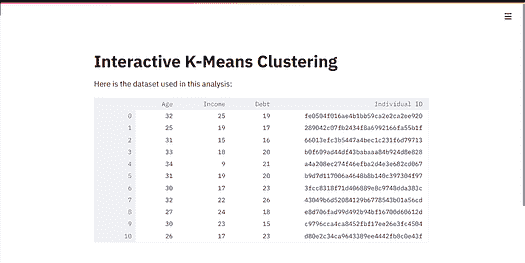
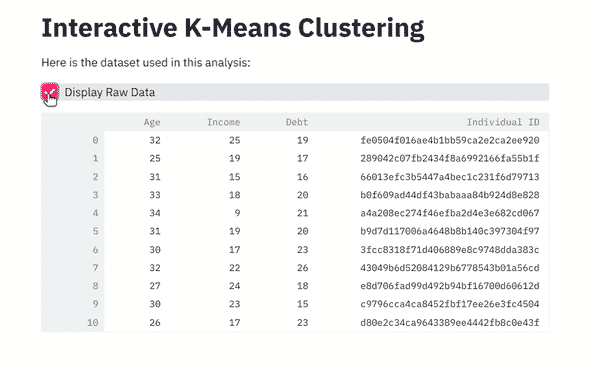
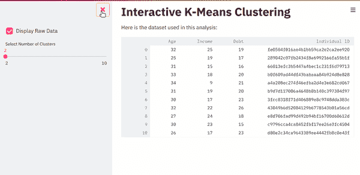
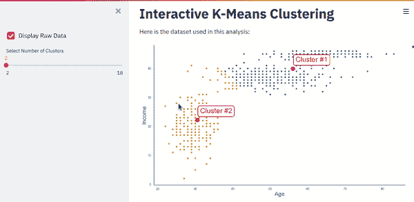
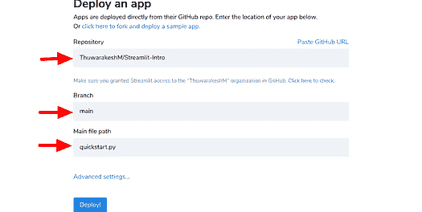

# 如何为你的数据科学项目创建令人惊叹的网页应用

> 原文：[`www.kdnuggets.com/2021/09/create-stunning-web-apps-data-science-projects.html`](https://www.kdnuggets.com/2021/09/create-stunning-web-apps-data-science-projects.html)

评论

**由 [Murallie Thuwarakesh](https://www.linkedin.com/in/thuwarakesh/)，Stax, Inc. 的数据科学家提供**


图片由 [Meagan Carsience](https://unsplash.com/@mcarsience_photography?utm_source=medium&utm_medium=referral) 在 [Unsplash](https://unsplash.com/?utm_source=medium&utm_medium=referral) 提供

* * *

## 我们的前三大课程推荐

 1\. [谷歌网络安全证书](https://www.kdnuggets.com/google-cybersecurity) - 快速进入网络安全职业生涯。

 2\. [谷歌数据分析专业证书](https://www.kdnuggets.com/google-data-analytics) - 提升你的数据分析能力

 3\. [谷歌 IT 支持专业证书](https://www.kdnuggets.com/google-itsupport) - 支持你在 IT 方面的组织

* * *

网页开发不是数据科学家的核心能力。大多数数据科学家不会学习不同的技术来完成这项任务。这不是他们的强项。

然而，大多数数据科学项目也有一个软件开发组件。开发人员有时对问题有不同的理解，并且使用离散的技术。这通常会导致问题，并浪费双方团队的宝贵时间。

此外，像 Tableau 和 Power BI 这样的可视化工具更多地关注数据探索。然而，这只是完整数据科学项目的一部分。如果你需要集成机器学习模型，它们还远远不够完美。

[Streamlit](https://share.streamlit.io/) 允许你为数据科学项目开发网页应用。这个开源库的 API 完全用 Python 编写。因此，你不需要学习其他网页技术即可使用它。此外，它容易学习，修改起来也很灵活。

这篇文章是对 Streamlit 的介绍。我们将构建一个互动网页应用，它接受用户输入，运行 K-means 算法，并立即在网页界面上绘制结果。

在短文结束时，我们将涵盖

+   安装 Streamlit 并测试水温；

+   构建一个互动网页应用；

+   使用用户输入运行 K-means 算法；

+   使用缓存来提高性能，以及；

+   在云端部署它；

这里是 [链接](https://share.streamlit.io/thuwarakeshm/streamlit-intro/main/quickstart.py#interactive-k-means-clustering) 到已部署版本。如果你想提前了解一下，请查看。

## 设置 Streamlit 以进行开发。

这个非凡的工具设置简单得令人难以置信，几乎所有 Python 用户都很熟悉它。使用 PyPI。

```py
pip install streamlit
```

你也可以使用 [conda](https://docs.streamlit.io/en/stable/installation.html#set-up-your-virtual-environment) 和其他流行的 Python 包管理工具。

完成后，你可以使用安装包中的 hello world 应用进行测试。在终端窗口中执行下面的命令以启动开发服务器。

```py
streamlit hello
```

hello world 应用展示了你可以用 Streamlit 做的出色可视化。上述命令将启动一个本地开发服务器，并在默认浏览器中打开链接。你还可以在同一页面上找到源代码。此外，这个示例应用还提供了许多高级教程的链接，以便你进一步学习。

既然设置完成了，让我们创建一个与我们的机器学习模型互动的应用。

## 使用机器学习模型与 Streamlit 网页应用一起使用。

下面的应用程序使用 Pandas、Scikit-Learn、Matplotlib、Seaborn 和 Streamlit。在开始之前，请确保你已经安装了所有必要的包。如果没有，下面的命令会为你安装。

```py
pip install pandas scikit-learn matplotlib seaborn streamlit
```

## 创建你的第一个网页应用

创建一个名为 ‘quickstart.py’ 的文件，内容如下。

```py
# Imports
# -----------------------------------------------------------
import streamlit as st
import pandas as pd
# -----------------------------------------------------------

# Helper functions
# -----------------------------------------------------------
# Load data from external source
df = pd.read_csv(
    "https://raw.githubusercontent.com/ThuwarakeshM/PracticalML-KMeans-Election/master/voters_demo_sample.csv"
)
# -----------------------------------------------------------

# Sidebar
# -----------------------------------------------------------

# -----------------------------------------------------------

# Main
# -----------------------------------------------------------
# Create a title for your app
st.title("Interactive K-Means Clustering")

# A description
st.write("Here is the dataset used in this analysis:")

# Display the dataframe
st.write(df)
# -----------------------------------------------------------
```

代码片段来自 [作者](https://thuwarakesh.medium.com/)。

上面的文件很简单。为了说明，我在文件中添加了几个部分。

在主应用部分，我们有三行。我们在页面上添加了一个标题和一个描述。然后我们在页面上显示数据框。 “st.write” 函数是一个全能解决方案。你可以将几乎任何东西传递给这个函数，Streamlit 足够智能，能够在 UI 中显示正确的小部件。要了解不同的 Streamlit 函数，这里有一个 [备忘单](https://share.streamlit.io/daniellewisdl/streamlit-cheat-sheet/app.py)。

让我们用下面的命令运行我们的初始应用。

```py
streamlit run quickstart.py
```

和 hello 应用一样，这个命令将启动一个新的开发服务器。在你的浏览器中，你会看到下面的内容。



截图来自 [作者](https://thuwarakesh.medium.com/)。

恭喜你，你刚刚创建了第一个网页应用；不需要 HTML、CSS，也完全不需要 JavaScript。

但这只是初级阶段。一个网页应用可以做很多酷炫的事情。它可以实时与用户互动并更新内容。让我们看看如何实现它。

## 添加交互功能

在 Streamlit 网页应用中添加交互功能非常简单。Streamlit API 包含多个小部件。你可以使用它们来获取用户输入并将其值存储在一个变量中。其余部分就像其他任何 Python 程序一样。

让我们添加一个复选框来切换数据集的显示。毕竟，没有人会开发一个网页应用来查看原始数据。用下面的内容替换数据框显示（第 30 行）。

```py
# Display the dataframe
df_display = st.checkbox("Display Raw Data", value=True)

if df_display:
    st.write(df)
```

代码片段来自 [作者](https://thuwarakesh.medium.com/)。

如果你刷新浏览器，现在可以看到一个复选框来切换数据框的显示。



截图来自 [作者](https://thuwarakesh.medium.com/)。

但是，中间的切换按钮并不令人愉悦。让我们把它移到侧边栏。

## 向应用程序添加侧边栏

再次，这是一项轻松的操作。Streamlit API 具有侧边栏属性。你在主应用程序中创建的所有小部件在这个侧边栏属性中也可用。

通过使用 ‘st.sidebar’ 属性创建一个侧边栏变量。然后将我们在主应用程序部分添加的复选框分配移动到侧边栏部分。注意，我们现在使用的是 ‘st.sidebar.checkbox’ 而不是 ‘st.checkbox’。

```py
# SIDEBAR
# -----------------------------------------------------------
sidebar = st.sidebar
df_display = sidebar.checkbox("Display Raw Data", value=True)

n_clusters = sidebar.slider(
    "Select Number of Clusters",
    min_value=2,
    max_value=10,
)
# -----------------------------------------------------------
```

代码片段来自 [作者](https://thuwarakesh.medium.com/)。

在上面的代码中，我们还向侧边栏添加了一个滑块。这个小部件将捕获用户选择的聚类数量。下面是输出效果的样子。



截图来自 [作者](https://thuwarakesh.medium.com/)。

下一站，我们将使用用户选择的聚类数量运行 K 均值算法。

## 使用实时输入运行 K-Means。

使用以下代码扩展导入、辅助函数和主应用程序部分。

```py

# Imports
# -----------------------------------------------------------
...
from sklearn.cluster import KMeans
import matplotlib.pyplot as plt
import seaborn as sns

sns.set_theme()
# -----------------------------------------------------------

# Helper functions
# -----------------------------------------------------------
...
def run_kmeans(df, n_clusters=2):
    kmeans = KMeans(n_clusters, random_state=0).fit(df[["Age", "Income"]])

    fig, ax = plt.subplots(figsize=(16, 9))

    #Create scatterplot
    ax = sns.scatterplot(
        ax=ax,
        x=df.Age,
        y=df.Income,
        hue=kmeans.labels_,
        palette=sns.color_palette("colorblind", n_colors=n_clusters),
        legend=None,
    )

    return fig
# -----------------------------------------------------------

# MAIN APP
# -----------------------------------------------------------
...
# Show cluster scatter plot
st.write(run_kmeans(df, n_clusters=n_clusters))
# -----------------------------------------------------------
```

代码片段来自 [作者](https://thuwarakesh.medium.com/)。

在上面的代码中，我们创建了一个运行 K-Means 算法的函数。它接受数据框和聚类数量作为参数，并返回一个 Matplotlib 图形。

K-Means 聚类的说明超出了本项目的范围。这是一个机器学习算法，这正是我们关心的。但是你可以参考我 [之前的帖子](https://towardsdatascience.com/running-election-campaigns-with-k-means-clustering-ecc40a91135a) ，那里有相关的描述。

我们使用 n_clusters 变量，该变量捕获了上一节中的滑块值，作为 run_forecast 函数的第二个参数。

如果你刷新页面，你会看到一个仪表盘，它接收用户输入，运行机器学习算法，并立即更新 UI。



截图来自 [作者](https://thuwarakesh.medium.com/)。

即使你是一个经验丰富的开发者，与后端机器学习的这种互动和集成也是一项困难的任务。特别是如果你是一个不懂如何开发网页应用的数据科学家，这可能会占用你几周的时间。

## 通过缓存提高性能。

数据科学流程中的某些任务是耗时的。然而，这些任务对于相同的输入很少产生不同的结果。你可以使用 Streamlit 内置的缓存功能来存储它们的值以备将来使用。

虽然这听起来可能复杂，但使用 Streamlit 实现非常简单。你的耗时任务应该是一个函数，并且你用 [@ts](https://twitter.com/ts).cache 装饰器将其包装起来。只要输入参数相同且函数体未被修改，Streamline 就会从缓存中提取它。

在我们构建的应用程序中，我们调用外部 URL 以下载数据。如果这是一个实时 API，你可能不想缓存它。但在我们的情况下，它不是。因此，让我们通过替换以下代码行来缓存它。

```py
# Load data from external source
@st.cache
def load_data():
    df = pd.read_csv(
        "https://raw.githubusercontent.com/ThuwarakeshM/PracticalML-KMeans-Election/master/voters_demo_sample.csv"
    )
    return df

df = load_data()
```

作者的 [代码片段](https://thuwarakesh.medium.com/)。

在第一次重新加载时，你可能会看到浏览器上显示“Processing load_data”的消息。但后续的重新加载不会出现这个提示。这是因为请求是从缓存中获取的，而不是从外部 URL 下载的。

## 在互联网上部署

如果你注意到了 Streamlit 控制台，你还会看到一个网络 URL。这意味着，如果你的防火墙允许，你的应用可以通过内部网访问。

如果你想在你的网络之外分享它，我们有很多选择。正如文档所说，Streamlit 应用在任何 Python 应用可以运行的地方都能工作。

1.  Streamlit 推荐使用“Streamlit Sharing”选项。

    你可以把你的代码放在 GitHub 仓库里，并配置 Streamlit Sharing 来提供你的应用。

    Streamlit Sharing 是免费的，但目前仅限邀请。你可以为自己申请邀请。

1.  你可以在云平台上部署它。这里有一篇 [文章](https://towardsdatascience.com/how-to-deploy-a-streamlit-app-using-an-amazon-free-ec2-instance-416a41f69dc3) 显示了如何使用 AWS EC2 免费实例进行部署。

1.  你可以 [配置反向代理](https://discuss.streamlit.io/t/streamlit-docker-nginx-ssl-https/2195/5)。像 Nginx 和 Apache 这样的代理服务器可以被配置来提供应用服务，并限制特定用户的访问。

一定要阅读 [Streamlit 的社区指南](https://discuss.streamlit.io/t/streamlit-deployment-guide-wiki/5099) 关于部署的内容，以探索你可以选择的众多选项。

下面是我如何在 Streamlit Share 上部署这个教程应用的。再一次，Streamlit 的便利性让我惊讶。

**步骤 I：将你的代码放入 GitHub 公共仓库。** 我已经将我的代码添加到这个 [GitHub 仓库](https://github.com/ThuwarakeshM/Streamlit-Intro.git)。我们需要确保它包含一个包含所有依赖项的 requirement.txt 文件。

**步骤 II：使用你的 GitHub 账户登录 [Streamlit](https://share.streamlit.io/)。**

**步骤 III：在 Streamlit 控制台上创建一个新应用。** 从下拉菜单中选择你的 GitHub 仓库或粘贴 URL。选择你想要用于部署的分支。最后，选择主文件名并点击部署。



作者截图。

大约一分钟内，[我的应用](https://share.streamlit.io/thuwarakeshm/streamlit-intro/main/quickstart.py#interactive-k-means-clustering) 就在 Streamlit Share 上上线了。但部署时间可能会因项目需求而异。

请注意，Streamlit Share 目前是仅限邀请的。但我没等太久就获得了它。Streamlit 的 [部署文档](https://docs.streamlit.io/en/stable/deploy_streamlit_app.html?utm_medium=email&_hsmi=129999626&_hsenc=p2ANqtz-_XkMKRkDwyEqBo00-MhMkFZrmNwXivmqVBMHHO8pEGst6yf3fAVaz_iaUAx_6kP4h-DOmIp4iaHd0QahErWMub8ethXA&utm_content=129999626&utm_source=hs_automation) 包含了更多有用的信息。

## 结论

不用说，Streamlit 解决了数据科学项目中的一个关键问题。它赋予数据科学家构建 Web 应用程序以与其机器学习模型互动的能力。

在这篇介绍性文章中，我们探讨了如何将 Streamlit 与 K-Means 聚类结合使用。虽然这是一个简单的应用，但它展示了这项技术的核心概念。除了开发，我们还了解了如何轻松管理 Streamlit 中的缓存以提高性能。最后，我们讨论了部署选项。

Streamlit 远不止于此。请查看他们的 [官方文档](https://docs.streamlit.io/en/stable/)，其中包含了出色的教程。此外，他们的 [API 速查表](https://share.streamlit.io/daniellewisdl/streamlit-cheat-sheet/app.py) 对于快速开发也很有帮助。

Web 应用程序是一个绝妙的解决方案。但在某些情况下，你可能需要考虑其他方式来与 ML 模型交互。也许，构建一个命令行界面可能会有所帮助。

[**简化指南：为你的数据科学项目创建 CLI**](https://towardsdatascience.com/a-simplified-guide-to-create-clis-for-your-data-science-project-bf9bcaa26e1)

> 感谢阅读，朋友！看起来你我有很多共同的兴趣。我很愿意在 [LinkedIn](https://www.linkedin.com/in/thuwarakesh/)、[Twitter](https://twitter.com/Thuwarakesh) 和 Medium 上与你联系。

还不是 Medium 会员？请使用此链接 [**成为会员**](https://thuwarakesh.medium.com/membership)。你可以享受成千上万的有深度的文章，并支持我作为推荐你的小佣金。

**简介：[Murallie Thuwarakesh](https://www.linkedin.com/in/thuwarakesh/)** (**[@Thuwarakesh](https://twitter.com/Thuwarakesh)**) 是 Stax, Inc. 的数据科学家，并且是 Medium 上分析领域的顶级作家。Murallie 分享了他每天在数据科学领域的探索。

[原文](https://towardsdatascience.com/how-to-create-stunning-web-apps-for-your-data-science-projects-c7791102134e)。转载已获许可。

**相关：**

+   数据科学家的 Streamlit 小贴士、技巧和窍门

+   使用 Streamlit 进行主题建模

+   构建一个应用程序来生成使用 TensorFlow 和 Streamlit 的逼真面孔

### 更多相关话题

+   [与 ChatGPT 一起在几秒钟内创建惊人的数据可视化](https://www.kdnuggets.com/create-stunning-data-viz-in-seconds-with-chatgpt)

+   [停止学习数据科学以寻找目标，寻找目标以……](https://www.kdnuggets.com/2021/12/stop-learning-data-science-find-purpose.html)

+   [学习数据科学统计的顶级资源](https://www.kdnuggets.com/2021/12/springboard-top-resources-learn-data-science-statistics.html)

+   [建立一个强大的数据团队](https://www.kdnuggets.com/2021/12/build-solid-data-team.html)

+   [成功数据科学家的 5 个特征](https://www.kdnuggets.com/2021/12/5-characteristics-successful-data-scientist.html)

+   [每位数据科学家都应该了解的三个 R 库（即使你使用 Python）](https://www.kdnuggets.com/2021/12/three-r-libraries-every-data-scientist-know-even-python.html)
